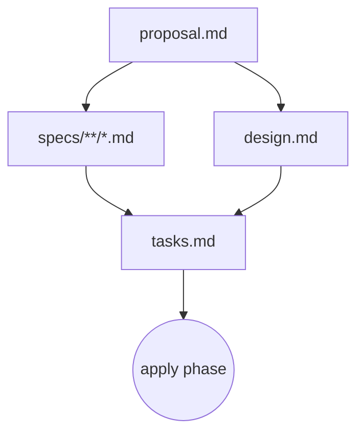
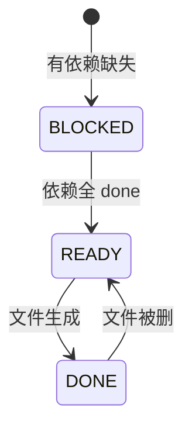

# 03 · 核心概念

> 回 [导读](00-index.md) · [FAQ](FAQ.md)

## 目录

- [§0 先抓大图：OpenSpec 到底在管理什么](#0-先抓大图openspec-到底在管理什么)
- [§1 Artifact 依赖图（DAG）](#1-artifact-依赖图dag)
- [§2 Delta Spec 格式](#2-delta-spec-格式)
- [§3 Schema 是什么、为什么这么叫](#3-schema-是什么为什么这么叫)
- [§4 内置 `spec-driven` schema 详解](#4-内置-spec-driven-schema-详解)
- [§5 Change 目录结构](#5-change-目录结构)

---

## §0 先抓大图：OpenSpec 到底在管理什么

如果你一开始就盯着 `schema`、artifact DAG、skill、adapter，很容易越看越碎。

官方文档真正先讲清的是一件更朴素的事：

> **OpenSpec 在管理的，不是“AI 提示词集合”，而是“项目当前规格基线，以及针对这条基线的一次次增量变更”。**

先把这四句话钉住：

| 东西 | 它是什么 | 先怎么理解最不容易错 |
|------|----------|----------------------|
| `openspec/specs/` | 项目当前已经成立的行为规格 | 当前能力基线，source of truth |
| `openspec/changes/<name>/` | 一次变更工作区 | 针对基线做的增量提案 |
| `proposal/specs/design/tasks` | 这次变更的几类 artifact | 为什么改、改什么、怎么改、怎么做 |
| `schema` | artifact 的结构和依赖定义 | “这类 change 应该长什么样” |

### 先看目录，不要先看机制

```text
项目根/
└── openspec/
    ├── specs/                       ← 当前系统已成立的规格
    │   ├── auth/spec.md
    │   └── billing/spec.md
    ├── changes/
    │   └── add-sso-login/           ← 一次变更
    │       ├── proposal.md          ← 为什么改 / 范围
    │       ├── design.md            ← 技术方案
    │       ├── tasks.md             ← 实施清单
    │       └── specs/
    │           └── auth/spec.md     ← delta spec：这次要怎么改 auth 规格
    └── config.yaml                  ← 默认 schema + context + rules
```

### 最核心的关系：`specs` 和 `changes`

官方文档里最重要、也最值得前置的，其实是下面这张心智图：

```text
openspec/

  specs/      = 当前真实规格
  changes/    = 准备对真实规格做的修改
```

换句话说：

- `specs/` 不是“计划做什么”，而是“系统现在被承认成什么样”
- `changes/` 不是“另一套正式规格”，而是“准备怎么改正式规格”
- archive 之后，`changes/<name>/specs/` 里的 delta 会 merge 回 `specs/`

### 最核心的动作链：不是 phases，而是围绕 change 的一组动作

对默认 `core` profile 来说，最值得先记住的是这个：

```text
/opsx:propose ──► /opsx:apply ──► /opsx:archive
```

它背后的文档链条是：

```text
proposal ──► specs ──► design ──► tasks ──► implement
```

可以把它记成一句话：

- `proposal` 管为什么和范围
- `specs` 管行为变化
- `design` 管技术方案
- `tasks` 管实施步骤

### 为什么很多人会在这里看乱

因为 OpenSpec 有两层东西很容易被提前看到：

1. **交付层**：`.cline/`、`.claude/`、commands、skills
2. **机制层**：schema、instruction injection、artifact graph

它们都重要，但都不该先于“项目基线 + 变更增量”这个主轴进入脑子。

所以更顺的阅读顺序应该是：

1. 先明白 `specs/` 和 `changes/` 分别是什么
2. 再明白 change 里四种 artifact 的职责
3. 再看 delta spec 怎么 merge
4. 最后再看 schema、config、skill、agent protocol

带着这个大图再看后面的 DAG、delta 和 schema，会顺很多。

---

## §1 Artifact 依赖图（DAG）

### Schema 决定 DAG 结构

一个 **schema** 定义了一个 workflow 里有哪些 artifact、它们怎么依赖。默认 schema 是 `spec-driven`，结构如下（[schemas/spec-driven/schema.yaml](../schemas/spec-driven/schema.yaml)）：

```yaml
name: spec-driven
artifacts:
  - id: proposal
    generates: proposal.md
    requires: []
  - id: specs
    generates: "specs/**/*.md"
    requires: [proposal]
  - id: design
    generates: design.md
    requires: [proposal]
  - id: tasks
    generates: tasks.md
    requires: [specs, design]

apply:
  requires: [tasks]
  tracks: tasks.md
```

### 四种 artifact 的职责

| Artifact | 职责 | 文件 | 依赖 |
|----------|------|------|------|
| `proposal` | **Why + What**：要解决什么问题、scope、high-level approach | `proposal.md` | — |
| `specs` | **What changes**：delta spec（ADDED / MODIFIED / REMOVED / RENAMED） | `specs/<domain>/spec.md` | proposal |
| `design` | **How**：技术方案、架构决策、trade-offs | `design.md` | proposal |
| `tasks` | **Steps**：可勾选的实施清单 | `tasks.md` | specs + design |

`apply` 阶段不是 artifact，而是**消费 artifact** 的动作——需要 `tasks.md` 存在，进度靠 checkbox 追踪。

### DAG 可视化



**关键**：`specs` 和 `design` 是**并行**的（都只依赖 proposal）。

### 三种状态

artifact 的状态完全由文件系统决定（[src/core/artifact-graph/state.ts](../src/core/artifact-graph/state.ts)）：

| 状态 | 含义 |
|------|------|
| `done` | 文件（或 glob 匹配的文件）已存在 |
| `ready` | 所有依赖都 `done`，但本身文件还没生成 |
| `blocked` | 有依赖还没 `done` |

### 状态机



### 依赖是 enabler 不是 gate

这是 OPSX 最重要的设计原则——`requires` 告诉你「现在可以做什么了」，**不是**「必须先做什么」。

落地含义：
- `specs` ready 后可以建，也可以先建 `design`（两者并行）
- 已建好的 artifact 可以**随时回改**（DONE → READY 不会有副作用）
- 用户可以**跳过**某些 artifact（比如简单改动跳过 design，但这样 tasks 就一直 blocked，需要改 schema 或人为决定不要 tasks）

### agent 怎么用这个图

典型的 `/opsx:continue` 流程：

1. 跑 `openspec status --json` 拿到所有 artifact 的状态
2. 选第一个 `ready` 的 artifact
3. 跑 `openspec instructions <artifact> --json` 拿模板 + 依赖内容 + rules
4. 读依赖 artifact 的文件（传给 AI 当 context）
5. 生成新 artifact 并写盘
6. 再跑一次 `status`，告诉用户「下一步解锁了什么」

这个「查询式、增量式」的范式是 OPSX 的核心与 legacy 的根本区别。详见 [06-agent-protocol.md](06-agent-protocol.md)。

### 引擎实现

源码目录：[src/core/artifact-graph/](../src/core/artifact-graph/)

- `graph.ts` — DAG 数据结构
- `instruction-loader.ts` — 加载模板 + 注入 context/rules
- `outputs.ts` — 解析 `generates` 字段（支持 glob）
- `resolver.ts` — schema 文件解析（project → user → package）
- `schema.ts` — schema.yaml 解析 + 校验
- `state.ts` — 状态判定
- `types.ts` — TypeScript 类型

---

## §2 Delta Spec 格式

### 为什么要 delta

OpenSpec 是为**老代码库**设计的。现实工作的 80% 是改已有系统，只有 20% 是从零建。所以：

- `openspec/specs/` 是「现在系统长什么样」——source of truth
- `openspec/changes/<name>/specs/` 是「这次改动长什么样」——delta

archive 时，delta 合并回 specs，specs 长大一点；下一次 change 基于新的 specs。

### Delta 的四种 section

每个 delta spec 文件（`changes/<name>/specs/<domain>/spec.md`）用 `## XXX Requirements` header 组织：

| Section | 语义 | archive 时的行为 |
|---------|------|-----------------|
| `## ADDED Requirements` | 新增 requirement | 追加到主 spec |
| `## MODIFIED Requirements` | 修改现有 requirement | 替换同名 requirement（必须放**完整**新内容） |
| `## REMOVED Requirements` | 废弃 requirement | 从主 spec 删除；**必须写 Reason 和 Migration** |
| `## RENAMED Requirements` | 只改名字 | 用 `FROM: old name` / `TO: new name` 格式 |

### 完整格式示例

```markdown
# Delta for Auth

## ADDED Requirements

### Requirement: Two-Factor Authentication
The system MUST support TOTP-based two-factor authentication.

#### Scenario: 2FA enrollment
- **WHEN** user enables 2FA in settings
- **THEN** a QR code is displayed for authenticator app setup
- **AND** the user must verify with a code before activation

## MODIFIED Requirements

### Requirement: Session Expiration
The system MUST expire sessions after 15 minutes of inactivity.
(Previously: 30 minutes)

#### Scenario: Idle timeout
- **WHEN** 15 minutes pass without activity
- **THEN** the session is invalidated

## REMOVED Requirements

### Requirement: Remember Me
**Reason**: Replaced by 2FA — security requirement
**Migration**: Users will need to re-authenticate each session.
```

### 写 delta 的硬性规则（来自 schema.yaml 的 instruction）

1. **每个 requirement `### Requirement: <name>`**，后跟描述
2. **用 SHALL / MUST**（避免 should / may）
3. **每个 scenario 用 4 个 `#`**（`#### Scenario: <name>`）——**少一个 `#` 或用 bullet list 都会静默失败**
4. **每个 requirement 必须至少 1 个 scenario**
5. **MODIFIED 必须复制完整 requirement 内容**——部分粘贴会在归档时丢信息
6. **REMOVED 必须写 Reason 和 Migration**

### MODIFIED 的操作步骤

1. 去 `openspec/specs/<capability>/spec.md` 找原 requirement
2. **完整**复制 `### Requirement:` 到所有 scenario 结束的整块
3. 粘到 delta 的 `## MODIFIED Requirements` 下面
4. 编辑为新内容
5. header 文本必须**空白不敏感地匹配**原 requirement 名

### 常见坑

- **用 MODIFIED 写部分内容** → 归档时丢内容。如果只是加新东西，用 ADDED
- **Scenario 用 3 个 `#`** → 不会被 parser 识别，静默丢失
- **要修改一个 capability 但没在 proposal 的 Capabilities 段列出来** → 不会创建 delta spec

### Scenario 的 Given/When/Then 格式

```markdown
#### Scenario: Successful export
- **WHEN** user clicks "Export" button
- **THEN** system downloads a CSV file with all user data
```

也支持 Given/When/Then 三件套（OpenSpec 更推荐 WHEN/THEN 简写）：

```markdown
#### Scenario: Valid credentials
- **GIVEN** a user with valid credentials
- **WHEN** the user submits login form
- **THEN** a JWT token is returned
- **AND** the user is redirected to dashboard
```

### Archive 时的 merge 逻辑

1. ADDED：追加到主 spec 末尾
2. MODIFIED：在主 spec 里找同名 requirement，整块替换
3. REMOVED：从主 spec 删除同名 requirement
4. RENAMED：只改名，不动内容

具体实现在 [src/core/specs-apply.ts](../src/core/specs-apply.ts) 和 [src/core/parsers/](../src/core/parsers/)。

---

## §3 Schema 是什么、为什么这么叫

> **一句话**：schema = **一种"开发工作流的可执行定义文件"**，用 YAML 写成，描述一次变更要产出哪几种 artifact、它们之间的依赖关系、每种 artifact 用什么模板和什么 AI 指令来生成。

### 字面定义（来自 [`src/core/artifact-graph/types.ts`](../src/core/artifact-graph/types.ts)）

```typescript
export const SchemaYamlSchema = z.object({
  name: z.string(),                               // schema 名字
  version: z.number().int().positive(),
  description: z.string().optional(),
  artifacts: z.array(ArtifactSchema).min(1),     // ← 关键：要产出哪些 artifact
  apply: ApplyPhaseSchema.optional(),            // ← 写代码阶段的契约
});

export const ArtifactSchema = z.object({
  id: z.string(),                                // artifact 的逻辑名（proposal、specs...）
  generates: z.string(),                         // 输出文件名/glob（proposal.md、specs/**/*.md）
  description: z.string(),
  template: z.string(),                          // 用哪个模板（templates/proposal.md）
  instruction: z.string().optional(),            // 喂给 LLM 的指令
  requires: z.array(z.string()).default([]),     // 依赖哪些 artifact（DAG 边）
});
```

**它就是这么个 plain-old YAML 文件**。schema = 工作流的 schema，不是数据库表的 schema。

### 为什么用 "schema" 这个词

OpenSpec 借用了 **JSON Schema / 数据库 schema** 的语义——它定义的是 **"什么算合法的 artifact 集合"**：

| 传统语义里的 schema | OpenSpec 里的 schema |
|---------------------|---------------------|
| 定义"什么样的 JSON 对象算合法" | 定义"什么样的 change 文件夹算合法" |
| 字段定义 + 字段类型 + 必填关系 | artifact 定义 + 模板路径 + 依赖关系 |
| 数据库表里行的"形状契约" | change 文件夹里 artifact 的"形状契约" |
| 是数据，不是代码 | 是 YAML，不是代码 |
| 可以由用户自定义 | 可以由用户自定义 |

**所以 schema 不是 prompt、不是模板、不是配置，而是"一次变更应该长什么样"的契约**。

### Schema vs 其它术语——别搞混

| 术语 | 是什么 | 在哪 | 谁用 |
|------|--------|------|------|
| **schema** | 工作流定义（YAML） | `openspec/schemas/<name>/schema.yaml` 或 npm 包内置 | 决定整个 change 的骨架 |
| **artifact** | schema 里定义的产物类型 | schema 的 `artifacts:` 数组 | proposal / specs / design / tasks 等 |
| **template** | artifact 实例的初始填充文 | `templates/<id>.md` | 给 LLM 当填空模板 |
| **instruction** | 给 LLM 的人话指令 | schema 里 artifact 节点的 `instruction:` 字段 | 告诉 LLM 这个 artifact 怎么写 |
| **change** | schema 的一次具体实例 | `openspec/changes/<change-name>/` | 实际产出的文件夹 |
| **profile** | 给 OpenSpec **CLI 命令**分组（core/custom） | 全局配置 | 决定装多少个斜杠命令，**跟 schema 无关** |
| **config.yaml** | 项目级配置 | `openspec/config.yaml` | 决定本项目用哪个 schema、注入什么 context/rules |
| **workflow** | 一个 OPSX 命令（propose/apply/...） | 模板代码里 | OPSX 用语，跟 schema 是**正交概念** |

⚠️ 容易混的两个对：
- **schema ≠ workflow**：schema 是"产物形状"，workflow 是"OPSX 命令名"。`/opsx:propose` 这个 workflow **不管你用哪个 schema 都能跑**——它通过 `openspec status --json` 实时去查"当前 change 用的 schema 长啥样"。
- **schema ≠ template**：schema 是 YAML（描述结构），template 是 Markdown（具体内容填空格）。schema 只**引用** template 的路径。

### 为什么要把它做成"可定义的 schema"而不是写死在源码里

这是 OPSX 相比 legacy 最关键的进化点。Legacy 时代："所有 change 都必须是 proposal → specs → design → tasks 这四样"是**硬编码在 source 里的**。OPSX 把它抽成 YAML，于是：

1. **支持多种工作流** —— 你可以写 `rapid.yaml`（只有 proposal+tasks）、`research-first.yaml`（先 research 再 proposal）、`with-review.yaml`（加一个 review artifact）等
2. **同项目可共存多 schema** —— 不同 change 用不同 schema
3. **Schema 可继承** —— `openspec schema fork spec-driven my-team` 复制一份再改
4. **Agent 不用升级** —— agent 只调 `openspec instructions <id> --json` 实时查询，schema 一改，agent 立刻按新结构干活
5. **三层覆盖**（项目 > 用户 > 包内置）—— 同一个 schema 名字可以在项目级被覆盖

### Schema 在整个数据流里的位置

```text
[用户跑 /opsx:propose]
        ↓
[Agent 读 .commands/opsx-propose.md，里面写着"调 openspec status --json"]
        ↓
[OpenSpec CLI 收到请求]
        ↓
[CLI 查 openspec/changes/<name>/.openspec.yaml 拿到 schema 名]
        ↓
[CLI 按解析顺序加载 schema.yaml （project > user > package）]   ← schema 在这里被用上
        ↓
[CLI 用 schema 的 artifacts 数组算 DAG，得出 ready/blocked/done 状态]
        ↓
[Agent 再调 openspec instructions <next-artifact> --json]
        ↓
[CLI 找到 schema 里那个 artifact 节点，把它的 template+instruction
 加上项目 context+rules+依赖 artifact 内容，打包成 JSON 返回]
        ↓
[Agent 把这个 JSON 拼成 prompt 喂自己的 LLM 生成 artifact]
        ↓
[Agent 写到 schema 定义的 generates 路径]
```

**Schema 是这条数据流的"中央词典"**——没有它，CLI 不知道下一个 artifact 是什么、模板在哪、要等哪些前置依赖。

**结论一句话**：schema 是 OpenSpec 把"软件开发工作流"做成**数据**而不是**代码**的关键抽象，所有 OPSX 命令都是围绕"读 schema、按 schema 编排 LLM、按 schema 写文件"展开的。

### 看个真东西：内置 spec-driven schema 逐行拆解

下面是 [`schemas/spec-driven/schema.yaml`](../schemas/spec-driven/schema.yaml) 的核心片段加上**每一行注释**。把这段读懂，schema 的设计意图就全清了：

```yaml
name: spec-driven              # schema 名（agent 查 CLI 时要报这个名字）
version: 1                     # schema 版本（升级 schema 而不破坏老 change 的兜底）
description: |
  Default OpenSpec workflow — proposal → specs → design → tasks

artifacts:                     # ← 核心：一次 change 要产出哪几类文件
  - id: proposal               # artifact 的逻辑名，agent 和 CLI 都用这个 id 互相指代
    generates: proposal.md     # 这个 artifact 产出什么文件（支持 glob，例如 specs/**/*.md）
    template: proposal.md      # 去 templates/proposal.md 拿初始填空模板
    requires: []               # 依赖的前置 artifact 列表，空 = 起点
    instruction: |             # 给 LLM 的人话指令，CLI 会塞进 instructions JSON 里
      Write a concise 1–2 page proposal.
      The **Capabilities** section is a contract between
      proposal and specs — every capability listed here must
      have a corresponding spec file.

  - id: specs
    generates: "specs/**/*.md" # glob：每个 capability 一个 spec 文件
    template: spec.md
    requires: [proposal]       # 必须 proposal 先 done，specs 才 ready
    instruction: |
      Write delta spec per capability using
      ## ADDED / MODIFIED / REMOVED / RENAMED Requirements.
      Each requirement uses SHALL/MUST and 4-hash scenarios.

  - id: design
    generates: design.md
    template: design.md
    requires: [proposal]       # 注意：design 也只依赖 proposal，所以 specs 和 design 可以并行
    instruction: |
      Only write design when needed (cross-module, new deps,
      security/perf concerns, or open tech questions).

  - id: tasks
    generates: tasks.md
    template: tasks.md
    requires: [specs, design]  # tasks 是收束节点，specs 和 design 都 done 它才 ready
    instruction: |
      Use checkbox format:
        ## 1. Setup
        - [ ] 1.1 Create module structure
      The apply phase parses these checkboxes to track progress.

apply:                         # ← 不是 artifact，是 "写代码阶段" 的契约
  requires: [tasks]            # 必须先有 tasks.md
  tracks: tasks.md             # 进度靠这个文件里的 checkbox 计数
  instruction: |
    Read context files, work through pending tasks,
    mark complete as you go. Pause on blockers.
```

**从这段能读出的设计哲学**：

1. **artifacts 是一个有序列表**，但顺序**不决定执行顺序**（`requires` 决定）——顺序只是给人读的
2. **`requires: []`** 的节点就是 DAG 的入口；实际项目常见多入口 schema（research + proposal）
3. **`generates` 支持 glob**，这就是为什么 specs 可以"一个 capability 一个文件"
4. **`apply` 是特殊节点**——它不产出文件，而是**消费** tasks.md 的 checkbox 来跟踪执行进度
5. **`instruction` 嵌在 schema 里**——升级 schema 就等于升级"教 LLM 怎么写这类 artifact 的提示词"，而且这段是给所有用这个 schema 的项目共享的（rules/context 才是项目级覆盖层）

### 一张图记住 schema

```text
┌──────────────────── schema.yaml ────────────────────┐
│                                                      │
│  name: spec-driven                                   │
│  version: 1                                          │
│                                                      │
│  ┌── artifacts: [ ─────────────────────────────┐    │
│  │                                              │    │
│  │   {id: proposal, generates: proposal.md,    │    │
│  │    template: …, requires: []}               │    │
│  │              │                               │    │
│  │              ▼                               │    │
│  │   {id: specs, generates: specs/**/*.md,     │    │
│  │    requires: [proposal]}    ┐                │    │
│  │              │               │                │    │
│  │              ▼               ▼                │    │
│  │   {id: design, requires: [proposal]}          │    │
│  │              │                                │    │
│  │              ▼                                │    │
│  │   {id: tasks, requires: [specs, design]}      │    │
│  │                                              │    │
│  └──────────────────────────────────────────────┘    │
│                                                      │
│  apply:                                              │
│    requires: [tasks]     ← 不是 artifact              │
│    tracks: tasks.md      ← 而是"写代码阶段"契约       │
│                                                      │
└──────────────────────────────────────────────────────┘

       schema.yaml 旁边的目录：

       templates/
       ├── proposal.md   ← schema 里 template: proposal.md 引用的
       ├── spec.md
       ├── design.md
       └── tasks.md
```

**Schema 文件夹 = 一份 YAML + 若干模板**，就这么简单，没有隐藏的魔法。

想管理 schema？见 [07-customization.md §4 `openspec schema`](07-customization.md)。

---

## §4 内置 `spec-driven` schema 详解

这是 OpenSpec 目前唯一的**内置** schema，对应大部分 feature 开发场景。所有自定义 schema 都推荐从它 `schema fork` 起步。

完整定义：[schemas/spec-driven/schema.yaml](../schemas/spec-driven/schema.yaml)。

### 核心结构

```yaml
name: spec-driven
version: 1
description: Default OpenSpec workflow - proposal → specs → design → tasks

artifacts:
  - id: proposal
    generates: proposal.md
    template: proposal.md
    requires: []

  - id: specs
    generates: "specs/**/*.md"
    template: spec.md
    requires: [proposal]

  - id: design
    generates: design.md
    template: design.md
    requires: [proposal]

  - id: tasks
    generates: tasks.md
    template: tasks.md
    requires: [specs, design]

apply:
  requires: [tasks]
  tracks: tasks.md
  instruction: |
    Read context files, work through pending tasks,
    mark complete as you go. Pause if you hit blockers
    or need clarification.
```

### 四份模板文件

位置：[schemas/spec-driven/templates/](../schemas/spec-driven/templates/)

| 模板 | 被哪个 artifact 用 | 关键段落 |
|------|---------------------|----------|
| `proposal.md` | proposal | Why / What Changes / Capabilities / Impact |
| `spec.md` | specs | ADDED / MODIFIED / REMOVED / RENAMED Requirements |
| `design.md` | design | Context / Goals-Non-Goals / Decisions / Risks / Migration / Open Questions |
| `tasks.md` | tasks | `## N.` 分组 + `- [ ] N.X` 打钩任务 |

### Instruction 字段（教 AI 怎么写）

每个 artifact 在 `schema.yaml` 里都有一个 `instruction:` 字段，注入到 `openspec instructions` 返回给 agent 的提示里。几个要点（从源文件摘）：

#### proposal
> 简洁（1–2 页），**Capabilities 段是关键**，它创建了 proposal 和 specs 阶段之间的「契约」——每个列出来的 capability 都要对应一个 spec 文件。

- 新 capability → `specs/<kebab-case-name>/spec.md`
- 修改已有 capability → 必须用已有的 folder 名

#### specs
> 每个 capability 一个文件。重点格式：
> - `### Requirement:` + 4 个 `#` 的 scenario
> - SHALL / MUST
> - **MODIFIED 必须复制整块原内容再改**

#### design
> 只在**必要时**才建，判据：
> - 跨模块 / 跨服务
> - 新外部依赖 / 数据模型变化
> - 安全 / 性能 / 迁移复杂
> - 有歧义需要先做技术决策

#### tasks
> **严格按模板**（checkbox 格式被 apply 阶段 parse）：
> ```
> ## 1. Setup
> - [ ] 1.1 Create new module structure
> - [ ] 1.2 Add dependencies to package.json
> ```

### 什么时候该 fork 这个 schema

- 要加一个 `review` artifact（让 AI 在 apply 前生成 review checklist）
- 要去掉 design（超简单流程）
- 要加 `research` artifact（先调研再提案）
- 想自己定义 Scenario 格式（比如必须 Given/When/Then 三件套）

fork 方法见 [07-customization.md §2 自定义 schema](07-customization.md)。

---

## §5 Change 目录结构

每个 change 是一个**自包含的文件夹**，放在 `openspec/changes/<name>/`。

### 典型结构（`spec-driven` schema）

```
openspec/changes/add-dark-mode/
├── .openspec.yaml           # change 元数据（可选）
├── proposal.md              # Why + What + Capabilities + Impact
├── design.md                # How（技术方案）
├── tasks.md                 # 可勾选的实施清单
└── specs/                   # Delta spec，按 domain 分子目录
    └── ui/
        └── spec.md          # 只写本次改动的 delta
```

### `.openspec.yaml` 元数据

Change 级别的可选配置文件，告诉 OpenSpec 用哪个 schema、什么时候创建的：

```yaml
schema: spec-driven        # 要用哪个 schema（可以覆盖项目默认）
created: 2025-01-23        # 创建日期
```

**优先级**：`.openspec.yaml` 的 `schema` > 项目 `openspec/config.yaml` 的 `schema` > `spec-driven`。

完整优先级链见 [07-customization.md §3 schema 解析优先级](07-customization.md)。

### `specs/` 按 domain 分目录

> **先说清楚术语**：OpenSpec 里 **capability = domain** 是同一个东西的两种叫法。
> - **capability**：从"产品能力"角度看，比如"用户登录"、"数据导出"、"暗黑模式"——一块内聚的功能
> - **domain**：从"代码组织"角度看，是 `specs/<name>/` 这层子目录名
> - proposal.md 的 "Capabilities" 段列哪些 capability，就会在 `specs/` 下建哪些 domain 目录
>
> **命名惯例**：kebab-case，且要跟代码里的模块/子系统对得上（`auth`、`user-profile`、`data-export`）。专家类比：把它当作**限界上下文**（Bounded Context）或**特性模块**（Feature Module）即可。

每个 delta spec 按 capability / domain 分子目录：

```
specs/
├── auth/
│   └── spec.md             # 认证相关的改动
├── ui/
│   └── spec.md             # UI 改动
└── payments/
    └── spec.md
```

domain 名字要和 `openspec/specs/<domain>/` **完全匹配**，因为 archive 时会按名字合并。新 capability 用 kebab-case（`user-auth`、`data-export`）。

### 一个 change 可能缺少某些 artifact

- 简单改动**不需要 design.md**（schema instruction 明确说：只在必要时建）
- 纯 tooling / 文档改动**不需要 specs/**（用 `openspec archive --skip-specs`）
- 所有 artifact 都是按 schema 定义生成的；缺哪个就对应 artifact 处于 `ready` 或 `blocked` 状态

### Archive 后去哪里

归档后整个 change 目录搬到：

```
openspec/changes/archive/2025-04-20-add-dark-mode/
├── proposal.md              # 全部 artifact 保留
├── design.md
├── tasks.md
└── specs/
    └── ui/
        └── spec.md
```

前缀 `YYYY-MM-DD-` 保证按时间排序。这时 delta spec 的内容已经 merge 到 `openspec/specs/ui/spec.md` 了（除非用了 `--skip-specs`）。

### 顶层 `openspec/` 目录

完整结构：

```
openspec/
├── specs/                   # 主规格（source of truth）
│   └── <domain>/
│       └── spec.md
├── changes/                 # 进行中的 change
│   ├── add-dark-mode/
│   ├── fix-login-bug/
│   └── archive/             # 已归档的 change
│       ├── 2025-01-20-add-auth/
│       └── 2025-01-22-fix-session/
├── schemas/                 # 自定义 schema（可选）
│   └── my-workflow/
│       ├── schema.yaml
│       └── templates/
└── config.yaml              # 项目 config（可选）
```
