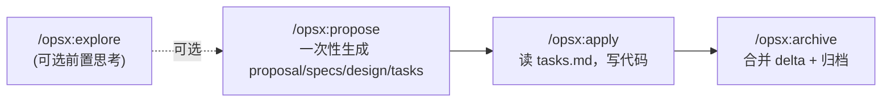
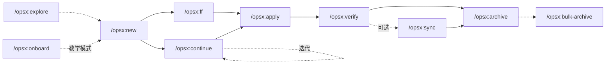
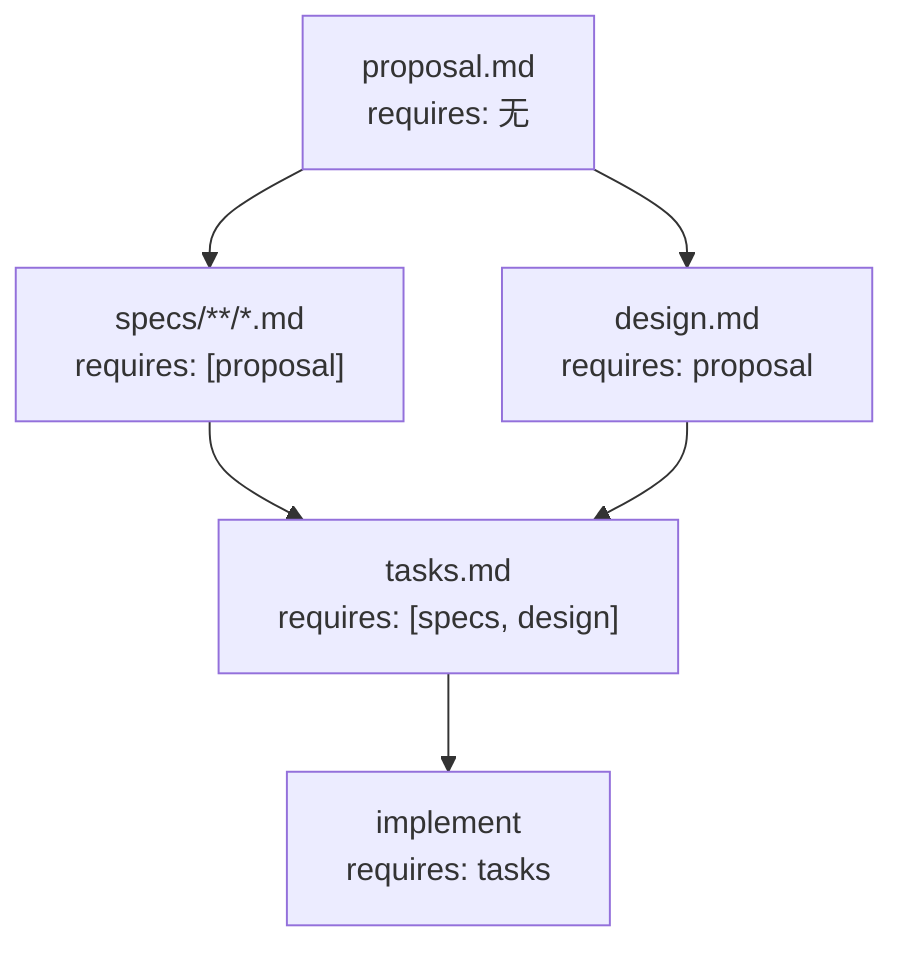
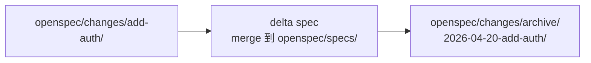

# 04 · 日常使用（Core Profile）

> 回 [导读](00-index.md) · [FAQ](FAQ.md)

本文覆盖默认 `core` profile 的 4 个斜杠命令 + 人类日常用的 CLI。想要进阶功能（扩展命令、工具特定语法）去 [05-usage-advanced.md](05-usage-advanced.md)。

## 目录

- [§1 Profile 简介](#1-profile-简介)
- [§2 Core 四个斜杠命令](#2-core-四个斜杠命令)
- [§3 命令次序流程图](#3-命令次序流程图)
- [§4 决策树：什么时候用什么](#4-决策树什么时候用什么)
- [§5 浏览 CLI：`list` / `view` / `show`](#5-浏览-cli-list--view--show)
- [§6 校验 CLI：`validate`](#6-校验-cli-validate)
- [§7 其它 CLI：`archive` / `feedback` / `completion`](#7-其它-cli-archive--feedback--completion)
- [§8 全局选项 / 环境变量 / 退出码](#8-全局选项--环境变量--退出码)

---

## §1 Profile 简介

OPSX 的命令不是随便排的——它们分成两档 **profile**，每档决定了「你能看到哪些 `/opsx:*` 命令」。

源码定义：[src/core/profiles.ts](../src/core/profiles.ts)

```ts
export const CORE_WORKFLOWS = ['propose', 'explore', 'apply', 'archive'] as const;

export const ALL_WORKFLOWS = [
  'propose', 'explore',
  'new', 'continue', 'apply', 'ff',
  'sync', 'archive', 'bulk-archive',
  'verify', 'onboard',
] as const;
```

| Profile | 包含 workflow | 适用人群 |
|---------|--------------|----------|
| **core**（默认） | `propose` / `explore` / `apply` / `archive` | 刚上手 / 大多数场景 |
| **custom** | 任意子集（最多 11 个） | 想要精细控制 / 批量归档 / 做 onboarding |

### 如何切换

```bash
# 交互式切换 profile + 勾选 workflow
openspec config profile

# 快速切回 core
openspec config profile core

# 切换后刷新项目
openspec update
```

`openspec config profile` 进入后有四个动作：
1. 改 delivery（both / skills / commands）+ workflows
2. 只改 delivery
3. 只改 workflows
4. 什么都不改（退出）

---

## §2 Core 四个斜杠命令

安装 OpenSpec 后**默认就开启**这 4 个命令（来自 [src/core/profiles.ts](../src/core/profiles.ts) 的 `CORE_WORKFLOWS`）：

```
propose / explore / apply / archive
```

想用更细粒度的 7 个扩展命令，去 `openspec config profile` 切到 custom，见 [05-usage-advanced.md](05-usage-advanced.md)。

### `/opsx:propose`

**一句话**：创建一个新的 change 并**一次性生成**所有规划 artifact（proposal / specs / design / tasks），到可以实现的状态就停。

**语法**：`/opsx:propose [change-name-or-description]`

**做了什么**：
1. 在 `openspec/changes/<name>/` 建目录
2. 按当前 schema（默认 `spec-driven`）依次生成四个 artifact
3. 停在「ready for `/opsx:apply`」

**典型输出**：
```text
You: /opsx:propose add-dark-mode

AI:  Created openspec/changes/add-dark-mode/
     ✓ proposal.md
     ✓ specs/ui/spec.md
     ✓ design.md
     ✓ tasks.md
     Ready for implementation. Run /opsx:apply.
```

**什么时候用**：端到端最快的路径，知道自己要什么时首选。

**不适合**：需要逐个 artifact review、迭代，那要切到扩展模式用 `/opsx:new` + `/opsx:continue`。

### `/opsx:explore`

**一句话**：**不创建任何文件**的思考搭档——梳理想法、对比方案、调研代码库，最后再决定要不要发起 change。

**语法**：`/opsx:explore [topic]`

**做了什么**：
- 开一段探索式对话
- AI 可读代码、搜索 repo、比较多种方案、画图
- 确认方向后，过渡到 `/opsx:propose`（core）或 `/opsx:new`（expanded）

**典型场景**：
- 需求还模糊，先想清楚
- 性能 / 架构问题要先调研
- 多个候选方案要对比

### `/opsx:apply`

**一句话**：读 `tasks.md`，逐个打勾地把任务实现掉。

**语法**：`/opsx:apply [change-name]`

**做了什么**：
1. 读当前 change 的 `tasks.md`
2. 找未勾选的任务
3. 写代码、建文件、跑测试
4. 完成一个就把 `- [ ]` 改成 `- [x]`

**可恢复性**：中断后再跑会从上次停下的 task 接着做（因为状态存在 checkbox 里）。

**多 change 并行**：可以显式 `/opsx:apply add-dark-mode` 指定，否则 AI 会从上下文推断。

### `/opsx:archive`

**一句话**：把完成的 change 归档——合并 delta spec 到主 specs，然后把整个文件夹搬到 `changes/archive/YYYY-MM-DD-<name>/`。

**语法**：`/opsx:archive [change-name]`

**做了什么**：
1. 检查 artifact 完整性
2. 检查 `tasks.md` 的勾选状态（有未完成会 warn，但不阻塞）
3. 若 delta spec 没 sync，问要不要现在 sync
4. 合并 delta 到 `openspec/specs/<domain>/spec.md`
5. 搬家：`openspec/changes/<name>/` → `openspec/changes/archive/YYYY-MM-DD-<name>/`

**和 CLI 的关系**：也可以在终端直接跑 `openspec archive [--yes] [--skip-specs] [--no-validate]`（见 [§7](#7-其它-cli-archive--feedback--completion)）。

**何时不阻塞**：archive 不会因 task 未完成而失败，只会打 warning。

---

## §3 命令次序流程图

### Core 路径（默认）



**典型会话**：
```text
/opsx:explore                → 先想清楚（不产文件）
/opsx:propose add-dark-mode  → 自动生成四件套
/opsx:apply                  → 写代码
/opsx:archive                → 搬到 changes/archive/
```

### Expanded 路径（完整 11 个命令）

这个路径属于 [05-usage-advanced.md](05-usage-advanced.md) 的范围，此处仅示意：



### Artifact 依赖 DAG（`spec-driven` schema）

这是 artifact 之间的 **依赖**，不是命令执行顺序。依赖是 enabler，不是 gate——解锁后你想什么时候建都行。



**特性**：
- `specs` 和 `design` 可以**并行**建（都只依赖 proposal）
- `tasks` 必须等 specs 和 design 都 done 才 ready
- 整个 apply 阶段需要 `tasks` 存在

### 归档生命周期



- `/opsx:sync` 只做左边这步（合并 delta 但不搬目录）
- `/opsx:archive` 默认做两步（会问你是否先 sync）
- `/opsx:bulk-archive` 同时对多个 change 做这个事，会检测冲突

---

## §4 决策树：什么时候用什么

### `/opsx:ff` vs `/opsx:continue`（属于扩展命令，但决策常问）

| 情况 | 选 |
|------|----|
| 需求清晰，直接上 | `/opsx:ff` |
| 边想边写，每个 artifact 想 review 一下 | `/opsx:continue` |
| 想在 proposal 定稿后再决定怎么写 specs | `/opsx:continue` |
| 时间紧、改动小 | `/opsx:ff` |
| 复杂 change，想要控制感 | `/opsx:continue` |

**经验法则**：能一次说清全部 scope 就 `ff`，还在摸索就 `continue`。

### `/opsx:propose`（core）vs `/opsx:new + ff`（expanded）

本质是一样的，只是 core profile 把两步合成一条命令。选择看你的 profile：

- 用 core：直接 `/opsx:propose <name>`
- 用 expanded：`/opsx:new <name>` 然后 `/opsx:ff`

### 更新现有 change vs 开新 change

这是常见的困惑。来自 [docs/opsx.md](../docs/opsx.md) 的决策树：

```
                ┌────────────────────────────────────┐
                │     这件事算「同一份工作」吗？       │
                └──────────────┬─────────────────────┘
                               │
          ┌────────────────────┼────────────────────┐
          │                    │                    │
          ▼                    ▼                    ▼
     intent 没变?       scope 重叠 >50%?      原 change 现在
     problem 没变?      scope 没跑偏?         能不能独立收尾?
          │                    │                    │
    ┌─────┴─────┐        ┌─────┴─────┐        ┌─────┴─────┐
   YES         NO       YES         NO       NO         YES
    │           │        │           │        │           │
    ▼           ▼        ▼           ▼        ▼           ▼
  UPDATE      NEW     UPDATE       NEW     UPDATE        NEW
```

#### UPDATE 的情况

- **同 intent，精化执行**：发现边界 case、approach 要微调但目标没变、实现暴露了 design 的小错
- **scope 收窄**：先 ship MVP，剩下的后面做
- **学习驱动的修正**：代码库结构和预想不一样、依赖不如期、从 CSS 变量改成 Tailwind

#### NEW 的情况

- **intent 根本变了**：「加 dark mode」→「做一套主题系统」
- **scope 爆炸**：改大到几乎是另一件事；「修登录 bug」→「重写 auth」
- **原 change 能独立收尾**：「ship dark mode MVP」收，然后开新 change「enhance dark mode」

#### 一句话原则（来自 docs）

> **Update 保留脉络（context）；New change 提供清晰（clarity）。**
> 当思考历史本身有价值时选 update；当从头开始更清晰时选 new。

#### 比喻

像 git branch：
- 同一个 feature 继续 commit
- 真正新的工作开新分支
- 有时候 ship 一个 partial feature，然后为 phase 2 开新分支

### 多 change 并行

多个进行中的 change **互不干扰**（每个 change 一个目录），切换方式：

```text
/opsx:apply fix-login-redirect   # 显式指定 change name
/opsx:apply add-dark-mode        # 切回来
```

归档时用 `/opsx:bulk-archive` 批量处理，自带冲突解决（见 [05-usage-advanced.md](05-usage-advanced.md)）。

### 归档前要不要 verify

推荐先 verify：

```
/opsx:apply → /opsx:verify → /opsx:archive
```

verify **不会阻塞** archive，但会输出 CRITICAL / WARNING / SUGGESTION 清单。让 AI 帮你审自己写的代码，便宜又有效。

### 归档时要不要手动 sync

一般不用。`/opsx:archive` 会主动问你要不要现场 sync。

需要手动 `/opsx:sync` 的场景：
- 长周期 change，想让主 specs 先跟进（别的 change 基于它）
- 多个并行 change 都要拿最新主 specs 作为基线
- 想单独 review merge 结果再归档

---

## §5 浏览 CLI：`list` / `view` / `show`

### `openspec list`

列 change 或 spec。

```
openspec list [--specs|--changes] [--sort recent|name] [--json]
```

- 不加选项默认列 change
- `--sort recent`（默认）按修改时间；`--sort name` 按字母

```bash
openspec list                     # 当前 active 的 change
openspec list --specs             # 所有 spec
openspec list --json              # 给脚本用
```

输出示例（text）：
```
Active changes:
  add-dark-mode     UI theme switching support
  fix-login-bug     Session timeout handling
```

### `openspec view`

**交互式**终端仪表盘，按键浏览 spec 和 change。纯人类用，没有 `--json`。

```
openspec view
```

### `openspec show`

查看一个 change 或 spec 的详情。

```
openspec show [item-name] [options]
```

#### 通用选项

| 选项 | 说明 |
|------|------|
| `--type <type>` | `change` 或 `spec`（不写会猜） |
| `--json` | JSON 输出，给 AI/脚本 |
| `--no-interactive` | 禁用交互提示 |

#### Change 专用

| 选项 | 说明 |
|------|------|
| `--deltas-only` | 只返回 delta specs（JSON 模式） |

#### Spec 专用

| 选项 | 说明 |
|------|------|
| `--requirements` | 只返回 requirements，不含 scenario |
| `--no-scenarios` | 返回 requirement 但不含 scenario 正文 |
| `-r, --requirement <id>` | 按 1-based 索引返回指定 requirement |

#### 示例

```bash
openspec show                           # 交互式选择
openspec show add-dark-mode             # 指定 change
openspec show auth --type spec          # 指定 spec
openspec show add-dark-mode --json      # JSON 给 agent
```

---

## §6 校验 CLI：`validate`

校验 change 和 spec 的结构问题。

```
openspec validate [item-name] [options]
```

### 选项

| 选项 | 说明 |
|------|------|
| `--all` | 校验所有 change + spec |
| `--changes` | 只校验所有 change |
| `--specs` | 只校验所有 spec |
| `--type <change\|spec>` | 名字有歧义时指定类型 |
| `--strict` | 严格模式 |
| `--json` | JSON 输出 |
| `--concurrency <n>` | 并行度（默认 6，或 `OPENSPEC_CONCURRENCY` 环境变量） |
| `--no-interactive` | 禁用提示 |

### 示例

```bash
# 交互式
openspec validate

# 校验单个 change
openspec validate add-dark-mode

# 校验所有 change
openspec validate --changes

# 全校验 + JSON（CI 常用）
openspec validate --all --json

# 严格模式 + 12 并发
openspec validate --all --strict --concurrency 12
```

### 输出（JSON 样例）

```json
{
  "version": "1.0.0",
  "results": {
    "changes": [
      {
        "name": "add-dark-mode",
        "valid": true,
        "warnings": ["design.md: missing 'Technical Approach' section"]
      }
    ]
  },
  "summary": { "total": 1, "valid": 1, "invalid": 0 }
}
```

---

## §7 其它 CLI：`archive` / `feedback` / `completion`

### `openspec archive`

在终端非交互归档一个 change。和 `/opsx:archive` 是同一回事，只是不走 AI。

```
openspec archive [change-name] [options]
```

#### 选项

| 选项 | 说明 |
|------|------|
| `-y, --yes` | 跳过确认 |
| `--skip-specs` | 跳过 spec 合并（适合 infra / tooling / 纯文档改动） |
| `--no-validate` | 跳过校验（会要求二次确认） |

#### 示例

```bash
openspec archive                        # 交互式
openspec archive add-dark-mode          # 指定
openspec archive add-dark-mode --yes    # CI 无人值守
openspec archive update-ci-config --skip-specs   # tooling 改动，specs 没变
```

#### 内部顺序

1. 校验 change（除非 `--no-validate`）
2. 问确认（除非 `--yes`）
3. 合并 delta → `openspec/specs/`
4. 把 change 目录搬到 `openspec/changes/archive/YYYY-MM-DD-<name>/`

### `openspec feedback`

创建 GitHub issue 提反馈。

```
openspec feedback <message> [--body <text>]
```

**依赖**：需要 `gh` CLI 已安装并登录。

```bash
openspec feedback "Add support for custom artifact types" \
  --body "I'd like to define my own artifact types beyond the built-in ones."
```

### `openspec completion`

shell 自动补全。

```
openspec completion <subcommand> [shell]
```

| 子命令 | 说明 |
|--------|------|
| `generate [shell]` | 输出补全脚本到 stdout |
| `install [shell]` | 为当前 shell 安装 |
| `uninstall [shell]` | 卸载 |

支持 shell：`bash`、`zsh`、`fish`、`powershell`。

```bash
openspec completion install              # 自动识别 shell
openspec completion install zsh          # 指定 zsh
openspec completion generate bash > ~/.bash_completion.d/openspec
openspec completion uninstall
```

---

## §8 全局选项 / 环境变量 / 退出码

### 全局选项

| 选项 | 说明 |
|------|------|
| `--version`, `-V` | 版本号 |
| `--no-color` | 禁用彩色输出 |
| `--help`, `-h` | 帮助 |

### 环境变量

| 变量 | 作用 |
|------|------|
| `OPENSPEC_TELEMETRY` | 设为 `0` 关闭遥测 |
| `DO_NOT_TRACK` | 设为 `1` 关闭遥测（业界标准 DNT） |
| `OPENSPEC_CONCURRENCY` | `validate --all` 的默认并发数（默认 6） |
| `EDITOR` / `VISUAL` | `openspec config edit` 用的编辑器 |
| `NO_COLOR` | 禁用彩色输出 |
| `CODEX_HOME` | Codex adapter 把全局命令装到 `$CODEX_HOME/prompts/`，没设则用 `~/.codex/` |

### 退出码

| 码 | 含义 |
|----|------|
| `0` | 成功 |
| `1` | 错误（校验失败、文件缺失等） |
| `130` | `Ctrl+C` 取消 `openspec config profile`（特殊约定） |
