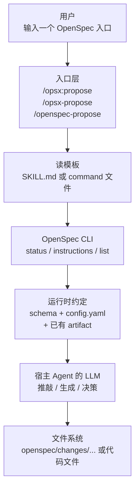

# 06 · Agent Protocol（CLI 给 AI 用）

> 回 [导读](00-index.md) · [FAQ](FAQ.md)

这四个命令是 **OPSX 的核心骨架**——AI agent 在执行 `/opsx:*` 命令时会调它们拿结构化数据。人类也能用它们检查进度。

实现在 [src/commands/workflow/](../src/commands/workflow/)。

## 目录

- [§0 OpenSpec 怎么"借用"宿主 coding agent 的 LLM](#0-openspec-怎么借用宿主-coding-agent-的-llm)
- [§0A Core 四个 skill 的统一执行模型](#0a-core-四个-skill-的统一执行模型)
- [§1 `openspec status`](#1-openspec-status)
- [§2 `openspec instructions`](#2-openspec-instructions)
- [§3 `openspec templates`](#3-openspec-templates)
- [§4 `openspec schemas`](#4-openspec-schemas)

---

## §0 OpenSpec 怎么"借用"宿主 coding agent 的 LLM

> 关键事实：**OpenSpec CLI 自己不带 LLM、不调 OpenAI/Anthropic API、不发任何网络请求**。grep 整个 src/ 目录搜 `openai|anthropic|claude.*api|llm` 零结果。

那它是怎么做"AI 编程"的？答：**它是个 prompt 编排器 + 结构化数据 API**，真正的智能来自宿主 coding agent（Claude Code / Cursor / Cline / ...）里的 LLM。

### 三方角色

```text
┌─────────────────┐   ┌──────────────────────┐   ┌────────────────┐
│  用户            │←─→│  Coding Agent        │←─→│  OpenSpec CLI   │
│  (键入命令)      │   │  (Claude Code/        │   │  (纯文件操作 +  │
│                  │   │   Cursor/...)         │   │   JSON API)     │
│                  │   │  ┌─────────────────┐  │   │                 │
│                  │   │  │   LLM（智能源）  │  │   │   ┌──────────┐ │
│                  │   │  │   Claude/GPT/... │  │   │   │ 文件系统  │ │
│                  │   │  └─────────────────┘  │   │   │ 模板/状态  │ │
└─────────────────┘   └──────────────────────┘   │   └──────────┘ │
                                                  └────────────────┘
```

- **OpenSpec 只做**：读写文件、解析 schema、组装 prompt 上下文（模板 + project context + rules + 依赖 artifact 内容）、计算 artifact 状态
- **Agent 做**：解析用户意图、读 OpenSpec 输出的 JSON、把 JSON 交给自己的 LLM 推理、生成 artifact、再调 OpenSpec CLI 写文件
- **LLM 做**：所有"创造性"的工作——写 proposal、设计 specs、列 tasks、实现代码

### 完整握手流程（以 `/opsx:propose add-dark-mode` 为例）

```text
[1] 用户 → Claude Code: 输入 "/opsx:propose add-dark-mode"

[2] Claude Code → 文件系统: 读 .claude/commands/opsx/propose.md
    （这就是 OpenSpec init 时铺好的 prompt 模板）

[3] Claude Code: 把 propose.md 的内容当成"我接下来要做什么"的指令
    模板告诉它："先调 openspec status --json 看状态，然后调
    openspec instructions <artifact> --json 拿模板和上下文，
    然后用你的 LLM 生成 artifact 内容，再写到指定路径"

[4] Claude Code → Shell: 执行 `openspec status --change add-dark-mode --json`
    OpenSpec 返回:
    {
      "schemaName": "spec-driven",
      "artifacts": [
        {"id":"proposal","status":"ready"},
        {"id":"specs","status":"blocked","missingDeps":["proposal"]},
        ...
      ]
    }

[5] Claude Code → Shell: 执行 `openspec instructions proposal --change add-dark-mode --json`
    OpenSpec 返回:
    {
      "artifactId": "proposal",
      "outputPath": "openspec/changes/add-dark-mode/proposal.md",
      "instruction": "Create a proposal that explains...",  ← schema 定义的 AI 指令
      "template": "## Why\n...\n## What Changes\n...",      ← 模板原文
      "context": "<context>This project uses React + ...</context>",  ← 项目背景
      "rules": "<rules>Use Conventional Commits...</rules>",          ← 规则
      "dependencies": []                                              ← 已有 artifact 的内容
    }

[6] Claude Code → 自己的 LLM: 把上面这些拼成一个大 prompt 喂给 Claude:
    "你是 OpenSpec 助手。任务: <instruction>
     用这个模板: <template>
     项目背景: <context>
     规则: <rules>
     已有依赖: <dependencies>
     用户的需求: add-dark-mode
     生成 proposal.md 的内容。"

[7] LLM 返回生成的 proposal.md 内容

[8] Claude Code → 文件系统: 把内容写到 openspec/changes/add-dark-mode/proposal.md

[9] Claude Code → 用户: 显示成功 + 提示下一步 (/opsx:apply 或 /opsx:continue)
```

**OpenSpec 全程只在 Step 4、5、8 出现**——**纯 IO，零推理**。

### 0A Core 四个 skill 的统一执行模型

如果你只想抓住一件事，就记这一句：

> **不管入口是 `/opsx:propose`、`/opsx-propose`、还是 `/openspec-propose`，底层都是同一个 workflow：agent 先读 skill / command 模板，再调 OpenSpec CLI 拿结构化上下文，再用宿主 LLM 推理，最后决定是否写文件。**

这正是 OpenSpec 的源码思路：

- **profile 决定装哪几个 workflow**：core 默认就是 `propose / explore / apply / archive`
- **delivery 决定入口长什么样**：skill、command，或者两者都装
- **CLI 提供运行时真实约定**：schema、context、rules、依赖、状态
- **宿主 agent 负责推理和执行**：什么时候问用户、什么时候继续、什么时候暂停

### 先看总图



### 入口虽然不同，但只是"壳"不同

| 你看到的入口 | 常见工具 | 本质 |
|--------------|----------|------|
| `/opsx:propose` | Claude Code 一类 | command 入口 |
| `/opsx-propose` | Cursor / Cline 一类 | command 入口 |
| `/openspec-propose` | Trae / ForgeCode 一类 | skill 入口 |

**不要被前缀吓到。** 对 core 四个 workflow 来说，真正稳定的是中间那层 `workflowId`：

- `propose`
- `explore`
- `apply`
- `archive`

前缀只是适配不同 agent 的交互习惯；**底层执行协议没有变**。

### 统一成 5 步，会更容易想明白

#### Step 1. 先选入口，再读模板

agent 首先读到的不是 `config.yaml`，而是 OpenSpec 生成出来的 skill / command 模板。模板里会明确告诉 agent：

- 先跑什么 CLI
- CLI 返回哪些字段
- 哪些字段是给 LLM 的约束，不能直接抄进文件
- 遇到不清楚时该问用户，还是该继续

所以：

- **模板是执行手册**
- **CLI 是运行时数据源**
- **`config.yaml` 是 CLI 的输入之一**

#### Step 2. 用 CLI 确认当前状态

大多数 workflow 都会先调这些命令中的一个或多个：

- `openspec list --json`
- `openspec status --change "<name>" --json`
- `openspec instructions <artifact> --change "<name>" --json`
- `openspec instructions apply --change "<name>" --json`

这些命令让 agent 知道：

- 当前有哪些 active change
- 当前 change 用的是哪个 schema
- 哪些 artifact 已经 `done`
- 哪些 artifact 已经 `ready`
- 哪些 artifact 还 `blocked`
- `apply` 阶段是不是能开始

#### Step 3. 用 CLI 返回的结构化数据喂给 LLM

源码里真正给 agent 的，不是散乱文本，而是结构化字段：

- `schemaName`
- `artifacts`
- `applyRequires`
- `instruction`
- `template`
- `context`
- `rules`
- `dependencies`
- `contextFiles`
- `tasks`
- `progress`

这里最重要的分工是：

- `template` 决定输出文件长什么样
- `instruction` 决定这个 artifact / apply 阶段该怎么写
- `context` 提供项目背景
- `rules` 提供 artifact 级约束
- `dependencies` / `contextFiles` 提供已有内容，避免 LLM 瞎编

#### Step 4. LLM 开始"推敲"

OpenSpec 不替 LLM 思考。真正的推敲，发生在宿主 agent 那边。按源码的设计，它至少会推敲这些问题：

| 推敲主题 | 典型问题 |
|---------|----------|
| **命名** | 用户说的是一个新 change，还是已有 change？名字要不要转成 kebab-case？ |
| **依赖顺序** | 当前应该先写 proposal，还是 design / specs 已经 ready？ |
| **信息是否足够** | 现有 context、rules、dependencies 能不能支撑继续写？要不要问用户？ |
| **是否该暂停** | 任务不清楚、设计暴露问题、状态 blocked 时，要不要停下来确认？ |
| **是否落盘** | 当前只是探索，还是应该真的写 artifact / 写代码 / 归档？ |
| **下一步提示** | 现在应该引导用户继续 `apply`、更新 artifact，还是 `archive`？ |

#### Step 5. 决定是否写文件

四个 skill 在这一步开始分叉：

- `explore`：通常**不落盘**
- `propose`：写 `openspec/changes/<name>/` 下的 artifact
- `apply`：写业务代码，并更新 `tasks.md`
- `archive`：必要时先 sync spec，再把 change 搬到 archive

---

### `propose`：一次性把规划做齐，直到可实施

这是 core profile 里**流程感最强**的 skill。

#### 代码上的固定动作

1. 如果用户没说清楚要做什么，先问清楚
2. 从描述里推一个 kebab-case change name
3. 跑 `openspec new change "<name>"`
4. 跑 `openspec status --change "<name>" --json`
5. 找出当前 `ready` 的 artifact
6. 对每个 `ready` artifact 跑 `openspec instructions <artifact> --change "<name>" --json`
7. 结合 `template + instruction + context + rules + dependencies` 生成文件
8. 每写完一个 artifact 就重新跑一次 `status`
9. 一直做到 schema 的 `applyRequires` 全部满足为止

#### 这一段在推敲什么

- 用户说的是需求名，还是一句自然语言描述
- 这个 change 是否已经存在；若存在，是继续还是新开
- 现在最先该写哪个 artifact，不能跳过哪些依赖
- `context` / `rules` 是约束，不该被原样抄进文档
- 哪个点已经足够清楚，可以继续；哪个点必须停下来问
- 什么时候算“已经 ready for apply”，而不是“必须把所有 artifact 都写满才停”

#### 它为什么符合 OPSX 的思路

OPSX 的核心不是“先写 proposal 再手动想下一步”，而是：

- 用 schema 定义 artifact 依赖
- 用 status 判断哪一步 ready
- 用 instructions 按需取每一步的模板和约束
- 到 `apply` 所需条件满足就停，把“规划”和“实施”清晰切开

#### 一个最小例子

```text
用户: /opsx:propose add-dark-mode

agent:
1. openspec new change "add-dark-mode"
2. openspec status --change "add-dark-mode" --json
   → proposal ready, specs/design/tasks 还没 ready
3. openspec instructions proposal --change "add-dark-mode" --json
   → 拿到 proposal 的 template / context / rules
4. 生成 proposal.md
5. 再跑 status
   → specs 和 design ready
6. 分别拿 instructions，生成 specs / design
7. 再跑 status
   → tasks ready
8. 生成 tasks.md
9. 检查 applyRequires 已满足
10. 停止，并提示用户下一步跑 apply
```

#### 这一步 agent 可能会说什么

- "我先把 change 建出来，然后按 schema 的依赖顺序生成 artifact。"
- "proposal 已经完成，现在 specs 和 design 都可继续。"
- "tasks 生成完后，这个 change 已经进入可实施状态。"
- "接下来可以直接 `/opsx:apply`。"

---

### `explore`：不是流水线，而是有边界的思考姿态

它跟另外三个 skill 最大的区别是：**源码明确说这不是一个固定 workflow，而是一种 stance。**

#### 代码上的固定边界

- 可以读文件、搜代码、调查架构
- 可以画 ASCII 图、列对比、找风险
- 可以在用户要求时创建或更新 OpenSpec artifact
- **绝不能直接实现功能代码**

#### 常见起手式

1. 跑 `openspec list --json`
2. 看看项目里有没有 active change
3. 如果用户提到了具体 change，就读该 change 的 proposal / design / tasks / specs
4. 结合代码库做调研、比较、提问、澄清
5. 当思路成形时，提出下一步建议

#### 这一段在推敲什么

- 用户到底是在探索“问题空间”，还是已经准备进入“方案落地”
- 该继续发散，还是该收敛成 proposal
- 现有 change 的 scope、design、requirements 有没有需要修正
- 某个发现应该落到 `proposal`、`design`、`specs` 还是 `tasks`
- 此刻最值钱的是“继续想”，还是“把想法固化成 artifact”

#### 一个最小例子

```text
用户: /openspec-explore auth-system

agent:
1. openspec list --json
   → 发现已有 change: refactor-auth
2. 读取该 change 的 proposal / design / tasks
3. 搜代码，看 session、OAuth、permission 的现状
4. 画出当前 auth flow 图
5. 提出三个可选方向：
   - 继续在现有设计上修补
   - 调整 design.md
   - 先把 scope 缩小成 MVP
6. 不写代码，只帮助用户收敛
```

#### 这一步 agent 可能会说什么

- "我先看一下当前有没有 active change，再决定是纯探索还是带着上下文探索。"
- "这个问题更像 design 决策，不应该直接开始写代码。"
- "我们已经收敛到一个稳定方向了，要不要我把它落成 proposal？"

---

### `apply`：把计划翻译成代码，并实时回写进度

`apply` 的核心不是“自由实现”，而是**按 schema 的 apply 配置和 tracking 文件推进**。

#### 代码上的固定动作

1. 确定要操作哪个 change
2. 跑 `openspec status --change "<name>" --json`
3. 跑 `openspec instructions apply --change "<name>" --json`
4. 根据返回状态分三类：
   - `blocked`
   - `ready`
   - `all_done`
5. 读取 `contextFiles` 指向的所有文件
6. 按 pending task 逐个实现
7. 每完成一个任务，立刻把 `tasks.md` 里的 checkbox 从 `- [ ]` 改成 `- [x]`
8. 遇到歧义、设计问题、阻塞项时暂停并反馈

#### 这一段在推敲什么

- 如果用户没点名 change，可不可以安全推断；不安全就必须问
- 当前 schema 的 apply 依赖是否已经满足
- `tasks.md` 是否存在、是否为空、是否已经全部完成
- 哪些上下文文件必须先读完再动手
- 某个任务到底是简单实现，还是已经暴露出 design / spec 问题
- 是继续把任务做完，还是先回头更新 artifact

#### 它为什么符合 OPSX 的思路

OPSX 不把“实施”当成脱离规格的自由发挥，而是把实施也纳入状态机：

- 先看 apply 是否 ready
- 再看任务跟踪文件
- 再按任务推进
- 实现中发现问题，可以回流到 artifact，而不是假装规格没问题

#### 一个最小例子

```text
用户: /opsx:apply add-dark-mode

agent:
1. openspec status --change "add-dark-mode" --json
   → schemaName = spec-driven
2. openspec instructions apply --change "add-dark-mode" --json
   → state = ready
   → contextFiles = proposal/specs/design/tasks
   → progress = 0/5
3. 先读四类上下文文件
4. 开始做 task 1
5. 改代码，跑测试
6. 完成后把 tasks.md 对应项改成 [x]
7. 继续 task 2、task 3...
8. 如果 task 3 暴露 design 缺口，暂停并建议更新 design.md
```

#### 这一步 agent 可能会说什么

- "我先确认这个 change 的 apply 状态和任务追踪文件。"
- "当前还没 blocked，可以开始实现。"
- "这个任务实现过程中暴露出设计缺口，我建议先更新 artifact 再继续写代码。"
- "本轮完成了 2 个任务，剩余 3 个。"

---

### `archive`：检查、确认、必要时 sync，然后归档

`archive` 的目标不是单纯“搬目录”，而是**给 change 一个可交代的结束动作**。

#### 代码上的固定动作

1. 如果用户没指定 change，先列 active changes 让用户选
2. 跑 `openspec status --change "<name>" --json` 看 artifact 完整度
3. 读 `tasks.md` 看是否还有未完成任务
4. 检查 `openspec/changes/<name>/specs/` 下是否有 delta specs
5. 若有 delta specs，先做 sync 判断与提示
6. 用户决定后，再执行 archive
7. 目标路径是 `openspec/changes/archive/YYYY-MM-DD-<name>/`
8. 完成后汇报 schema、sync 状态、archive 位置、警告信息

#### 这一段在推敲什么

- 能不能自动猜 change；源码答案是**不能，没给名字时要让用户选**
- 当前不完整的地方只是 warning，还是足以让人重新确认
- delta specs 是不是已经同步过；如果没同步，应该先 sync 还是允许跳过
- 现在这个 change 是否真的该封箱，还是仍处于中途状态

#### 它为什么符合 OPSX 的思路

OPSX 认为 change 不是“写完代码就结束”，而是要有一个明确的生命周期闭环：

```text
active change
   ↓
实现完成 / 至少准备结束
   ↓
delta specs 合并回主 specs（可提示）
   ↓
归档到 changes/archive/
```

#### 一个最小例子

```text
用户: /opsx:archive add-dark-mode

agent:
1. openspec status --change "add-dark-mode" --json
   → artifact 都是 done
2. 读 tasks.md
   → 5/5 tasks complete
3. 检查 delta specs
   → 发现有 UI 能力的 delta spec
4. 提示：
   "建议先 sync 再 archive，要现在同步吗？"
5. 用户确认后继续
6. 把 change 搬到
   openspec/changes/archive/2026-04-20-add-dark-mode/
7. 汇报：已归档、是否 sync、是否有 warning
```

#### 这一步 agent 可能会说什么

- "我先检查这个 change 的 artifact 和任务完成度。"
- "我发现有 delta spec 尚未合并，建议先 sync。"
- "即使有 warning，也可以继续 archive，但我会先请你确认。"
- "归档后，这个 change 会从 active changes 移到 archive 目录。"

---

### 你真正该记住的不是四个命令名，而是四种动作

| workflow | 本质动作 | 典型产出 |
|----------|----------|----------|
| `explore` | 想清楚 | 结论、图、比较、可选的 artifact 更新 |
| `propose` | 立 change 并补齐 apply 前置 artifact | `proposal / specs / design / tasks` |
| `apply` | 按任务实施并更新进度 | 代码变更 + 被打勾的 `tasks.md` |
| `archive` | 关闭生命周期 | merged specs + archive 目录 |

如果你是要接 CLA / Cline / Trae，最重要的一句就是：

> **这些工具只是在入口层长得不一样；真正稳定、可依赖、可移植的是 OpenSpec 的 workflow 模板 + CLI 协议。**

### 为什么这种设计聪明

1. **零 API key、零网络依赖**：OpenSpec 装机即用，不要 OPENAI_API_KEY、不要登录
2. **模型无关**：Claude Code 用 Claude、Cursor 用 Cursor 自家 LLM、Codex 用 GPT 都行——OpenSpec 不在意
3. **成本结构清晰**：所有 token 消费走宿主 agent 的账户，OpenSpec 不偷偷烧钱
4. **离线可调试**：你可以手动跑 `openspec instructions proposal --json` 看 agent 会拿到什么 prompt，方便排查
5. **每个 agent 用自己最擅长的方式**：Claude 用 skills 自动加载、Cursor 用斜杠命令、Trae 用 skill 面板——同一套 OpenSpec CLI 适配 28 个 agent

### Skill / Command 文件本质上是什么

它们是 **OpenSpec 出版给 LLM 看的"使用手册"**：
- 用人话告诉 LLM"OpenSpec 是什么、有哪些命令、协议是什么"
- 一步步指导 LLM"调哪个命令、解析哪个字段、什么时候写文件"

源码佐证 ([src/core/templates/workflows/apply-change.ts](../src/core/templates/workflows/apply-change.ts) 节选)：

```text
2. **Check status to understand the schema**
   ```bash
   openspec status --change "<name>" --json
   ```
   Parse the JSON to understand:
   - `schemaName`: The workflow being used (e.g., "spec-driven")
   - Which artifact contains the tasks ...

3. **Get apply instructions**
   ```bash
   openspec instructions apply --change "<name>" --json
   ```
   This returns:
   - `contextFiles`: artifact ID -> array of concrete file paths
   - Progress (total, complete, remaining)
   ...
```

**这段就是直接写给 LLM 看的、放在斜杠命令文件里**。LLM 读到后照着做。

### 只读 skill，会不会自动读 `openspec/config.yaml`

短答案：

- **不会直接读。**
- **会通过 OpenSpec CLI 间接生效。**

把这两层分开看最清楚：

#### 第一层：skill 文件本身

skill / command 文件本质上只是 prompt 模板，里面写的是：

- 先跑 `openspec status --json`
- 再跑 `openspec instructions <artifact> --change <name> --json`
- 再把返回的 `template / context / rules / dependencies` 交给宿主 agent 的 LLM

也就是说，**skill 自己不会去 parse `openspec/config.yaml`**。它既不内嵌 YAML parser，也不自己读这个文件内容；它只是告诉 agent 去调哪些 CLI 命令。

#### 第二层：OpenSpec CLI

真正会读 `openspec/config.yaml` 的，是 CLI 侧。

当 agent 按 skill 说明去执行命令时，会发生这几件事：

1. `openspec new change ...` / `openspec status ...`
   - 会解析当前 change 用哪个 schema
   - schema 的默认来源会落到 `openspec/config.yaml` 里的 `schema`

2. `openspec instructions <artifact> --json`
   - 会读取 `openspec/config.yaml`
   - 把项目级 `context` 注入返回结果
   - 把当前 artifact 对应的 `rules` 注入返回结果
   - 再把 schema 里的 `instruction` 和 `template` 一起打包返回给 agent

所以如果你说的是：

> "我只装 OpenSpec 的四个 core skill，不去研究源码，只让 agent 照着 skill 做事"

那答案是：

- **会拿到 `schema/context/rules`，但方式不是 skill 直接读文件，而是 skill 驱动 agent 去调用 CLI，然后 CLI 再读 `openspec/config.yaml`。**

#### 这三个核心东西分别在哪一步生效

| 核心项 | 来源 | 什么时候被用上 |
|--------|------|----------------|
| `schema` | `openspec/config.yaml` 的 `schema`（若 change 自己没绑定） | 新建 change、解析状态、决定 artifact DAG |
| `context` | `openspec/config.yaml` 的 `context` | `openspec instructions ... --json` 返回时注入 |
| `rules` | `openspec/config.yaml` 的 `rules[artifactId]` | `openspec instructions ... --json` 返回时注入 |

#### 一个最容易混淆的点

如果某个 agent **只是把 skill 文本展示出来**，但没有真的执行里面要求的 `openspec ...` 命令，那：

- 它**不会自动知道**项目里的 `schema/context/rules`
- 因为这些内容并不直接写在 skill 文件里
- 它们是在 CLI 响应里按需注入的

所以 OpenSpec 的正确理解是：

> **skill 是协议说明书，CLI 才是项目约定的实时提供者。**

可以把它记成一句话：

> **只读 skill = 只拿到操作手册；按 skill 去调 CLI = 才真正拿到 `config.yaml` 里的约定。**

### 跟以前 legacy "硬编码 prompt" 的区别

| 维度 | Legacy | OPSX (现在) |
|------|--------|-------------|
| Prompt 来自 | 源码里写死的字符串 | CLI 实时返回（`openspec instructions --json`） |
| 项目特定上下文 | 靠 LLM "自己读 project.md" | CLI 主动注入到 `<context>` 标签 |
| 依赖 artifact 内容 | LLM 自己 grep | CLI 在 JSON 里直接给完整内容 |
| 升级 OpenSpec | 要重新生成所有 prompt 文件 | 升级 CLI 即可，模板/逻辑都在 CLI 里 |

### 一句话总结

> **OpenSpec = 文件 + 模板 + 状态机 + JSON API**。所有 LLM 推理都由宿主 agent 执行；OpenSpec 只负责把"该怎么提示 LLM"这件事**结构化、可重放、可定制**。

### 推论

- 没装 coding agent → OpenSpec **只能**用来手动管理 specs/changes 目录（也能跑 `validate`、`list`、`show` 这些）
- 你完全可以**绕开 agent**，自己手写 artifact 文件然后用 `openspec validate` 校验——OpenSpec 不强求 AI 参与
- 想把 OpenSpec 接到自己的 LLM pipeline？读 `openspec instructions <id> --json` 拿到结构化 prompt → 自己调 OpenAI → 把返回写到 `outputPath` 即可

下面四个命令就是"agent 用来跟 OpenSpec 对话的 RPC 接口"。

---

## §1 `openspec status`

显示某个 change 的 artifact 完成状态。

```
openspec status [--change <id>] [--schema <name>] [--json]
```

### 示例

```bash
# 交互式
openspec status

# 指定 change
openspec status --change add-dark-mode

# JSON 给 agent 用
openspec status --change add-dark-mode --json
```

### JSON 输出

```json
{
  "changeName": "add-dark-mode",
  "schemaName": "spec-driven",
  "isComplete": false,
  "applyRequires": ["tasks"],
  "artifacts": [
    {"id": "proposal", "outputPath": "proposal.md",    "status": "done"},
    {"id": "design",   "outputPath": "design.md",      "status": "ready"},
    {"id": "specs",    "outputPath": "specs/**/*.md",  "status": "done"},
    {"id": "tasks",    "outputPath": "tasks.md",
     "status": "blocked", "missingDeps": ["design"]}
  ]
}
```

状态的三种值来自 [src/core/artifact-graph/state.ts](../src/core/artifact-graph/state.ts)：`done` / `ready` / `blocked`。

---

## §2 `openspec instructions`

拿到创建某个 artifact 或 apply 阶段的**富上下文指令**。agent 主要靠这个命令拼提示词。

```
openspec instructions [artifact] [--change <id>] [--schema <name>] [--json]
```

### artifact 参数

- `proposal`、`specs`、`design`、`tasks`（`spec-driven` schema 的）
- `apply`（特殊值：拿 apply 阶段的指令）

### 示例

```bash
# 下一个可建的 artifact 的指令
openspec instructions --change add-dark-mode

# 指定 artifact
openspec instructions design --change add-dark-mode

# apply 阶段指令
openspec instructions apply --change add-dark-mode

# JSON 给 agent
openspec instructions design --change add-dark-mode --json
```

### 返回内容

- artifact 的模板正文
- 项目 config.yaml 里的 `context`（包在 `<context>` 标签）
- 对应 artifact 的 `rules`（包在 `<rules>` 标签）
- 所有依赖 artifact 的内容（让 AI 生成时有上下文）

这就是 OPSX 打破「硬编码提示」的关键——AI 不再读源码里的字符串，而是实时查询 CLI。

---

## §3 `openspec templates`

查看某个 schema 的模板文件实际解析到哪里。

```
openspec templates [--schema <name>] [--json]
```

### 示例

```bash
# 默认 schema
openspec templates

# 自定义 schema
openspec templates --schema my-workflow

# JSON
openspec templates --json
```

### 输出

```
Schema: spec-driven

Templates:
  proposal  → ~/.openspec/schemas/spec-driven/templates/proposal.md
  specs     → ~/.openspec/schemas/spec-driven/templates/specs.md
  design    → ~/.openspec/schemas/spec-driven/templates/design.md
  tasks     → ~/.openspec/schemas/spec-driven/templates/tasks.md
```

模板解析优先级：**project → user global → package built-in**（见 [07-customization.md §3](07-customization.md#3-schema-解析优先级)）。

---

## §4 `openspec schemas`

列出所有可用 schema 和它们的来源。

```
openspec schemas [--json]
```

### 输出

```
Available schemas:

  spec-driven (package)
    The default spec-driven development workflow
    Flow: proposal → specs → design → tasks

  my-custom (project)
    Custom workflow for this project
    Flow: research → proposal → tasks
```

括号里的来源类型：`package`（内置）/ `user`（`~/.local/share/openspec/schemas/`）/ `project`（`openspec/schemas/`）。
