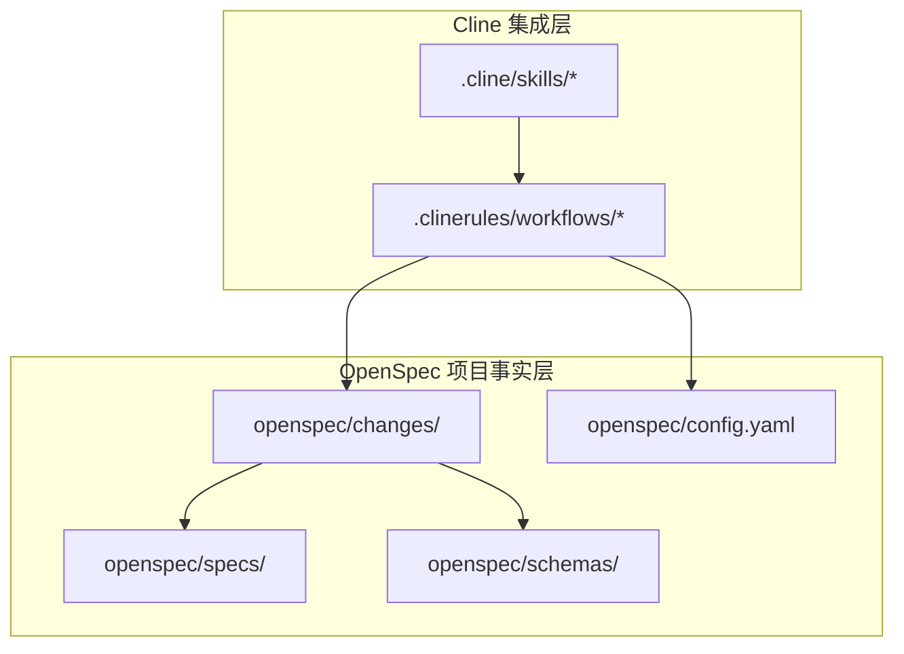
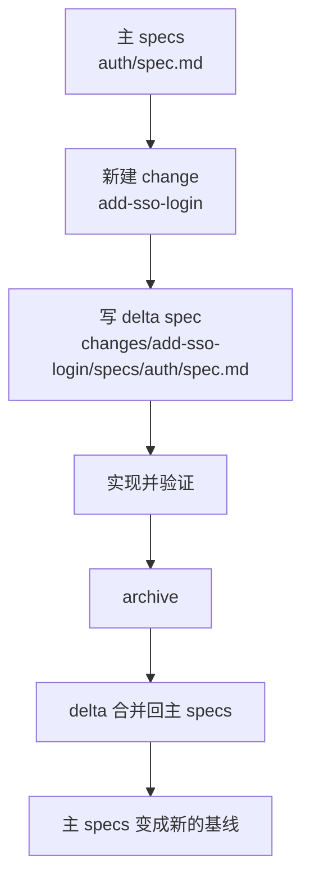

# 09 · Cline + OPSX 项目全景

> 回 [导读](00-index.md) · [03 核心概念](03-concepts.md) · [06 Agent 协议](06-agent-protocol.md) · [10 配置与 Schema 边界](10-config-and-schema-boundaries.md)

这篇专门回答一个很容易想错的问题：

> **“如果一个项目只装了 Cline + OpenSpec，只走 OPSX 这套命令，它的‘真实项目结构’到底长什么样？全局约定到底落在哪里？”**

如果把这个问题想不清，很容易把 OpenSpec 误解成：

- 只有 `changes/` 的一堆小文件夹
- skill 文件就是核心
- `config.yaml` 是“大总管”
- `schema` 只是 template 的别名

这些理解都只对一部分。OpenSpec 真正有意思的地方，恰恰在于它把“全局”拆成了几层，而且每层只管一件事。

## 目录

- [§1 一句话结论：全局不在一个文件里](#1-一句话结论全局不在一个文件里)
- [§2 只装 Cline 时，一个典型项目长什么样](#2-只装-cline-时一个典型项目长什么样)
- [§3 哪些目录是 source of truth，哪些只是投递层](#3-哪些目录是-source-of-truth哪些只是投递层)
- [§4 `specs/` 和 `changes/` 的真实关系](#4-specs-和-changes-的真实关系)
- [§5 四个 OPSX 命令背后各发生了什么](#5-四个-opsx-命令背后各发生了什么)
- [§6 一次 change 的完整生命周期](#6-一次-change-的完整生命周期)
- [§7 一个“真实感比较强”的模拟项目](#7-一个真实感比较强的模拟项目)
- [§8 常见误解：最容易想错的 8 件事](#8-常见误解最容易想错的-8-件事)

---

## §1 一句话结论：全局不在一个文件里

OpenSpec 的“全局约定”不是塞进某个单点总配置，而是分布在四层：

| 层 | 位置 | 它回答的问题 |
|----|------|--------------|
| **项目当前能力** | `openspec/specs/` | “这个系统**已经成立**的行为契约是什么？” |
| **项目提示约定** | `openspec/config.yaml` | “给 AI 的统一背景、规则、默认 schema 是什么？” |
| **项目工作流骨架** | `openspec/schemas/` | “一次 change 应该产出哪些 artifact、依赖关系是什么？” |
| **单次 change 绑定** | `openspec/changes/<name>/.openspec.yaml` | “这次 change 实际使用哪套 schema？” |

而 Cline 侧的：

- `.cline/skills/...`
- `.clinerules/workflows/...`

都不是项目事实本身，它们只是把 OpenSpec 能力“递送”给 Cline 的壳。

### 一张图先记住

```text
                        ┌────────────────────────────┐
                        │        Cline 入口层         │
                        │ .cline/skills/             │
                        │ .clinerules/workflows/     │
                        └──────────────┬─────────────┘
                                       │ 调 CLI
                                       ▼
┌─────────────────────────────────────────────────────────────────────┐
│                        OpenSpec 项目工作区                          │
│                                                                     │
│  openspec/specs/         ← 项目当前能力基线（长期 source of truth）  │
│  openspec/changes/       ← 当前正在做的增量（短中期工作区）          │
│  openspec/config.yaml    ← 项目背景 / 规则 / 默认 schema            │
│  openspec/schemas/       ← 项目自定义工作流定义                      │
└─────────────────────────────────────────────────────────────────────┘
                                       │
                                       ▼
                           AI 读 instructions / 写文件
```

你要是只记一句，就记这句：

> **OpenSpec 的核心不是“某个 change 文件夹”，而是“项目当前能力基线 + 针对该基线的增量演化”。**

---

## §2 只装 Cline 时，一个典型项目长什么样

假设你有一个真实业务项目，已经装了 OpenSpec，并且只给 Cline 装了 OPSX core 四个入口：`propose / explore / apply / archive`。

一个很典型的目录会长这样：

```text
my-app/
├── src/
│   ├── auth/
│   ├── billing/
│   └── ui/
├── tests/
├── package.json
├── README.md
├── openspec/
│   ├── specs/
│   │   ├── auth/
│   │   │   └── spec.md
│   │   ├── billing/
│   │   │   └── spec.md
│   │   └── notifications/
│   │       └── spec.md
│   ├── changes/
│   │   ├── add-sso-login/
│   │   │   ├── .openspec.yaml
│   │   │   ├── proposal.md
│   │   │   ├── design.md
│   │   │   ├── tasks.md
│   │   │   └── specs/
│   │   │       └── auth/
│   │   │           └── spec.md
│   │   ├── improve-invoice-export/
│   │   │   ├── .openspec.yaml
│   │   │   ├── proposal.md
│   │   │   └── specs/
│   │   │       └── billing/
│   │   │           └── spec.md
│   │   └── archive/
│   │       └── 2026-04-20-remove-legacy-reminder/
│   ├── config.yaml
│   └── schemas/
│       └── opsx-lite/
│           ├── schema.yaml
│           └── templates/
│               ├── proposal.md
│               ├── spec.md
│               ├── design.md
│               └── tasks.md
├── .cline/
│   └── skills/
│       ├── openspec-propose/
│       │   └── SKILL.md
│       ├── openspec-explore/
│       │   └── SKILL.md
│       ├── openspec-apply-change/
│       │   └── SKILL.md
│       └── openspec-archive-change/
│           └── SKILL.md
└── .clinerules/
    └── workflows/
        ├── opsx-propose.md
        ├── opsx-explore.md
        ├── opsx-apply.md
        └── opsx-archive.md
```

### 哪些是 OpenSpec 自己的工作区

- `openspec/` 是项目内的 OpenSpec 工作区
- `openspec/specs/` 是当前能力基线
- `openspec/changes/` 是所有 change 的工作区
- `openspec/config.yaml` 是项目级提示配置
- `openspec/schemas/` 是项目自定义 schema 仓库

### 哪些是 Cline 集成层

- `.cline/skills/` 是 skill 安装位置
- `.clinerules/workflows/` 是 Cline 的 workflow/command 文档

这两个目录让 Cline “知道如何调用 OpenSpec”，但它们本身不保存项目能力事实。

---

## §3 哪些目录是 source of truth，哪些只是投递层

这是整个心智模型最重要的一节。

### A. 真正的项目事实层

#### `openspec/specs/`

这是**当前系统已经成立的能力定义**。它不是“未来计划”，也不是“这次 change 的草稿”，而是**此刻被项目承认的行为合同**。

你可以把它理解成：

- 产品能力目录
- 需求事实层
- 行为契约层
- 所有后续 change 的基线

#### `openspec/changes/<name>/`

这是**一次 change 的实例工作区**。同一个 change 下面，会逐步产生：

- `proposal.md`
- `specs/.../spec.md`
- `design.md`
- `tasks.md`

这些文件不是项目长期总事实，而是“这次改动准备怎么改”的中间产物。

#### `openspec/schemas/<name>/`

这是**工作流定义**。它不是 change 内容，也不是项目现状，而是：

- 这类 change 需要哪些 artifact
- 每个 artifact 产出什么文件
- 哪些 artifact 依赖哪些前置
- 每个 artifact 用哪个 template
- apply 阶段怎么开放、追踪什么

#### `openspec/config.yaml`

这是**项目级提示注入配置**，管的是：

- 默认 schema 选哪个
- 给所有 artifact 追加哪些背景
- 给某些 artifact 追加哪些规则

它不是“能力定义仓库”，也不是“工作流结构定义”。

### B. 只是投递层的目录

#### `.cline/skills/`

这里的 `SKILL.md` 更像“给 agent 的操作手册”。它会引导 agent 去调用 `openspec status`、`openspec instructions`、`openspec archive` 等 CLI。

#### `.clinerules/workflows/`

这里的 `opsx-*.md` 是 Cline 的 slash/workflow 入口文档。它定义的是“怎么触发”和“触发后建议做什么”，不是项目业务本体。

### 一张区分图



读这张图时注意：

- agent 入口在 Cline 层
- schema 解析、instructions 生成在 OpenSpec 层
- 项目能力基线在 `openspec/specs/`

---

## §4 `specs/` 和 `changes/` 的真实关系

很多人第一次看 OpenSpec，都会以为它主打 `changes/`。这只对流程表面，对模型核心不对。

### 正确关系

```text
openspec/specs/                     = 当前主世界
openspec/changes/<name>/specs/...   = 这次 change 对主世界的增量描述
archive                             = 把增量合并回主世界
```

### 它不是“任务清单叠加”

`changes/` 不是 Jira ticket 目录，也不是纯文档草稿集合。它本质上是在说：

> “基于当前 `openspec/specs/` 这套现状，我们要把哪几个 capability 改成什么样？”

所以 `changes/<name>/specs/<capability>/spec.md` 默认不是完整主 spec，而是 **delta spec**：

- `ADDED`
- `MODIFIED`
- `REMOVED`
- `RENAMED`

### 一次变更如何长到主 specs 里



### 所以你该怎么理解“项目当前能力”

不是：

- “代码当前能跑出来什么”
- “上一次 change 做了什么”
- “config 里写了什么”

而是：

- **主 `openspec/specs/` 当前声明了什么 requirement**

如果代码已经实现了某种能力，但主 `specs/` 没写，那对 OpenSpec 来说，这个能力就还没有被清晰纳入“当前合同”。

---

## §5 四个 OPSX 命令背后各发生了什么

这节专门回答：

> “我在 Cline 里敲 `/opsx-*`，背后真正动的是哪些东西？”

### 1. `/opsx-propose`

目的不是写代码，而是**建立 change 骨架**。

通常背后会发生：

1. 确认或创建 `openspec/changes/<change-name>/`
2. 决定本次 change 用哪个 schema
3. 把 schema 写进 `.openspec.yaml`
4. 读取 schema 定义，判断 proposal 是否是入口 artifact
5. 加载 proposal 的 template + instruction + 项目 context/rules
6. 生成 `proposal.md`

它动到的关键文件：

```text
openspec/config.yaml
openspec/changes/<change-name>/.openspec.yaml
openspec/changes/<change-name>/proposal.md
openspec/schemas/<schema>/schema.yaml        # 如果是项目本地 schema
```

### 2. `/opsx-explore`

它不是一个单独 artifact，而更像“按状态推进下一个 ready artifact”。

典型行为：

1. 读 change 当前状态
2. 看 proposal/specs/design/tasks 谁是 `ready`
3. 调 `openspec instructions <artifact> --json`
4. agent 再结合依赖 artifact 内容生成下一个文件

所以 explore 背后真正靠的是：

- artifact DAG
- change 当前已完成文件
- schema 中的 `requires`

### 3. `/opsx-apply`

这一步才是真正进代码。

它的前提通常是：

- change 已经有 `tasks.md`
- apply phase 在 schema 里开放
- agent 依据 tasks 逐项实施

它会同时盯着两类东西：

- 项目代码目录，例如 `src/`
- `openspec/changes/<name>/tasks.md`

它不是只看代码不看 OpenSpec；恰恰相反，它依赖 OpenSpec 的任务分解来控制编码节奏。

### 4. `/opsx-archive`

这是最容易被低估的一步。它不是“把 change 文件夹塞进 archive 目录”这么简单。

真正含义是：

1. 找出该 change 下的 delta specs
2. 把 delta 应用到主 `openspec/specs/`
3. 让主 specs 成为新的项目能力基线
4. 再把 change 移动到 `openspec/changes/archive/`

所以 archive 是 **知识沉淀动作**，不是纯清理动作。

---

## §6 一次 change 的完整生命周期

下面用一个“给老系统加 SSO 登录”的例子看全流程。

### 第 0 步：项目已有能力基线

```text
openspec/specs/
└── auth/
    └── spec.md
```

这个 `auth/spec.md` 代表当前系统已经承认的认证能力，比如：

- 用户名密码登录
- 密码重置
- session 过期

### 第 1 步：新建 change

```text
openspec/changes/add-sso-login/
└── .openspec.yaml
```

里面通常像这样：

```yaml
schema: spec-driven
created: 2026-04-20
```

这一步说明：

- 项目默认 schema 可能来自 `config.yaml`
- 但从 change 创建开始，这次 change 的 schema 就被固化了

### 第 2 步：写 proposal

```text
openspec/changes/add-sso-login/proposal.md
```

proposal 的重点不是“怎么接 OAuth 细节”，而是：

- 为什么要做
- 影响哪些能力
- 是新增 capability 还是修改既有 capability

### 第 3 步：写 delta specs

```text
openspec/changes/add-sso-login/specs/
└── auth/
    └── spec.md
```

这里写的是“这次 change 对 auth 能力的增量”，例如：

```markdown
## ADDED Requirements

### Requirement: Enterprise SSO login
The system MUST allow eligible users to authenticate via enterprise SSO.

#### Scenario: Successful SSO login
- **WHEN** the user selects enterprise login
- **THEN** the system redirects the user to the identity provider
- **AND** signs the user in after successful callback
```

### 第 4 步：必要时写 design

如果这次变更涉及：

- 新外部身份提供商
- 多模块认证链路
- 安全风险
- 用户迁移

那 design 就有价值。

### 第 5 步：拆出 tasks

这一步把“行为合同”和“技术方案”落成可执行的编码清单。

### 第 6 步：apply

这时 agent 依据 tasks 改代码、补测试、跑验证。

### 第 7 步：archive

archive 后，主世界变成：

```text
openspec/specs/
└── auth/
    └── spec.md    # 已包含 SSO 这个新 requirement
```

而原 change 进入：

```text
openspec/changes/archive/2026-04-20-add-sso-login/
```

### 这就是 OpenSpec 最核心的时间结构

```text
主 specs（当前）
   ↓
change（未来增量）
   ↓
apply（实现）
   ↓
archive（沉淀）
   ↓
主 specs（新的当前）
```

---

## §7 一个“真实感比较强”的模拟项目

下面模拟一个只用 Cline 的 SaaS 项目，名字叫 `acme-console`。

### 项目目标

- 有登录、账单、通知三个领域
- 团队用 Cline 做 OPSX
- 默认使用 `spec-driven`
- 希望所有 specs 都强调兼容性和回滚

### 目录结构

```text
acme-console/
├── src/
│   ├── auth/
│   ├── billing/
│   ├── notifications/
│   └── shared/
├── tests/
├── docs/
│   ├── api-guidelines.md
│   └── architecture-overview.md
├── openspec/
│   ├── specs/
│   │   ├── auth/
│   │   │   └── spec.md
│   │   ├── billing/
│   │   │   └── spec.md
│   │   └── notifications/
│   │       └── spec.md
│   ├── changes/
│   │   ├── add-sso-login/
│   │   │   ├── .openspec.yaml
│   │   │   ├── proposal.md
│   │   │   ├── design.md
│   │   │   ├── tasks.md
│   │   │   └── specs/
│   │   │       └── auth/
│   │   │           └── spec.md
│   │   └── archive/
│   └── config.yaml
├── .cline/
│   └── skills/
│       ├── openspec-propose/
│       │   └── SKILL.md
│       ├── openspec-explore/
│       │   └── SKILL.md
│       ├── openspec-apply-change/
│       │   └── SKILL.md
│       └── openspec-archive-change/
│           └── SKILL.md
└── .clinerules/
    └── workflows/
        ├── opsx-propose.md
        ├── opsx-explore.md
        ├── opsx-apply.md
        └── opsx-archive.md
```

### 这个项目里，“操纵一个东西”时背后分别是什么

| 你在 Cline 里做的动作 | 你以为你在改什么 | 背后真正动的东西 |
|----------------------|------------------|------------------|
| `/opsx-propose add-sso-login` | 写 proposal | 创建 change、绑定 schema、生成 proposal artifact |
| `/opsx-explore add-sso-login` | “让 AI 继续” | 读取 DAG 状态，推进下一个 ready artifact |
| `/opsx-apply add-sso-login` | 让 AI 写代码 | 读取 tasks + specs + design，然后改源码/测试 |
| `/opsx-archive add-sso-login` | 收尾 | 合并 delta specs 回主 specs，并归档 change |

### 这个项目里最值得盯住的 5 个地方

1. `openspec/specs/`：项目当前能力基线
2. `openspec/changes/`：增量开发区
3. `openspec/config.yaml`：团队级提示约定
4. `.openspec.yaml`：单次 change 的 schema 绑定
5. `.cline/skills/` + `.clinerules/workflows/`：Cline 的触发入口

---

## §8 常见误解：最容易想错的 8 件事

### 误解 1：OpenSpec 的核心就是 `changes/`

不对。`changes/` 是工作区，`specs/` 才是长期主世界。

### 误解 2：skill 文件会直接读 `config.yaml`

不对。skill 更多是“告诉 agent 去调 CLI”；真正读 `config.yaml` 的是 CLI。

### 误解 3：`config.yaml` 是项目总配置中心

不对。它只管 `schema`、`context`、`rules`，不是业务能力仓库。

### 误解 4：schema 只是模板

不对。template 只是 schema 的一个字段；schema 还定义 artifact 集合、依赖图和 apply 规则。

### 误解 5：archive 只是移动目录

不对。archive 的关键动作是把 delta 合并回主 specs。

### 误解 6：`specs/` 是代码自动推导出来的

不对。它是团队维护的“当前能力合同”。代码和 specs 可能漂移，所以它需要被持续维护。

### 误解 7：一次 change 永远跟着项目默认 schema 走

不对。创建时可能继承项目默认值，但创建后会写进 `.openspec.yaml` 固化。

### 误解 8：只用 Cline 时，`.cline/` 才是主目录

不对。`.cline/` 是集成目录；`openspec/` 才是项目知识与工作流事实所在。

---

## 最后记忆法

如果你想把这整篇压成一句话，可以这样记：

```text
OpenSpec 不是“围绕 change 的简陋小文档系统”。
它是“以主 specs 为当前世界、以 changes 为增量世界、以 schema 为工作流骨架、
以 config 为提示注入层、再通过 Cline 把这套机制递送给 agent”的协作系统。
```

下一篇看 [10-config-and-schema-boundaries.md](10-config-and-schema-boundaries.md)，专门把：

- `config.yaml` 到底该写什么
- `schema` 到底是不是 template
- 什么该放 config，什么该放 schema，什么该放 specs

彻底拆开讲清楚。
