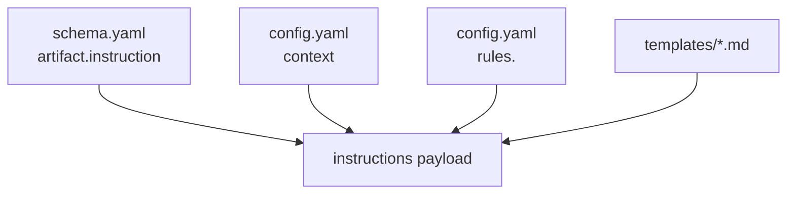
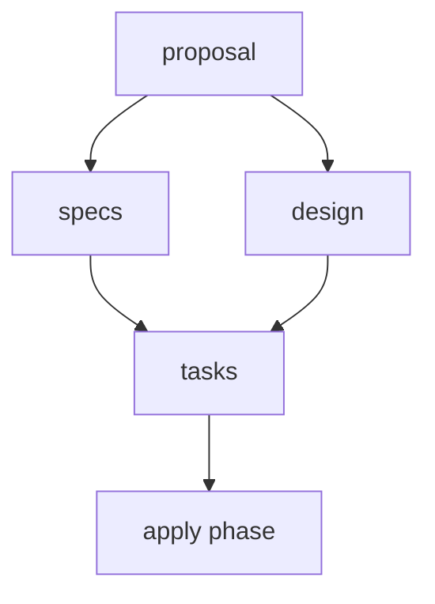
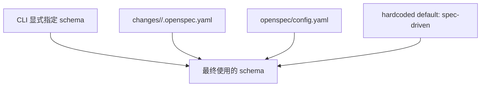

# 10 · Config 与 Schema 边界

> 回 [导读](00-index.md) · [03 核心概念](03-concepts.md) · [07 定制化](07-customization.md) · [09 Cline + OPSX 项目全景](09-cline-opsx-project-shape.md)

这篇专门解决四个最容易缠在一起的问题：

1. `openspec/config.yaml` **到底应该写什么**
2. `schema` **到底是不是 template**
3. `specs / config / schema / .openspec.yaml` **各自的边界是什么**
4. 什么时候该改 `config.yaml`，什么时候该 fork 一个 schema

如果这几层边界没想清楚，就特别容易出现两种极端：

- 什么都往 `config.yaml` 里塞，最后它成了一个半结构化垃圾桶
- 什么都想用 schema 解决，结果把团队偏好写成工作流结构，搞得过重

OpenSpec 的设计恰恰不是这样。它是把不同类型的“约定”放在不同层。

## 目录

- [§1 一句话先定边界](#1-一句话先定边界)
- [§2 `config.yaml` 到底是什么，不是什么](#2-configyaml-到底是什么不是什么)
- [§3 `config.yaml` 的三个字段，逐个讲透](#3-configyaml-的三个字段逐个讲透)
- [§4 6 份完整 `config.yaml` 例子](#4-6-份完整-configyaml-例子)
- [§5 `schema` 到底是什么](#5-schema-到底是什么)
- [§6 `schema` 和 template 的关系](#6-schema-和-template-的关系)
- [§7 `.openspec.yaml` 为什么很关键](#7-openspecyaml-为什么很关键)
- [§8 解析优先级：到底谁说了算](#8-解析优先级到底谁说了算)
- [§9 到底该改 config，还是该改 schema](#9-到底该改-config还是该改-schema)
- [§10 最常见的坏例子](#10-最常见的坏例子)

---

## §1 一句话先定边界

先把四个东西一句话钉死：

| 东西 | 一句话定义 |
|------|------------|
| `openspec/specs/` | 项目**当前能力合同** |
| `openspec/config.yaml` | 项目级**提示注入层** + 默认 schema 选择 |
| `openspec/schemas/<name>/schema.yaml` | 一次 change 的**工作流骨架定义** |
| `openspec/changes/<name>/.openspec.yaml` | 这次 change **实际绑定的 schema** |

再换一种更口语的说法：

- `specs` 管“**现在系统承诺了什么**”
- `config.yaml` 管“**让 AI 写东西时统一注意什么**”
- `schema` 管“**一次 change 应该长成什么形状**”
- `.openspec.yaml` 管“**这次 change 最终走哪套形状**”

### 最重要的区别

> **`config.yaml` 改的是“提示层行为”，`schema` 改的是“工作流结构”。**

这句非常关键。

---

## §2 `config.yaml` 到底是什么，不是什么

### 它是什么

`openspec/config.yaml` 是**项目级配置文件**，目前运行时真正认的核心字段只有：

- `schema`
- `context`
- `rules`

它解决的不是“项目有哪些能力”，而是：

- 默认用哪套 schema
- 给 agent 注入哪些项目背景
- 对不同 artifact 补哪些额外约束

### 它不是什么

它不是：

- 项目需求总仓库
- 项目能力清单
- artifact DAG 定义
- 模板仓库
- 某次 change 的局部元数据

### 用一句很准确的话概括

> `config.yaml` 是 **project-level prompt/config layer**，不是 **project capability layer**。

### 为什么不能把它当“大总管”

因为它的字段天生就不是干这个的。它没有能力表达：

- 新增一个 artifact
- 删除一个 artifact
- 修改 artifact 依赖关系
- 改变 apply 需要的前置条件
- 替换模板集合

这些都属于 `schema`。

---

## §3 `config.yaml` 的三个字段，逐个讲透

这一节要讲的不是“文档怎么说”，而是“代码实际怎么读它”。

### 字段总览

```yaml
schema: spec-driven

context: |
  Tech stack: TypeScript, React, Node.js
  Testing: Vitest + Playwright
  Public APIs should remain backward compatible.

rules:
  proposal:
    - Include rollback plan
  specs:
    - Add unhappy-path scenarios
  design:
    - Explain migration risk
  tasks:
    - Include verification tasks
```

### 1. `schema`

#### 它的作用

项目默认 schema 名。

典型含义：

- 新建 change 时，如果你不显式传 `--schema`，就用这里的值
- 某些命令在 change 没有自己的 `.openspec.yaml` 时，也会回退到这里

#### 它不意味着什么

它不意味着“项目永远只允许这一种 schema”。

一个项目可以：

- 大部分 change 用 `spec-driven`
- 某个特殊 change 用 `rapid`
- 某个团队内部实验用 `review-heavy`

创建时只要显式指定，单次 change 就可以偏离项目默认值。

#### 最小例子

```yaml
schema: spec-driven
```

#### 常见误解

误解：“这里写了 `schema: spec-driven`，所以所有现有 change 都会自动切过去。”

不对。现有 change 如果已经有 `.openspec.yaml`，它们会优先用自己的绑定。

### 2. `context`

#### 它的作用

给**所有 artifact 的 instructions** 注入统一背景。

它最适合放：

- 技术栈
- 项目结构
- 测试/发布/兼容性约束
- 领域背景
- 重要外部文档入口

#### 它最不适合放

- 一次 change 的临时说明
- 冗长的产品 PRD 原文
- 结构化工作流规则
- 用户自己的个人偏好

#### 注入方式

它会以 `<context>...</context>` 的形式出现在 instructions 里，而且对 proposal/specs/design/tasks 都生效。

示意：

```xml
<context>
Tech stack: TypeScript, React, Node.js
Testing: Vitest + Playwright
Public APIs should remain backward compatible.
</context>
```

#### 经验法则

好的 `context` 有三个特征：

1. 稳定：不是只对一个 change 成立
2. 高价值：agent 经常需要但不应每次重复输入
3. 不替代 spec：它给背景，不定义正式 requirement

### 3. `rules`

#### 它的作用

按 artifact 维度补充额外规则。

最重要的理解是：

> `rules` 是 **additive**，不是 replacement。

也就是：

- schema 自己有 `instruction`
- `config.yaml` 再给某个 artifact 补几条项目级规则
- 最终 agent 同时看到两者

#### 它的典型用途

- 给 `proposal` 强调要写影响面和回滚
- 给 `specs` 强调 scenario 风格、兼容性、错误路径
- 给 `design` 强调 migration / security / trade-off
- 给 `tasks` 强调粒度、验证项、发布项

#### 典型例子

```yaml
rules:
  proposal:
    - Call out affected APIs and user-facing impact.
    - Mention rollback strategy if behavior changes are visible.
  specs:
    - Add scenarios for unhappy paths, not only successful paths.
    - When modifying behavior, prefer MODIFIED over vague ADDED text.
  tasks:
    - Include test and verification tasks for each behavior change.
```

#### 它不会做什么

- 不会替换 schema 的内置 instruction
- 不会改 template 内容
- 不会改变 artifact DAG
- 不会让一个不存在的 artifact 凭空出现

### 一张机制图



这个 payload 再被 agent 拿去喂模型。

---

## §4 6 份完整 `config.yaml` 例子

这一节不讲抽象，只讲“你真正可能会怎么写”。

### 例 1：最小版

适合刚接入、先别多想的团队。

```yaml
schema: spec-driven
```

### 例 2：标准 Web 项目版

```yaml
schema: spec-driven

context: |
  Tech stack: TypeScript, React, Node.js, PostgreSQL
  API style: REST + JSON
  Testing: Vitest for unit tests, Playwright for e2e
  Deployment: GitHub Actions -> Kubernetes
  Public APIs should remain backward compatible unless explicitly marked breaking.

rules:
  proposal:
    - State impacted modules and public APIs.
    - Mention rollback path for user-visible behavior changes.
  specs:
    - Add unhappy-path scenarios for validation and permission failures.
    - If modifying existing behavior, inspect current openspec/specs/ before writing MODIFIED requirements.
  design:
    - Explain migration strategy if storage or API shape changes.
    - Document major trade-offs, not only the chosen path.
  tasks:
    - Include verification tasks and test updates.
    - Keep each task small enough for one focused implementation session.
```

### 例 3：遗留大仓库版

```yaml
schema: spec-driven

context: |
  This is a legacy monorepo.
  Backend: Java Spring Boot
  Frontend: React
  Data: MySQL + Redis
  Existing ERP and SSO integrations are high-risk zones.
  Prefer incremental changes over wide refactors.
  Avoid new dependencies unless the proposal explicitly justifies them.

rules:
  proposal:
    - Separate business change from technical cleanup.
    - Explicitly state whether external integrations are affected.
  specs:
    - Add compatibility scenarios for upstream and downstream systems.
    - Describe expected fallback behavior when external systems fail.
  design:
    - Document blast radius across modules and integrations.
    - Include rollback and operational risk notes.
  tasks:
    - Split implementation, migration, and rollout verification into separate sections.
```

### 例 4：只用 Cline + OPSX core 版

```yaml
schema: spec-driven

context: |
  This repository uses OpenSpec through Cline only.
  The standard workflow is OPSX core: propose -> explore -> apply -> archive.
  The canonical source of truth for current capability is openspec/specs/.
  New work starts in openspec/changes/<change-name>/.
  Prefer evolving existing capabilities over creating overlapping ones.

rules:
  proposal:
    - Distinguish clearly between new capabilities and modifications to existing ones.
    - Use kebab-case capability names.
  specs:
    - Read current main specs before writing MODIFIED requirements.
    - Each requirement must have at least one Scenario.
    - REMOVED requirements must include Reason and Migration.
  design:
    - Write design only for cross-module, dependency-heavy, or migration-sensitive changes.
  tasks:
    - Order tasks by dependency.
    - Add explicit verification tasks for each changed behavior.
```

### 例 5：跨平台 CLI 工具版

```yaml
schema: spec-driven

context: |
  Tech stack: TypeScript, Node.js, ESM modules
  Supported OS: macOS, Linux, Windows
  File paths must use path.join/path.resolve, never hardcoded separators.
  Tests must avoid OS-specific assumptions.

rules:
  specs:
    - Add Windows path-handling scenarios when file paths are involved.
    - Requirements about filesystem behavior must describe cross-platform expectations.
  design:
    - Prefer Node.js path utilities over string manipulation.
    - Document platform-specific caveats and limits.
  tasks:
    - Include Windows verification when changes touch file paths or shell integration.
```

### 例 6：平台团队治理版

```yaml
schema: spec-driven

context: |
  This project is maintained by a platform team serving multiple product teams.
  We optimize for safety, operability, and backward compatibility.
  Changes with migration impact should be explicit about rollout order and communication.

rules:
  proposal:
    - Name stakeholders and impacted consumer teams.
    - Call out operational and migration impact in the summary.
  specs:
    - Include authorization, quota, and failure-mode scenarios when relevant.
  design:
    - Add rollout, rollback, and observability considerations.
    - Record why rejected alternatives were not chosen.
  tasks:
    - Include docs, metrics, and rollout tasks when behavior crosses team boundaries.
```

---

## §5 `schema` 到底是什么

### 一句话定义

`schema` 不是 prompt，不是 template，不是 config，而是：

> **一次 change 的工作流定义文件。**

它描述：

- 这次 change 需要哪些 artifact
- 每个 artifact 产出什么文件
- 每个 artifact 用什么 template
- 每个 artifact 有什么 instruction
- 每个 artifact 依赖谁
- apply 阶段何时可用、追踪什么文件

### 一个最小 schema 长什么样

```yaml
name: spec-driven
version: 1
description: Default OpenSpec workflow - proposal -> specs -> design -> tasks

artifacts:
  - id: proposal
    generates: proposal.md
    description: Initial proposal document
    template: proposal.md
    instruction: |
      Create the proposal document that establishes WHY this change is needed.
    requires: []

  - id: specs
    generates: "specs/**/*.md"
    description: Detailed specifications for the change
    template: spec.md
    instruction: |
      Create specification files that define WHAT the system should do.
    requires: [proposal]

apply:
  requires: [tasks]
  tracks: tasks.md
```

### 它定义的是“结构”，不是“内容事实”

schema 关心的是：

- proposal 是否存在
- specs 是否依赖 proposal
- tasks 是否依赖 specs/design

它不关心：

- auth 现在有哪些 requirement
- billing 的能力边界是什么
- 这次 change 要不要改 session timeout

这些内容事实属于 `specs` 和 change artifact 自己。

### 一张图理解 schema



上图不是业务图，而是 **artifact 依赖图**。

---

## §6 `schema` 和 template 的关系

这是最容易混的地方。

### 最准确的关系

> **template 是 schema 的一个部件，不是 schema 的同义词。**

### 你可以这么理解

| 概念 | 它回答什么 |
|------|------------|
| `schema` | “这套 change 结构是什么样？” |
| `artifact` | “这套结构里有哪几类产物？” |
| `template` | “某类产物生成时，先给 AI 一个什么 Markdown 骨架？” |
| `instruction` | “告诉 AI 这类产物要怎么写的人话说明” |

### 一个非常直观的比喻

如果把一次 change 比作一张建筑蓝图：

- `schema` = 整栋楼的结构图
- `artifact` = 楼里的房间类型
- `template` = 每个房间的默认装修样板
- `instruction` = 装修说明

所以 schema 比 template 高一层。

### 为什么这点很重要

因为很多人一看 OpenSpec 就会说：

> “哦，它不就是几个模板吗？”

其实不是。它难点和价值都不在模板，而在：

- artifact DAG
- per-change schema binding
- template/instruction/context/rules 的组合
- archive 把 delta 沉淀回主 specs

---

## §7 `.openspec.yaml` 为什么很关键

很多人盯着 `config.yaml`，却忽略了 change 目录里的 `.openspec.yaml`。这是不对的。

### 它的作用

`.openspec.yaml` 是**单次 change 的元数据文件**。

典型内容：

```yaml
schema: spec-driven
created: 2026-04-20
```

### 它解决的核心问题

> “项目默认值会变，但一个 change 一旦开始，最好别跟着漂。”

比如：

- 你 4 月份新建了一个 change，默认 schema 是 `spec-driven`
- 5 月份团队把项目默认 schema 改成了 `rapid`
- 那个 4 月的 change 不应该被自动改造成 `rapid`

这时就靠 `.openspec.yaml` 来固化。

### 它和 `config.yaml` 的关系

可以这样理解：

- `config.yaml`：项目默认值
- `.openspec.yaml`：这次实例的实际绑定值

---

## §8 解析优先级：到底谁说了算

这一节特别关键，因为“默认值”和“实际值”经常不是一回事。

### 新建 change 时

创建 change 时，schema 的来源通常是：

```text
显式 --schema
   ↓
项目 openspec/config.yaml 的 schema
   ↓
硬编码默认 spec-driven
```

然后结果会写入该 change 的 `.openspec.yaml`。

### 后续对某个 change 运行命令时

优先级会变成：

```text
显式 schema 参数
   ↓
change 自己的 .openspec.yaml
   ↓
项目 openspec/config.yaml
   ↓
硬编码默认 spec-driven
```

### 一张图记住



### 这意味着什么

#### 情况 1：你刚把项目默认值从 `spec-driven` 改成 `rapid`

- 新 change 会受影响
- 已有 change 通常不会受影响

#### 情况 2：你想让某次 change 试验一套新 workflow

- 不必改全项目默认值
- 可以只让那次 change 用新 schema

#### 情况 3：你想回溯一个老 change 当时到底按什么规则创建的

- 看它自己的 `.openspec.yaml`

---

## §9 到底该改 config，还是该改 schema

这节给你一个最实用的判断表。

### 决策表

| 你的诉求 | 改哪里 |
|----------|--------|
| 想给所有 artifact 加统一背景 | `config.yaml -> context` |
| 想只给 `specs` 补几条写作规则 | `config.yaml -> rules.specs` |
| 想让默认 workflow 从 `spec-driven` 改成 `rapid` | `config.yaml -> schema` |
| 想新增一个 `review.md` artifact | `schema` |
| 想让 `tasks` 不再依赖 `design` | `schema` |
| 想把 proposal 模板整体改掉 | `schema` 下的 `templates/` |
| 想让 apply 改为跟踪别的文件 | `schema.apply` |
| 想修改项目当前 auth 能力定义 | `openspec/specs/auth/spec.md` |
| 想定义某次 change 的实际 schema | `changes/<name>/.openspec.yaml` |

### 一条超实用原则

> **“改提示”用 config，“改骨架”用 schema，“改事实”用 specs。**

### 再换一种说法

#### 该改 `config.yaml` 的场景

- “以后所有 proposal 都顺手带回滚计划”
- “我们项目默认是 TypeScript + React + PostgreSQL”
- “只要碰到外部 API，就提醒 agent 关注兼容性”

#### 该改 `schema` 的场景

- “我们团队不要 design，直接 proposal -> specs -> tasks”
- “我们需要加一个 review artifact”
- “apply 只能在 review 完成后开放”

#### 该改 `specs` 的场景

- “auth 能力现在正式支持 SSO 了”
- “billing 的发票导出语义变了”
- “notifications 删除了一种旧提醒机制”

---

## §10 最常见的坏例子

这一节专门讲“怎么写会把系统写乱”。

### 坏例 1：把 change 临时信息塞进 `context`

```yaml
context: |
  This week we only need to fix ticket OPS-123.
  Alice said maybe try option B first.
  The current hotfix branch is unstable.
```

问题：

- 这些不是项目长期稳定背景
- 会污染所有后续 change 的提示

正确做法：

- 这类信息放当前 change 的 proposal/design 里

### 坏例 2：把工作流结构愿望写进 `rules`

```yaml
rules:
  tasks:
    - Skip design completely
    - Allow apply before specs are done
```

问题：

- 这只是“提示愿望”
- 不会真的改变 DAG 或 apply gating

正确做法：

- 改 schema 的 `requires` 和 `apply`

### 坏例 3：把 `context` 写成百科全书

```yaml
context: |
  [50 多页系统设计文档全文粘贴]
```

问题：

- 太长
- 信噪比低
- 真正关键上下文被淹没

正确做法：

- 只放高密度摘要
- 外加文档入口链接或路径

### 坏例 4：把团队偏好做成 schema 结构

比如你只是想让所有 proposal 都写回滚，但却新建了一个重 schema。

问题：

- 过度建模
- 增加维护成本

正确做法：

- 先试 `rules.proposal`

### 坏例 5：把 `specs` 当实现笔记

问题：

- `specs` 应该表达行为合同，不是代码设计细节

正确做法：

- 行为放 `specs`
- 方案放 `design`
- 实施拆分放 `tasks`

---

## 最后的总记忆图

```text
specs      = 当前系统“已经成立了什么”
changes    = 这次准备“把它改成什么”
config     = 写这些 artifact 时“统一提醒 AI 什么”
schema     = 一次 change “应该长成什么骨架”
.openspec  = 这次 change “最终绑定了哪套骨架”
```

如果你只记一句最核心的话，我建议记这个：

> **OpenSpec 不是把一切都塞进 config 的轻量模板工具，而是把“能力事实”“提示约定”“工作流结构”“change 实例绑定”分层建模的协作系统。**

配合上一章 [09-cline-opsx-project-shape.md](09-cline-opsx-project-shape.md) 一起看，这套模型就完整了。
