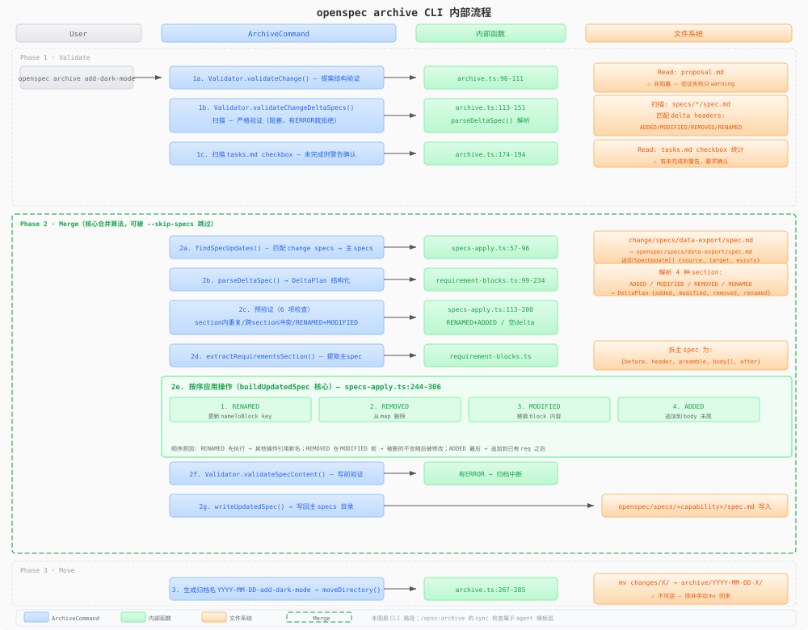

# 04 — archive：archive 合并

archive 是整个 change 生命周期的终点。它做三件事：验证 change、将 delta spec 合并到主 spec 基线、然后把 change 目录移到 archive 区。

这里需要先区分两条相关但不同的路径：

- **`openspec archive` CLI**：由 `ArchiveCommand.execute()` 执行，程序化完成验证、delta spec 合并和目录移动。
- **host 的 archive workflow skill/command 模板**：由 host agent 按 `archive-change.ts` 的指令执行，会先做 delta spec sync 状态评估，再按模板移动目录。Claude 等 command adapter 可显示为 `/opsx:archive`；Codex v1.8.0 使用 `$openspec-archive-change` skill。它不是 `ArchiveCommand.execute()` 的逐字封装。

本篇主体讲 `openspec archive` CLI 的内部机制；第 5 节单独说明 host archive workflow 的 sync 检查与 operation inputs。

---

## 1. 三阶段总览



`openspec archive` 来自 `src/core/archive.ts` 的 `ArchiveCommand.execute()`。逻辑上可分为三大阶段（validate → merge → move），但代码内部实际是**四步**顺序执行：① 结构/delta 验证 → ② tasks 完成检查 → ③ delta spec 合并写入（调用 `buildUpdatedSpec` / `writeUpdatedSpec`）→ ④ archive 移动。下面的图示把 ② 归入 Validate 的范畴，按逻辑阶段呈现：

```
Phase 1: Validate
  ├── proposal.md 验证（非阻塞，只警告）
  └── delta spec 验证（阻塞，有 ERROR 就拒绝 archive）

Phase 2: Merge（除非 --skip-specs）
  ├── 找到所有 delta spec
  ├── 逐一构建更新后的 spec（buildUpdatedSpec）
  ├── 验证重建后的 spec
  └── 写入主 specs 目录

Phase 3: Move
  ├── 创建 archive/ 目录
  ├── 生成archive 名 YYYY-MM-DD-<changeName>
  └── mv changeDir → archive/
```

---

## 2. 验证阶段

### 2.1 proposal 验证（非阻塞）

`archive.ts:96-111`：用 `Validator.validateChange()`（`src/core/validation/validator.ts`）验证 proposal.md 的结构（Why/What Changes 等 section 是否存在、长度是否合理）。但**验证失败不会阻止 archive**——proposal 验证是信息性的。

### 2.2 delta spec 验证（阻塞）

`archive.ts:113-151`：扫描 `<changeDir>/specs/` 下每个子目录中带 delta header 的文件（`## ADDED/MODIFIED/REMOVED/RENAMED Requirements`）。

如果发现 delta spec，用 `Validator.validateChangeDeltaSpecs()`（`src/core/validation/validator.ts`）严格验证：

| 检查项 | 级别 |
|--------|------|
| 缺少 `## Requirements` section 中的 `### Requirement:` header | ERROR |
| ADDED/MODIFIED requirement 缺少 SHALL/MUST | ERROR |
| requirement 缺少 scenario | ERROR |
| 同一 section 内 requirement 名重复 | ERROR |
| 同一 requirement 出现在多个 section 中（如同时 ADDED 和 MODIFIED） | ERROR |
| requirement 文本过长 | WARNING |
| delta 数量超过阈值 | WARNING |

如果存在任何 ERROR，**CLI 拒绝 archive**。WARNING 只显示，不阻止。

`--no-validate` 可以跳过所有验证，但需要额外确认（或 `--yes`）。

### 2.3 任务完成检查

`archive.ts:174-194`：读取 tasks.md，统计未完成 checkbox。如果有未完成任务，警告并要求确认。

---

## 3. 合并阶段：核心算法

这是整个 OpenSpec 中最精密的单段算法。核心入口是 `buildUpdatedSpec()` in `src/core/specs-apply.ts`。

### 3.1 找 delta spec

`findSpecUpdates()` (`src/core/specs-apply.ts`)：递归扫描 `<changeDir>/specs/`。对于每个包含 `spec.md` 的 capability path，查找相同相对路径的主 spec 文件：

```
change/specs/data-export/spec.md  →  openspec/specs/data-export/spec.md
change/specs/user-auth/spec.md    →  openspec/specs/user-auth/spec.md
change/specs/identity/session/spec.md → openspec/specs/identity/session/spec.md
```

返回 `SpecUpdate[]`，每个包含 `{source, target, exists}`（target 是主 spec 路径，exists 表示主 spec 是否已存在）。

`changes/<change>/specs/spec.md` 没有 capability folder，递归发现器不会把它当 update；v1.7.0 的 validator/archive 会把这种根级 delta 作为 ERROR 拒绝，而不是静默跳过。

### 3.2 解析 delta plan

`parseDeltaSpec()` (`src/core/parsers/requirement-blocks.ts`)：将 delta 格式的 spec 文件解析成 `DeltaPlan`：

```typescript
interface DeltaPlan {
  added: RequirementBlock[];       // { headerLine, name, raw }
  modified: RequirementBlock[];
  removed: string[];               // 只是 requirement 名
  renamed: Array<{ from: string; to: string }>;
  sectionPresence: {               // 标记哪些 section 出现了
    added: boolean;
    modified: boolean;
    removed: boolean;
    renamed: boolean;
  };
}
```

解析过程：
1. 用 `splitTopLevelSections` 按 `##` headers 切分内容
2. 大小写不敏感匹配四个 section 类型
3. `parseRequirementBlocksFromSection()`：提取 `### Requirement:` header 和 body 内容（包括 `#### Scenario:`）
4. `parseRemovedNames()`：提取 requirement 名（可以是 `### Requirement:` header 或 bullet 中的引用）
5. `parseRenamedPairs()`：解析 `FROM:` / `TO:` 对

### 3.3 预验证（合并前）

`specs-apply.ts:113-200`，在修改任何文件之前先做六重检查（前五项是"重复/冲突"类，最后一项是"空 delta"防护）：

1. **section 内重复**：同一个 ADDED section 内不能有两个同名 requirement；MODIFIED/REMOVED/RENAMED 同理
2. **跨 section 冲突**：同一个 requirement 名不能同时出现在 ADDED 和 MODIFIED 中（或任何其他组合）
3. **RENAMED + MODIFIED 交互**：如果有 RENAMED 将 `OldName` → `NewName`，则 MODIFIED 必须引用 `NewName`（不能引用 `OldName`）
4. **RENAMED + ADDED 冲突**：RENAMED 的 TO 不能和 ADDED 的 requirement 重名
5. **空 delta**：至少有一个 delta 操作

如果目标 spec 不存在（新 capability）：
- 只允许 ADDED。MODIFIED/RENAMED 会报错（因为没有东西可以 modify/rename）
- REMOVED 会被忽略并产生警告（没有东西可以 remove）
- delta 若含可读的 `## Purpose`，`buildSpecSkeleton()` 会把它写入新 main spec；缺失或不可读时才回退到 TBD placeholder。已有目标的 Purpose 不被 delta 覆盖。

### 3.4 提取主 spec 的 Requirements section

`extractRequirementsSection()` (`requirement-blocks.ts`)：将目标 spec 的内容拆分为：

```
before:   "# Capability Specification\n\n## Purpose\n..."
header:   "## Requirements"
preamble: ""（或 header 后的文字直到第一个 requirement）
body:     [RequirementBlock, RequirementBlock, ...]
after:    ""（Requirements section 之后的文字）
```

然后构建 `nameToBlock` map：key 是 normalized requirement name（当前 `normalizeRequirementName()` 只做 `name.trim()`），value 是完整的 `RequirementBlock`。

注意：`normalizeRequirementName` 只做 trim，**不做 toLowerCase**。header 匹配用的 regex 是大小写不敏感的（`/^###\s*Requirement:\s*(.+)\s*$/i`），但 map key 保留原始大小写。这意味着 `### Requirement: User Auth` 和 `### Requirement: user auth` 的 header 能被同一个 regex 匹配，但它们在 map 中是不同的 key。

### 3.5 按序应用操作

这是整个archive 流程中最关键的代码段 (`specs-apply.ts:244-306`)。操作有严格的顺序，**不能打乱**：

#### 第一：RENAMED（`specs-apply.ts:245-266`）

```typescript
// 1. 在 map 中查找 from → 找不到报错
// 2. 检查 to 是否已被占用 → 已占用报错
// 3. 获取 from 的 block，改写 header 行
// 4. 删除旧 key，插入新 key
```

为什么 RENAMED 必须最先做？因为如果 RENAMED 在后，MODIFIED 只能引用旧名字，导致改名后 MODIFIED 的内容丢失。

#### 第二：REMOVED（`specs-apply.ts:269-281`）

```typescript
// 1. 在 map 中查找 name → 找不到报错（新 spec 除外）
// 2. 从 map 中 delete
```

为什么 REMOVED 在 MODIFIED 前？因为如果 MODIFIED 在 REMOVED 前，REMOVED 会删除 MODIFIED 的结果。正确的语义是：先移掉不需要的，再修改保留的。

为什么 REMOVED 在 RENAMED 后？因为 RENAMED 改了 key，REMOVED 应该针对的是新 key。

#### 第三：MODIFIED（`specs-apply.ts:284-297`）

```typescript
// 1. 在 map 中查找 name → 找不到报错
// 2. 验证新 block 的 header 与 key 一致
// 3. 替换 map 中的 block
```

完整的 requirement block（包括所有 scenario）必须在 MODIFIED 中提供 —— 不是 diff，是整个替换。这就是为什么 schema instruction 反复强调"copy the ENTIRE requirement block"。

#### 第四：ADDED（`specs-apply.ts:300-306`）

```typescript
// 1. 在 map 中查找 name → 已存在报错
// 2. 插入新 block
```

为什么 ADDED 最后？因为如果在 RENAMED 之前做 ADDED，RENAMED 的 TO 可能和 ADDED 冲突检测为假阴性。ADDED 应该检测合并后的最终状态。

### 3.6 重建 spec

```typescript
// 保持原有顺序，新加的内容追加到末尾
const keptOrder = [];
for (const block of parts.bodyBlocks) {
  const key = normalizeRequirementName(block.name);
  const replacement = nameToBlock.get(key);
  if (replacement) keptOrder.push(replacement);  // 原有或替换
}
for (const [key, block] of nameToBlock) {
  if (!seen.has(key)) keptOrder.push(block);      // 全新追加
}

// 拼接：before + header + body + after
const rebuilt = [parts.before, parts.headerLine, reqBody, parts.after]
  .join('\n')
  .replace(/\n{3,}/g, '\n\n');  // 压缩多余空行
```

**对顺序的尊重**：已有的 requirement 保持它们原来的相对位置。新的 requirement 追加到 Requirements section 末尾。这避免了每次archive 打乱整个 spec，让 git diff 可读。

### 3.7 写前验证

CLI 会先对所有 `SpecUpdate` 调用 `buildUpdatedSpec()`，把 rebuilt 内容准备好；如果这一步任何一个 spec 失败，会在写入前中止并提示 "No files were changed."。

随后在实际写入每个重建后的 spec 之前，用 `Validator.validateSpecContent()`（`src/core/validation/validator.ts`）验证。如果有 ERROR，**整个 archive 在写入前中断**，change 目录仍在原地。

需要注意的是：一旦进入实际 `writeUpdatedSpec()` 写入阶段，CLI 没有事务式回滚。如果写入过程中发生 I/O 异常，已经写入的文件不会自动恢复。

### 3.8 已 early-sync 的 delta 不再一律失败

v1.7.0 识别“agent sync 已把同一内容写入 main spec”的正常模式：内容相同的 ADDED/MODIFIED、已消失的 REMOVED、以及 source 已消失但 target 已存在的 RENAMED 都是 no-op，archive 不会为它们重写 main spec。REMOVED 的 no-op 会携带 warning，JSON archive 结果也可返回 `warnings`。

这个宽容只针对**确实已应用的同一操作**。主 spec 里仍存在仅大小写或空白不同的近似 requirement 时，工具会明确报错要求精确匹配；内容不同的 ADDED 仍是 collision。fenced code 中的 scenario/header 也不会参与 drift 比较，UTF-8 BOM 不会让首个 delta section 失效。

---

## 4. 移动阶段

### 4.1 生成archive 名

```typescript
const archiveName = `${YYYY-MM-DD}-${changeName}`;
// 例: "2026-06-14-add-dark-mode"
```

### 4.2 冲突检测

如果 `archive/2026-06-14-add-dark-mode/` 已存在 → 报错退出。建议用户改名或删除重复 archive。

### 4.3 移动

`moveDirectory()` (`archive.ts:36-48`)：先用 `fs.rename()` 尝试原子移动。如果失败且错误码为 `EPERM` 或 `EXDEV`（Windows 常见），降级为递归复制+删除：

```typescript
async function moveDirectory(src: string, dest: string): Promise<void> {
  try {
    await fs.rename(src, dest);           // 首选原子操作
  } catch (err) {
    if (err.code === 'EPERM' || err.code === 'EXDEV') {
      await copyDirRecursive(src, dest);   // 复制
      await fs.rm(src, { recursive: true, force: true });  // 删除源
    } else {
      throw err;
    }
  }
}
```

### 4.4 最终状态

```
openspec/changes/archive/2026-06-14-add-dark-mode/
  .openspec.yaml
  proposal.md
  specs/
    theme/spec.md
  design.md
  tasks.md

openspec/specs/theme/spec.md    ← 已更新（如果有 delta spec）
```

---

## 5. Sync 检查与 operation inputs（host workflow 层面）

host archive workflow (`archive-change.ts`) 在选择 change 后先调用 `openspec instructions archive --change <name> --json`。返回的 `context` 是项目级 prompt input，`operationGuidance` 是适用时遵守的 advisory guidance；它们不改变 CLI root、validator、任务确认或 merge 规则。随后 workflow 才在移动之前检查 delta spec 是否已经合并到主 spec。这个检查属于 **agent 模板层**，不是 `ArchiveCommand.execute()` 的内部步骤。

```text
if delta specs exist:
   对比 change 中的 delta spec 和主 spec
   提示用户四选一：
     - "Sync now (recommended)"  → inline 执行 sync → 验证全部 capability → 通过后才 mv
     - "Archive without syncing" → 直接 archive
     - "Cancel"                  → 停止，changeRoot 完整
     - 其他输入                  → 重新询问
```

**当前 v1.8.0 的加固行为**：
- sync 必须 **inline** 执行（不等完成绝不 mv——防止 changeRoot 被移走后 sync 读不到 delta spec）
- sync 完成后对 `artifactPaths.specs.existingOutputPaths` 中**每个 capability** 重新验证：ADDED 存在、MODIFIED 含变更且其他 scenario 完整、REMOVED 消失、RENAMED 用新名
- 任何 mismatch 都停止 archive，changeRoot 保持完整
- main spec 路径改用 store-aware `planningHome.root`，不硬编码当前 repo 路径
- 新增 **Cancel** 选项

---

## 6. 命令行标志

| flag | 作用 |
|------|------|
| `-y, --yes` | 跳过所有确认提示 |
| `--skip-specs` | 跳过 spec 合并（只验证+移动） |
| `--no-validate` | 跳过验证（不推荐，需要额外确认） |

---

## 7. archive 后的不可逆性

archive 操作没有"unarchive"。一旦 change 移入 `archive/`，它就从活跃工作流中消失了。如果 spec 合并出问题，只能手动修正主 spec 文件然后重新提交。

这也是为什么验证阶段如此严格 —— 一旦写入主 spec，错误的 requirement 就会成为系统的正式基线。

---

## 8. 当前行为摘要（v1.8.0）

| 变更 | 影响位置 | 说明 |
|---|---|---|
| date prefix 防堆叠 | `archive.ts`：move 前检测 change name 是否已有 `YYYY-MM-DD-` 前缀 | 已有前缀则不再叠加，避免 `2026-07-21-2026-06-14-xxx`（v1.7.0 引入） |
| recursive capability path | `spec-discovery.ts` / `findSpecUpdates()` | 支持 `specs/identity/session/spec.md`；delta/main 同路径；根级 delta 会报错（v1.7.0） |
| Purpose carry-through | `specs-apply.ts` | 新 capability 的 delta Purpose 进入新 main spec；existing Purpose 保持权威（v1.7.0） |
| early-sync no-op | `specs-apply.ts` | 完全一致的 ADDED/MODIFIED、已移除 REMOVED、已改名 RENAMED 不造成无意义失败或重写（v1.7.0） |
| parser / drift robustness | `requirement-blocks.ts` / `code-fence.ts` | BOM、fenced code 不再造成假 delta 或 scenario drift（v1.7.0） |
| inline verified sync | `archive-change.ts` | agent sync 后逐 capability 验证才允许移动 change；Cancel 保留 changeRoot（v1.7.0） |
| **retire_capabilities** | `.openspec.yaml` marker（`archive.ts` / `specs-apply.ts`） | change 的 REMOVED 拿掉某 capability 最后一个 requirement 时，声明 `retire_capabilities: true` 可让 archive 删除整个 main spec，而不是以 "at least one requirement" 中止；无 marker 时行为不变。退役只发生在 spec 确实无法保留时，输出会列出被删 section 并给可粘贴的 `git checkout` 恢复命令；`--no-validate` 永不触发退役。与退役 capability 的 in-flight MODIFIED change 会 validate 通过、archive 拒绝（v1.8.0） |
| 重复 canonical 名拒绝 | `archive.ts` | main spec 存在重复 canonical requirement 名时拒绝归档，避免 delta reconciliation 压掉重复块之一（v1.8.0） |
| note-loss 提示 | `archive.ts` | 重建 spec 会丢失 requirement 旁的 note（缩进 note、未识别 heading）时，先指名会删的内容与迁移位置；merge 本身不自动搬移（v1.8.0） |
| 交互失败可重跑 | `archive.ts` 的 `confirmOrBlock()` | agent 以 stdin closed 跑 archive 时，每个被阻塞的确认会给出需要哪个 flag 和携带原 flags 的可粘贴重跑（如 `openspec archive <name> --skip-specs --yes`）；无 change 名时从 exit 0 吞错改为 exit 1 请求 change 名（v1.8.0） |
