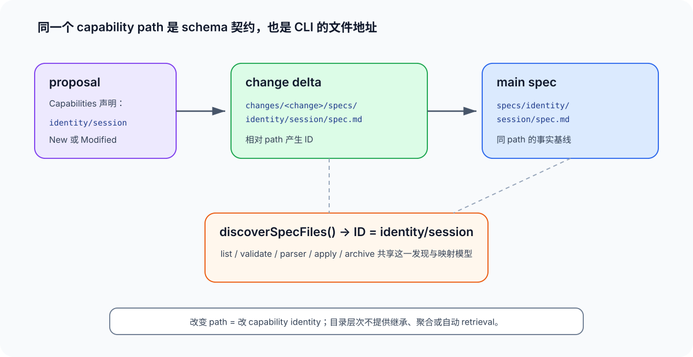

# 02 · schema 与 CLI：capability path 如何成为运行时契约

## 先看最重要的等式

~~~text
capability identity = 相对于 specs 根目录的完整路径
~~~

例如：

~~~text
openspec/specs/identity/session/spec.md
               └────────────────┘
                    identity/session
~~~

这个 identity 不是方便展示的别名。它是 proposal、delta、main spec、read command 和 archive/apply 共同使用的地址。

## spec-driven schema 给出的合同

内置 spec-driven schema 的 proposal instruction 要求声明 New Capabilities 与 Modified Capabilities；specs artifact 则要求每个被声明的 capability 有对应 delta spec。正常的行为变化应形成如下对应：

~~~text
proposal.md
  Capabilities: identity/session

openspec/changes/<change>/specs/identity/session/spec.md
                                      ↓ archive / apply
openspec/specs/identity/session/spec.md
~~~

所以 proposal 的 capability 列表不只是说明文字。它是 agent 在规划阶段对“本次会触及哪一份事实合同”的声明；delta 的相对路径必须兑现同一个声明。

当前内置 schema 的教学文案仍以单段 kebab-case 示例为主，但 runtime 已完整支持 nested path。采用 nested layout 的团队应在自己的 AGENTS 或 config 里明确 path convention；不能期待默认提示自动从 flat 示例推断出团队的 domain 结构。

## discovery 的精确语义

源码中的 discoverSpecFiles() 递归扫描 specs 根目录下的 spec.md，并把文件所在目录相对于根的路径转换为使用正斜杠的 ID。

| 文件系统情况 | 结果 |
|---|---|
| specs/auth/spec.md | 发现为 auth |
| specs/identity/session/spec.md | 发现为 identity/session |
| specs/spec.md | 被忽略；根目录不是 capability |
| 隐藏目录或隐藏文件 | 被跳过 |
| 普通子目录 | 继续递归 |
| 目录 symlink | 不跟随 |
| 指向可读文件的 spec.md symlink | 作为 spec 计入；悬空链接跳过 |
| 根目录不存在 | 视为空列表；其他读取错误会抛出 |

这种处理不是装饰性兼容。它避免 archive/apply 在遇到不可读目录时静默漏掉一个 capability，并保证各平台都以 slash-separated ID 交流。

## 哪些 CLI 路径消费这个 identity

| 操作 | 如何使用 capability path | 对规划的含义 |
|---|---|---|
| list --specs | 递归发现并列出 ID 与 requirement count | 可获得轻量目录，但不是语义 catalog |
| show | 已知 ID 后定位 specs/<id>/spec.md | 用完整 path 指定目标，不能只给末段名称 |
| validate --specs | 递归枚举 main specs | taxonomy 的所有叶子都进入校验范围 |
| change parser / delta validation | 递归发现 change/specs 下的 delta | nested delta 是正常输入，不是旁路 |
| apply / archive | 以 delta ID 重建 mainSpecsDir/<id>/spec.md | delta 与 main spec 必须同路径 |

常用的只读检查组合：

~~~bash
openspec list --specs --json
openspec show identity/session --type spec --json --requirements
openspec validate identity/session --type spec --strict
openspec validate --specs --strict
~~~

第二条先获得 requirement 列表而不带 scenarios，适合 discovery 的中间阶段。只有决定修改某一 requirement 时，才应继续读取完整 block；requirement 序号是当前视图的位置，不是长期稳定 ID。

## archive/apply 的同路径映射

findSpecUpdates() 会对 change 的 specs 目录调用同一发现器。对每个 delta ID，它把 slash 分段重新拼接到 main specs 根目录：

~~~text
change/specs/identity/session/spec.md
    ID = identity/session
    target = main-specs/identity/session/spec.md
~~~

这正是 nested layout 能获得完整生命周期支持的原因：它不是某个 CLI 命令恰好接受斜杠，而是 discovery、parser、validation、apply 和 archive 在同一 identity 上协作。

同时也产生一个严格后果：把 auth 改成 identity/login，就是换了 capability ID。旧 active change 中仍位于 specs/auth/spec.md 的 delta 不会“猜到”新地址；path 迁移要按 [04-演进与治理.md](04-演进与治理.md) 的受控 rebaseline 处理。

## skip_specs 是边界，不是逃生门

若 change 没有 spec-level 行为变化，例如纯重构、工具或文档工作，可在 change 的 .openspec.yaml 中声明 skip_specs: true。它的作用是说明“本次不应有 capability delta”，而不是绕过真实的合同变更。

| 情况 | 正确做法 |
|---|---|
| 可观察行为改变 | 在已有或新 capability 下写 delta spec |
| 没有可观察行为改变 | 使用 skip_specs |
| skip_specs 与 specs 下任何非隐藏文件并存 | 视为冲突，应删除其中一侧 |
| 不确定是否改变合同 | 在 proposal / explore 先解决，不要靠 skip_specs 逃避判断 |

## 本文不把什么归因给 nested path

- nested path 不会生成 domain 汇总、依赖图或父 spec。
- nested path 不会自动把相关 main specs 注入 propose、apply 或 archive。
- nested path 不会解决 requirement 缺少稳定 ID 的问题。
- nested path 不会代替 naming、catalog 和治理纪律。

要理解“已经有这么多 path 后，agent 怎样不读全库仍能选对”，继续读 [03-agent上下文与catalog协议.md](03-agent上下文与catalog协议.md)。

## 源码锚点

- src/utils/spec-discovery.ts：递归发现、ID 规范化、root file/hidden/symlink 边界。
- src/core/parsers/change-parser.ts：change delta 的递归发现。
- src/core/specs-apply.ts：findSpecUpdates() 与 delta 到 main spec 的 target 映射。
- schemas/spec-driven/schema.yaml：proposal↔specs 的 artifact 契约与默认 instruction。
- [机制层 Spec Model](../mechanisms/03-spec-model.md)：parser、validator、archive 的整体分工。
