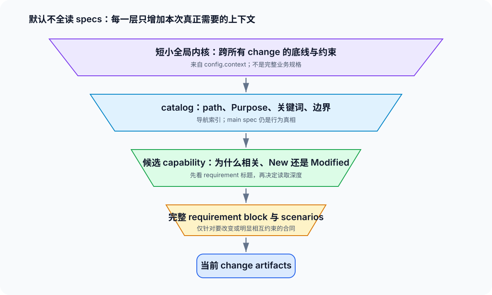

# 03 · agent 上下文与 catalog：在增长的 specs 中仍然选对合同

## 先接受 runtime 的边界

OpenSpec v1.7.0 能把 main specs 按 capability path 递归发现、list、show、validate 和 archive，但它不会为当前项目自动完成下面这条链：

~~~text
列出轻量 catalog → 判断哪些 capability 相关 → 按 token 预算读取所需 requirement → 记录选择依据
~~~

因此，nested taxonomy 解决的是“怎样让能力可分片、可导航”；它不等于自动 retrieval。一个系统有几十个 capability 后，正确默认不是把 specs 全部塞给 agent，而是采用可 review 的发现协议。

## 五层上下文，各自只做自己的事

| 层 | 内容 | 应有的大小 | 权威性 |
|---|---|---|---|
| 全局内核 | 不可违反的领域、兼容性、安全、发布约束 | 很短 | 项目 config |
| catalog | path、Purpose、关键词、边界、owner 可选 | 轻量 | 派生导航，不替代 spec |
| 候选 capability | 本次可能相关的少数 path 及理由 | 小 | proposal 的 discovery 证据 |
| requirement block | 将要 MODIFIED/REMOVED/RENAMED 的完整合同和 scenarios | 只读必要部分 | main spec |
| change artifacts | 本次决定、delta、design、tasks | 本次直接上下文 | active change |

把完整业务说明复制进 config.context 是错误方向：它每次都注入、有大小上限、容易形成第二份过时的 baseline。把完整 requirements 复制进 catalog 也同样错误：它让导航索引变成另一份无法可靠 archive 的 specs。

## catalog 的最小形状

在上游提供本地 main-spec catalog 之前，项目可维护一份轻量导航表，例如放在 specs 根的 README，或放在专用 docs 页面。最小字段为：

| path | Purpose | 关键词 | 边界 / 邻居 | owner，可选 |
|---|---|---|---|---|
| identity/session | 建立、刷新、失效用户会话 | JWT, refresh, expiry | 与 identity/login 相邻；不负责授权策略 | identity |
| billing/invoices | 生成、投递、查询发票 | invoice, tax, PDF | 不负责订阅扣款 | billing |

规则只有两条：

1. catalog 只帮助找到 spec，不复述完整 requirements、scenarios 或 change 历史。
2. 每条 catalog 信息必须能回指 capability path；发生冲突时，以 main spec 为行为真相。

Purpose 是最自然的索引摘要。新 capability 的 delta 应写出可读 Purpose，archive 创建 main spec 时会带入它；不要让 catalog 依赖一堆 TBD Purpose。

## 一个可重复的 discovery 协议

普通局部 change 按下面顺序处理：

1. 读短小的 project context，知道全局不能破坏什么。
2. 读取 catalog 或执行 list --specs，列出候选 path；先不要读全量正文。
3. 用关键术语、代码调查和用户意图缩小候选；为每个保留或排除的 capability 写一句理由。
4. 对候选调用 show 的 requirements 视图，先看 requirement 标题。
5. 只有当本次需要修改、删除或改名某项 requirement 时，读取该完整 block 与 scenarios；MODIFIED delta 必须保留完整更新后的 block。
6. 在 proposal 的 Capabilities 中列出 New / Modified capability，并保留这次选择的证据。边界仍不确定时先 Explore，而不是悄悄新建近义 path。

可用的命令面是：

~~~bash
openspec list --specs --json
openspec show identity/session --type spec --json --requirements
openspec show identity/session --type spec --json --requirement 2
~~~

最后一条适合当前会话中的精确阅读；其中 requirement 序号会随 archive 改变，不能用作长期引用。长期引用使用 capability path 加 requirement 标题，并在编辑前再次核对原文。

## 什么情况下必须扩大阅读

catalog 是收缩局部上下文的工具，不是掩盖全局影响面的借口。以下情况应明确扩大范围：

| 信号 | 需要做的事 |
|---|---|
| 更改跨 domain 的身份、权限、兼容性或事件语义 | 写 impact matrix，列出相关、仅验证、明确排除的 capability |
| 一个 capability 的 Purpose 无法说明边界 | 先修复 taxonomy 或 catalog，再继续 proposal |
| 多个 active changes 都触及同一 path | 串行化、重基线或显式协调，避免各自按旧 main spec 推理 |
| 需要理解所有 capability 才能判断正确性 | 承认这是全局变更或全局审查；不能伪装成局部 change |

一个最小 impact matrix 可以写在 proposal 或 design：

| capability | 为什么相关 | 本次读取粒度 | 动作 |
|---|---|---|---|
| identity/session | token 生命周期改变 | 全部 requirements | MODIFIED |
| billing/subscriptions | 依赖 token claim | 相关 block | verify only |
| data-export | 无依赖 | 不读正文 | excluded，说明理由 |

## 把协议交给 agent，而不是靠记忆

默认 spec-driven instruction 仍可能只提示 agent“检查 specs 目录”。项目要获得稳定行为，应把 path convention、catalog 位置与 discovery 步骤写入自身 AGENTS 或 config artifact rules。可直接基于 [capability-governance-template.md](capability-governance-template.md) 复制最小约定。

但不要把整个 protocol、完整 taxonomy 或 catalog 内容都塞进 config.context。context 只放跨所有 change 都成立的短原则；catalog 保持外部、可搜索、可按需读取。

## 上游能力与当前项目纪律的边界

现有 CLI 的 list --specs JSON 只提供 ID 与 requirement count，不提供一个完整本地语义 catalog。上游关于 catalog discovery、按需 fetch 与预算控制的讨论仍不是已发布 runtime 能力。

所以本文的 protocol 是今天项目可以采用的治理层，而不是声称 OpenSpec 已经自动保证它。详细的上游研究、外部 reference 的 index-then-fetch 模型及其限制见 [FAQ 14](../../_faq_on_digested/14_main_specs_context_scaling/answer.md)。

下一步读 [04-演进与治理.md](04-演进与治理.md)：发现和命名不是一次性工作，系统增长后还要防止 path identity 失控。
