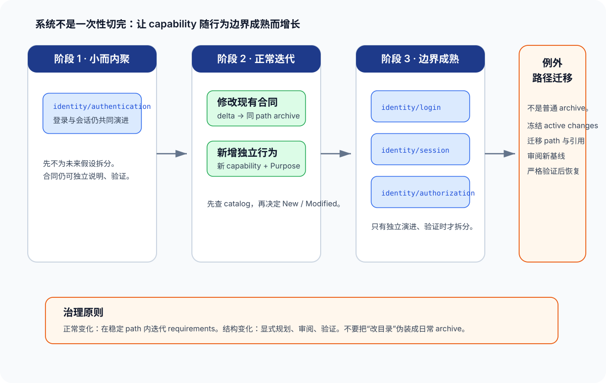

# 04 · 演进与治理：让 capability 随系统增长而不失去身份

capability taxonomy 不是在项目开始时画完就冻结的图。系统会新增行为、既有合同会变粗、domain 会被重新理解、多个团队会同时触碰同一个 path。

> 治理的目标不是避免变化，而是区分稳定 identity 内的正常 requirement 迭代，与需要显式 rebaseline 的结构变化。

## 日常循环：优先保持 path 稳定

正常 change 尽量只在既有 capability path 内修改 requirements：

| 变化 | 正常路径 | 为什么安全 |
|---|---|---|
| 新 requirement | 已有 capability 的 ADDED delta | identity 不变，archive 可确定性合并 |
| 修改行为 | 同 path 的 MODIFIED delta，含完整 requirement block | 目标合同和修改范围清楚 |
| requirement 改名 | 同 path 的 RENAMED delta | requirement 层有正式 rename 语义 |
| 新独立行为 | 新 capability 的 ADDED delta，加 Purpose | archive 能创建新的 main spec |
| 纯 implementation 改动 | skip_specs | 不把不存在的合同变化写进事实层 |

这就是“稳定 path 内的正常迭代”。它是最容易被 review、被 archive、被未来 agent 重新理解的变化。

## 结构变化不是普通 archive

下表中后四项会改变 taxonomy 或 capability identity，必须先做规划：

| 变化 | 什么时候合理 | 风险 | 治理方式 |
|---|---|---|---|
| 拆分 capability | 两组行为已独立演进、独立验证 | 旧 path 的 active delta 和引用失配 | 受控 rebaseline |
| 合并 capability | 两份合同几乎永远同改、同测 | 新老 path 的行为边界不清 | 受控 rebaseline |
| 改 domain 或 path | 名称已持续误导 discovery | capability 没有 rename 操作 | 受控 rebaseline |
| 废弃 capability | 行为、代码与外部迁移都已完成 | 删除 spec 可能把仍在用的事实抹掉 | 明确退役计划和引用审计 |

OpenSpec 对 requirement 有 RENAMED 操作，但对 capability 没有等价的 rename。改变 auth 到 identity/login 时，archive 只会看到两个不同 ID；它不会把旧 path 的所有 active delta、catalog 项、文档引用或代码中的约定自动迁移。

## capability path 迁移的受控 rebaseline

把 path 更名、拆分或合并作为一个独立的结构迁移，而不是掺进任意功能 change。最小过程如下：

1. 写清旧 path 到新 path 的映射，以及每个 requirement 最终归属。
2. 查出所有触及旧 path 或目标 path 的 active changes；完成、取消、冻结或显式重基线它们。
3. 为迁移选定一个共同基线，审阅当前 main spec 真实内容，而不是只看历史 delta。
4. 用版本控制移动或重建 main specs，使目标 taxonomy 一次性清楚可读。
5. 同行移动、重写或废弃仍需保留的 active delta；每个 delta 必须指向新相对 path。
6. 更新 catalog、AGENTS/config 中的 path convention、文档链接和任何外部引用。
7. 检查 list --specs 的输出是否只包含预期的新 identity。
8. 对 main specs 执行 strict validation，并对每个受影响 active change 单独 validate。
9. 经过人工 review 后才恢复常规 change；将旧 path 的迁移理由留在 change/design 或项目决策记录中。

可用的最小验证命令：

~~~bash
openspec list --specs --json
openspec validate --specs --strict
openspec validate <affected-change> --type change --strict
~~~

这里的关键不是某一条命令，而是顺序：先处理 active delta 的身份，再移动基线，最后恢复普通 archive。不要期待一次 archive 同时替你完成路径重命名和内容合并。

## 拆分与合并时的判断

### 拆分

当一个 capability 内长期出现以下信号，考虑拆分：

- 不同 requirements 在多个连续 change 中各自修改，几乎没有共同改动。
- 不同读者需要不同的 contracts 才能完成工作。
- 一个 spec 的 Purpose 已经无法清晰表述它的责任边界。
- 一个 change 经常只触及其中一小部分，但每次都必须阅读冗长且无关的 scenarios。

拆分后，不要让旧 capability 变成空壳或“所有东西的目录”。为每个新 path 写清 Purpose 和边界；若旧 path 仍代表真实兼容合同，就保留它直到退役完成。

### 合并

只有当两个 capability 的行为总是共同演进、共同验证，且分开反而让 agent 每次都需要读两份 spec 时才合并。合并不是为了少几个文件；它要减少未来调用方、reader 和 maintainer 跨 path 协调的成本。

### 退役

退役一个 capability 前，要证明：

1. 已发运代码不再提供或依赖该行为。
2. 外部调用方已有迁移路径或不再存在。
3. 没有 active change 仍指向该 path。
4. catalog 和全局约定不再把它作为可选目标。

删除 main spec 目录本身不是普通 archive 的语义；可用 `retire_capabilities: true`（`.openspec.yaml`，与 `schema:` 并存）让 archive 在 REMOVED 拿掉该 capability 最后一个 requirement 时**删除整个 main spec**，否则会以 "at least one requirement" 中止。退役因此可以是受控的 archive 操作，但仍要经过 review、确认没有 active delta 指向该 path，并把原因记录在相应 change 或设计资料中。注意：另一个 in-flight change 的 MODIFIED 若以该 capability 为 base，会 validate 通过、archive 拒绝——退役要和处理它的 change 一起考虑。

还要求退役前证明该 spec “可干净删除”：除 title、`## Purpose` 和 canonical requirement blocks 外，不得遗留 orphan sections、`## Notes`、requirement 外注释或其他 merge 无法归属的 prose。存在这些内容时，archive 会列出 blocking lines，`retire_capabilities: true` 也不能授权静默丢失；先把有价值信息迁入 Purpose/requirement，或显式审阅后人工删除。

## 并发 change 的治理

两个 active changes 同时修改同一 capability path 时，工具并不会替团队解决语义冲突。每条 delta 都是相对当前 main spec 写的；先 archive 的 change 可能让后者的 requirement 标题或完整 block 失配。

建议：

- 把同 path 的行为 change 串行化，或在前一个 archive 后立即重基线第二个。
- 跨 domain change 在 proposal 中写 impact matrix，明确每个 path 是修改、仅验证还是排除。
- catalog 和 taxonomy 的结构变化由明确 owner review，而非由单个 feature change 顺手决定。
- 定期运行 main-spec strict validation；同时记住它只检查结构，不能代替 specs 与代码的语义对账。

## 一个轻量维护节奏

| 节奏 | 检查点 |
|---|---|
| 每个 proposal | 是否查过 catalog、是否重用已有 path、New/Modified 是否有证据 |
| 每个 archive | delta path 是否与 main path 一致、Purpose 是否可用、active change 是否遗留 |
| 每次跨域 change | impact matrix、受影响 capability 的阅读范围、并发协调 |
| 定期巡检 | 是否出现过粗 spec、同义 path、TBD Purpose、无人维护的 catalog 条目 |
| taxonomy 重构前 | 独立 rebaseline 计划、active change inventory、迁移验证 |

## 与 specs truth 的分工

本篇的重点是“在漂移出现前，怎样保持能力身份和 taxonomy 可治理”。已经出现的 requirement not found、代码与 specs 不对账、僵尸 change、archive repair 等问题，请进入 [specs_truth](../specs_truth/00-map.md)。那里是事实层修复的权威专题。

项目需要一份短、明确、可复制的规则时，采用 [capability-governance-template.md](capability-governance-template.md)。
