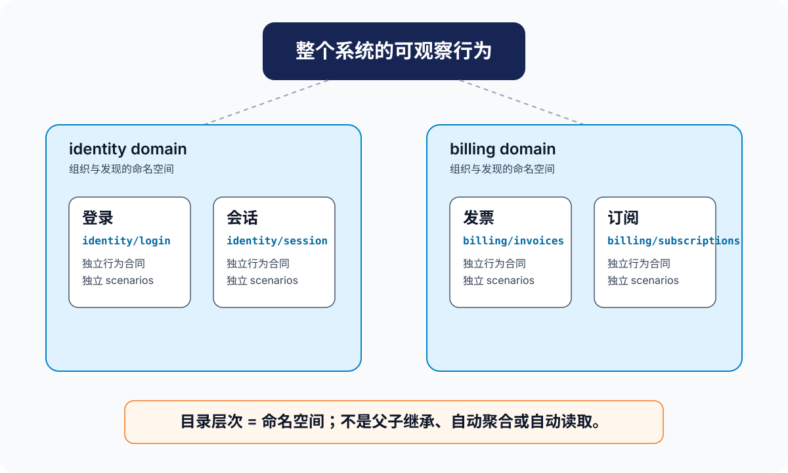

# spec-driven capability

这个专题讨论的不是“怎样多建几个 spec 文件”，而是怎样把一个系统切成一组能被人、agent 和 OpenSpec 长期共同使用的行为合同。

这里的正式术语是：

| 术语 | 本文的准确含义 | 不应误解为 |
|---|---|---|
| capability | 可独立演化的行为合同切片；它说明系统对谁提供什么可观察行为 | 任意代码目录、一个实现模块、或随手装东西的 bucket |
| domain | 对一组相邻 capability 的组织命名空间 | 父 capability、自动继承层、或聚合 spec |
| capability path | capability 在 specs 根下的相对路径，也是 OpenSpec 当前的稳定地址/身份 | 可随意改的展示名称 |
| taxonomy | domain 与 capability path 组成的、浅而稳定的能力地图 | 第二份需求文档或完整架构图 |
| catalog | 从 main specs 派生的轻量导航索引 | 行为真相的替代品 |

“bucket”可以帮助第一次理解：它让人看到系统不是一块巨石，而是若干可管理的格子。但它不够精确，因为 OpenSpec 的 nested 目录没有“父 bucket 包含/继承子 bucket”的语义。本文统一使用“行为合同切片”或简称“capability”。

## 本专题回答什么

1. 什么样的行为值得成为一个 capability，什么不值得？
2. 为什么 capability path 同时是组织方式、schema 契约和 archive 靶点？
3. nested path 到底被哪些 CLI 路径读取，哪些事情它没有解决？
4. agent 在越来越多 main specs 中如何发现、选择和读取相关合同？
5. capability 随产品增长后，怎样新增、拆分、迁移和巡检而不制造失配？

## 阅读顺序

| 文章 | 解决的问题 |
|---|---|
| [00-map.md](00-map.md) | 先建立“切片、路径、delta、archive、下次发现”的全链路模型 |
| [01-切分与taxonomy.md](01-切分与taxonomy.md) | 怎样为系统规划一张浅而稳定的 capability 地图 |
| [02-schema与CLI如何读取capability.md](02-schema与CLI如何读取capability.md) | schema 和 CLI 如何把 path 当作契约、读取并合并 |
| [03-agent上下文与catalog协议.md](03-agent上下文与catalog协议.md) | specs 增长后，agent 如何按需选取上下文 |
| [04-演进与治理.md](04-演进与治理.md) | 怎样让 capability 随系统成长而保持可维护 |
| [capability-governance-template.md](capability-governance-template.md) | 可复制到项目 AGENTS 或 config 的最小约定模板 |

## 责任边界

- [specs_truth](../specs_truth/00-map.md) 说明 main specs 如何成为事实层、为什么会漂移、怎样修复；本专题负责更早一步的能力边界与长期组织。
- [internal-spec-driven](../internal-spec-driven/README.md) 深挖 workflow 的实现；本专题只保留会改变 capability 规划决策的源码机制。
- [schema](../schema/00-map.md) 解释 artifact DAG 与 schema 自定义；本专题只聚焦 spec-driven 的 capability 契约。
- [handbook 第 09 章](../../_openspec_handbook/09-高级-能力身份与specs漂移维护.md) 是面向使用者的压缩实践版；这里是它的规划和源码级上游。
- [FAQ 14](../../_faq_on_digested/14_main_specs_context_scaling/answer.md) 深入研究 main-spec context scaling 与上游缺口；这里将其转为可操作的 catalog 协议。

capability 身份与 discovery 模型自 v1.7.0 起未变（v1.11.0–v1.13.0 的 `show --diff`、`status --all`、`validate --report findings` 只是审阅手段，不改变 capability 规划语义）；当前基线见 [`../README.md`](../README.md)。本专题不改变 OpenSpec runtime、默认 schema 或本仓库现有 main specs 的布局。
