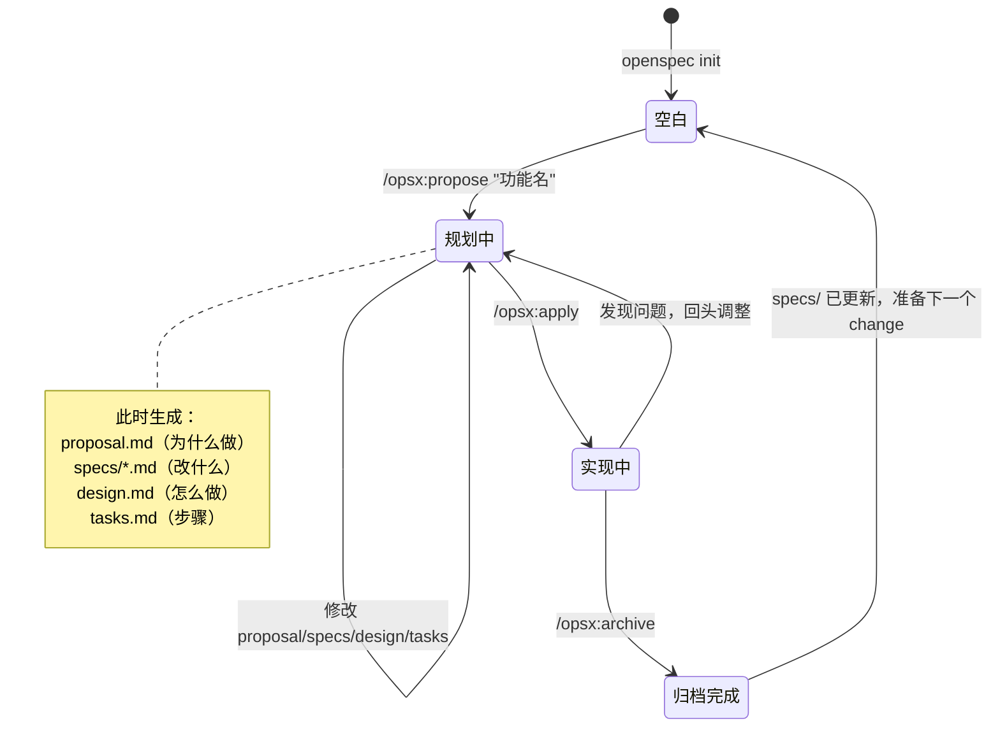

# 01 · 初级：先把 OpenSpec 用起来

> 目标不是研究源码，而是先把它当工具用顺。

---

## 先记一句话

**OpenSpec 是一个"先把变更讲清楚，再去写代码"的协作层。**

它不是模型，不替你思考；它做的事是把一次改动拆成几份能讨论、能验证、能归档的文件。

如果你是第一次接触它，先不用记 `schema`、skill、adapter。
先记这三步就够了：

```text
/opsx:propose  →  /opsx:apply  →  /opsx:archive
```

---

## 你日常最常用的 3 个动作

用一张图理解整个工作流：



### 1. `/opsx:propose`

用来**发起一个 change**，并把规划类文件先搭起来。

你可以把它理解成：

- 给这次改动起名字
- 让 AI 帮你先把"为什么改、改什么、怎么做、做哪些任务"写出来

典型例子：

```text
/opsx:propose add-dark-mode
```

通常会得到这样一组文件：

```text
openspec/changes/add-dark-mode/
├── proposal.md
├── design.md
├── tasks.md
└── specs/
    └── ui/
        └── spec.md
```

### 2. `/opsx:apply`

用来**按 `tasks.md` 真正实现代码**。

它会围绕任务清单逐项推进，做完的任务会被打勾。

你可以把它理解成：

- 现在不是"讨论要做什么"
- 而是"拿着已经形成的 change 文件，开始干活"

### 3. `/opsx:archive`

用来**收尾**。

它做两件很关键的事：

1. 把这次 change 里的 delta spec 合并回主 `specs/`
2. 把这次 change 挪到 `changes/archive/`，保留历史

所以 archive 不是"删掉"，而是"结案归档"。

---

## 先看目录，别先看机制

一个最典型的项目，大概长这样：

```text
my-project/
├── src/
├── tests/
└── openspec/
    ├── specs/
    ├── changes/
    └── config.yaml
```

这一层先只要这样理解：

- `openspec/specs/`：记录项目当前已经成立的规格
- `openspec/changes/`：记录你现在正在做的变更
- `openspec/config.yaml`：补一些项目级背景和默认设置

到这里就够了。

### 新手最常问：openspec init 之后会发生什么？

运行 `openspec init` 后，你会得到：

```text
my-project/
└── openspec/
    ├── specs/          ← 空的，等第一个 change archive 后才有内容
    ├── changes/        ← 空的，等你 propose 第一个 change
    └── config.yaml     ← 有一个最基础的配置
```

**重点**：
- `specs/` 一开始是空的，这是正常的！
- 第一个 change archive 后，specs/ 才会有内容
- 不需要手动写 specs/，它是 archive 自动生成的

### 新手最常问：为什么要有这么多文件？

很多人第一次看到 proposal/specs/design/tasks 会觉得"太复杂了"。

其实每个文件都在解决一个真实问题：

| 文件 | 解决什么问题 | 如果没有它会怎样 |
|------|-------------|----------------|
| **proposal.md** | 防止 scope 失控 | AI 会不断加功能，永远做不完 |
| **specs/*.md** | 防止行为不清晰 | 做完了也不知道系统承诺了什么 |
| **design.md** | 防止技术选型随意 | 后人不知道为什么这样做 |
| **tasks.md** | 防止实现无序 | AI 不知道从哪开始，容易乱改。有了 tasks.md，可以逐项推进，还能追踪进度 |

**一句话**：这些文件不是为了"仪式感"，而是为了"让 AI 和人都能对齐"。

---

## 一次最小工作流

假设你要给系统加深色模式。

### 第一步：发起 change

```text
/opsx:propose add-dark-mode
```

这时 AI 会围绕这次 change 生成几类文件：

- `proposal.md`：为什么做
- `specs/.../spec.md`：行为上要改什么
- `design.md`：技术上怎么做
- `tasks.md`：具体任务拆解

**生成的 proposal.md 大概长这样：**

```markdown
# Proposal: Add Dark Mode

## Why
用户反馈在夜间使用时界面太亮，影响体验。

## What Changes
- 新增主题切换按钮（右上角）
- 支持 light / dark 两种主题
- 用户偏好持久化到 localStorage

## Out of Scope
- 系统级主题跟随（留给下一个 change）
- 自定义颜色（不在本次范围内）
```

### 第二步：实现

```text
/opsx:apply add-dark-mode
```

这一步才开始真正改代码。

### 第三步：归档

```text
/opsx:archive add-dark-mode
```

这一步结束后，这次 change 的结果会变成项目正式规格的一部分。

---

## 第一次用 OpenSpec 的 5 个常见误区

| 误区 | 实际情况 |
|------|---------|
| "要先把整个系统的规格都写完才能开始" | 不需要。第一个 change 只需要描述"这次要改的那一块" |
| "proposal 写完了就不能改了" | 随时可以改。Actions, not phases |
| "archive 是删除 change" | 不是。是把 delta spec 合并回 specs/，并把 change 移到 archive/ 保留历史 |
| "specs/ 是我手动维护的文档" | 不是。它是 archive 后自动更新的正式基线 |
| "不用 archive 也没关系" | 不 archive 的话，specs/ 基线不会更新，下一个 change 就没有正确的基线可以参考。**后果**：你会不知道系统现在到底是什么样的，多人协作时会乱套 |

---

## 初级阶段最重要的 5 个认知

### 1. OpenSpec 管的是"变更"，不是纯聊天

它不是让 AI 随便聊聊需求，而是把一次改动沉淀成文件。

### 2. 你不用一开始就理解全部内部结构

先会用 `propose / apply / archive`，已经能完成大部分日常场景。

### 3. `changes/` 是工作区，不是垃圾堆

每个 change 都是一个完整工作单元，有自己的规划、规格、任务和历史。

### 4. `specs/` 很重要，但初学时不用一次想透

你只要先知道：archive 以后，变更会沉淀回正式规格。

### 5. 不要一开始就被 Cline、Claude、skills 吓住

那些是"宿主工具怎么接 OpenSpec"的问题，不是"你怎么用 OpenSpec"的第一步问题。

---

## 初级阶段先别纠结什么

先别急着纠结这些词：

- `schema`
- `.openspec.yaml`
- `workflow profile`
- `skill`
- `command adapter`
- `instructions JSON`

它们都是真的，也都重要。

但如果你在还没把主流程走通前就钻进去，很容易看乱。

---

## 读完这篇后，下一步看什么

如果你现在已经知道：

- OpenSpec 大概解决什么问题
- 默认工作流怎么走
- 一个 change 从哪里开始、在哪里结束

那下一篇就该去看：

- [02-中级-把核心概念真正串起来.md](02-中级-把核心概念真正串起来.md)

下一篇会把真正容易混的几件事讲透：

- `specs` 和 `changes` 的关系
- artifact 到底是什么
- delta spec 为什么是 OpenSpec 的关键
