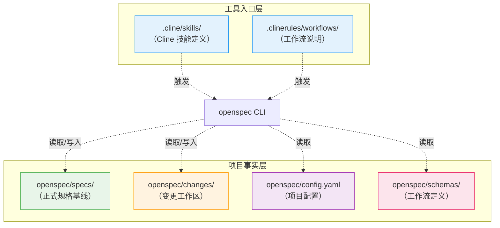
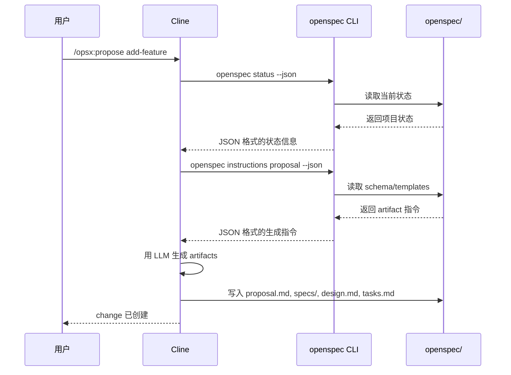

# 04 · 高级：Cline 里的 OpenSpec 到底怎么落地

> 这一篇回答的是"放进 Cline 以后，它到底长什么样"。

---

## 先把最容易想错的地方说透

很多人第一次看，会误以为：

- skill 文件就是 OpenSpec 本体
- `.cline/` 才是核心
- `config.yaml` 是总控中心

其实都不对。

放进 Cline 后，OpenSpec 仍然有两层：

1. **项目事实层**
2. **工具入口层**

### 新手最常问：为什么需要两层？直接一层不行吗？

**答案：为了让 OpenSpec 不被绑死在某个工具上。**

如果只有一层（比如全放 `.cline/`），会有什么问题：

| 问题 | 后果 |
|------|------|
| 换工具就要重写所有配置 | 从 Cline 换到 Claude Code，所有 specs/ 都要迁移 |
| 项目事实和工具配置混在一起 | 看不清哪些是项目的，哪些是工具的 |
| 多个工具无法共存 | 不能同时用 Cline 和 Cursor |

**两层设计的好处**：

```
项目事实层（openspec/）
  ↓ 被多个工具共享
工具入口层（.cline/ 或 .claude/ 或 .cursor/）
```

- 项目事实（specs/changes/config.yaml）只写一次
- 不同工具各自有自己的入口层
- 换工具时，只需要重新生成入口层，项目事实不变

---

## 第一层：项目事实层

这层在项目自己的 `openspec/` 目录里。

```text
openspec/
├── specs/
├── changes/
├── config.yaml
└── schemas/
```

这层管的是：

- 项目当前正式规格
- 这次 change 的增量内容
- 项目级背景与规则
- change 结构定义

这层才是 OpenSpec 的核心数据层。

---

## 第二层：Cline 入口层

这层在 `.cline/` 和相关规则目录里。

典型地你会看到：

```text
.cline/
└── skills/
    ├── openspec-propose/
    ├── openspec-explore/
    ├── openspec-apply-change/
    └── openspec-archive-change/

.clinerules/
└── workflows/
    ├── opsx-propose.md
    ├── opsx-explore.md
    ├── opsx-apply.md
    └── opsx-archive.md
```

这层不是项目事实层，而是"让 Cline 知道怎么触发 OpenSpec"。

所以更准确的理解是：

- `openspec/` 保存事实
- `.cline/` / `.clinerules/` 保存入口

---

## 一个典型项目长什么样

```text
my-app/
├── src/
├── tests/
├── openspec/
│   ├── specs/
│   ├── changes/
│   ├── config.yaml
│   └── schemas/
├── .cline/
│   └── skills/
└── .clinerules/
    └── workflows/
```

如果要一句话概括：

> **OpenSpec 的"内容"在 `openspec/`，OpenSpec 的"入口"在 Cline 的目录里。**

### 两层架构可视化



---

## Cline 里一次命令背后发生什么

以 `/opsx:propose` 为例，可以粗略理解成 4 步：



所以 Cline 本身不是 OpenSpec。
它只是 OpenSpec 被人触发、被模型消费的宿主环境之一。

---

## 人类最该关心的，不是机器细节，而是层次别搞混

如果你是人类使用者，最值得记住的只有三点：

### 1. Cline 是入口，不是事实来源

不要把 `.cline/skills/...` 当成项目能力定义。

### 2. `openspec/specs/` 才是长期基线

项目当前能力的正式表述，最终沉淀在这里。

### 3. `changes/` 是变更工作区

平时迭代都发生在这里，archive 后再合并回基线。

---

## 下一步更适合先看什么

如果你现在已经分清了：

- `openspec/` 是事实层
- `.cline/` / `.clinerules/` 是入口层
- Cline 只是宿主，不是 OpenSpec 本体

更建议先看"OpenSpec 对软件开发生命周期到底怎么理解"，也就是：

- [05-高级-openspec-的软件开发生命周期思想.md](05-高级-openspec-的软件开发生命周期思想.md)

---

## 什么时候才需要继续看机器视角

只有当你想研究这些问题时，才需要再往下看：

- Cline 具体调用了哪些 CLI
- instructions JSON 里有什么
- skill、command、workflow 三者如何对应

这时再去看附录：

- [90-附录-给机器看的-agent-协议.md](90-附录-给机器看的-agent-协议.md)
