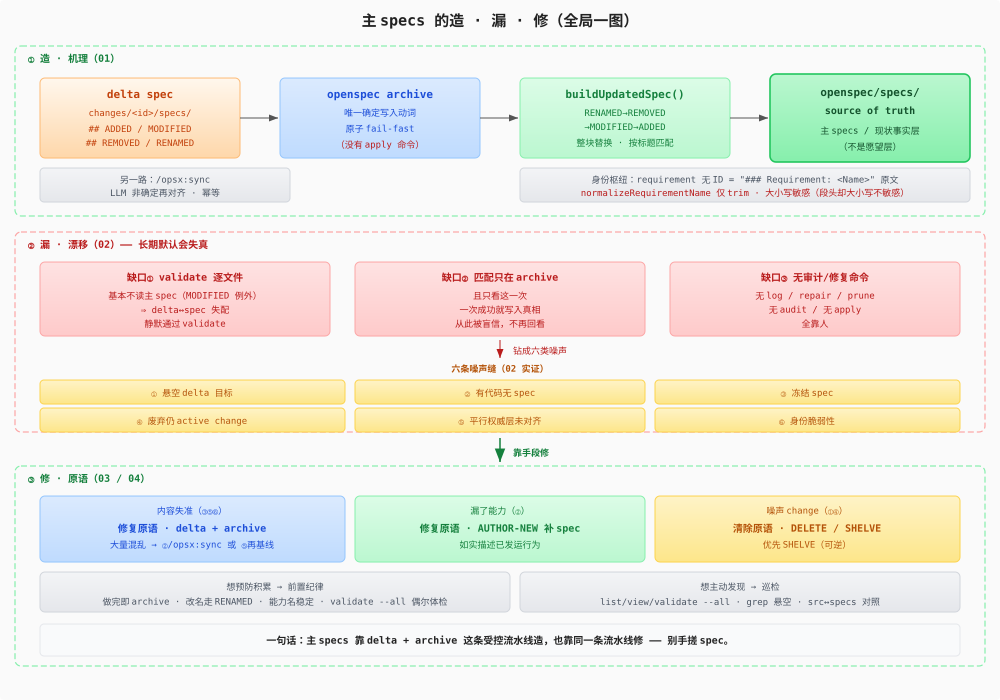
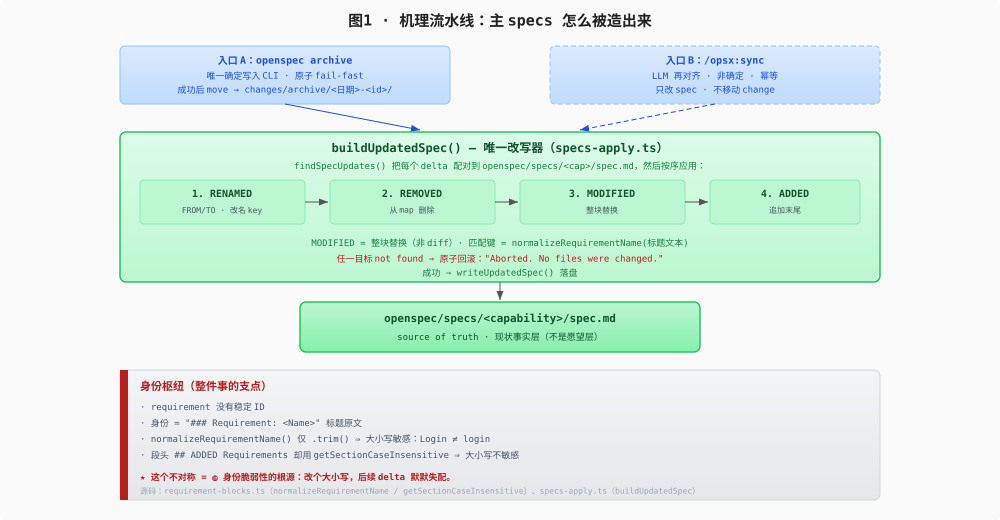
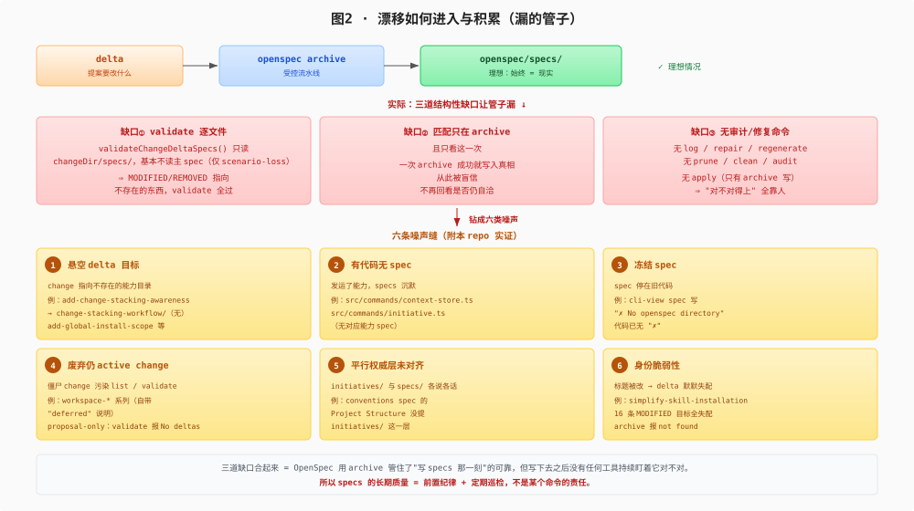
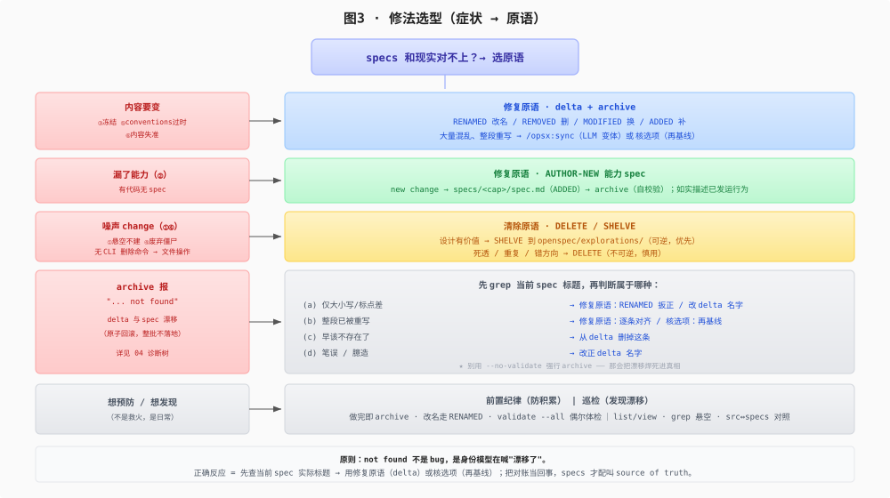
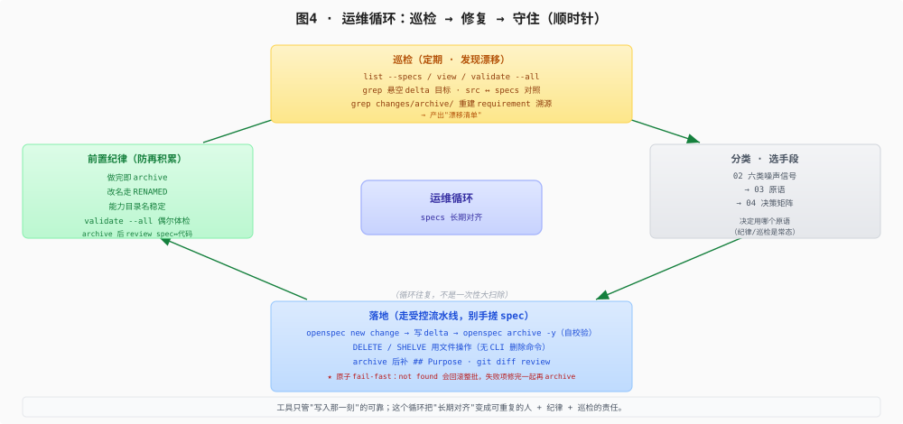

# 总览图：造·漏·修 一图全貌

> 视觉速查。五张 SVG（`figures/`）把前几篇串起来：怎么造（`01`）、怎么漏（`02`）、怎么修（`03`/`04`）、怎么守住（`05`）。可最先读建立全貌，也可读完后回顾。纯文档，命令都是 recipe。

## 图0 · 全局一图（造 → 漏 → 修）

一句话：主 specs 靠 delta + `archive` 这条受控流水线造，也靠同一条流水线修——别手搓 spec。

## 图1 · 机理流水线：主 specs 怎么被造出来

支点是**身份枢纽**：requirement 无 ID，身份 = `### Requirement: <Name>` 标题原文；`normalizeRequirementName()` 仅 trim ⇒ 大小写敏感，而段头却大小写不敏感——这个不对称是 ⑥ 身份脆弱性的根源。

## 图2 · 漂移如何进入与积累（漏的管子）

三道缺口（validate 逐文件 / 匹配只在 archive / 无审计修复命令）合起来 = OpenSpec 管住了"写 specs 那一刻"，但写下去之后再没东西盯着它对不对。

**validate 的位置**：它是 CLI 结构 linter（**不是 `/opsx:` slash**），**不在造-漏-修的循环里**，也**抓不出 specs↔代码漂移**——只在 CI 当结构闸、或偶尔体检时挡结构坏死（僵尸 change / 缺 scenario / 主 spec 残留 delta 段头）。详见 `02` 缺口一、`06` validate 命令参考。

## 图3 · 修法选型（症状 → 原语）

原则：`not found` 不是 bug，而是身份模型在提示"漂移了"。正确反应 = 先查当前 spec 实际标题 → 修复原语（delta + archive），或核选项（再基线）。

## 图4 · 运维循环：巡检 → 修复 → 守住

工具只管"写入那一刻"的可靠；这个循环把"长期对齐"变成可重复的 **人 + 前置纪律 + 巡检** 的责任。

## 怎么用这五张图

| 你处在哪个阶段 | 看哪张 |
|----------------|--------|
| 刚入门，想知道全貌 | 图0 |
| 想懂 specs 到底怎么来的 | 图1 |
| 想懂为什么会失真 | 图2 |
| 现场要决定怎么修 | 图3（配合 `04` 决策矩阵） |
| 想建立长期运维节奏 | 图4 |

## 守住的边界

五张图合起来就一句话：**主 specs 是事实层，靠 delta + archive 这条受控流水线造，也靠同一条流水线修；别手搓。** 工具只管"写入那一刻"的可靠，长期对齐是**前置纪律 + 巡检**的责任。把这条闭环跑顺，specs 才配叫 source of truth。

## 继续阅读

- 全貌里每段的展开：`01` 机理 / `02` 漂移 / `03` 原语 / `04` 决策矩阵
- 真实项一步步套用：`05` playbook
- `validate` 命令参考 + 诚实缺口：`06`
