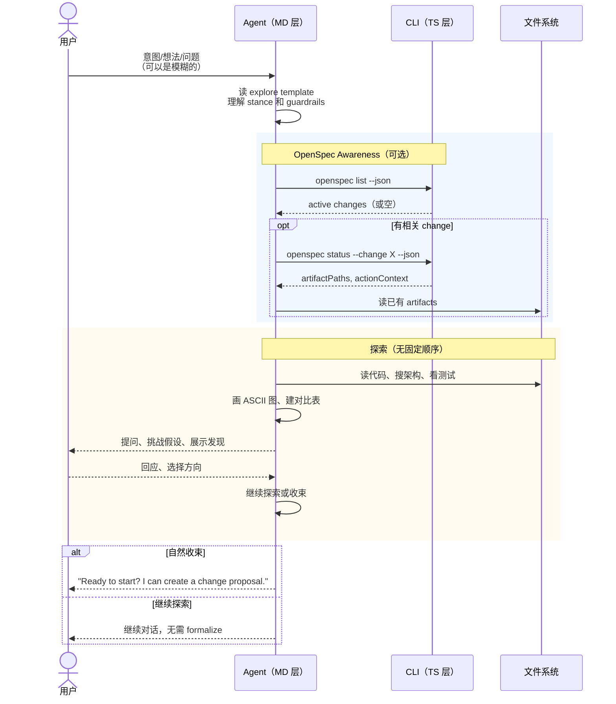

# Workflow · explore

## 源文件

`src/core/templates/workflows/explore.ts` → `getExploreSkillTemplate()` + `getOpsxExploreCommandTemplate()`

> **用户怎么调**：`/opsx:explore [想法|change名|空]`
> **agent 看到的名字**：`openspec-explore`（skill）/ `OPSX: Explore`（command）
> **独立 CLI 命令**：无——explore 没有对应的 `openspec explore` CLI 命令，它是纯 agent 模板。
> **profile**：core（大多数用户默认可见）

## 一句话

explore 是**唯一不是 workflow 的 workflow**。它是 stance（姿态），不是 process（流程）。没有固定步骤、没有强制输出、没有 "done" 状态。agent 被要求做一个好奇的、可视化的、扎根代码的思考伙伴。

## 和所有其他 workflow 的根本区别

| | explore | propose / apply / archive / … |
|---|---|---|
| 本质 | stance（姿态） | workflow（流程） |
| 步骤 | 无固定步骤 | 有编号 steps |
| 输出 | 无强制输出 | 有明确 output 格式 |
| 结束条件 | 自然收束或用户离开 | apply gate / tasks done / change archived |
| 可以读代码 | 是 | 视阶段而定 |
| 可以写代码 | **否** | apply 可以 |

explore 的模板里没有 "Step 1/2/3"，只有 "What You Might Do" 和 "The Stance"。

## CLI 命令调用

template 要求 agent 启动时跑一次：

```bash
openspec list --json
```

仅此一个命令。如果发现相关 active change，可能再跑：

```bash
openspec status --change "<name>" --json
```

但这不是强制的——explore 不强求有 change 上下文。

## 时序图



## 五个 entry point 场景

template 里硬编码了五种典型入口的示例对话：

| 入口 | 用户说什么 | agent 怎么回应 |
|---|---|---|
| 模糊想法 | "I'm thinking about adding real-time collaboration" | 画 spectrum 图，帮用户定位 |
| 具体问题 | "The auth system is a mess" | 读代码 → 画架构图 → 找痛点 |
| 实施卡住 | "/opsx:explore add-auth-system" | 读 artifacts → 追踪复杂度 → 建议方向 |
| 方案比较 | "Should we use Postgres or SQLite?" | 追问上下文 → 建对比表 → 给推荐 |
| 空输入 | 只进入 explore mode | 自由对话 |

> **v1.8.0**：捕捉成**新 change** 时必须先 `openspec new change "<name>"` scaffold（保住 `.openspec.yaml` metadata），再按 `status`/`instructions` 建 artifact；capture 后不需用户再跑额外命令。详见 `../internal-spec-driven/01-explore-探索模式.md` 第五节。

## Guardrails

template 里写了 8 条 guardrail：

| Guardrail | 类型 |
|---|---|
| **Don't implement** — 绝不写代码或实现功能 | 硬约束 |
| **Don't fake understanding** — 不清楚就深挖 | 软约束 |
| **Don't rush** — 探索是思考时间，不是任务时间 | 姿态 |
| **Don't force structure** — 让模式自然浮现 | 姿态 |
| **Don't auto-capture** — 提议保存洞察，但不替用户决定。只读工具和命令不需要确认；在第一次写操作之前（含 `openspec new change`），命名拟创建/编辑的 artifacts 或文件，ask a direct yes/no question，在单独的 user message 中等待确认。答案设计/澄清问题不是写入授权。 | 硬约束 |
| **Do visualize** — 好图胜过千言 | 鼓励 |
| **Do explore the codebase** — 扎根现实 | 鼓励 |
| **Do question assumptions** — 包括用户的和你自己的 | 鼓励 |

## 和 FAQ 的衔接

FAQ `03_explore-to-propose-change/` 是从 "Explore 怎么判断是否 propose" 的角度分析的。本文件是从 "template 源码给了 agent 什么指令" 的角度分析的。两者互补——FAQ 讲的是 agent 实际会做什么工程判断，本文件讲的是 template 为这些判断提供了什么框架。

## 源码锚点

| 内容 | 行号范围（explore.ts） |
|---|---|
| SkillTemplate 定义 | L10-L296 |
| CommandTemplate 定义 | L298-L472 |
| STORE_SELECTION_GUIDANCE 注入 | L19, L310 |
| OpenSpec Awareness 段 | L82-L136, L379-L433 |
| 五个 entry point 示例 | L149-L249 |
| Guardrails | L282-L291, L461-L470 |
