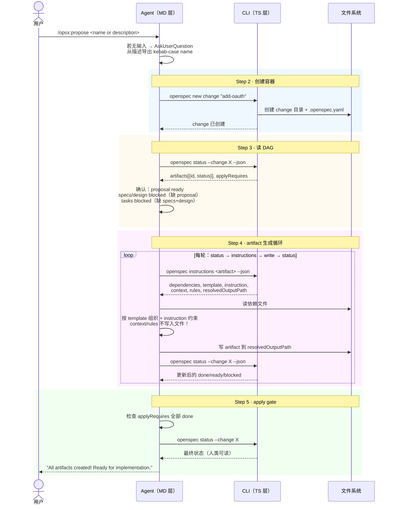

# Workflow · propose

## 源文件

`src/core/templates/workflows/propose.ts` → `getOpsxProposeSkillTemplate()` + `getOpsxProposeCommandTemplate()`

## 一句话

propose 是**默认快速路径**：从 change name/description 出发，创建 change 容器，然后循环 status → instructions → write → status，直到 schema 的 `apply.requires` 全部满足。它是规划类四个 workflow 里最"全自动"的一个。

## 和 new / continue / ff 的粒度区别

```text
propose:  create change + 生成全部 artifact → apply-ready（一口气）
new:      create change only → STOP（scaffold）
continue: 已有 change → 生成下一个 ready artifact → STOP（一步）
ff:       已有或新 change → 批量生成剩余 artifact → apply-ready（批量推进）
```

## CLI 命令调用序列

```text
1. openspec new change "<name>"           # 创建容器
2. openspec status --change "<name>" --json   # 读 DAG
3. loop:
   a. openspec instructions <artifact> --change "<name>" --json  # 取操作包
   b. [agent 读依赖 + 写 artifact 文件]
   c. openspec status --change "<name>" --json                   # 刷新状态
   until applyRequires 全部 done
4. openspec status --change "<name>"       # 展示最终状态（人类可读）
```

## 时序图



## 关键指令：context 和 rules 绝不写入文件

template 里三次强调这一点：

```text
IMPORTANT: context and rules are constraints for YOU, not content for the file
Do NOT copy <context>, <rules>, <project_context> blocks into the artifact
These guide what you write, but should never appear in the output
```

这是 propose（以及 continue、ff）最容易踩的坑：agent 把 template 返回的 `<context>` 和 `<rules>` 标签复制进了 artifact 文件。

## Guardrails

| Guardrail | 含义 |
|---|---|
| 创建 ALL artifacts（满足 apply.requires） | 不半途而废 |
| 写之前读依赖 | 不凭记忆写 |
| context 不清时问用户 | 但优先保持 momentum |
| change 同名时问用户 | 避免覆盖 |
| 写完后验证文件存在 | 不假称完成 |

## 和 FAQ 的衔接

FAQ `04_propose-to-apply-ready/` 从工程视角分析了 propose 的 artifact DAG、instructions JSON 操作包、apply gate 两层定义。本文件从 "template 源码给了 agent 什么指令" 的视角补充。

## 源码锚点

| 内容 | 行号范围（propose.ts） |
|---|---|
| SkillTemplate 定义 | L10-L119 |
| CommandTemplate 定义 | L122-L231 |
| Step 1: 询问输入 | L31-L38 |
| Step 2: new change | L40-L44 |
| Step 3: status DAG | L46-L53 |
| Step 4: artifact 循环 | L55-L82 |
| Step 5: final status | L87-L90 |
| context/rules 警告 | L106-L108 |
