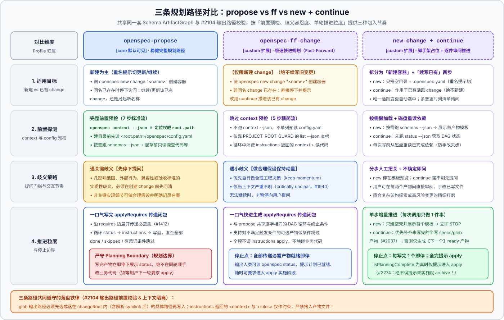
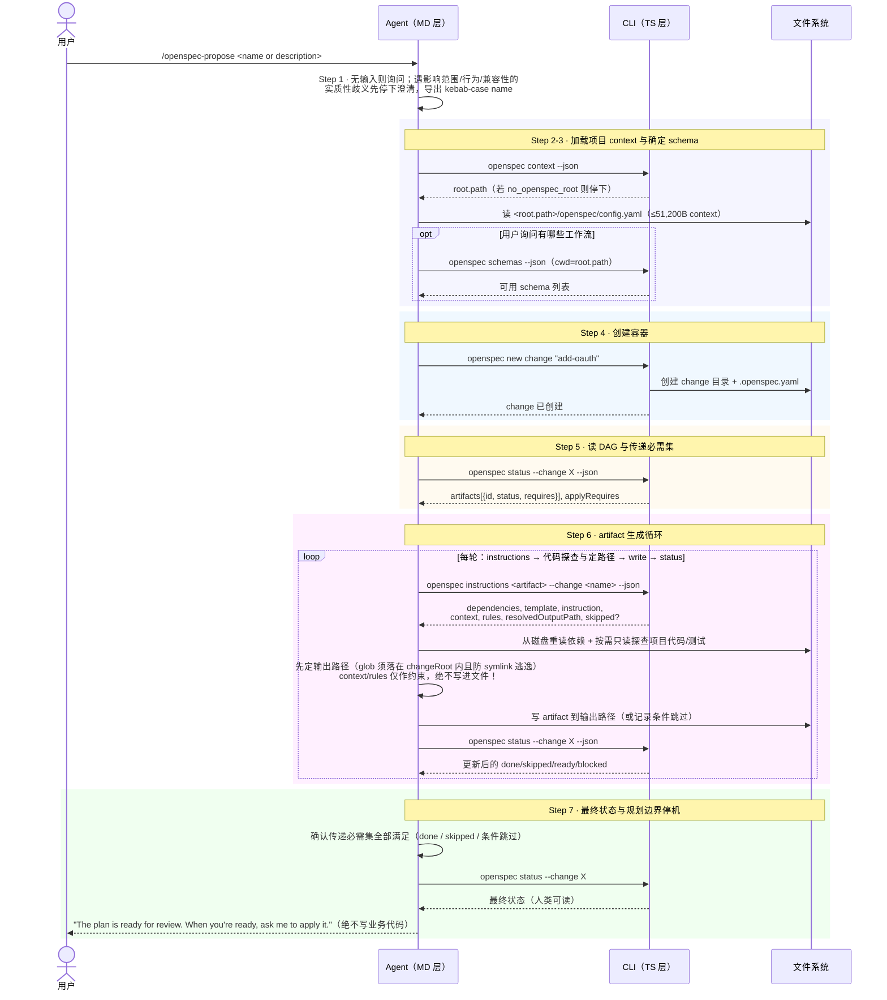

# Workflow · propose

## 源文件

`src/core/templates/workflows/propose.ts` → `getOpsxProposeSkillTemplate()` + `getOpsxProposeCommandTemplate()`

> **调用方式**：技能 `openspec-propose` <change-name 或描述>——Claude Code 等工具里 `/openspec-propose` <change-name 或描述>，Codex 用 `$openspec-propose` <change-name 或描述>。1.x 写作 `/opsx:propose`；v2.0.0 起命令文件已移除，`/opsx:` 只用于历史解释。
> **agent 看到的名字**：`openspec-propose`（skill）/ `OPSX: Propose`（command）
> **独立 CLI 命令**：无——propose 内调 `openspec new change`，但 propose 本身没有对应的 CLI 命令。
> **profile**：core（大多数用户默认可见）

## 一句话

propose 是**带前置上下文与规划边界的默认完整规划路径**：澄清实质性歧义 → 调 `openspec context --json` 并预读 `<root.path>/openspec/config.yaml` → 确定 schema → 创建新 change 容器 → 循环 `status → instructions → write → status`，直到 `applyRequires` 的传递依赖闭包全部满足（`done`、`skipped` 或有意识条件跳过），最后**严格停在规划边界内**，绝不在同一轮开始写业务代码。

## 和 new / continue / ff 的粒度区别



```text
propose:  澄清实质歧义 + context 预加载 + 新建 change + 生成传递必需集全部 artifact → STOP（严守规划边界）
new:      新建 change + 展示首个 ready 模板 → STOP（scaffold）
continue: 已有 change → 先补完半写 glob 产物，否则生成下一个 ready artifact → STOP（一步）
ff:       新建 change（跳过 context 预检，倾向做合理假设保持节奏）→ 生成传递必需集全部 artifact → STOP
```

## CLI 命令调用序列（完整 7 步）

```text
1. [理解请求 + 澄清实质性歧义]
2. openspec context --json [--store "<id>"]  # 解析权威 root.path，再读 <root.path>/openspec/config.yaml (≤51,200B)
3. [可选] openspec schemas --json            # 仅当用户询问有哪些工作流时，在 root.path 下运行
4. openspec new change "<name>" [--schema "<schema-name>"]  # 创建新容器
5. openspec status --change "<name>" --json  # 读 DAG（含 applyRequires 与 artifacts[].requires）
6. loop:
   a. openspec instructions <artifact> --change "<name>" --json  # 取操作包（或检查是否可条件跳过）
   b. [agent 重读依赖 + 只读探查代码库 + 定输出路径 + 写 artifact 文件]
   c. openspec status --change "<name>" --json                   # 刷新状态
   until applyRequires 及其沿 requires 边的传递闭包全部 done、skipped 或条件跳过
7. openspec status --change "<name>"         # 展示最终状态（人类可读），提示 "ask me to apply it"
```

## 时序图


```mermaid
sequenceDiagram
    actor User as 用户
    participant MD as Agent（MD 层）
    participant TS as CLI（TS 层）
    participant FS as 文件系统

    User->>MD: /openspec-propose <name or description>
    MD->>MD: Step 1 · 无输入则询问；遇影响范围/行为/兼容性的<br/>实质性歧义先停下澄清，导出 kebab-case name

    rect rgb(245, 245, 255)
        Note over MD,FS: Step 2-3 · 加载项目 context 与确定 schema
        MD->>TS: openspec context --json
        TS-->>MD: root.path（若 no_openspec_root 则停下）
        MD->>FS: 读 <root.path>/openspec/config.yaml（≤51,200B context）
        opt 用户询问有哪些工作流
            MD->>TS: openspec schemas --json（cwd=root.path）
            TS-->>MD: 可用 schema 列表
        end
    end

    rect rgb(240, 248, 255)
        Note over MD,FS: Step 4 · 创建容器
        MD->>TS: openspec new change "add-oauth"
        TS->>FS: 创建 change 目录 + .openspec.yaml
        TS-->>MD: change 已创建
    end

    rect rgb(255, 250, 240)
        Note over MD,FS: Step 5 · 读 DAG 与传递必需集
        MD->>TS: openspec status --change X --json
        TS-->>MD: artifacts[{id, status, requires}], applyRequires
    end

    rect rgb(255, 240, 255)
        Note over MD,FS: Step 6 · artifact 生成循环
        loop 每轮：instructions → 代码探查与定路径 → write → status
            MD->>TS: openspec instructions <artifact> --change <name> --json
            TS-->>MD: dependencies, template, instruction,<br/>context, rules, resolvedOutputPath, skipped?
            MD->>FS: 从磁盘重读依赖 + 按需只读探查项目代码/测试
            MD->>MD: 先定输出路径（glob 须落在 changeRoot 内且防 symlink 逃逸）<br/>context/rules 仅作约束，绝不写进文件！
            MD->>FS: 写 artifact 到输出路径（或记录条件跳过）
            MD->>TS: openspec status --change X --json
            TS-->>MD: 更新后的 done/skipped/ready/blocked
        end
    end

    rect rgb(240, 255, 240)
        Note over MD,FS: Step 7 · 最终状态与规划边界停机
        MD->>MD: 确认传递必需集全部满足（done / skipped / 条件跳过）
        MD->>TS: openspec status --change X
        TS-->>MD: 最终状态（人类可读）
        MD-->>User: "The plan is ready for review. When you're ready, ask me to apply it."（绝不写业务代码）
    end
```

## 关键指令：context 和 rules 绝不写入文件

template 里三次强调这一点：

```text
IMPORTANT: context and rules are constraints for YOU, not content for the file
Do NOT copy <context>, <rules>, <project_context> blocks into the artifact
These guide what you write, but should never appear in the output
```

这是 propose（以及 continue、ff）最容易踩的坑：agent 把 template 返回的 `<context>` 和 `<rules>` 标签复制进了 artifact 文件。

## 命名、顺序与无 spec change

- `openspec new change` 接受数字前缀的 kebab-case 名，例如 `100-add-feature`；不再把数字开头一概拒绝。
- **capability 命名引导**：proposal 的 Capabilities 段（schema instruction + proposal 模板注释，经 `openspec instructions proposal` 投递）引导 agent 用**耐久的系统行为**命名新 capability（如 `user-auth`），而不是本次工作（如 `add-login-endpoint`）；选一个能随系统演化持续拥有相关 requirement 的内聚边界，避免宽泛的 catch-all 名。新引入的路径段用 kebab-case，并沿用项目既有 spec 组织。
- `specs` 和 `design` 在 proposal 后都 ready，但 status/模板按 schema 声明顺序先推荐 specs。它不是新增的 `specs -> design` 依赖。
- 纯重构、工具或文档工作可在 `.openspec.yaml` 声明 `skip_specs: true`。此时 specs 是 `skipped`，而不是待生成的空文件；若需求出现 spec-level 行为变化，必须移除 marker 后再写 delta。
- nested layout 原生受 `propose.ts` 与内置 `schema.yaml` 支持：两者统一以 `specs/<capability-path>/spec.md`（例如 `user-auth` 或 `identity/user-auth`）表述能力路径，要求对既有 capability 保留完整相对路径，对新 capability 沿用项目已有的扁平或分层目录组织（不再假设单层扁平目录）。

## 先读代码、先加载上下文

- propose 和 ff 模板在起草 artifact 前引导 agent 检查相关项目代码、测试、文档——计划反映现有实现，而不是把基础发现推迟成实施任务。
- 规划前加载所选项目/store root 的 `context`（遵守 config 优先级与验证上限）；无 root 时不写任何文件就停止并建议初始化，不再隐式创建 root。
- spec-driven 的 propose/specs 指令里，「研究现有能力」与「delta 路径匹配现有 spec」两步带 `--store "<id>"`；capability 读取用 `openspec show "<spec-id>" --type spec --json --no-scenarios`，resolve 到与 list 相同的 root。

## 先定输出路径，再创建（#2104）

artifact 循环里 `resolvedOutputPath` 有两副面孔：**具体路径**，或**glob 模式**（如 `specs/**/*.md`）。glob 模式下它不是可以直接写入的目标，模板因此把「选路径」提升成创建的前置步骤：

| 步骤 | 规则 |
|---|---|
| 1. 定路径 | `resolvedOutputPath` 是 glob 时，按 `instruction` 选一个落在 `changeRoot` 内、**且匹配该 glob** 的具体路径；它不是 glob 时，输出路径就是它本身 |
| 2. 校验 | 解析 symlink（父目录，以及已存在的文件本身）之后仍须在 `changeRoot` 内；不在就停下告知用户，**不写** |
| 3. 委托 | `instruction` 把创建委托给某个 skill/command 时，只有它**能写到这个输出路径**才调用，否则停下告知用户 |
| 4. 写 + 验 | 写到该输出路径，然后确认文件确实在那里 |

这条规则出现在 propose、ff、continue、explore 四套模板里（`update` 早就有等价口径；`apply` 不在其中——#2104 没碰 `apply-change.ts`）。措辞并不完全相同：propose 与 ff 是**逐字同一句**，continue 换了主语（"the `resolvedOutputPath` specified in instructions is a glob pattern"，并多一句"using the schema instruction and the change's context"），explore 则把它并进 capture 步骤 3 的长句里。四者**顺序与判定相同**：先选具体路径 → resolve symlink 后仍在 `changeRoot` 内 → 委托时只有对方能写到该路径才调用 → 写完确认文件在该路径。（#2104 之前只把 `resolvedOutputPath` 当作写入目标，glob 工件会落成字面文件名或逃出 change 目录。）它和 update 的 glob 例外（[`12-update.md`](./12-update.md#v1142-起例外写在两处2083)）是一对：一边是**新建**工件时选路径，一边是**修订**已有 change 时补缺失文件，两者的包含检查口径一致。

## Guardrails

| Guardrail | 含义 |
|---|---|
| **Planning boundary（规划边界）**：触发本工作流的请求只授权规划，任何实现/apply 指令均不跨阶段结转 | 严禁在本轮修改业务代码或自动启动 apply；写完产物必须停止并等待新一轮用户指令 |
| 创建传递必需集内全部 artifacts（`applyRequires` + 沿 `requires` 边的传递闭包，而非只看 `applyRequires`） | 防止先写 `tasks.md` 漏掉上游 `specs`（#1412）；支持对不满足条件的 `design.md` 做有意识条件跳过 |
| 写之前重读依赖（从磁盘，不从对话记忆） | 用户可能已编辑过 |
| **实质性歧义先停下问用户，细节假设记录在案** | 凡影响范围、外部可观测行为、兼容性或验收标准的歧义必须在创建 change 前问清（"优先保持 momentum" 是 `ff` 的策略，不是 `propose` 的） |
| change 同名时询问用户是继续已有 change 还是另起新名 | 避免覆盖 |
| 写完后验证文件存在，且写前先定并校验 `changeRoot` 内的具体输出路径 | 不假称完成，glob 工件防逃逸 |

## 和 FAQ 的衔接

FAQ `04_propose-to-apply-ready/` 从工程视角分析了 propose 的 artifact DAG、instructions JSON 操作包、apply gate 两层定义。本文件从 "template 源码给了 agent 什么指令" 的视角补充。

## 源码锚点

| 内容 | 行号范围（`propose.ts`，共 342 行） |
|---|---|
| 交接文案常量 `SKILL_APPLY_HANDOFF` / `COMMAND_APPLY_HANDOFF` | L11-L15 |
| SkillTemplate 定义 | L17-L179 |
| CommandTemplate 定义 | L181-L342 |
| Planning boundary（规划边界） | L23 / L189 |
| Step 1: 理解请求并澄清实质性歧义 | L45-L54 |
| Step 2: 加载项目 context（`openspec context --json` + `config.yaml` ≤51,200B） | L56-L64 |
| Step 3: 确定工作流 schema（含 `openspec schemas --json`） | L66-L74 |
| Step 4: `new change` | L76-L89 |
| Step 5: `status` DAG | L91-L98 |
| Step 6: artifact 循环（含输出路径选择 L124 与传递必需集 L130-L139） | L100-L143 |
| Step 7: final status | L144-L147 |
| context/rules 警告 | L164-L166 |
| Guardrails | L168-L174 |

## v1.12.0–v1.13.1 行为更新

- **context-first（v1.13.0，`6d2dbe62`）**：propose 在做任何规划决策前先从选定项目/store root 加载 project context；目录无 OpenSpec root 时停止并提示 init，不再静默创建。
- **code-grounded（v1.12.0，`98bf53e5`）**：起草 artifact 前先检查相关代码、测试和文档，proposal 建立在仓库现实之上。
- ff（fast-forward）与 propose 共享同一套 code-grounded 指令。
- **输出路径先定后写（v1.14.3，`276d0150` #2104）**：glob `resolvedOutputPath` 必须先选成 `changeRoot` 内的具体路径并做 symlink 后包含检查；委托给 skill/command 时只有它能写到该路径才调用。
