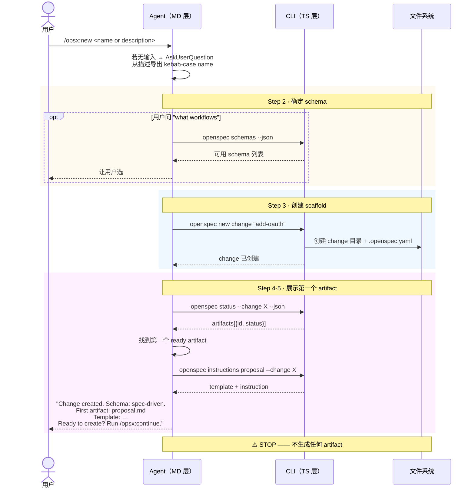

# Workflow · new

## 源文件

`src/core/templates/workflows/new-change.ts` → `getNewChangeSkillTemplate()` + `getOpsxNewCommandTemplate()`

## 一句话

new 是**最轻量的规划 workflow**：只创建 change scaffold（目录 + `.openspec.yaml`），不生成任何 artifact 内容。创建完后展示第一个 artifact 的 instructions，然后 **STOP**。

它的价值是把 "创建容器" 和 "生成内容" 拆开——适合先占位、手动推进、显式选择 schema 或 initiative linkage。

## 和 propose 的关键区别

| | propose | new |
|---|---|---|
| 创建 change 目录 | ✓ | ✓ |
| 生成 artifact | ✓（全部，直到 apply-ready） | ✗（STOP 在展示第一个 template 后） |
| 粒度 | 一口气完成 | scaffold only |
| 适用场景 | 用户已有明确意图 | 先占位，再逐步推进 |

## CLI 命令调用序列

```text
1. [可选] openspec schemas --json          # 仅当用户问"有哪些 workflow"
2. openspec new change "<name>"            # 创建容器（可能带 --schema）
3. openspec status --change "<name>" --json # 读 DAG
4. openspec instructions <first-artifact> --change "<name>"  # 展示第一个 template
5. STOP  ← 关键：到此为止
```

## 时序图



## 关键 guardrail：STOP

new 最关键的指令是 Step 6：

```text
STOP and wait for user direction
```

Guardrails 里再次强调：

```text
Do NOT create any artifacts yet - just show the instructions
Do NOT advance beyond showing the first artifact template
```

这意味着 agent 绝不能在这个 workflow 里写 proposal.md。它只负责搭好舞台，用户决定下一步。

## Guardrails

| Guardrail | 含义 |
|---|---|
| Do NOT create any artifacts | 不写 proposal/specs/design/tasks |
| Do NOT advance beyond first template | 停在展示阶段 |
| name invalid → ask for valid name | kebab-case 校验 |
| change 同名 → suggest continue | 避免重复创建 |
| Pass --schema if non-default | 尊重用户选择 |

## 和 continue / ff 的配合

new 创建 scaffold 后，典型的后续路径：

```text
/opsx:new add-oauth
  → "Change created. First: proposal.md"
/opsx:continue
  → 创建 proposal.md → STOP
/opsx:continue
  → 创建 specs/ → STOP
/opsx:continue
  → 创建 design.md → STOP
/opsx:ff
  → 批量生成剩余 artifact → apply-ready
```

## 源码锚点

| 内容 | 行号范围（new-change.ts） |
|---|---|
| SkillTemplate 定义 | L10-L82 |
| CommandTemplate 定义 | L85-L156 |
| Step 2: 确定 schema | L31-L39 |
| Step 3: new change | L41-L45 |
| Step 4: status | L48-L52 |
| Step 5: instructions | L54-L60 |
| Step 6: STOP | L62 |
| Guardrails | L73-L78 |
