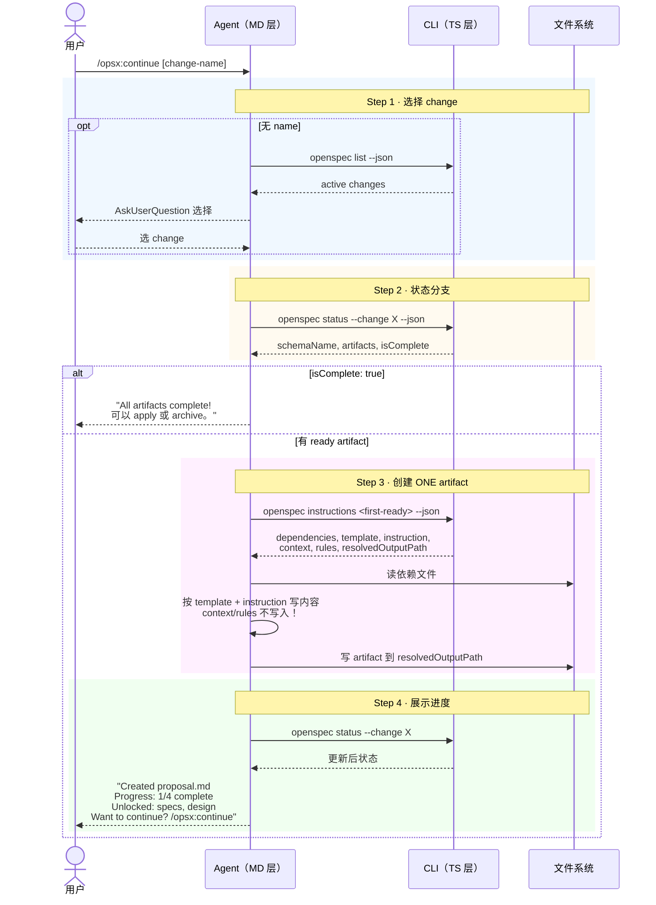

# Workflow · continue

## 源文件

`src/core/templates/workflows/continue-change.ts` → `getContinueChangeSkillTemplate()` + `getOpsxContinueCommandTemplate()`

## 一句话

continue 是**增量路径**：每次调用只推进一个 ready artifact。它体现 artifact DAG 的逐步工作流——先 `status --json` 找 ready artifact，再 `instructions <artifact> --json` 获取执行包，写完一个 **STOP**。

## 和 propose / ff 的粒度区别

| | propose | ff | continue |
|---|---|---|---|
| 每次创建 | 全部 artifact | 全部剩余 artifact | **一个** artifact |
| 停止条件 | applyRequires 满足 | applyRequires 满足 | 写完一个立即 STOP |
| 适用 | 新 change，快速启动 | 已有 change，批量补齐 | 逐步推进，每步 review |

## 三个状态分支

continue 根据 `status --json` 的结果有三个分支：

| 状态 | agent 行为 |
|---|---|
| `isComplete: true` | 祝贺 → 建议 apply 或 archive → STOP |
| 有 `status: "ready"` 的 artifact | 取第一个 → instructions → 写 → STOP |
| 全部 blocked | 不应该发生 → 展示 status + 建议检查 |

## CLI 命令调用序列

```text
1. [可选] openspec list --json              # 选 change
2. openspec status --change "<name>" --json  # 读 DAG → 判断分支
3. [若 ready] openspec instructions <first-ready> --change "<name>" --json
4. [agent 读依赖 + 写 artifact]
5. openspec status --change "<name>"         # 展示进度
6. STOP
```

## 时序图



## 关键 guardrail：一次只做一个

```text
Create ONE artifact per invocation
STOP after creating ONE artifact
```

这是 continue 和 propose 最核心的区别。propose 循环到 apply-ready，continue 每次只走一步。这让用户在每步之间可以 review、调整、甚至切换方向。

## Guardrails

| Guardrail | 含义 |
|---|---|
| Create ONE artifact per invocation | 核心约束 |
| Always read dependency artifacts first | 不凭记忆 |
| Never skip artifacts or create out of order | 遵守 DAG |
| context unclear → ask before creating | 不猜 |
| Verify artifact file exists after writing | 确认写入 |
| Use schema's artifact sequence, don't assume names | schema-agnostic |

## common artifact patterns

template 里硬编码了 spec-driven schema 的 artifact 创建指引：

- **proposal.md**: 问清 change → 填 Why/What Changes/Capabilities/Impact。Capabilities 段决定后续 specs 文件数。
- **specs/<capability>/spec.md**: 按 proposal 的 Capabilities 列表，每个 capability 一个 spec 文件。
- **design.md**: 技术决策、架构、实现方案。
- **tasks.md**: checkbox 任务清单。

对于其他 schema，agent 应按 `instruction` field 而非硬编码规则。

## 源码锚点

| 内容 | 行号范围（continue-change.ts） |
|---|---|
| SkillTemplate 定义 | L10-L127 |
| CommandTemplate 定义 | L130-L247 |
| Step 1: 选 change | L22-L34 |
| Step 2: status | L36-L44 |
| Step 3: 三向分支 | L46-L83 |
| artifact 指引 | L100-L112 |
| Guardrails | L114-L121 |
