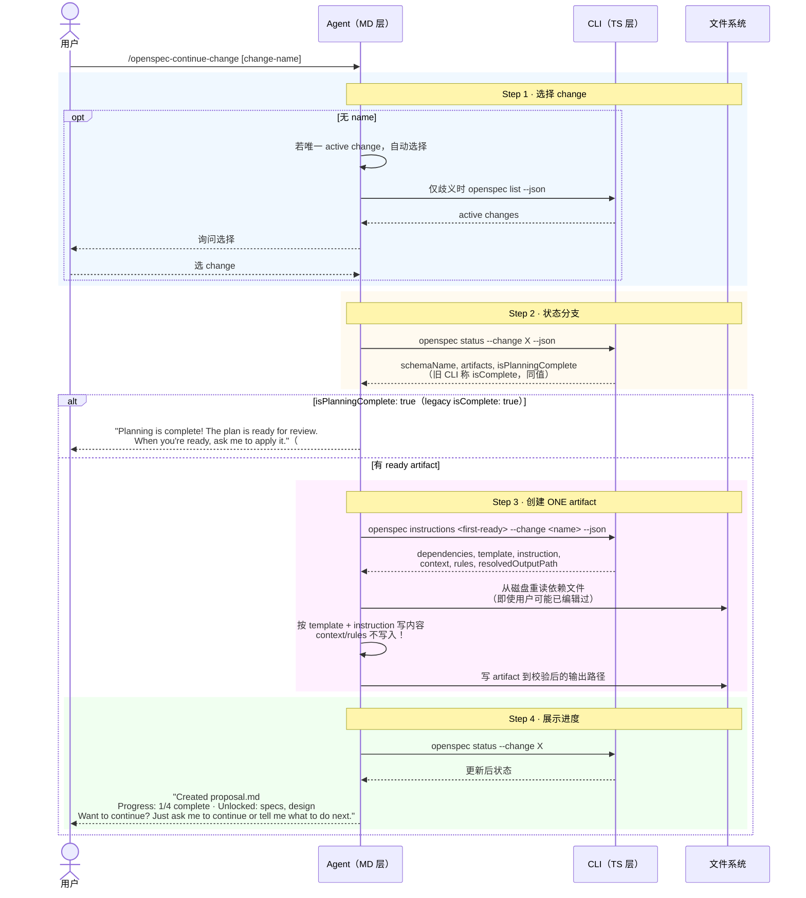

# Workflow · continue

## 源文件

`src/core/templates/workflows/continue-change.ts` → `getContinueChangeSkillTemplate()` + `getOpsxContinueCommandTemplate()`

> **调用方式**：技能 `openspec-continue-change` [change-name]——Claude Code 等工具里 `/openspec-continue-change` [change-name]，Codex 用 `$openspec-continue-change` [change-name]。1.x 写作 `/opsx:continue`；v2.0.0 起命令文件已移除，`/opsx:` 只用于历史解释。
> **agent 看到的名字**：`openspec-continue-change`（skill）/ `OPSX: Continue`（command）
> **独立 CLI 命令**：无——continue 没有对应的 `openspec continue` CLI 命令。
> **profile**：custom（需显式启用，不在默认 core 里）

## 一句话

continue 是**增量路径**：每次调用只推进一个 ready artifact。它体现 artifact DAG 的逐步工作流——先 `status --json` 找 ready artifact，再 `instructions <artifact> --json` 获取执行包，写完一个 **STOP**。

## 和 propose / ff 的粒度区别

| | propose | ff | continue |
|---|---|---|---|
| 创建 change | 是（新建） | 是（新建） | **否**（作用于已有 change） |
| 每次创建 | 传递必需集内全部 artifact | 传递必需集内全部 artifact | **一个** artifact（或补齐一个半写 glob 产物） |
| 停止条件 | 传递必需集满足 | 传递必需集满足 | 写完一个立即 STOP |
| 适用 | 新 change，带 context 预检与歧义澄清 | 新 change，倾向做合理假设快速直推 | 已有 change，逐步推进、每步 review |

## 状态分支

continue 根据 `status --json` 的结果分成三段：一段**先于所有分支**执行的半写工件补完，加上 `status` 给出的三选一主分支（合计四条路径）：

| 状态 | agent 行为 |
|---|---|
| **先于所有分支**：有读作 `done` 的 glob 工件但文件不全 | 只补写缺失文件 → STOP（算作本次调用的那一个工件） |
| `isPlanningComplete: true`（legacy `isComplete: true`） | 祝贺 → 展示含 schema 名的最终 status → **只提示进入实施（apply）**：`"Planning is complete! The plan is ready for review. When you’re ready, ask me to apply it."`（v2.1.1 **#2274**：**绝不提示 archive**，因为规划刚结束时代码尚未实施！）→ STOP |
| 有 `status: "ready"` 的 artifact | 取第一个 → instructions（若返回 `skipped: true` 则跳过换下一个）→ 定并校验输出路径 → 写 → STOP |
| 全部 blocked | 不应该发生 → 展示 status + 建议检查 |

## 半写工件：glob 工件的 done 不可全信

glob 工件（如 `specs/**/*.md`）只要存在**一个**匹配文件就被读作 `done`。一次在写第二个文件时被打断的运行，会留下「done 但文件不全」的状态，而下次调用看到 `done` 就直接往下走，不再读它的 instruction——于是缺失的 spec 文件永远不会被补上（#2034）。

`PARTIAL_ARTIFACT_CHECK` 段（skill 版与 command 版各注入一次）规定：

1. 对每个 `done` 的 glob 工件，先取它的 instructions，读已完成依赖推断出**应有文件**列表；
2. 与 `artifactPaths.<id>.existingOutputPaths` 比对。spec-driven 的 `specs` 具体是：读 proposal，按它列出的 capability 逐个核对 `specs/<capability-path>/spec.md`；
3. 每条期望路径先相对 `changeRoot` 解析，并校验解析 symlink 后（父目录与已存在的文件本身）仍在 `changeRoot` 内；
4. 只补写缺失的文件，**每个都写在校验过的路径上**；`instruction` 把创建委托给某个 skill/command 时，只有它能写到该路径才调用，否则停下告知用户；
5. 补写完成后 STOP——这算作本次调用的那一个工件。分不清某文件是刻意省略还是被漏掉时，问用户。

## CLI 命令调用序列

```text
1. [可选] 显式名称 → 对话推断 → 唯一 active change 自动选择；仅歧义时 `openspec list --json` 选 change
2. openspec status --change "<name>" --json  # 读 DAG → 判断分支
3. [若 ready] openspec instructions <first-ready> --change "<name>" --json
4. [agent 读依赖 + 写 artifact]
5. openspec status --change "<name>"         # 展示进度
6. STOP
```

## 时序图


```mermaid
sequenceDiagram
    actor User as 用户
    participant MD as Agent（MD 层）
    participant TS as CLI（TS 层）
    participant FS as 文件系统

    User->>MD: /openspec-continue-change [change-name]

    rect rgb(240, 248, 255)
        Note over MD,FS: Step 1 · 选择 change
        opt 无 name
            MD->>MD: 若唯一 active change，自动选择
            MD->>TS: 仅歧义时 openspec list --json
            TS-->>MD: active changes
            MD-->>User: 询问选择
            User-->>MD: 选 change
        end
    end

    rect rgb(255, 250, 240)
        Note over MD,FS: Step 2 · 状态分支
        MD->>TS: openspec status --change X --json
        TS-->>MD: schemaName, artifacts, isPlanningComplete<br/>（旧 CLI 称 isComplete，同值）
    end

    alt isPlanningComplete: true（legacy isComplete: true）
        MD-->>User: "Planning is complete! The plan is ready for review.<br/>When you're ready, ask me to apply it."（#2274 仅提示 apply，不提 archive）
    else 有 ready artifact
        rect rgb(255, 240, 255)
            Note over MD,FS: Step 3 · 创建 ONE artifact
            MD->>TS: openspec instructions <first-ready> --change <name> --json
            TS-->>MD: dependencies, template, instruction,<br/>context, rules, resolvedOutputPath
            MD->>FS: 从磁盘重读依赖文件<br/>（即使用户可能已编辑过）
            MD->>MD: 按 template + instruction 写内容<br/>context/rules 不写入！
            MD->>FS: 写 artifact 到校验后的输出路径
        end

        rect rgb(240, 255, 240)
            Note over MD,FS: Step 4 · 展示进度
            MD->>TS: openspec status --change X
            TS-->>MD: 更新后状态
            MD-->>User: "Created proposal.md<br/>Progress: 1/4 complete · Unlocked: specs, design<br/>Want to continue? Just ask me to continue or tell me what to do next."
        end
    end
```

## 关键 guardrail：一次只做一个

```text
Create ONE artifact per invocation
STOP after creating ONE artifact
```

这是 continue 和 propose 最核心的区别。propose 循环到 apply-ready，continue 每次只走一步。这让用户在每步之间可以 review、调整、甚至切换方向。

## 先定输出路径，再创建任何东西

v1.14.3 起，continue / propose / ff 三套模板统一了创建顺序（#2104）：

| 情形 | 规则 |
|---|---|
| `resolvedOutputPath` 是具体文件 | 输出路径就是它 |
| `resolvedOutputPath` 是 glob | 用 schema instruction 与 change 上下文选一个**落在 `changeRoot` 内**的具体路径，并校验 resolve symlink 后仍在 `changeRoot` 内；不合格则停下告知用户 |
| `instruction` 把创建委托给某个 skill/command | **只在它能把工件写到该校验过的路径时**才调用，否则停下告知用户；调用前后都确认文件存在于该路径 |

这条规则写在「读取依赖」之后、「创建文件」之前：路径选择是创建的前置条件，不是创建后的补救。

## Guardrails

| Guardrail | 含义 |
|---|---|
| Create ONE artifact per invocation | 核心约束 |
| Finish a partly written glob artifact first | `done` 只说明有一个匹配文件，先比对 `existingOutputPaths` 补缺 |
| Choose and check the output path before creating anything | glob 工件必须先定具体路径并做 symlink 后包含检查 |
| Always read dependency artifacts — re-read from disk, not memory | 用户可能已编辑过 |
| Never skip artifacts or create out of order | 遵守 DAG；`skip_specs: true` 的 specs 是显式 skipped，不应创建 spec 文件 |
| context unclear → ask before creating | 不猜 |
| Verify artifact file exists after writing | 确认写入 |
| Use schema's artifact sequence, don't assume names | schema-agnostic |

## 完全去硬编码的 Artifact Creation Guidelines

`continue-change.ts:126-130` **不再硬编码任何 `proposal.md` / `design.md` / `tasks.md` 示范规则**。相反，它专门提醒 agent：即便遇到熟悉的文件名（如 `proposal.md`、`tasks.md`），自定义 schema 也可能为其定义完全不同的内容或创建流程，因此必须始终以 `openspec instructions` 返回的 `instruction` 字段作为唯一权威指引（若 `instruction` 将创建动作委托给特定 skill/command，则在选定并校验好输出路径、且确认被委托方能写到该路径时调用它）。

## 源码锚点

| 内容 | 行号范围（`continue-change.ts`，共 269 行） |
|---|---|
| `PLANNING_COMPLETE_HANDOFF`（#2274 规划完成交接句） | L11-L12 |
| `PARTIAL_ARTIFACT_CHECK` 共享片段 | 注释 L14-L18；常量 L19-L22 |
| SkillTemplate 定义 | L24-L146 |
| CommandTemplate 定义 | L148-L269 |
| Step 1: 选 change | L38-L52 |
| Step 2: status | L54-L62 |
| Step 3 前置: 半写工件检查（注入点） | L68 |
| Step 3: 主分支三选一（含输出路径选择 L96 / L222） | L64-L111 |
| Step 4: 展示进度 | L112-L115 |
| Output 段 | L117-L124 |
| Artifact Creation Guidelines | L126-L130 |
| Guardrails | L132-L141 |
| command 版对应锚点 | L164 / L180 / L194 / L222 / L243 / L252 / L258 |
