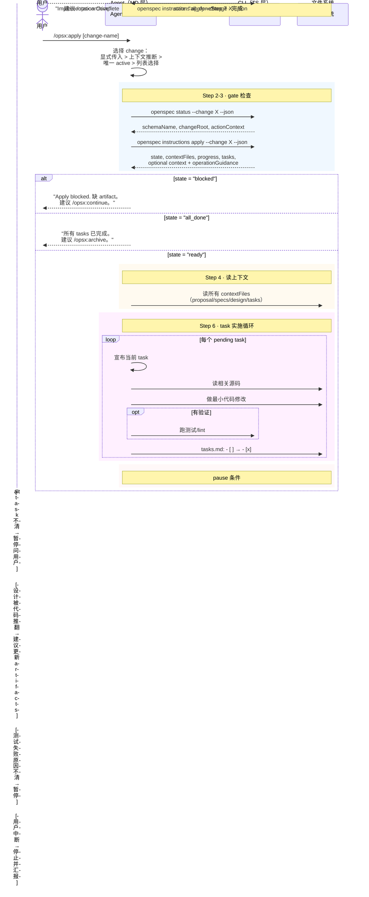

# Workflow · apply

## 源文件

`src/core/templates/workflows/apply-change.ts` → `getApplyChangeSkillTemplate()` + `getOpsxApplyCommandTemplate()`

> **调用方式**：command adapter 可为 `/opsx:apply [change-name]`；Codex 用 `$openspec-apply-change`。下文的 `/opsx:` 仅表示前者。
> **agent 看到的名字**：`openspec-apply-change`（skill）/ `OPSX: Apply`（command）
> **独立 CLI 命令**：无——apply 没有对应的 `openspec apply` CLI 命令，它是纯 agent 模板，消费 `openspec instructions apply --json` 的运行时输出。
> **profile**：core（大多数用户默认可见）

## 一句话

apply 是**唯一真正修改业务代码的 workflow**。它消费 `openspec instructions apply --json` 的 runtime 输出，按 tasks.md checkbox 逐项实施，每完成一个 task 就勾掉一个 checkbox。它是 "actions on a change" 模型的核心——可以在任何时候被调用，不强制 phase lock。

## CLI 命令调用序列

```text
1. [可选] openspec list --json              # 选择 change
2. openspec status --change "<name>" --json  # 确认 schema 和 scope
3. openspec instructions apply --change "<name>" --json  # 获取 apply runtime 包
4. [agent 读 contextFiles + 逐项实施 task + 更新 checkbox]
5. [可选，按需] openspec instructions apply --change "<name>" --json  # 刷新进度
```

## 时序图



## apply runtime 包的三个 state

template 规定 agent 必须先检查 state，不是所有情况都能直接开始写代码：

| state | 含义 | agent 行为 |
|---|---|---|
| `blocked` | 缺 required artifact、缺 tracking file、或无 checkbox | 停止，建议 `/opsx:continue` |
| `ready` | 一切就绪，有 pending tasks | 读 contextFiles → 开始 task loop |
| `all_done` | 全部 checkbox 已勾 | 祝贺，建议 archive |

## operation inputs 不等于 artifact rules

`openspec instructions apply --change X --json` 除了 `contextFiles`、progress、tasks 和 state，还可返回：

- `context`：来自 selected root 的项目背景，agent 必须作为实施期 prompt input 考虑；
- `operationGuidance`：`config.yaml` 的 `operations.apply.guidance`，逐条作为适用时遵守的 advisory guidance。

它们不替代任何 CLI state、task、完成判定或 schema instruction。`rules.tasks` 只在生成 `tasks.md` 时使用；`rules.apply` 没有消费者。若要给 Apply 写长期提醒，正确位置是 `operations.apply.guidance`，强制约束仍应落在 tests、lint 或 CI。

## apply 不再假装「ready to implement」是完整的

apply 的门控只按 schema 的 `apply.requires` 判定——`tasks.md` 先于 specs 写好的 change，之前读作 ready to implement，但 `openspec validate` 本就拒绝这种状态。`instructions apply` 会：

1. **无 spec delta 时警告**（text + `--json` 的 warning 字段），点名两条出路：先写 specs，或声明 `skip_specs: true`（该 change 真的不改任何 spec 化行为时）。
2. **报完整缺失链**：被阻塞的 apply 之前只报第一跳（`Missing artifacts: tasks`），而 tasks 依赖的 specs 也缺时读起来像「直接写 tracking 文件」。现在按 build order 报 `missingPrerequisites`（文本 `Not created yet, in build order: ...`，`--json` 数组），补救命令是 `openspec instructions <artifact> --change <name>`——不再引用 `openspec-continue-change` skill（core profile 不装它）。

有 specs、声明 `skip_specs`、或仍被自己的必需 artifact 挡住的 change 不受影响。

## Fluid Workflow Integration

apply template 明确写了它不是 phase lock：

```text
- Can be invoked anytime: Before all artifacts are done (if tasks exist),
  after partial implementation, interleaved with other actions
- Allows artifact updates: If implementation reveals design issues,
  suggest updating artifacts - not phase-locked, work fluidly
```

这意味着 agent 在 apply 中发现 design 问题时，可以直接建议更新 artifacts，然后继续 apply——不需要先 archive 再新建 change。

## 三种输出格式

template 硬编码了三种输出格式：

| 场景 | 格式 |
|---|---|
| 实施中 | `## Implementing: <name> (schema: <schema>)` + 逐 task 进度 |
| 完成 | `## Implementation Complete` + progress + completed list |
| 暂停 | `## Implementation Paused` + progress + issue + options |

进度计数与 `instructions apply` 的 task 列表共享同一个 parser（`src/utils/task-progress.ts`），并按**缩进子任务**计数：`list`、`view`、`instructions apply`、`archive` 对同一 tasks 文件的判断一致；checkbox 即使出现在 code fence / HTML comment / 缩进块里也会被计数（把示例清单当展示的 tasks 文件，可能被算成待办）。

## Guardrails

| Guardrail | 含义 |
|---|---|
| Keep going until done or blocked | 不无故停 |
| Always read context files before starting | 不凭记忆 |
| Task ambiguous → pause and ask | 不猜 |
| Implementation reveals issues → suggest artifact updates | 不硬写 |
| Task needs work beyond the spec → surface added scope and pause | 不默默缩小/推迟指定行为 |
| Keep changes minimal and scoped | 不夹带 |
| Update checkbox immediately after each task | 不拖延 |
| Use contextFiles from CLI, don't assume file names | 不硬编码 |
| Read context / consider operation guidance, but preserve CLI gate | config 是 prompt input，不能绕过 blocked/all_done |

## 和 FAQ 的衔接

FAQ `06_apply-ready-to-archive-ready/` 从工程视角分析了 task loop、checkbox 机制、guard 分支。本文件从 "template 源码给了 agent 什么指令" 的视角补充。

## 源码锚点

| 内容 | 行号范围（apply-change.ts） |
|---|---|
| SkillTemplate 定义 | L10-L165 |
| CommandTemplate 定义 | L168-L323 |
| Step 1: 选择 change | L22-L29 |
| Step 2: status | L31-L38 |
| Step 3: apply instructions | L40-L55 |
| Step 4: 读 contextFiles | L57-L63 |
| Step 6: task loop | L72-L86 |
| Guardrails | L146-L154 |
| Fluid Workflow | L156-L161 |

## v1.13.0 行为更新

**无 delta spec 的 change 会被 apply 警告**（`8ba4ac1b`）：之前只要 tasks 存在，apply 就报 ready，哪怕完全没有 spec delta（这正是 validate 拒绝的状态）。现在 text 和 `--json` 都警告，并给出两条出路：补写 specs，或显式声明 `skip_specs: true`。
