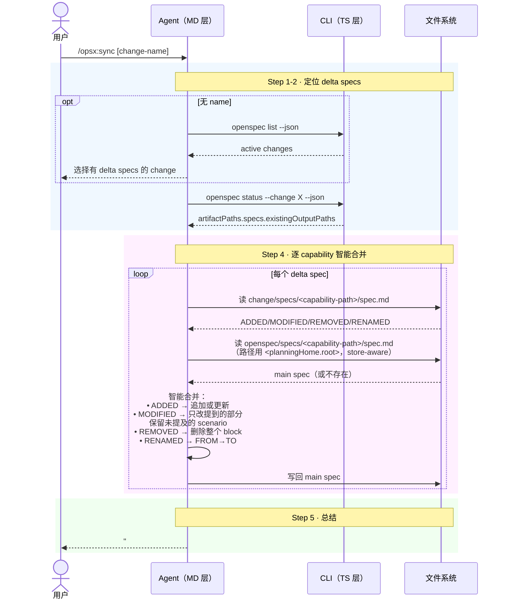

# Workflow · sync

## 源文件

`src/core/templates/workflows/sync-specs.ts` → `getSyncSpecsSkillTemplate()` + `getOpsxSyncCommandTemplate()`

> **调用方式**：command adapter 可为 `/opsx:sync [change-name]`；Codex v1.7.0 用 `$openspec-sync-specs`。下文的 `/opsx:` 仅表示前者。
> **agent 看到的名字**：`openspec-sync-specs`（skill）/ `OPSX: Sync`（command）
> **独立 CLI 命令**：无——sync 是纯 agent-driven merge，和 `openspec archive` CLI 的 programmatic merge 是两条独立路径。sync 也会被 host archive workflow inline 调用（sync assessment 阶段）。
> **profile**：core（大多数用户默认可见）
> **v1.7.0 要点**：main spec 路径使用 store-aware `planningHome.root`（`<planningHome.root>/openspec/specs/`）；status 提供的 delta path 可为 nested capability path；sync 在写前读取一次 `openspec instructions specs`，把返回的 artifact rules 只用于被写入 main specs 的内容/形式。

## 一句话

sync 是 **agent-driven spec merge**，不是 CLI 的 programmatic merge。agent 读 delta spec 和 main spec，用自己的智能判断做合并——可以只加一个 scenario 而不复制完整 requirement block。这和 `openspec archive` CLI 的 `buildUpdatedSpec()` 是完全不同的合并路径。

## 和 CLI archive 的合并方式对比

| | CLI archive (`buildUpdatedSpec`) | sync template |
|---|---|---|
| 合并方式 | programmatic | agent-driven（智能） |
| MODIFIED 行为 | **完整替换** requirement block | **智能合并**：可只加一个 scenario |
| 谁执行 | CLI 进程 | agent 读文件 + 编辑 |
| 原子性 | 全量预构建 → 失败即中止 | 逐文件操作，无事务保证 |
| change 是否保留 | 移动 change 到 archive | **change 保持 active** |

## CLI 命令调用序列

```text
1. [可选] openspec list --json              # 选 change
2. openspec status --change "<name>" --json  # 获取 artifactPaths.specs.existingOutputPaths
3. [agent 逐文件] 读 delta spec → 读 main spec → 智能合并 → 写 main spec
```

注意：sync **不调用** `openspec archive` 也不调用 `openspec new change`。它纯粹是文件读取+编辑操作。

## 时序图



## Key Principle: Intelligent Merging

template 明确写了和 programmatic merge 的核心区别：

```text
Unlike programmatic merging, you can apply partial updates:
- To add a scenario, just include that scenario under MODIFIED
- The delta represents intent, not a wholesale replacement
- Use your judgment to merge changes sensibly
```

这意味着 agent 在 sync 中的 MODIFIED 只需要写**变化的部分**，不需要复制整个 requirement block。这和 CLI archive 的 MODIFIED=完整替换是根本不同的语义。

## Guardrails

| Guardrail | 含义 |
|---|---|
| Read both delta and main specs before making changes | 双边读取 |
| Preserve existing content not mentioned in delta | 不丢数据 |
| If something is unclear, ask for clarification | 不猜 |
| Show what you're changing as you go | 透明 |
| Should be idempotent | 跑两次结果一样 |
| New capability Purpose | 将 delta `## Purpose` 复制到新 main spec；已有 main spec 的 Purpose 保持权威 |
| Specs rules only constrain spec content | 不把 `rules.specs` 当 archive/selection guidance |

## 和 archive template 的关系

archive template 的 Step 4（sync assessment）会调 sync：

```text
archive template → 发现 delta specs → sync assessment
  → 用户选 "Sync now" → 调 openspec-sync-specs skill
  → 本 template 执行 agent-driven merge
  → 回到 archive template 继续 mv
```

## 源码锚点

| 内容 | 行号范围（sync-specs.ts） |
|---|---|
| SkillTemplate 定义 | L10-L153 |
| CommandTemplate 定义 | L157-L299 |
| Step 3: 找 delta specs | L39-L48 |
| Step 4: 逐 capability 合并 | L50-L83 |
| Key Principle | L119-L124 |
| Guardrails | L144-L149 |
