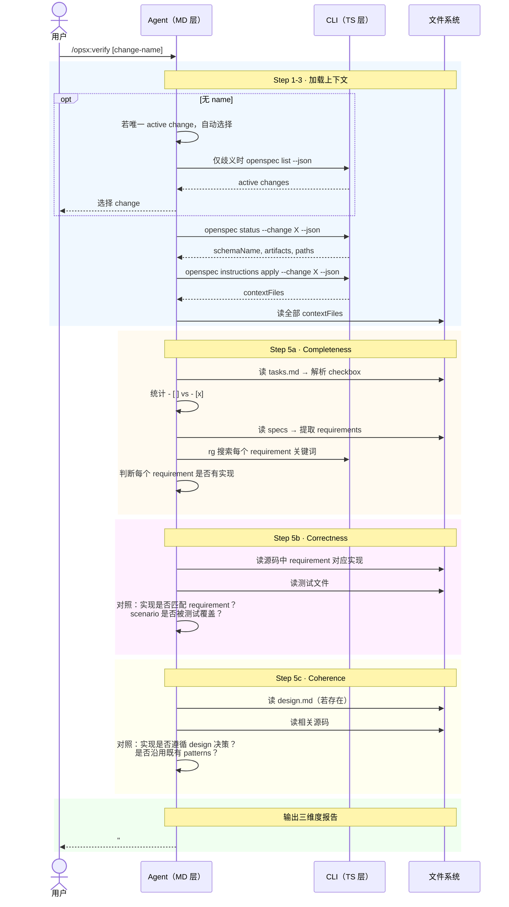

# Workflow · verify

## 源文件

`src/core/templates/workflows/verify-change.ts` → `getVerifyChangeSkillTemplate()` + `getOpsxVerifyCommandTemplate()`

> **调用方式**：command adapter 可为 `/opsx:verify [change-name]`；Codex v1.8.0 用 `$openspec-verify-change`。下文的 `/opsx:` 仅表示前者。
> **agent 看到的名字**：`openspec-verify-change`（skill）/ `OPSX: Verify`（command）
> **独立 CLI 命令**：有类似功能的 `openspec validate`，但两者不同——`validate` 检查 OpenSpec 文档结构（CLI 程序化），verify 检查代码实现是否与 artifacts 一致（agent 智能审查）。
> **profile**：custom（需显式启用，不在默认 core 里）

## 一句话

verify 检查实现是否与 planning artifacts 一致。它不是 `openspec validate` 的替代——`validate` 检查 OpenSpec 文档结构，verify 让 agent 审查代码实现、测试、任务完成度和 artifact 一致性。

## 三维度验证框架

template 硬编码了三维验证结构：

| 维度 | 检查什么 | 严重度 |
|---|---|---|
| **Completeness** | tasks 是否全部完成？specs 的 requirement 是否都有实现？ | CRITICAL（缺 task/requirement） |
| **Correctness** | requirement 实现是否正确？scenario 是否覆盖？测试是否存在？ | CRITICAL/WARNING |
| **Coherence** | 实现是否遵循 design？是否沿用既有 patterns？ | WARNING/SUGGESTION |

## CLI 命令调用序列

```text
1. [可选] 显式名称 → 对话推断 → 唯一 active change 自动选择；仅歧义时 `openspec list --json`
2. openspec status --change "<name>" --json  # 读 schema 和 artifacts
3. openspec instructions apply --change "<name>" --json  # 获取 contextFiles
4. [agent 读全部 contextFiles]
5. [agent 逐维度检查：读源码、rg 搜索、解析 checkbox、对照 specs]
6. [输出三维度报告]
```

## 时序图



## 和 `openspec validate` 的区别

| | `openspec validate` CLI | verify template |
|---|---|---|
| 检查对象 | OpenSpec 文档结构 | 代码实现 vs artifacts |
| 检查方式 | CLI 程序化解析 | agent 读代码 + 推理 |
| 典型发现 | delta spec 格式错误、requirement 重复 | task 未完成、requirement 未实现、design 未被遵守 |
| 谁执行 | CLI 进程 | agent |

## Guardrails

| Guardrail | 含义 |
|---|---|
| Always use contextFiles from CLI, not assumptions | schema-agnostic |
| Search codebase for implementation evidence | 不只读 artifacts |
| Be specific in findings | 不说"可能有问题"，说"task 3 未完成" |
| Provide actionable recommendations | 每个 finding 带建议 |

## 源码锚点

| 内容 | 行号范围（verify-change.ts） |
|---|---|
| SkillTemplate 定义 | L10-L139 |
| CommandTemplate 定义 | L142-L263 |
| Step 4: 初始化三维报告 | L49-L55 |
| Step 5: Completeness | L57-L77 |
| Step 6: Correctness | L78-L114 |
| Step 7: Coherence | L115-L133 |
