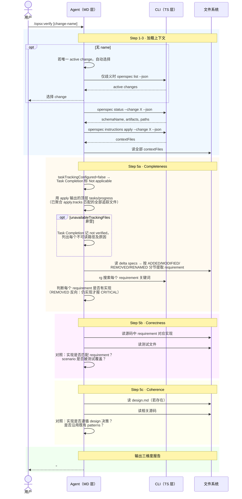

# Workflow · verify

## 源文件

`src/core/templates/workflows/verify-change.ts` → `getVerifyChangeSkillTemplate()` + `getOpsxVerifyCommandTemplate()`

> **调用方式**：command adapter 可为 `/opsx:verify [change-name]`；Codex 用 `$openspec-verify-change`。下文的 `/opsx:` 仅表示前者。
> **agent 看到的名字**：`openspec-verify-change`（skill）/ `OPSX: Verify`（command）
> **独立 CLI 命令**：有类似功能的 `openspec validate`，但两者不同——`validate` 检查 OpenSpec 文档结构（CLI 程序化；另有 `--archived` 查 archive 里未勾完的 tasks），verify 检查代码实现是否与 artifacts 一致（agent 智能审查）。
> **profile**：custom（需显式启用，不在默认 core 里）

## 一句话

verify 检查实现是否与 planning artifacts 一致。它不是 `openspec validate` 的替代——`validate` 检查 OpenSpec 文档结构，verify 让 agent 审查代码实现、测试、任务完成度和 artifact 一致性。

## 三维度验证框架

template 硬编码了三维验证结构：

| 维度 | 检查什么 | 严重度 |
|---|---|---|
| **Completeness** | tasks 是否全部完成？specs 的 requirement 是否都有实现？ | CRITICAL（缺 task/requirement） |
| **Correctness** | requirement 实现是否正确？scenario 是否覆盖？测试是否存在？ | CRITICAL/WARNING |
| **Coherence** | 实现是否遵循 design？是否沿用既有 patterns？ | WARNING/SUGGESTION |

对只做删除/改名的 change，检查语义反转：REMOVED requirement 的预期结果是**找不到实现**——仍在交付该行为的代码路径才报 CRITICAL（"Removed requirement still implemented"）；RENAMED 检查的是 TO 名下行为是否保留，不要求代码符号/文件改名。这类 change 的 Correctness 两个检查（Requirement Implementation Mapping、Scenario Coverage）标 **Not applicable**——Spec Coverage 里的 REMOVED/RENAMED 检查就是它们的证据。report 的计数只算 ADDED/MODIFIED，REMOVED/RENAMED 单独陈述（如 "1 removal confirmed, 1 rename verified"）。

## CLI 命令调用序列

```text
1. [可选] 显式名称 → 对话推断 → 唯一 active change 自动选择；仅歧义时 `openspec list --json`
   （提示列表显示全部 active changes，含 `status: "no-tasks"` 的 change；未完成任务标 "(In Progress)"）
2. openspec status --change "<name>" --json  # 读 schemaName、planningHome/changeRoot/artifactPaths/actionContext
3. openspec instructions apply --change "<name>" --json
   # contextFiles + taskTrackingConfigured + 顶层 tasks/progress（按 apply.tracks 聚合）+ unavailableTrackingFiles
4. [agent 读全部 contextFiles]
5. [agent 逐维度检查：任务完成度用顶层 tasks/progress（不自己解析 checkbox）；
   specs 按 delta 分节（ADDED/MODIFIED/REMOVED/RENAMED）定语义；apply 的 state/instruction 只作 context]
6. [输出三维度报告；每个被跳过的检查点名并给原因，不得计为通过]
```

## 时序图


```mermaid
sequenceDiagram
    actor User as 用户
    participant MD as Agent（MD 层）
    participant TS as CLI（TS 层）
    participant FS as 文件系统

    User->>MD: /opsx:verify [change-name]

    rect rgb(240, 248, 255)
        Note over MD,FS: Step 1-3 · 加载上下文
        opt 无 name
            MD->>MD: 若唯一 active change，自动选择
            MD->>TS: 仅歧义时 openspec list --json
            TS-->>MD: active changes
            MD-->>User: 选择 change
        end
        MD->>TS: openspec status --change X --json
        TS-->>MD: schemaName, artifacts, paths
        MD->>TS: openspec instructions apply --change X --json
        TS-->>MD: contextFiles
        MD->>FS: 读全部 contextFiles
    end

    rect rgb(255, 250, 240)
        Note over MD,FS: Step 5a · Completeness
        MD->>MD: taskTrackingConfigured=false →<br/>Task Completion 标 Not applicable
        MD->>MD: 用 apply 输出的顶层 tasks/progress<br/>（已聚合 apply.tracks 匹配的全部追踪文件）
        opt unavailableTrackingFiles 非空
            MD->>MD: Task Completion 记 not verified，<br/>列出每个不可读路径及原因
        end
        MD->>FS: 读 delta specs → 按 ADDED/MODIFIED/<br/>REMOVED/RENAMED 分节提取 requirement
        MD->>TS: rg 搜索每个 requirement 关键词
        MD->>MD: 判断每个 requirement 是否有实现<br/>（REMOVED 反向：仍实现才报 CRITICAL）
    end

    rect rgb(255, 240, 255)
        Note over MD,FS: Step 5b · Correctness
        MD->>FS: 读源码中 requirement 对应实现
        MD->>FS: 读测试文件
        MD->>MD: 对照：实现是否匹配 requirement？<br/>scenario 是否被测试覆盖？
    end

    rect rgb(255, 255, 240)
        Note over MD,FS: Step 5c · Coherence
        MD->>FS: 读 design.md（若存在）
        MD->>FS: 读相关源码
        MD->>MD: 对照：实现是否遵循 design 决策？<br/>是否沿用既有 patterns？
    end

    rect rgb(240, 255, 240)
        Note over MD,FS: 输出三维度报告
        MD-->>User: "## Verification Report<br/>### Completeness<br/>- CRITICAL: task 3/7 incomplete<br/>### Correctness<br/>- WARNING: OAuth callback 缺测试<br/>### Coherence<br/>✓ design 决策全部遵守"
    end
```

## 任务进度来自 apply 契约，不再自己解析 checkbox

verify 模板已按 status/apply 契约重写：任务完成度不再由 agent 数 `tasks.md` 的 checkbox。

- `instructions apply --json` 返回顶层 `tasks` 与 `progress`——CLI 已按 schema 的 `apply.tracks` 聚合**所有**能读到的具体任务文件，与该 artifact 叫什么 id 无关；agent 不从 `contextFiles` 的 key 推断追踪关系。
- `taskTrackingConfigured: false` → **Task Completion 标 Not applicable**；空 `tasks` 不算缺证据。
- `unavailableTrackingFiles` 非空 → Task Completion 记 not verified，逐一列出不可读路径及原因；可读的部分仍可用，但不得用部分聚合的 `tasks`/`progress` 推断完成。
- `taskTrackingConfigured: true` 且 `tasks` 为空 → not verified，并把 apply 的 `state`/`instruction` 记为原因（非零总数本身不等于可评估的任务描述）。
- `progress.remaining > 0` → 每个列出的未完成任务报 CRITICAL；若 remaining 超过列出数，还要报无描述的未勾 checkbox 并建议补描述。

## apply 的 state/instruction 只是 context，不是 verdict

模板明确：`instructions apply` 的 `state` 与 `instruction` 是**上下文输入**，不是验证结论。verify 是 advisory 的——验证过程中不得实施任务或归档 change；`Not verified` 描述的是本报告的边界，不是新的归档前置条件（archive 保留自己的检查与用户确认行为）。

## Not applicable 与 Not verified 的分界

| 标记 | 何时用 |
|---|---|
| **Not applicable** | schema 未定义的检查（无 design artifact 的 Design Adherence、无任务追踪的 Task Completion、无 spec artifact 的 spec 类检查）；status 报告为 intentional skip 的 artifact（`skip_specs: true`）；只删除/改名 requirement 的 change 的 Correctness 两检查 |
| **Not verified** | 适用检查的证据缺失或不可用：读不到 artifacts、无可用的 requirement/scenario/design 决策、只有任务证据时的其余适用检查（含 Code Pattern Consistency）、不可读的追踪文件、找不到 RENAMED 的 baseline requirement |

被跳过的检查既不算通过也不算失败：报告里每个 skipped 检查都要点名并给原因；只要存在 skipped 检查且无 CRITICAL，**不得宣称 ready for archive**——改说 "No critical issues found in the checks that ran. <check(s)> not verified: <reason>."

## 和 `openspec validate` 的区别

| | `openspec validate` CLI | verify template |
|---|---|---|
| 检查对象 | OpenSpec 文档结构（`--archived` 则是 archive 的 tasks 勾选） | 代码实现 vs artifacts |
| 检查方式 | CLI 程序化解析 | agent 读代码 + 推理 |
| 典型发现 | delta spec 格式错误、requirement 重复 | task 未完成、requirement 未实现、design 未被遵守 |
| 谁执行 | CLI 进程 | agent |

## Guardrails

| Guardrail | 含义 |
|---|---|
| Always use contextFiles from CLI, not assumptions | schema-agnostic |
| Don't parse checkboxes yourself — use apply's top-level `tasks`/`progress` | 覆盖自定义任务文件/glob；`taskTrackingConfigured` 说了算 |
| Mark schema-undefined or intentionally-skipped checks **Not applicable** | 既不算失败也不算通过 |
| Never score a skipped check as passing; 有 skipped 检查时不宣称 ready for archive | 不虚报验证结论 |
| Treat apply `state`/`instruction` as context, not a verdict | 不在验证中实施任务或归档 |
| Search codebase for implementation evidence | 不只读 artifacts |
| Be specific in findings | 不说"可能有问题"，说"task 3 未完成" |
| Provide actionable recommendations | 每个 finding 带建议 |

## 源码锚点

| 内容 | 行号范围（verify-change.ts，skill 与 command 共享同一份步骤文本） |
|---|---|
| SkillTemplate 定义 | L11-L218 |
| CommandTemplate 定义 | L220-L425 |
| Step 1: 选择 change（含 no-tasks 列表） | L25-L36 |
| Step 3: 读取 apply 契约（tasks/progress/taskTrackingConfigured） | L47-L55 |
| Step 4: 报告初始化 + Not applicable 规则 | L57-L72 |
| Step 5: Completeness（任务 + spec 覆盖，含 REMOVED/RENAMED 语义） | L74-L111 |
| Step 6: Correctness（removal-only → Not applicable） | L113-L133 |
| Step 7: Coherence | L135-L153 |
| Step 8: 生成报告（skipped 检查的计分与最终判定） | L155-L196 |
