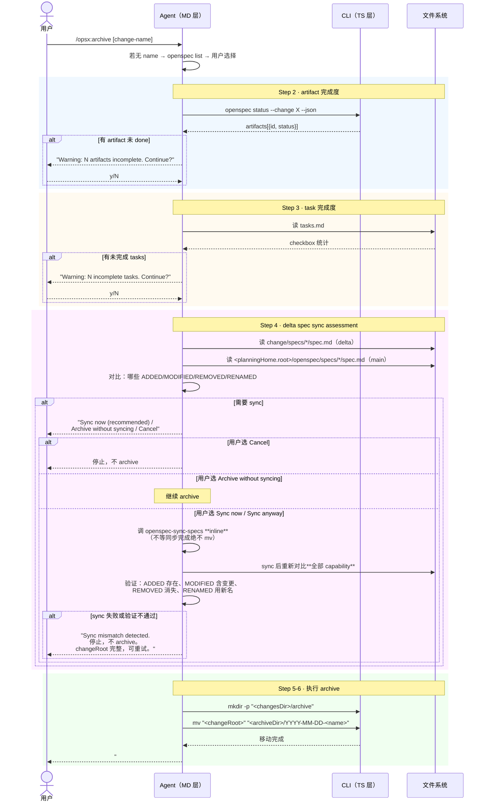

# Workflow · archive

## 源文件

`src/core/templates/workflows/archive-change.ts` → `getArchiveChangeSkillTemplate()` + `getOpsxArchiveCommandTemplate()`

> **调用方式**：command adapter 可为 `/opsx:archive [change-name]`，Codex v1.8.0 用 `$openspec-archive-change`；另有确定性 CLI `openspec archive <name>`。下文的 `/opsx:` 仅表示前者。
> **agent 看到的名字**：`openspec-archive-change`（skill）/ `OPSX: Archive`（command）
> **独立 CLI 命令**：**有**——`openspec archive <name>` 做 programmatic validate → merge → move。host archive workflow 做 pre-flight checks + agent-driven sync + 手动 mv。**两条路径不同**：CLI 做完整替换式合并，agent workflow 做智能合并。
> **profile**：core（大多数用户默认可见）
> **v1.8.0 要点（v1.7.0 起）**：① 选择 change 后先读取 `openspec instructions archive --json` 的 context/operation guidance；② status 的 `skipped` specs artifact 视为满足；③ sync 仍必须 inline 并逐 capability 验证；④ CLI merge 对 fully early-synced operations 采用 no-op / warnings，而非无意义重写；⑤ 归档无法交互提问时会给出可重跑命令，change 移除某 capability 最后一个 requirement 时可声明 `retire_capabilities: true`（v1.8.0）。
> **v1.9.0 追加**：非 TTY 时 confirm 无 ANSI、无 change 名则要求先传入名字；重建 spec 保留 `## Requirements` 周围空行且以单个 LF 结尾；scenario-loss 认所有 `####` 子标题。
> **v1.10.0 追加**：CLI retirement 失败分为“只缺 marker”“有 blocking content”“marker 已读但不可 honor/仍被内容阻塞”三路；只有第一路建议添加 marker。

## 一句话

archive 是 agent 层的收尾操作手册。它和 `openspec archive` CLI 命令不同——template 做的是 pre-flight checks（artifact 完成度、task 完成度、delta spec sync assessment），然后由 agent 执行 `mv` 移动 change 目录。它不调用 CLI 的 programmatic merge。

## CLI archive vs host archive workflow

| | `openspec archive` CLI | host archive workflow |
|---|---|---|
| 合并方式 | programmatic merge（RENAMED→REMOVED→MODIFIED→ADDED） | agent-driven sync（读 delta + main → 智能合并） |
| spec update | `buildUpdatedSpec()` → `writeUpdatedSpec()` | 调 `openspec-sync-specs` skill |
| 是否可跳过 | `--skip-specs` / `--no-validate` | 用户可选择 "Archive without syncing" |
| 谁来执行 | CLI 进程 | agent 调 `mv` 命令 |

CLI 列中的完整 mutation 边界是：全量预构建 → 全量 rebuilt validation → fingerprints/snapshots → 写入或退役 → verified move。写入、退役或 move 失败时会尽力恢复 snapshots 和 active change；并发修改使安全恢复不可能时显式报告 rollback failure。host workflow 的手动 `mv` 不实现这套 CLI transaction；源码细节见 [`../internal-spec-driven/04-archive-归档合并.md`](../internal-spec-driven/04-archive-归档合并.md)。

## CLI 命令调用序列

```text
1. 显式名称 → 对话推断 → 唯一 active change 自动选择；仅歧义时 `openspec list --json`
2. openspec instructions archive --change "<name>" --json  # 读取 context + operationGuidance（不影响 CLI contract）
3. openspec status --change "<name>" --json        # 检查 artifact 完成度；done / skipped 都满足
4. [agent 读 tasks.md]                             # 统计 checkbox
5. [agent 读 delta specs + main specs 对比]         # sync assessment
   → main spec 路径用 <planningHome.root>/openspec/specs/（store-aware）
   → 用户可选 Cancel / Archive without syncing / Sync now / Sync anyway
   → 若选 sync：inline 执行 → 验证全部 capability → 通过后才继续
6. mkdir -p "<changesDir>/archive"                 # 创建 archive 目录
7. mv "<changeRoot>" "<archiveDir>/YYYY-MM-DD-<name>"  # 移动
```

注意：archive template **不调用** `openspec archive` CLI 命令。它自己执行 `mv`。

## 时序图



## sync assessment 的选项和路由

template 规定 agent 必须做 delta spec 和 main spec 的对比分析，然后给用户选项。sync **必须 inline 执行**，且完成后必须重新对比全部 capability 做验证；archive inputs 的 context 是必读 prompt input、operation guidance 是可适用的建议，但二者不会改变任务确认、root 或 CLI merge 规则。

| 用户选择 | agent 行为 |
|---|---|
| **Cancel** | 停止，不 archive。changeRoot 完整保留。 |
| **Archive without syncing** / **Archive now** | 跳过 sync，直接进入 mv |
| **Sync now** / **Sync anyway** | ① 调 `openspec-sync-specs` **inline**（不委托后台——step 5 的 mv 会移走 changeRoot，后台 sync 读不到文件）；② 等待 sync 完成；③ 对 `artifactPaths.specs.existingOutputPaths` 中的**每个 capability** 重新验证——ADDED 存在、MODIFIED 含变更且其他 scenario 完整、REMOVED 消失、RENAMED 用新名；④ 验证全部通过才继续 archive；⑤ 任何 mismatch 都停止并报告 |
| 其他输入 | 重新询问，不 archive |

> **为什么必须 inline**：step 5 会 `mv changeRoot`。如果 sync 在后台运行而 mv 先执行了，sync 读不到 delta spec，结果是 change 已 archived 但 main specs 从未更新。inline 执行 + 完成后验证避免了这种竞态。

## 四种输出格式

| 场景 | 格式 |
|---|---|
| 成功（有 sync） | `## Archive Complete` + change/schema/location/specs: synced |
| 成功（无 delta） | `## Archive Complete` + specs: No delta specs |
| 成功（有 warning） | `## Archive Complete (with warnings)` + 列出所有 warning |
| 失败（目标已存在） | `## Archive Failed` + 原因 + 三个选项 |

## Guardrails

| Guardrail | 含义 |
|---|---|
| Always prompt for change selection | 不自动选 |
| Use artifact graph for completion checking | 不猜 |
| Don't block archive on warnings | warning 只是确认 |
| Preserve .openspec.yaml when moving | 随目录移动 |
| If sync requested, run openspec-sync-specs **inline** | 不等同步完成绝不 mv |
| Never archive while spec sync is still in flight | inline sync + verify before mv（v1.6.0 新增 guardrail） |
| If delta specs exist, always run sync assessment | 不跳过对比 |
| Route Cancel as stop | 不 archive，changeRoot 完整（v1.6.0 新增） |

## retirement 失败的操作步骤

当 `openspec archive` 移除 capability 最后一个 requirement 时：

1. 若输出只说缺授权，在有效 `.openspec.yaml` 中加入 `retire_capabilities: true` 后重跑。
2. 若输出列出 blocking lines（例如 `## Notes` 或 orphan prose），不要先加 marker；把它们迁入 `## Purpose`/canonical requirement，或经 review 人工删除 spec。
3. 若 marker 已存在，按输出修复无法 honor 的具体原因（无效 YAML、未知/坏 schema、非 boolean 值），或清理仍会随整文件删除的 blocking content。

CLI 最多安全展示 3 条 blocking line、每条 200 code points，控制字符转为 `?`；这属于 CLI 的 content-specific refusal。host archive template 只负责 pre-flight/sync/move，不应被描述为自己实现了这套退役内容分析。

## 和 FAQ 的衔接

FAQ `07_archive-ready-to-archived/` 从 CLI 主线视角分析了 programmatic merge 算法。本文件从 OPSX template 视角分析了 agent 层的 pre-flight checks。

两者的关键差异：CLI archive 是 programmatic merge（MODIFIED=完整替换），OPSX archive template 是 agent-driven sync（MODIFIED=智能合并，可只加一个 scenario）。

## 源码锚点

| 内容 | 行号范围（archive-change.ts） |
|---|---|
| SkillTemplate 定义 | L10-L131 |
| CommandTemplate 定义 | L134-L312 |
| Step 2: artifact 检查 | L31-L43 |
| Step 3: task 检查 | L45-L56 |
| Step 4: sync assessment + inline verify | L58-L85 |
| Step 5: 移动目录 | L87-L102 |
| Guardrails | L120-L131 |

## v1.13.0–v1.13.1 正确性大修

v1.13.0 修掉了一批「写了但没生效、还报成功」的 archive/delta parser bug：

| 修复 | 之前的行为 |
|---|---|
| 接受所有 CommonMark 列表标记（`fadac3e1`） | `*`/`+` 写的 REMOVED/RENAMED 被静默忽略 |
| 应用每一个 delta section header（`8251763e`） | 两个 `## ADDED Requirements` 只应用一份 |
| 包裹换行的 scenario bullet 读为一个（`c170dc77`） | 折行 bullet 被拆开误读 |
| requirement 名剥收尾 `#`（`4b5c07a0`） | 带收尾 `#` 的名字匹配不上 |
| fence 内保留空行（`aedf4d0c`） | 代码样例的连续空行每次 archive 被重写 |
| 拒绝仅大小写不同的 requirement 名（`767d63c9`） | 静默接受 |
| archive 拒绝 merge path 读不到的 delta 文件（`e01ed070`） | 静默漏应用 |
| 拒绝无正文的 scenario header（`db560a63`） | — |

另外 v1.13.1：bulk-archive 移动 changeRoot 前先检查目标（`e67ac47f`）。
