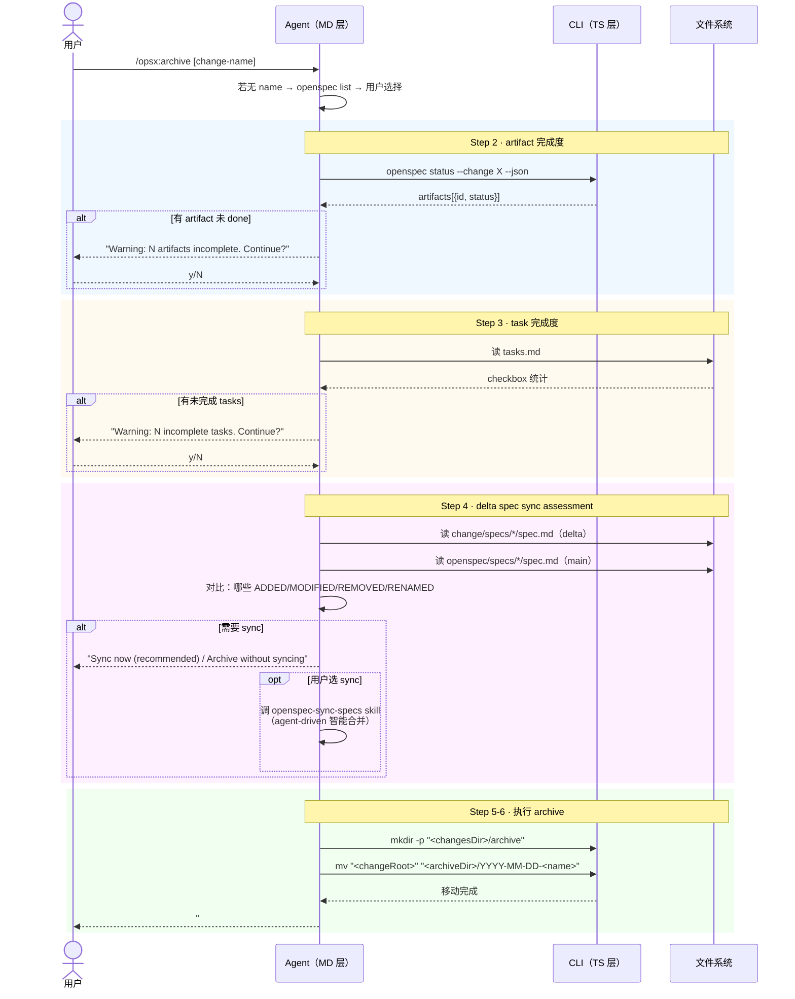

# Workflow · archive

## 源文件

`src/core/templates/workflows/archive-change.ts` → `getArchiveChangeSkillTemplate()` + `getOpsxArchiveCommandTemplate()`

> **用户怎么调**：`/opsx:archive [change-name]`（agent 模板）或 `openspec archive <name>`（CLI 命令）
> **agent 看到的名字**：`openspec-archive-change`（skill）/ `OPSX: Archive`（command）
> **独立 CLI 命令**：**有**——`openspec archive <name>` 是独立的 CLI 命令，做 programmatic validate → merge → move。`/opsx:archive` 是 agent 模板，做 pre-flight checks + agent-driven sync + 手动 mv。**两条路径不同**：CLI 做完整替换式合并，OPSX 做智能合并。
> **profile**：core（大多数用户默认可见）

## 一句话

archive 是 agent 层的收尾操作手册。它和 `openspec archive` CLI 命令不同——template 做的是 pre-flight checks（artifact 完成度、task 完成度、delta spec sync assessment），然后由 agent 执行 `mv` 移动 change 目录。它不调用 CLI 的 programmatic merge。

## CLI archive vs OPSX archive

| | `openspec archive` CLI | `/opsx:archive` template |
|---|---|---|
| 合并方式 | programmatic merge（RENAMED→REMOVED→MODIFIED→ADDED） | agent-driven sync（读 delta + main → 智能合并） |
| spec update | `buildUpdatedSpec()` → `writeUpdatedSpec()` | 调 `openspec-sync-specs` skill |
| 是否可跳过 | `--skip-specs` / `--no-validate` | 用户可选择 "Archive without syncing" |
| 谁来执行 | CLI 进程 | agent 调 `mv` 命令 |

## CLI 命令调用序列

```text
1. [可选] openspec list --json                    # 选择 change
2. openspec status --change "<name>" --json        # 检查 artifact 完成度
3. [agent 读 tasks.md]                             # 统计 checkbox
4. [agent 读 delta specs + main specs 对比]         # sync assessment
5. mkdir -p "<changesDir>/archive"                 # 创建 archive 目录
6. mv "<changeRoot>" "<archiveDir>/YYYY-MM-DD-<name>"  # 移动
```

注意：archive template **不调用** `openspec archive` CLI 命令。它自己执行 `mv`。

## 时序图



## sync assessment 的四种选项

template 规定 agent 必须做 delta spec 和 main spec 的对比分析，然后给用户选项：

| 场景 | 选项 |
|---|---|
| delta 和 main 有差异 | "Sync now (recommended)", "Archive without syncing" |
| delta 和 main 已一致 | "Archive now", "Sync anyway", "Cancel" |
| 没有 delta specs | 直接跳过，无 sync 提示 |

如果用户选 sync，agent 调 `openspec-sync-specs` skill（agent-driven merge），不是 CLI 的 `buildUpdatedSpec()`。

## 四种输出格式

| 场景 | 格式 |
|---|---|
| 成功（有 sync） | `## Archive Complete` + change/schema/location/specs: synced |
| 成功（无 delta） | `## Archive Complete` + specs: No delta specs |
| 成功（有 warning） | `## Archive Complete (with warnings)` + 列出所有 warning |
| 失败（目标已存在） | `## Archive Failed` + 原因 + 三个选项 |

## Guardrails

| Guardrail | 含义 |
|---|---|
| Always prompt for change selection | 不自动选 |
| Use artifact graph for completion checking | 不猜 |
| Don't block archive on warnings | warning 只是确认 |
| Preserve .openspec.yaml when moving | 随目录移动 |
| If sync requested, use openspec-sync-specs | agent-driven，非 CLI |
| If delta specs exist, always run sync assessment | 不跳过对比 |

## 和 FAQ 的衔接

FAQ `07_archive-ready-to-archived/` 从 CLI 主线视角分析了 programmatic merge 算法。本文件从 OPSX template 视角分析了 agent 层的 pre-flight checks。

两者的关键差异：CLI archive 是 programmatic merge（MODIFIED=完整替换），OPSX archive template 是 agent-driven sync（MODIFIED=智能合并，可只加一个 scenario）。

## 源码锚点

| 内容 | 行号范围（archive-change.ts） |
|---|---|
| SkillTemplate 定义 | L10-L123 |
| CommandTemplate 定义 | L126-L286 |
| Step 2: artifact 检查 | L31-L43 |
| Step 3: task 检查 | L45-L56 |
| Step 4: sync assessment | L58-L71 |
| Step 5: 移动目录 | L73-L88 |
| Guardrails | L112-L119 |
