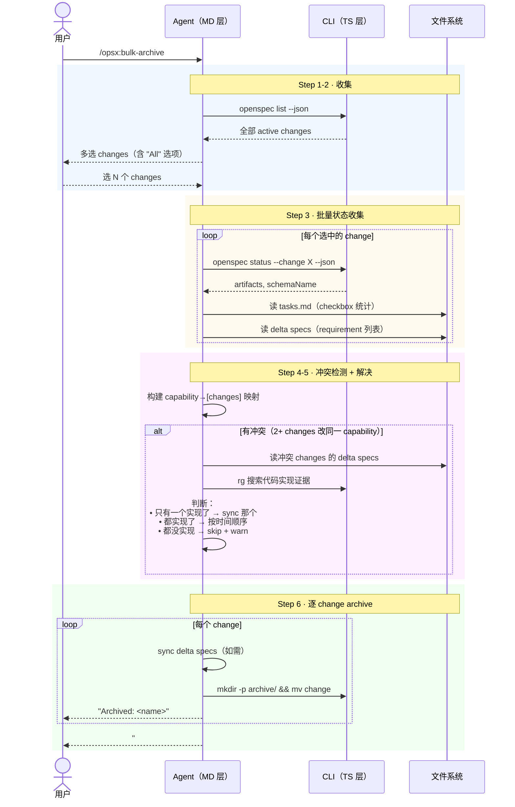

# Workflow · bulk-archive

## 源文件

`src/core/templates/workflows/bulk-archive-change.ts` → `getBulkArchiveChangeSkillTemplate()` + `getOpsxBulkArchiveCommandTemplate()`

> **调用方式**：command adapter 可为 `/opsx:bulk-archive`；Codex v1.7.0 用 `$openspec-bulk-archive-change`。下文的 `/opsx:` 仅表示前者。
> **agent 看到的名字**：`openspec-bulk-archive-change`（skill）/ `OPSX: Bulk Archive`（command）
> **独立 CLI 命令**：无——没有 `openspec bulk-archive` CLI 命令。这是纯 agent 模板，批量编排 archive + sync + 冲突解决。
> **profile**：custom（需显式启用，不在默认 core 里）

## 一句话

bulk-archive 是 archive 的批量版。它的核心复杂度不在单个 merge 算法，而在**冲突检测和解决**：当多个 changes 同时触达同一个 capability 的 delta spec 时，agent 需要读真实代码来判断"到底哪个 change 的实现真正落地了"。

## 和 archive 的关键区别

| | archive | bulk-archive |
|---|---|---|
| change 数量 | 1 个 | 2+ 个 |
| 核心挑战 | sync assessment | **跨 change 冲突检测 + 解决** |
| spec 冲突 | 不存在（只有一个 change） | 2+ changes 改同一个 capability |
| 冲突解决方式 | N/A | agent 读代码判断谁真正实现了 |

## CLI 命令调用序列

```text
1. openspec list --json                          # 获取全部 active changes
2. [用户多选 changes]
3. for each change:
   a. openspec instructions archive --change "<name>" --json # context / archive guidance
   b. openspec status --change "<name>" --json   # artifact 状态（done / skipped 都满足）
   c. [读 tasks.md]                              # task 完成度
   d. [读 artifactPaths.specs.existingOutputPaths]  # delta specs
4. [冲突检测：capability → [changes]]
5. [对每个冲突：读 delta specs + 搜代码 → 判断谁实现了]
6. [对每个 change：archive（sync + mv）]
```

## 时序图



## 冲突解决的三种策略

template 规定 agent 必须读代码来判断：

| 代码事实 | 解决方式 |
|---|---|
| 只有一个 change 的实现存在 | sync 那个 change 的 specs |
| 两个都实现了 | 按时间顺序（旧→新），后者覆盖 |
| 都没实现 | 跳过 spec sync，warn 用户 |

这体现了 OpenSpec 的核心工程思想：**代码是最终事实源**。当 delta specs 冲突时，不看谁写得好，看谁的代码真正存在。

## Guardrails

| Guardrail | 含义 |
|---|---|
| Always show what will happen before executing | 预览变更 |
| Detect and resolve spec conflicts agentically | 不盲合并 |
| Report partial failures clearly | 一个失败不阻塞其他 |
| Don't auto-select changes | 用户必须显式选 |
| Read each selected change's archive inputs | context/guidance 是 prompt input，不改变批量选择或确定性检查 |

## 源码锚点

| 内容 | 行号范围（bulk-archive-change.ts） |
|---|---|
| SkillTemplate 定义 | L10-L132 |
| CommandTemplate 定义 | L135+ |
| Step 3: 批量状态收集 | L39-L53 |
| Step 4: 冲突检测 | L55-L63 |
| Step 5: 冲突解决 | L65-L79 |
