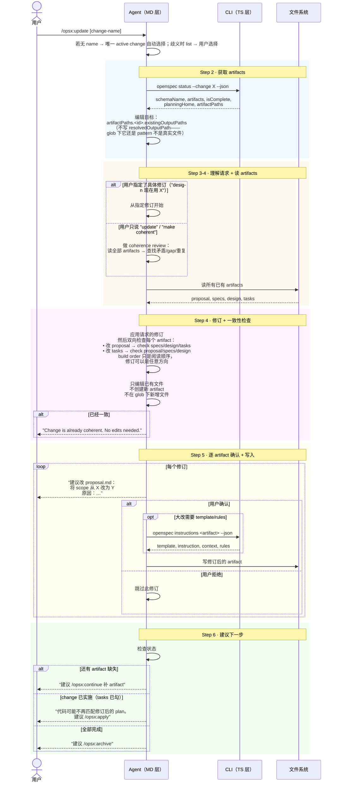

# Workflow · update

## 源文件

`src/core/templates/workflows/update-change.ts` → `getUpdateChangeSkillTemplate()` + `getOpsxUpdateCommandTemplate()`

> **调用方式**：command adapter 可为 `/opsx:update [change-name]`；Codex v1.8.0 用 `$openspec-update-change`。下文的 `/opsx:` 仅表示前者。
> **agent 看到的名字**：`openspec-update-change`（skill）/ `OPSX: Update`（command）
> **独立 CLI 命令**：无——update 是纯 agent 模板，修订已有 planning artifacts，不改代码。
> **profile**：custom（需显式启用，不在默认 core 里）
> **引入版本**：v1.6.0

## 一句话

update 是 **planning artifact 修订器**。它不改代码，只修订已有的 proposal/specs/design/tasks，并且保证修订后 artifact 之间保持一致。它填补了 "Explore 里做了决策 → 需要更新 artifacts" 和 "Apply 中发现 design 问题 → 需要回修 artifacts" 这两个场景的官方 workflow 空白。

## 和 continue / propose 的根本区别

| | propose | continue | update |
|---|---|---|---|
| 创建新 change？ | 会 | 不创建 | 不创建 |
| 创建新 artifact？ | 会（全部） | 会（一个） | **不会**——只修订已有 |
| 修订已有 artifact？ | 不会 | 不会 | **会** |
| 会读 instructions？ | 每轮都读 | 创建前读 | 只有大改时才读 |
| 需要用户确认？ | 不需要 | 不需要 | **每次修改前必须确认** |

## CLI 命令调用序列

```text
1. [可选] 显式名称 → 对话推断 → 唯一 active change 自动选择；仅歧义时 `openspec list --json`
2. openspec status --change "<name>" --json  # 获取 artifactPaths + planningHome
3. [agent 读全部已有 artifacts]
4. [agent 做修订 + 检查一致性]
5. [可选] openspec instructions <artifact> --change "<name>" --json  # 仅大改时
6. [逐 artifact 展示修订 → 用户确认 → 写入]
```

注意：update **不使用** `openspec new change`。它操作的是已有 change 的已有文件。

## 时序图



## 关键 guardrail：只编已有文件，不推进 build frontier

update 最核心的约束是：

```text
Revise only files that already exist (existingOutputPaths)
Do NOT create artifacts that don't exist yet
Do NOT invent new files under a glob artifact
→ point to /opsx:continue for those
```

这把它和 continue 的职责切得很清：**continue 推进 build frontier（创建新 artifact），update 只在已有 frontier 内修订。**

## 和 `05_iterate-to-apply-ready` 的关系

我们 `_faq_on_digested/05_iterate-to-apply-ready/` 描述的迭代循环：

```text
Explore 审视 artifacts → 发现 gap → 修 gap → 再审
```

v1.6.0 引入、在 v1.7.0 仍可用的 update workflow，就是这个循环中**"修 gap"**步骤的官方 workflow。它提供了：

- artifact 修订的正式操作协议（读→改→一致性检查→确认→写）
- "update vs start fresh" 判断（修改意图 vs 精炼细节）
- 和 continue/apply/archive 的衔接路径

## Guardrails

| Guardrail | 含义 |
|---|---|
| Planning artifacts only — NEVER edit code | 如果修订暗示代码变更，停止并指向 `/opsx:apply` |
| Use artifact ids from `openspec status`, never hardcode | schema-agnostic |
| Edit only `existingOutputPaths`, not `resolvedOutputPath` | glob artifact 的 resolvedOutputPath 还是 pattern |
| Do not advance build frontier | 不创建新 artifact/文件 |
| Confirm every edit with user before writing | 每次修改都要确认 |
| If request changes intent → recommend `/opsx:new` | "Update vs. Start Fresh" 判断 |

## 源码锚点

| 内容 | 行号范围（update-change.ts） |
|---|---|
| SkillTemplate 定义 | L10-L99 |
| CommandTemplate 定义 | L101-L200 |
| Step 2: 获取 artifacts | L33-L44 |
| Step 3: 理解请求 | L46-L49 |
| Step 4: 读 + 修订 + 一致性 | L51-L58 |
| Step 5: 确认 + 写入 | L60-L66 |
| Step 6: 建议下一步 | L68-L72 |
| Guardrails | L82-L87 |
