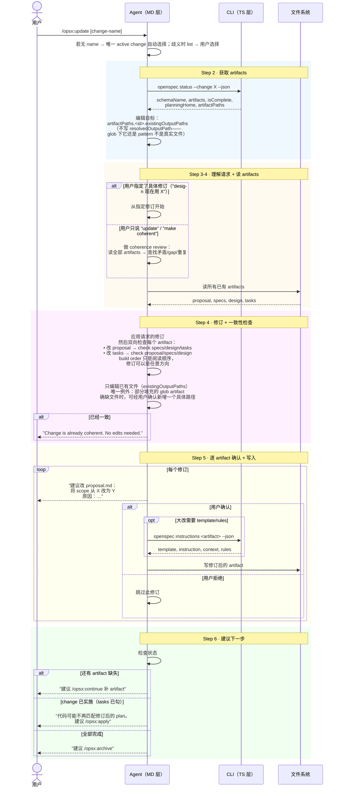

# Workflow · update

## 源文件

`src/core/templates/workflows/update-change.ts` → `getUpdateChangeSkillTemplate()` + `getOpsxUpdateCommandTemplate()`

> **调用方式**：command adapter 可为 `/opsx:update [change-name]`；Codex 用 `$openspec-update-change`。下文的 `/opsx:` 仅表示前者。
> **agent 看到的名字**：`openspec-update-change`（skill）/ `OPSX: Update`（command）
> **独立 CLI 命令**：无——update 是纯 agent 模板，修订已有 planning artifacts，不改代码。
> **profile**：custom（需显式启用，不在默认 core 里）

## 一句话

update 是 **planning artifact 修订器**。它不改代码，只修订已有的 proposal/specs/design/tasks，并且保证修订后 artifact 之间保持一致。它填补了 "Explore 里做了决策 → 需要更新 artifacts" 和 "Apply 中发现 design 问题 → 需要回修 artifacts" 这两个场景的官方 workflow 空白。

## 和 continue / propose 的根本区别

| | propose | continue | update |
|---|---|---|---|
| 创建新 change？ | 会 | 不创建 | 不创建 |
| 创建新 artifact？ | 会（全部） | 会（一个） | **不会**——只修订已有（唯一例外见下方 build frontier 一节） |
| 修订已有 artifact？ | 不会 | 不会 | **会** |
| 会读 instructions？ | 每轮都读 | 创建前读 | 只有大改时才读 |
| 需要用户确认？ | 不需要 | 不需要 | **每次修改前必须确认** |

## CLI 命令调用序列

```text
1. [可选] 显式名称 → 对话推断 → 唯一 active change 自动选择；仅歧义时 `openspec list --json`
2. openspec status --change "<name>" --json  # 获取 artifactPaths + planningHome
3. [agent 读全部已有 artifacts]
4. [agent 做修订 + 检查一致性]
5. [可选] openspec instructions <artifact> --change "<name>" --json  # 仅大改时
6. [逐 artifact 展示修订 → 用户确认 → 写入]
```

注意：update **不使用** `openspec new change`。它操作的是已有 change 的已有文件。

## 时序图


```mermaid
sequenceDiagram
    actor User as 用户
    participant MD as Agent（MD 层）
    participant TS as CLI（TS 层）
    participant FS as 文件系统

    User->>MD: /opsx:update [change-name]
    MD->>MD: 若无 name → 唯一 active change 自动选择；歧义时 list → 用户选择

    rect rgb(240, 248, 255)
        Note over MD,FS: Step 2 · 获取 artifacts
        MD->>TS: openspec status --change X --json
        TS-->>MD: schemaName, artifacts, isComplete,<br/>planningHome, artifactPaths
        MD->>MD: 编辑目标：<br/>artifactPaths.<id>.existingOutputPaths<br/>（不写 resolvedOutputPath——<br/>glob 下它还是 pattern 不是真实文件）
    end

    rect rgb(255, 250, 240)
        Note over MD,FS: Step 3-4 · 理解请求 + 读 artifacts
        alt 用户指定了具体修订（"design 现在用 X"）
            MD->>MD: 从指定修订开始
        else 用户只说 "update" / "make coherent"
            MD->>MD: 做 coherence review：<br/>读全部 artifacts → 查找矛盾/gap/重复
        end
        MD->>FS: 读所有已有 artifacts
        FS-->>MD: proposal, specs, design, tasks
    end

    rect rgb(255, 240, 255)
        Note over MD,FS: Step 4 · 修订 + 一致性检查
        MD->>MD: 应用请求的修订<br/>然后双向检查每个 artifact：<br/>• 改 proposal → check specs/design/tasks<br/>• 改 tasks → check proposal/specs/design<br/>build order 只是阅读顺序，<br/>修订可以是任意方向
        MD->>MD: 只编辑已有文件（existingOutputPaths）<br/>唯一例外：部分填充的 glob artifact<br/>确缺文件时，可经用户确认新增一个具体路径
        alt 已经一致
            MD-->>User: "Change is already coherent. No edits needed."
        end
    end

    rect rgb(255, 255, 240)
        Note over MD,FS: Step 5 · 逐 artifact 确认 + 写入
        loop 每个修订
            MD-->>User: "建议改 proposal.md：<br/>将 scope 从 X 改为 Y<br/>原因：…"
            alt 用户确认
                opt 大改需要 template/rules
                    MD->>TS: openspec instructions <artifact> --json
                    TS-->>MD: template, instruction, context, rules
                end
                MD->>FS: 写修订后的 artifact
            else 用户拒绝
                MD->>MD: 跳过此修订
            end
        end
    end

    rect rgb(240, 255, 240)
        Note over MD,FS: Step 6 · 建议下一步
        MD->>MD: 检查状态
        alt 还有 artifact 缺失
            MD-->>User: "建议 /opsx:continue 补 artifact"
        else change 已实施（tasks 已勾）
            MD-->>User: "代码可能不再匹配修订后的 plan。<br/>建议 /opsx:apply"
        else 全部完成
            MD-->>User: "建议 /opsx:archive"
        end
    end
```

## 关键 guardrail：只编已有文件，不推进 build frontier

update 最核心的约束是（模板原文口径）：

```text
Do not advance the build frontier: if an artifact has empty existingOutputPaths
and status ready or blocked, that is /opsx:continue's job. Leave skipped
artifacts untouched. The only new-file scope is a confirmed concrete path under
a glob artifact whose existingOutputPaths is non-empty.
```

即**不推进 build frontier**：`existingOutputPaths` 为空且状态 `ready`/`blocked` 的 artifact 一律交给 continue；`skipped` 的不动。唯一的建新文件口子是：某个 glob artifact 已有部分文件、一致性检查发现确缺一个文件时，可以先起草 → 用户确认 → 在 `changeRoot` 内选一个不存在的具体路径创建（创建前刷新 status/instructions 复核，仍不得用 glob `resolvedOutputPath` 当目标）。**continue 推进 build frontier（创建新 artifact），update 只在已有 frontier 内修订**——外加这个狭窄的、需确认的补口。

## 和 `05_iterate-to-apply-ready` 的关系

我们 `_faq_on_digested/05_iterate-to-apply-ready/` 描述的迭代循环：

```text
Explore 审视 artifacts → 发现 gap → 修 gap → 再审
```

update workflow，就是这个循环中**"修 gap"**步骤的官方 workflow。它提供了：

- artifact 修订的正式操作协议（读→改→一致性检查→确认→写）
- "update vs start fresh" 判断（修改意图 vs 精炼细节）
- 和 continue/apply/archive 的衔接路径

## update 的工具侧行为补强

注意区分**两层 update**：`update-change.ts`（本文：agent 修订 planning artifact 的 workflow）与 `src/core/update.ts`（`openspec update`：把 CLI 的 skills/commands 同步到工具侧文件系统）。下面两条属于后者，但影响同一份文档的读者：

- **共享 IDE restart 提示**：`openspec init` 和 `openspec update` 共用 `src/core/shared/ide-restart.ts` 的同一句提示（`Restart your IDE to refresh commands.` / `...skills.`），message 也覆盖「移除 workflow」场景，不再声称生成了新文件。
- **损坏 command 文件检测**：`openspec update` 之前只比对 skill 文件的 `generatedBy` 版本戳——skill 是新版本就报「All up to date」，但旁边手改/截断的 command 文件完全没被检查。现在也比对 command 文件内容（只针对 skills+commands 都配置的工具；commands-only 路径不变），`--force` 之外多了一条自动修复路径。
- **遗漏 workflow 提示**：init/update 输出用 `formatOptionalWorkflowsNote` 列出 profile 没装的 workflow（`new`、`continue`、`ff`、`bulk-archive`、`verify`、`onboard`）和 `openspec config profile` 命令。
- **工具目标大扩容**：`--tools` 新增 10 个目标——`dsh`（DeepSeek Harness，skills-only，项目级 `.dsh/skills/`）、`codestudio`（skills + `.prompt.md` 命令）、`gigacode`（Markdown 命令 `opsx-<id>.md`）、`atomcode`（Markdown 命令 `/opsx-<id>`，按 workflow 是否读输入声明 `args: optional`/`args: none`）、`easycode`（TOML 命令 `/opsx:<id>`，新共享模块 `src/core/command-generation/toml.ts`）、`gsd` 与 `amp`（与 Codex/Zed/Antigravity 共享 `.agents` root，detection 分别靠 `.gsd`/`.amp`）、`grok`、`warp`、`veai`（均 skills-only）。全部注册在 `src/core/config.ts` 的 `AI_TOOLS`；shared `.agents` root 成员扩为六方。IBM Bob 显示名改为 "IBM Bob"（tool id `bob` 与 `.bob` 路径不变）。命令形态与 detection 细节见 [`../mechanisms/02-tool-delivery.md`](../mechanisms/02-tool-delivery.md)。
- **Kilo Code 目录修正**：`openspec init`/`update` 的命令文件写到 `.kilo/command/opsx-<id>.md`（此前错写在 `.kilocode/workflows/`）；legacy cleanup 按已知文件名清走两代旧文件。

## Guardrails

| Guardrail | 含义 |
|---|---|
| Planning artifacts only — NEVER edit code | 如果修订暗示代码变更，停止并指向 `/opsx:apply` |
| Use artifact ids from `openspec status`, never hardcode | schema-agnostic |
| Edit only `existingOutputPaths`, not `resolvedOutputPath` | glob artifact 的 resolvedOutputPath 还是 pattern |
| Do not advance build frontier | 不创建新 artifact；唯一例外是部分填充 glob 下经用户确认补一个具体路径文件 |
| Confirm every edit with user before writing | 每次修改都要确认 |
| If request changes intent → recommend `/opsx:new` | "Update vs. Start Fresh" 判断 |

## 源码锚点

| 内容 | 行号范围（update-change.ts） |
|---|---|
| continue/apply/archive/new 的 optionalWorkflow handoff 常量 | L18-L74 |
| SkillTemplate 定义 | L76-L172 |
| CommandTemplate 定义 | L174-L269 |
| Step 2: 获取 artifacts | L108-L120 |
| Step 3: 理解请求 | L122-L124 |
| Step 4: 读 + 修订 + 一致性（含 glob 补文件协议） | L126-L137 |
| Step 5: 确认 + 写入 | L139-L146 |
| Step 6: 建议下一步 | L148-L151 |
| Guardrails | L161-L167 |

## v1.13.1 行为更新

**draft-then-write（`fede536c`）**：`/opsx:update` 现在把请求的修订先起草（step 4），经用户确认后才写入（step 5）。与 explore 的 capture 确认同属一轮「写前确认」护栏收紧。
