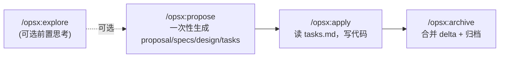
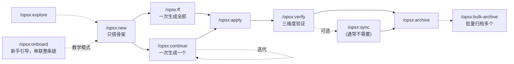
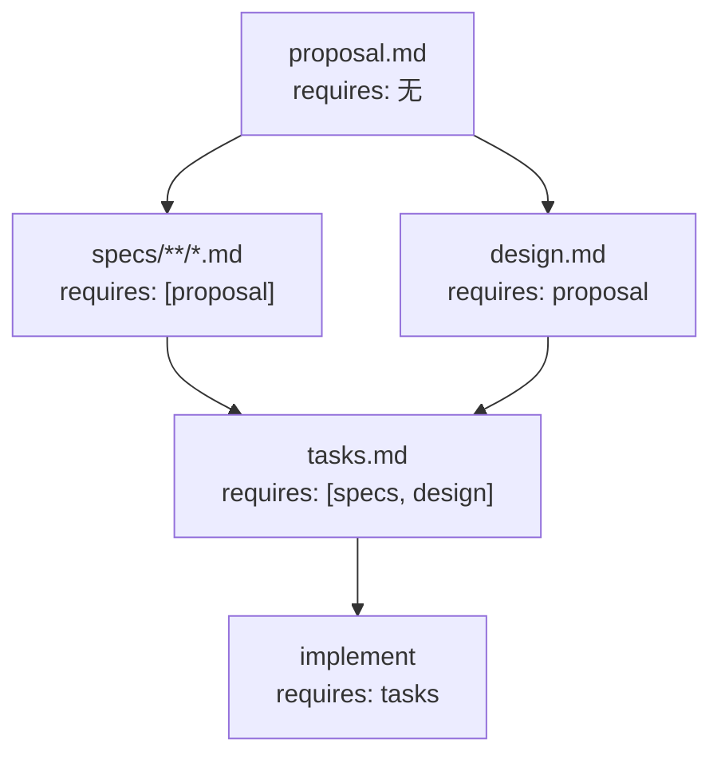
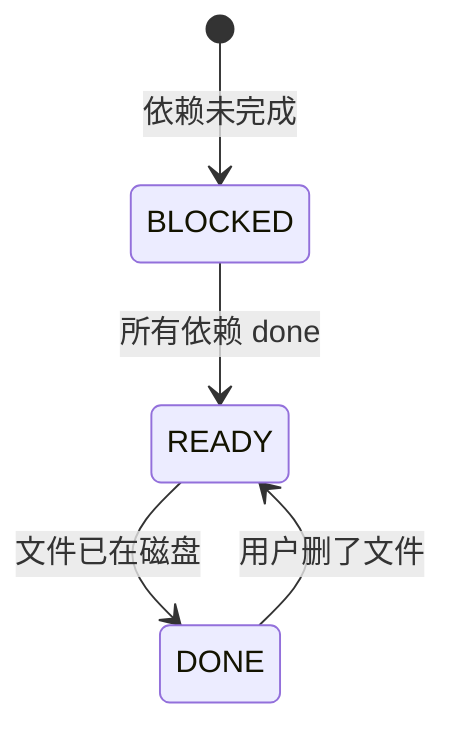
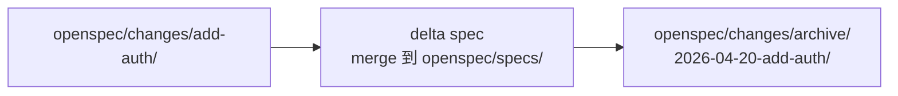

# 命令次序流程图

## 1. Core 路径（默认）



**典型会话**：
```text
/opsx:explore                → 先想清楚（不产文件）
/opsx:propose add-dark-mode  → 自动生成四件套
/opsx:apply                  → 写代码
/opsx:archive                → 搬到 changes/archive/
```

## 2. Expanded 路径（完整 11 个命令）



## 3. Artifact 依赖 DAG（`spec-driven` schema）

这是 artifact 之间的 **依赖**，不是命令执行顺序。依赖是 enabler，不是 gate——解锁后你想什么时候建都行。



**特性**：
- `specs` 和 `design` 可以**并行**建（都只依赖 proposal）
- `tasks` 必须等 specs 和 design 都 done 才 ready
- 整个 apply 阶段需要 `tasks` 存在

## 4. Artifact 状态机



状态判定源码在 [src/core/artifact-graph/state.ts](../../src/core/artifact-graph/state.ts)，核心逻辑是**看文件系统里有没有对应产物**（`generates` 字段指定的 glob），而不是依靠某种阶段标记。

## 5. 归档生命周期



- `/opsx:sync` 只做左边这步（合并 delta 但不搬目录）
- `/opsx:archive` 默认做两步（会问你是否先 sync）
- `/opsx:bulk-archive` 同时对多个 change 做这个事，会检测冲突
