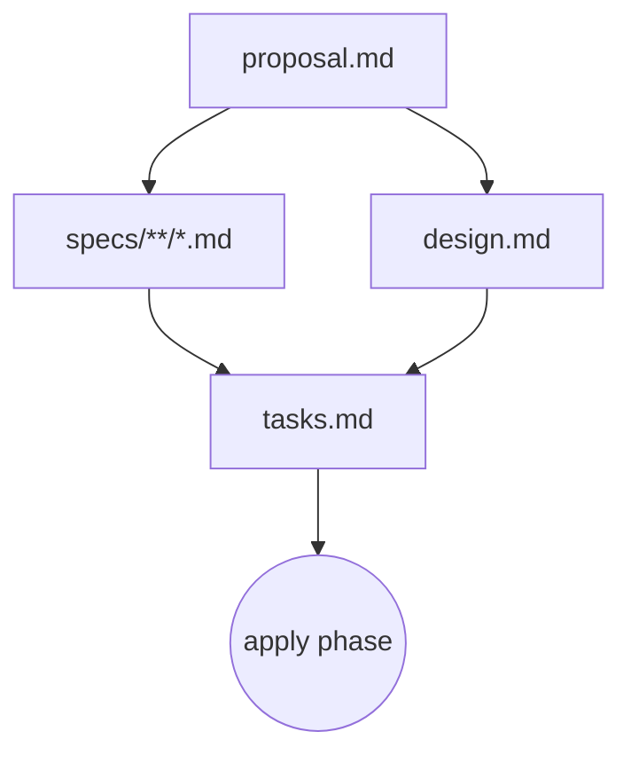
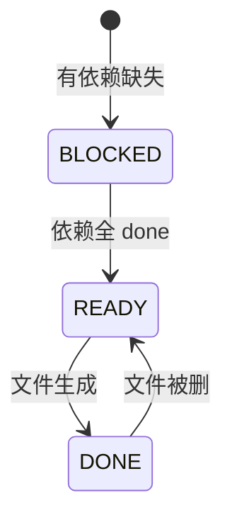

# Artifact 依赖图（DAG）

## Schema 决定 DAG 结构

一个 **schema** 定义了一个 workflow 里有哪些 artifact、它们怎么依赖。默认 schema 是 `spec-driven`，结构如下（[schemas/spec-driven/schema.yaml](../../schemas/spec-driven/schema.yaml)）：

```yaml
name: spec-driven
artifacts:
  - id: proposal
    generates: proposal.md
    requires: []
  - id: specs
    generates: "specs/**/*.md"
    requires: [proposal]
  - id: design
    generates: design.md
    requires: [proposal]
  - id: tasks
    generates: tasks.md
    requires: [specs, design]

apply:
  requires: [tasks]
  tracks: tasks.md
```

## 四种 artifact 的职责

| Artifact | 职责 | 文件 | 依赖 |
|----------|------|------|------|
| `proposal` | **Why + What**：要解决什么问题、scope、high-level approach | `proposal.md` | — |
| `specs` | **What changes**：delta spec（ADDED / MODIFIED / REMOVED / RENAMED）| `specs/<domain>/spec.md` | proposal |
| `design` | **How**：技术方案、架构决策、trade-offs | `design.md` | proposal |
| `tasks` | **Steps**：可勾选的实施清单 | `tasks.md` | specs + design |

`apply` 阶段不是 artifact，而是**消费 artifact** 的动作——需要 `tasks.md` 存在，进度靠 checkbox 追踪。

## DAG 可视化



**关键**：`specs` 和 `design` 是**并行**的（都只依赖 proposal）。

## 三种状态

artifact 的状态完全由文件系统决定（[src/core/artifact-graph/state.ts](../../src/core/artifact-graph/state.ts)）：

| 状态 | 含义 |
|------|------|
| `done` | 文件（或 glob 匹配的文件）已存在 |
| `ready` | 所有依赖都 `done`，但本身文件还没生成 |
| `blocked` | 有依赖还没 `done` |

### 状态机



## 依赖是 enabler 不是 gate

这是 OPSX 最重要的设计原则——`requires` 告诉你「现在可以做什么了」，**不是**「必须先做什么」。

落地含义：
- `specs` ready 后可以建，也可以先建 `design`（两者并行）
- 已建好的 artifact 可以**随时回改**（DONE → READY 不会有副作用）
- 用户可以**跳过**某些 artifact（比如简单改动跳过 design，但这样 tasks 就一直 blocked，需要改 schema 或人为决定不要 tasks）

## agent 怎么用这个图

典型的 `/opsx:continue` 流程：

1. 跑 `openspec status --json` 拿到所有 artifact 的状态
2. 选第一个 `ready` 的 artifact
3. 跑 `openspec instructions <artifact> --json` 拿模板 + 依赖内容 + rules
4. 读依赖 artifact 的文件（传给 AI 当 context）
5. 生成新 artifact 并写盘
6. 再跑一次 `status`，告诉用户「下一步解锁了什么」

这个「查询式、增量式」的范式是 OPSX 的核心与 legacy 的根本区别。

## 引擎实现

源码目录：[src/core/artifact-graph/](../../src/core/artifact-graph/)

- `graph.ts` — DAG 数据结构
- `instruction-loader.ts` — 加载模板 + 注入 context/rules
- `outputs.ts` — 解析 `generates` 字段（支持 glob）
- `resolver.ts` — schema 文件解析（project → user → package）
- `schema.ts` — schema.yaml 解析 + 校验
- `state.ts` — 状态判定
- `types.ts` — TypeScript 类型
