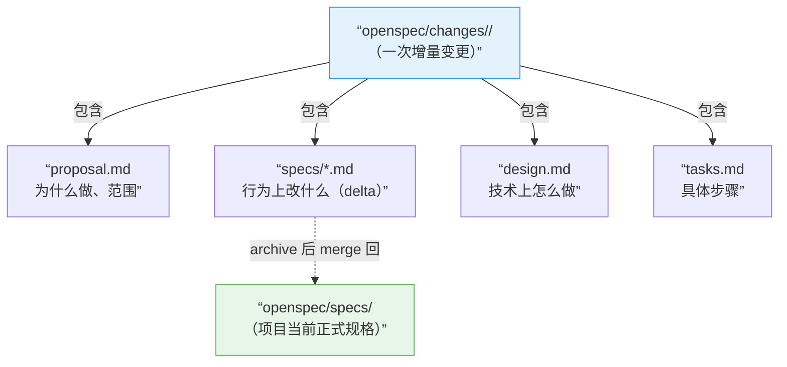
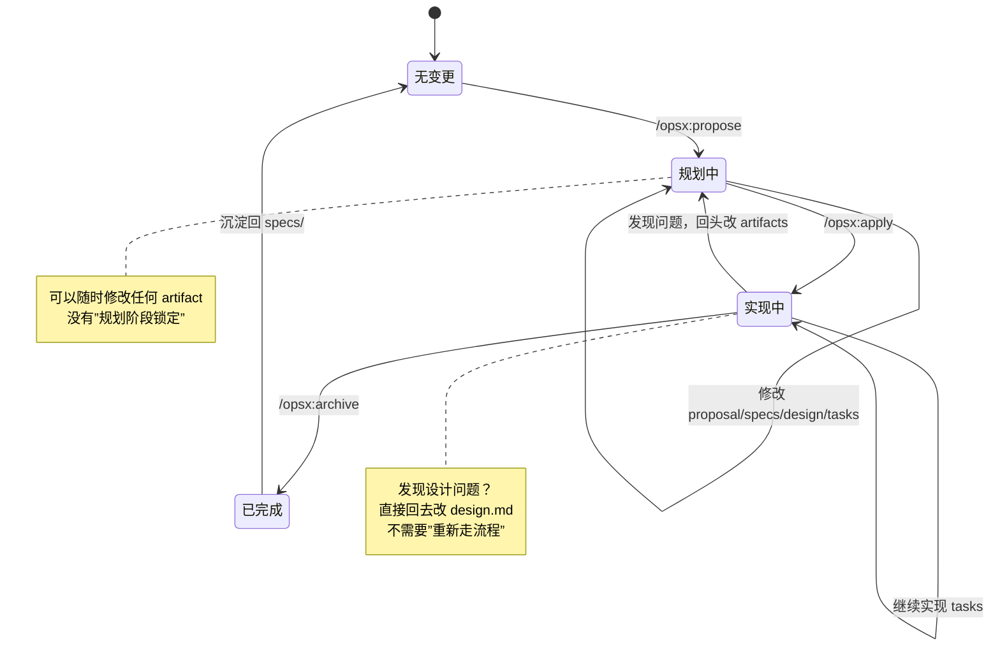

# 02 · 中级：把核心概念真正串起来

> 这一篇解决的不是”怎么按命令用”，而是”OpenSpec 到底在管理什么”。

---

## 先抓住主轴

很多人读 OpenSpec 会乱，不是因为文档不够多，而是因为主轴抓晚了。

最该先抓住的不是 `schema`，也不是 skill，而是这条线：



换句话说：

> **OpenSpec 的核心不是”生成几份文档”，而是”围绕项目当前规格，管理一次次增量变更”。**

---

## 先抓住主轴

## `specs/` 和 `changes/` 到底是什么关系

### `openspec/specs/`

这是**当前正式规格**。

它表达的是：

- 这个项目现在承诺了什么行为
- 当前系统的能力边界是什么
- 后续所有 change 该以什么为基线继续修改

所以它更像：

- 当前能力合同
- 项目行为基线
- source of truth

### 新手最常问：specs/ 一开始是空的吗？要手动写吗？

**答案：一开始是空的，不需要手动写。**

很多人误以为要先手动写一份完整的系统规格，其实不是：

1. `openspec init` 后，specs/ 是空的
2. 你做第一个 change（比如 `/opsx:propose add-login`）
3. change 里会生成 delta spec（描述这次加了什么）
4. `/opsx:archive` 后，delta spec 自动 merge 到 specs/
5. 这时 specs/ 才有了第一份内容

**关键**：specs/ 是"长出来的"，不是"一开始写完的"。

### `openspec/changes/`

这是**变更工作区**。

每一个 change 文件夹，都是“针对当前正式规格的一次增量改动”。

所以它更像：

- 一次完整改动的工作包
- 一次迭代的文档容器
- 正式规格的 patch 工作区

### 它们的关系

```text
specs/    = 现在系统是什么
changes/  = 这次准备把它改成什么样
```

archive 之后：

```text
changes/<name>/specs/...  ──merge──>  openspec/specs/...
```

这就是 OpenSpec 最关键的设计点。

### 新手最常问：archive 的 merge 是自动的还是手动的？

**答案：自动的。**

当你运行 `/opsx:archive add-dark-mode` 时：

1. OpenSpec CLI 自动读取 `changes/add-dark-mode/specs/` 里的 delta spec
2. 自动解析 ADDED/MODIFIED/REMOVED 标记
3. 自动更新 `openspec/specs/` 里对应的文件
4. 自动把 change 移到 `changes/archive/`

**你不需要**：
- 手动复制粘贴
- 手动合并冲突（如果有冲突，CLI 会提示）
- 手动更新 specs/

**你只需要**：
- 确保 delta spec 写对了（ADDED/MODIFIED/REMOVED 标记正确）
- 运行 archive 命令

---

## artifact 到底是什么

artifact 不是“附件”，而是一次 change 内部的几类产物。

默认最常见的 4 个是：

| artifact | 作用 | 你可以把它理解成 |
|----------|------|------------------|
| `proposal` | 为什么做、范围是什么 | 变更立项说明 |
| `specs` | 行为上改什么 | 需求/行为变更合同 |
| `design` | 技术上怎么做 | 技术方案 |
| `tasks` | 具体怎么一步步落地 | 施工清单 |

它们的顺序，不是僵硬流程，而是一种自然的信息展开：

```text
proposal  →  specs  →  design  →  tasks  →  implement
```

简单说：

- `proposal` 回答“为什么改”
- `specs` 回答“行为上改什么”
- `design` 回答“技术上怎么实现”
- `tasks` 回答“具体先做哪几步”

---

## delta spec 为什么是 OpenSpec 的关键

如果没有 delta spec，OpenSpec 只是一套”AI 帮你写 planning 文档”的工具。

真正让它变得有意思的，是它不是每次重写整份规格，而是写”增量修改”。

### delta spec 的意思

change 里的 `specs/**/*.md`，不是一份全新的正式规格。

它表达的是：

- 新增什么要求
- 修改什么要求
- 删除什么要求
- 必要时重命名什么要求

通常你会看到这样的分段：

```markdown
## ADDED Requirements
## MODIFIED Requirements
## REMOVED Requirements
```

这背后的思想非常重要：

> **OpenSpec 不是让你每次重新描述整个系统，而是让你精确描述”这次改了哪里”。**

这就特别适合老项目、增量迭代、多人并行修改。

### 反面例子：不用 delta spec 会怎样

假设你要给一个已有 20 个功能的系统新增”导出 CSV”功能。

**不用 delta spec（传统方式）**：
```markdown
# 系统规格.md（整份重写）

## 功能 1：用户登录
...（200 行）

## 功能 2：数据查询
...（150 行）

...（中间 18 个功能）

## 功能 20：数据导出
支持 PDF、Excel、CSV 三种格式  ← 这里改了，但审查者要自己找
```

问题：
- 审查者要对比整份文档才知道你改了什么
- 并行开发时容易冲突（两个人都重写了整份文档）
- 历史记录里看不出”这次变更的边界”

**用 delta spec（OpenSpec 方式）**：
```markdown
# changes/add-csv-export/specs/export.md

## MODIFIED Requirements

### REQ-EXPORT-001: 支持的导出格式
- **原来**：支持 PDF、Excel 两种格式
- **现在**：支持 PDF、Excel、CSV 三种格式
- **原因**：用户反馈需要轻量级的纯文本导出

## ADDED Requirements

### REQ-EXPORT-004: CSV 导出格式规范
- 第一行为列标题
- 使用 UTF-8 编码
- 日期格式为 YYYY-MM-DD
```

优势：
- 审查者一眼看出改了什么
- 并行开发不冲突（不同 change 改不同文件）
- 历史清晰（archive 后能看到每次变更的边界）

---

## 为什么说它是 brownfield-first

官方一直强调 `brownfield-first`，意思不是一句口号。

### 什么是 brownfield？什么是 greenfield？

```
greenfield（绿地）= 从零开始的新项目，白纸一张
brownfield（棕地）= 已有代码库，有历史包袱，需要在上面继续改
```

**现实是：90% 的软件工作都是 brownfield。**

你接手了一个跑了 3 年的电商系统，要加一个”积分兑换”功能。这就是典型的 brownfield 场景：

- 已有用户系统、订单系统、支付系统
- 已有一堆历史决策和技术债
- 你不能推倒重来，只能在上面加

OpenSpec 的真正对象，不是空白世界，而是：

- 已有代码库
- 已有行为
- 已有能力边界
- 已有一堆历史包袱

delta spec 恰好就是为这种现实工作方式设计的。

### 反面例子：greenfield 工具用在 brownfield 场景

很多 spec 工具假设你从零开始，让你先写一份完整的系统规格。

但如果你接手的是一个老项目：

- 你要先把现有系统的所有行为都写成规格（可能要几周）
- 然后才能开始描述”这次要改什么”
- 这个门槛太高，大多数团队直接放弃

OpenSpec 的做法：

- 先用 `openspec init` 建立一个空的 `specs/` 基线
- 第一个 change 可以只描述”这次要改的那一块”
- 随着时间推移，`specs/` 会逐渐丰富
- 不需要一开始就把整个系统都写完

---

## “Actions, not phases” 到底是什么意思

OpenSpec 还有一句特别重要的话：

> **Actions, not phases**

意思是：

- `propose`、`apply`、`archive` 是动作
- 不是把你永远锁死的阶段

### 用状态机理解 OpenSpec 工作流



这意味着：

- 你可以先生成 proposal，再回头补 specs
- 你可以在实现过程中发现 design 不对，再回改 design
- 你可以边做边修正，而不是一旦进入 implementation 就再也不能改 planning

这和传统那种”规划阶段结束了，接下来只能执行”的思路很不一样。

---

## 中级阶段最该分清的 4 组边界

### 1. `specs` vs change 里的 `specs`

- 前者是正式基线
- 后者是这次变更的 delta

### 2. artifact vs workflow

- artifact 是文件产物类型
- workflow 是你在工具里触发的动作

### 3. change vs task

- change 是一次完整工作
- task 只是 change 里的实施步骤

### 4. 项目事实 vs 工具入口

- `openspec/` 里大多是项目事实层
- `.cline/`、`.claude/` 这类更多是工具入口层

---

## 读到这里，先不要急着钻机器层

现在还不急着问：

- skill 怎么发现
- command 怎么生成
- `openspec instructions --json` 怎么喂给 agent

这些属于“机器怎么跑”。

对人来说，中级阶段最重要的是先把下面这句话真正吃透：

> **OpenSpec 用 `changes/` 管增量变更，用 `specs/` 管正式规格；artifact 是 change 内部的表达层。**

---

## 下一步该看什么

如果你现在已经把：

- `specs` 和 `changes` 的关系
- artifact 的职责
- delta spec 的价值
- action vs phase 的区别

真正理顺了，那么下一步就适合看：

- [03-高级-config-schema-与项目边界.md](03-高级-config-schema-与项目边界.md)

那里才开始讲这些真正容易搅在一起的高级边界：

- `config.yaml`
- `schema`
- `.openspec.yaml`
- profile
