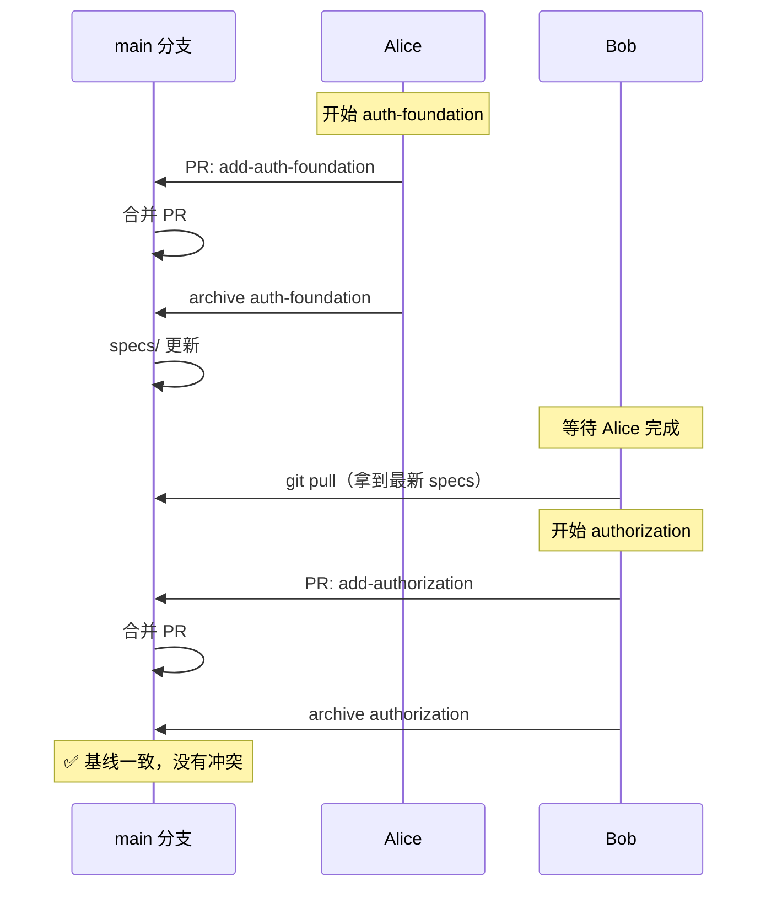
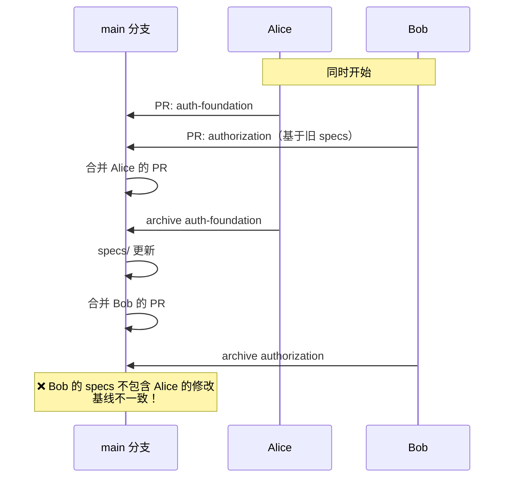
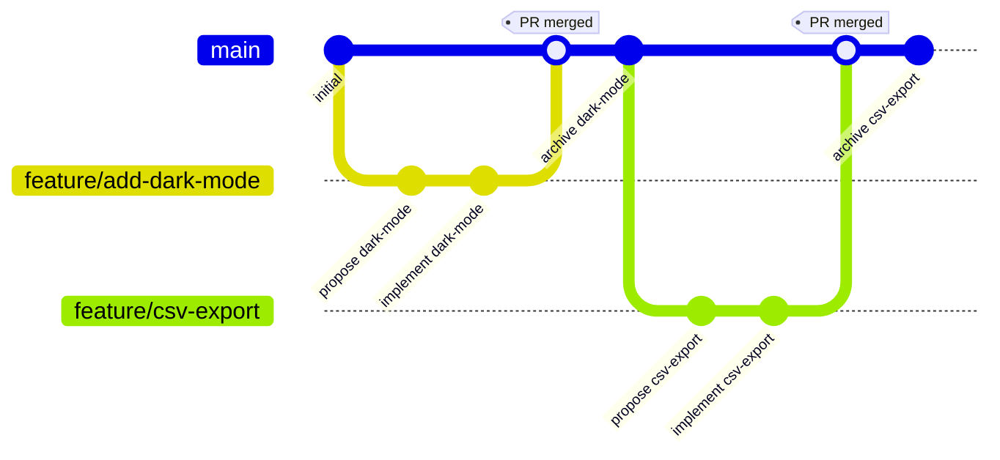
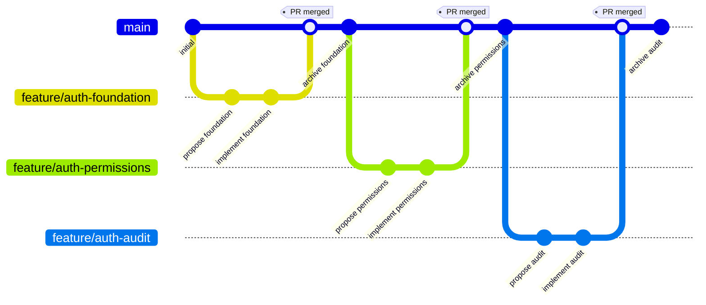
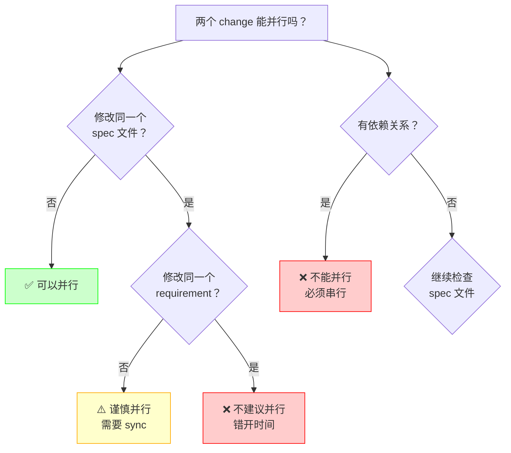
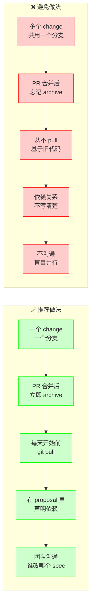
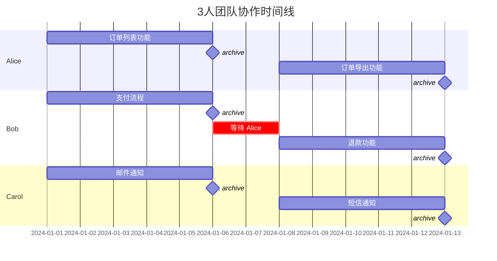
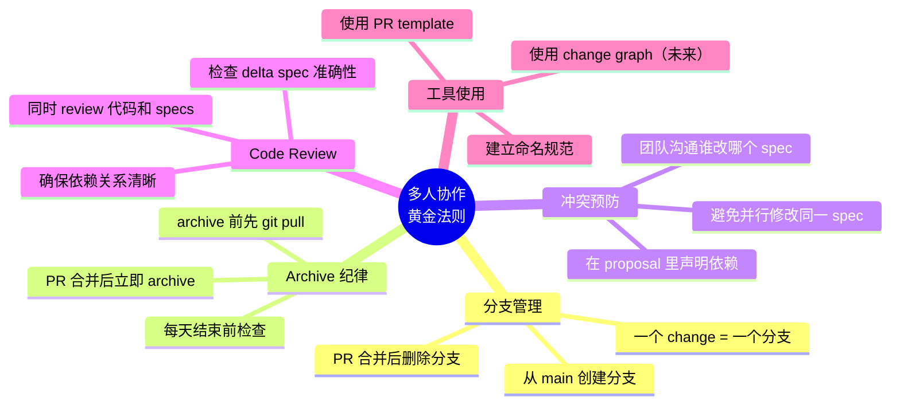

# 10 · 实战：多人协作与 Git 工作流

> 这一篇专门讲多人团队使用 OpenSpec + Git 时的最佳实践和协作流程。

---

## 为什么多人协作需要特别注意

OpenSpec 的设计天然支持多人协作，但如果不了解最佳实践，容易遇到这些问题：

| 问题 | 表现 | 后果 |
|------|------|------|
| **并行修改同一个 spec** | 两个 change 都修改 `specs/auth/spec.md` | archive 时冲突，需要手动合并 |
| **change 依赖关系不清** | change B 依赖 change A 的结果 | B 先 archive 会导致基线不一致 |
| **Git 分支策略混乱** | 不知道 change 和 Git 分支怎么对应 | 代码和 specs 不同步 |
| **archive 顺序错误** | 后 archive 的覆盖了先 archive 的 | 丢失已完成的工作 |

---

## 核心原则：一个 change = 一个 Git 分支

**最佳实践**：

```
Git 分支                    OpenSpec change
────────────────────────    ────────────────────────────
feature/add-dark-mode  ←→  changes/add-dark-mode/
bugfix/fix-login       ←→  changes/fix-login-redirect/
feature/csv-export     ←→  changes/add-csv-export/
```

**为什么这样做**：
- 代码和 specs 保持同步
- Git 的分支管理能力可以直接用于 change 管理
- PR review 时可以同时看到代码和 specs 的变化
- 回滚时代码和 specs 一起回滚

---

## 标准协作流程（推荐）

### 场景 1：独立功能，无依赖

**团队成员 A**：做深色模式
**团队成员 B**：做 CSV 导出

这两个功能互不依赖，可以完全并行。

#### 成员 A 的工作流

```bash
# 1. 创建 Git 分支
git checkout -b feature/add-dark-mode

# 2. 在 Cline 里发起 change
/opsx:propose add-dark-mode

# 3. 实现功能
/opsx:apply add-dark-mode

# 4. 提交代码和 specs
git add openspec/changes/add-dark-mode/
git add src/  # 实际代码改动
git commit -m "Add dark mode support"

# 5. 推送并创建 PR
git push -u origin feature/add-dark-mode
gh pr create --title "Add dark mode"

# 6. PR 合并后，archive change
git checkout main
git pull
/opsx:archive add-dark-mode

# 7. 提交 archive 结果
git add openspec/specs/
git add openspec/changes/archive/
git commit -m "Archive add-dark-mode change"
git push
```

#### 成员 B 的工作流

完全相同的流程，只是 change 名字不同。两人可以完全并行工作，互不干扰。

**关键点**：
- 各自在独立的 Git 分支上工作
- 各自的 change 修改不同的 spec 文件
- archive 顺序无所谓（因为没有依赖）

### 可视化：并行开发的正确姿势

```mermaid
graph TB
    subgraph 正确做法 ✅
    A1[main 分支] --> B1[Alice: feature/dark-mode]
    A1 --> C1[Bob: feature/csv-export]
    B1 --> D1[修改 specs/ui/spec.md]
    C1 --> E1[修改 specs/orders/spec.md]
    D1 --> F1[PR 合并]
    E1 --> G1[PR 合并]
    F1 --> H1[archive dark-mode]
    G1 --> I1[archive csv-export]
    H1 --> J1[main 分支更新]
    I1 --> J1
    end
    
    subgraph 错误做法 ❌
    A2[main 分支] --> B2[Alice: feature/dark-mode]
    A2 --> C2[Bob: feature/csv-export]
    B2 --> D2[修改 specs/orders/spec.md]
    C2 --> E2[修改 specs/orders/spec.md]
    D2 --> F2[冲突！]
    E2 --> F2
    end
    
    style F2 fill:#ffcccc,stroke:#ff0000
    style J1 fill:#ccffcc,stroke:#00ff00
```

---

### 场景 2：有依赖关系的功能

**成员 A**：先做用户认证基础设施
**成员 B**：基于认证做权限控制

B 依赖 A 的结果。

#### 成员 A 的工作流

```bash
# 1. 创建分支和 change
git checkout -b feature/add-auth-foundation
/opsx:propose add-auth-foundation

# 2. 实现并提交
/opsx:apply
git add openspec/changes/add-auth-foundation/
git add src/auth/
git commit -m "Add authentication foundation"
git push -u origin feature/add-auth-foundation

# 3. 创建 PR 并等待 review
gh pr create --title "Add authentication foundation"

# 4. PR 合并后立即 archive
git checkout main
git pull
/opsx:archive add-auth-foundation
git add openspec/
git commit -m "Archive add-auth-foundation"
git push
```

#### 成员 B 的工作流（依赖 A）

```bash
# 1. 等待 A 的 PR 合并和 archive 完成
# 确保 main 分支已经有了 A 的 specs

# 2. 从最新的 main 创建分支
git checkout main
git pull
git checkout -b feature/add-authorization

# 3. 发起 change（此时可以看到 A 的 specs）
/opsx:propose add-authorization

# 4. 在 proposal 里明确依赖关系
# 编辑 openspec/changes/add-authorization/proposal.md
# 添加：
## Dependencies
This change depends on `add-auth-foundation` being archived first.

# 5. 实现功能
/opsx:apply

# 6. 提交并创建 PR
git add openspec/changes/add-authorization/
git add src/auth/
git commit -m "Add authorization based on authentication"
git push -u origin feature/add-authorization
gh pr create --title "Add authorization"

# 7. PR 合并后 archive
git checkout main
git pull
/opsx:archive add-authorization
git add openspec/
git commit -m "Archive add-authorization"
git push
```

**关键点**：
- B 必须等 A archive 后再开始
- B 的 proposal 里明确写出依赖关系
- 这样可以避免基线不一致

### 可视化：依赖关系的正确处理



**错误做法**：Bob 不等 Alice，直接开始



---

### 场景 3：并行修改同一个 spec 文件（需要协调）

**成员 A**：给订单列表加过滤功能
**成员 B**：给订单列表加排序功能

两个功能都要修改 `specs/orders/spec.md`。

#### 推荐做法：错开时间

```bash
# 团队协调：A 先做，B 后做

# 成员 A
git checkout -b feature/add-order-filter
/opsx:propose add-order-filter
/opsx:apply
git add openspec/ src/
git commit -m "Add order filter"
git push -u origin feature/add-order-filter
gh pr create --title "Add order filter"

# PR 合并后立即 archive
git checkout main
git pull
/opsx:archive add-order-filter
git add openspec/
git commit -m "Archive add-order-filter"
git push

# 成员 B 等 A 完成后再开始
git checkout main
git pull  # 拿到 A 的 specs 更新
git checkout -b feature/add-order-sort
/opsx:propose add-order-sort
# ... 后续流程相同
```

#### 如果必须并行：使用 sync 命令

如果 A 和 B 必须同时开始（比如紧急需求），可以这样：

```bash
# 成员 A 和 B 同时开始
# A: feature/add-order-filter
# B: feature/add-order-sort

# A 先完成并 archive
# （A 的流程省略）

# B 在 archive 前需要 sync
git checkout feature/add-order-sort
git pull origin main  # 拉取 A 的更新

# 运行 sync 命令（未来功能，当前需要手动处理）
# openspec change sync add-order-sort

# 手动处理冲突（当前做法）
# 1. 查看 A 的 delta spec
cat openspec/changes/archive/*/add-order-filter/specs/orders/spec.md

# 2. 合并到自己的 delta spec
# 编辑 openspec/changes/add-order-sort/specs/orders/spec.md
# 确保包含 A 的修改 + 自己的修改

# 3. 提交并 archive
git add openspec/
git commit -m "Sync with add-order-filter changes"
/opsx:archive add-order-sort
```

**关键点**：
- 尽量错开时间，避免并行修改同一个 spec
- 如果必须并行，后 archive 的人要手动 sync
- 未来 OpenSpec 会提供自动 sync 命令

---

## Git 分支策略推荐

### 策略 1：Feature Branch + PR（推荐）



**优点**：
- 每个 change 独立开发和 review
- PR 可以同时 review 代码和 specs
- 主分支始终保持稳定

**工作流**：
1. 从 main 创建 feature 分支
2. 在分支上完成 change（propose → apply）
3. 提交代码 + specs，创建 PR
4. PR 合并后，在 main 上 archive
5. 提交 archive 结果

### 策略 2：Stacked Changes（高级）

适合大功能拆分成多个小 change：



**工作流**：
1. 先做 auth-foundation，PR 合并后 archive
2. 从 main 创建 auth-permissions 分支
3. 在 proposal 里声明依赖 auth-foundation
4. 依次完成并 archive

**优点**：
- 大功能可以分批 review 和上线
- 每个 change 保持小而聚焦

---

## 常见问题和解决方案

### Q1: 两个人同时 archive 了，怎么办？

**场景**：
- 成员 A archive 了 change-a
- 成员 B 同时 archive 了 change-b
- 两个 archive 都修改了 `specs/orders/spec.md`

**解决**：
```bash
# 后 push 的人会遇到 Git 冲突
git pull  # 会提示冲突

# 手动解决冲突
# 1. 打开 openspec/specs/orders/spec.md
# 2. 找到冲突标记（<<<<<<< ======= >>>>>>>）
# 3. 合并两个 change 的修改
# 4. 删除冲突标记

git add openspec/specs/orders/spec.md
git commit -m "Resolve archive conflict between change-a and change-b"
git push
```

**预防**：
- 团队约定：archive 前先 `git pull`
- 使用 PR 流程，让 archive 串行化

### Q2: 忘记 archive 就开始下一个 change 了

**场景**：
- 完成了 change-a，但忘记 archive
- 直接开始了 change-b
- change-b 看不到 change-a 的 specs

**解决**：
```bash
# 1. 先回去 archive change-a
/opsx:archive change-a
git add openspec/
git commit -m "Archive change-a (late)"
git push

# 2. 如果 change-b 已经开始，需要重新生成 specs
# 方式 1：重新 propose（如果还没写太多）
rm -rf openspec/changes/change-b/
/opsx:propose change-b

# 方式 2：手动更新 delta spec（如果已经写了很多）
# 编辑 openspec/changes/change-b/specs/
# 确保基于最新的 openspec/specs/
```

**预防**：
- 养成习惯：PR 合并后立即 archive
- 团队约定：每天结束前检查是否有未 archive 的 change

### Q3: 怎么知道哪些 change 可以并行？

**判断标准**：

| 条件 | 可以并行？ | 原因 |
|------|-----------|------|
| 修改不同的 spec 文件 | ✅ 可以 | 不会冲突 |
| 修改同一个 spec 的不同 requirement | ⚠️ 谨慎 | 可能冲突，需要 sync |
| 修改同一个 requirement | ❌ 不建议 | 肯定冲突，错开时间 |
| 有依赖关系 | ❌ 不能 | 必须串行 |

### 可视化：并行判断决策树



**工具辅助**（未来功能）：
```bash
# 查看 change 依赖图
openspec change graph

# 查看哪些 change 可以并行
openspec change next
```

### Q4: 怎么处理紧急 bugfix？

**场景**：
- 正在做 feature-a
- 突然来了紧急 bugfix

**推荐流程**：
```bash
# 1. 暂存当前工作
git stash  # 或者提交到当前分支

# 2. 切换到 main，创建 bugfix 分支
git checkout main
git pull
git checkout -b bugfix/critical-issue

# 3. 快速修复
/opsx:propose fix-critical-issue
/opsx:apply
git add openspec/ src/
git commit -m "Fix critical issue"
git push -u origin bugfix/critical-issue

# 4. 创建 PR，快速合并
gh pr create --title "Fix critical issue"

# 5. PR 合并后 archive
git checkout main
git pull
/opsx:archive fix-critical-issue
git add openspec/
git commit -m "Archive fix-critical-issue"
git push

# 6. 回到原来的工作
git checkout feature/feature-a
git rebase main  # 拉取最新的 specs
git stash pop  # 恢复之前的工作
```

---

## 团队协作最佳实践

### 可视化：团队协作的 Do's and Don'ts



### 1. 建立 change 命名规范

```
功能类：feature/<name>  →  add-<feature>
修复类：bugfix/<name>   →  fix-<issue>
重构类：refactor/<name> →  refactor-<component>
```

### 2. 在 proposal 里声明依赖

```markdown
# Proposal: Add Authorization

## Dependencies
- `add-auth-foundation` must be archived first
- Requires `specs/auth/spec.md` to include authentication requirements

## Conflicts
- May conflict with `add-oauth-support` if both modify auth flow
```

### 3. 使用 PR template

创建 `.github/pull_request_template.md`：

```markdown
## OpenSpec Change
- Change ID: `<change-name>`
- Change Path: `openspec/changes/<change-name>/`

## Dependencies
- [ ] No dependencies
- [ ] Depends on: (list other changes)

## Specs Modified
- [ ] No spec changes
- [ ] Modified: (list spec files)

## Archive Checklist
- [ ] Code changes complete
- [ ] Tests passing
- [ ] Ready to archive after merge
```

### 4. 团队约定

**每日同步**：
- 每天开始前 `git pull`，确保基于最新 specs
- 每天结束前 archive 完成的 change

**沟通机制**：
- 在团队频道宣布"我要修改 specs/orders/spec.md"
- 避免多人同时修改同一个 spec

**Code Review**：
- Review 时同时看代码和 specs
- 确保 delta spec 准确反映了代码变化

---

## 高级话题：Change Stacking（未来功能）

OpenSpec 正在开发更强大的 change 依赖管理功能：

### 声明式依赖

在 change 的 metadata 里声明依赖：

```yaml
# openspec/changes/add-authorization/.openspec.yaml
schema: spec-driven
dependsOn:
  - add-auth-foundation
provides:
  - authorization-check
requires:
  - authentication-service
```

### 自动依赖检查

```bash
# 检查依赖关系
openspec change graph

# 输出：
# add-auth-foundation (archived)
#   └── add-authorization (in progress)
#         └── add-role-management (not started)

# 建议下一步
openspec change next
# 输出：Ready to work on: add-authorization
```

### 自动冲突检测

```bash
# 验证 change
openspec validate

# 输出：
# ⚠️  Warning: add-authorization and add-oauth-support both touch specs/auth/spec.md
# ℹ️  Consider coordinating with the other change owner
```

---

## 实战案例：3 人团队开发电商系统

**团队**：
- Alice：负责订单模块
- Bob：负责支付模块
- Carol：负责通知模块

### 可视化：团队协作时间线



**第 1 周**：

```
Alice: feature/add-order-list     → 修改 specs/orders/spec.md
Bob:   feature/add-payment-flow   → 修改 specs/payments/spec.md
Carol: feature/add-email-notify   → 修改 specs/notifications/spec.md
```

三人完全并行，互不干扰。

**第 2 周**：

```
Alice: feature/add-order-export   → 修改 specs/orders/spec.md
Bob:   feature/add-refund         → 依赖 Alice 的订单状态
Carol: feature/add-sms-notify     → 修改 specs/notifications/spec.md
```

Bob 需要等 Alice 的 change archive 后再开始。

**协作流程**：

1. **周一早上**：团队站会，宣布本周计划
   - Alice: "我要做订单导出，会修改 orders spec"
   - Bob: "我要做退款，依赖 Alice 的订单状态"
   - Carol: "我要做短信通知，修改 notifications spec"

2. **周三**：Alice 完成订单导出
   - Alice archive 后在团队频道通知："订单导出已 archive，Bob 可以开始了"
   - Bob 从 main 创建分支，开始退款功能

3. **周五**：Code Review
   - 每个 PR 都包含代码 + specs
   - Reviewer 检查 delta spec 是否准确

4. **周五下班前**：Archive 所有完成的 change
   - 确保 main 分支的 specs 是最新的
   - 下周一可以基于最新基线开始

---

## 总结：多人协作的黄金法则



### 文字版黄金法则

1. **一个 change = 一个 Git 分支**
2. **PR 合并后立即 archive**
3. **避免并行修改同一个 spec**
4. **在 proposal 里声明依赖关系**
5. **每天开始前 git pull，结束前 archive**
6. **团队沟通：谁在改哪个 spec**
7. **Code Review 时同时看代码和 specs**

遵循这些原则，多人团队可以高效使用 OpenSpec，避免冲突和混乱。

---

## 下一步

如果你想深入了解：
- **Git 冲突解决**：参考 Git 官方文档
- **Change 依赖管理**：关注 OpenSpec 的 change-stacking 功能
- **团队规范**：根据团队情况定制 PR template 和命名规范

如果遇到具体问题，参考 [99-FAQ-常见问题.md](99-FAQ-常见问题.md)。
