# 答案：MD/TS 交替协作时序 — Explore 如何走到 Propose

## 一句话

Explore→Propose 不是 agent 一个人在想，也不是 CLI 在自动算。它是两层交替协作：

```text
MD（智力层）= agent 的阅读、推理、判断、综合
TS（机械层）= OpenSpec CLI，被 MD 调用来获取结构化状态

MD 调用 TS → TS 返回状态 → MD 解读后决定下一步 → 再调 TS → …
交替推进，直到 change 边界浮出来。
```

两层各自能做什么、不能做什么：

| | MD（智力层） | TS（机械层） |
|---|---|---|
| 本质 | agent 的工程判断 | 编译后的 CLI 命令 |
| 输入 | skill template（也是 MD）、用户意图、文件内容、TS 返回的 JSON | 文件系统 + schema 定义 |
| 输出 | 问题地图、候选边界、分流建议、artifact 内容 | 结构化 JSON（状态、路径、指令） |
| 能做 | 读文件、搜索代码、推理、比较方案、写 artifact | 列 changes、解析状态、返回 artifact 依赖图 |
| 不能做 | 直接知道 change 目录在哪、artifact DAG 长什么样 | 读业务代码、判断产品目标、拆 change 边界 |

## 时序图

```mermaid
sequenceDiagram
    actor User as 用户
    participant MD as MD<br/>智力层<br/>Agent 工程判断
    participant TS as TS<br/>机械层<br/>OpenSpec CLI
    participant FS as 文件系统<br/>源码/specs/changes

    %% ===== Phase 0: 入口 =====
    rect rgb(240, 248, 255)
        Note over User,FS: ══════ Phase 0 · 入口 ══════
        User->>MD: "auth 系统有点乱"<br/>（意图/痛点/方向）
        MD->>MD: 读 explore skill template<br/>（本身也是 MD 内容，<br/>由 TS 模板系统生成）
        MD->>MD: 进入 Explore stance<br/>不实施，只探索
    end

    %% ===== Phase 1: OpenSpec 状态 =====
    rect rgb(255, 250, 240)
        Note over User,FS: ══════ Phase 1 · OpenSpec 状态调查 ══════
        MD->>TS: openspec list --json
        TS->>FS: 解析 planning home<br/>扫描 changes/ 目录
        FS-->>TS: active changes 列表
        TS-->>MD: JSON: [{name, schema, status}, …]<br/>或空数组 []
        MD->>MD: 解读：有没有 active change？<br/>用户话题是否命中某个？
    end

    %% ===== Branch A: 有相关 change =====
    alt 有相关 active change
        rect rgb(245, 255, 245)
            Note over User,FS: ══════ Branch A · 读取已有 change ══════
            MD->>TS: openspec status --change "X" --json
            TS->>FS: 读 change 目录<br/>加载 schema
            FS-->>TS: artifact 文件状态
            TS-->>MD: JSON: changeRoot, artifactPaths,<br/>actionContext, artifacts status
            MD->>FS: 按 artifactPaths.*.existingOutputPaths<br/>读 proposal.md, design.md,<br/>specs/, tasks.md
            FS-->>MD: artifact 内容
            MD->>MD: 理解已有 scope、design 决策、<br/>task 进度；判断新问题和<br/>已有 change 的关系
        end
    end

    %% ===== Phase 2: Spec 基线 =====
    rect rgb(255, 240, 255)
        Note over User,FS: ══════ Phase 2 · Spec 基线调查 ══════
        MD->>FS: 读 openspec/specs/ 目录
        FS-->>MD: capability spec 文件列表<br/>（或空目录）
        MD->>MD: 判断：现有 specs 是否覆盖<br/>用户关心的能力？<br/>变化是 ADDED/MODIFIED/REMOVED？
    end

    %% ===== Branch B: specs 为空 =====
    alt openspec/specs/ 为空（首次引入）
        rect rgb(248, 248, 255)
            Note over User,FS: ══════ Branch B · 空 OpenSpec 首次探索 ══════
            MD->>MD: 区分两种 baseline：<br/>「事实 baseline」→ 来自真实代码<br/>「spec baseline」→ openspec/specs/（空）
            MD->>FS: 读 README, docs, package.json,<br/>CLI 入口, API routes, 数据模型
            FS-->>MD: 项目表面事实
            MD->>MD: 从代码反推「系统现在实际做什么」<br/>≠ 假装 specs 存在<br/>≠ 跳过调查直接 propose
        end
    end

    %% ===== Phase 3: 真实代码 =====
    rect rgb(255, 255, 240)
        Note over User,FS: ══════ Phase 3 · 真实代码调查 ══════
        MD->>TS: rg -n "auth|session|oauth" src test
        TS-->>MD: 匹配行列表
        MD->>FS: 沿搜索结果读源码：<br/>入口 → service → 数据层 → 测试
        FS-->>MD: 源码内容
        MD->>FS: 读测试目录、数据模型、<br/>配置文件、既有 patterns
        FS-->>MD: 测试/模型/配置内容
        MD->>MD: 建立词汇映射<br/>（用户说"auth"→代码里是<br/>identity/session/permission）<br/>确认影响面、耦合、风险
    end

    %% ===== Phase 4: 问题地图 =====
    rect rgb(250, 250, 250)
        Note over User,FS: ══════ Phase 4 · 合成问题地图 ══════
        MD->>MD: 汇总 7 块：<br/>① current state（specs + 代码事实）<br/>② target state（用户可观察目标）<br/>③ gap（差了什么）<br/>④ impact surface（影响哪些文件/能力）<br/>⑤ risks（迁移/安全/兼容/耦合）<br/>⑥ unknowns（待查/待决策）<br/>⑦ candidate boundaries（候选 change 边界）
    end

    %% ===== Phase 5: 分流 =====
    rect rgb(255, 248, 248)
        Note over User,FS: ══════ Phase 5 · 分流判断 ══════
        MD->>MD: 按优先级逐一检查：<br/>① 事实够不够？<br/>② 是否已有相关 active change？<br/>③ 是否真的需要 formalize？<br/>④ 一个边界还是多个？
    end

    alt EXP-07 · 事实不足 → 继续 Explore
        MD->>MD: 关键未知数未解决<br/>（如 session 持久化方式、<br/>产品策略未定）
        MD-->>User: "还不建议 propose。<br/>先查 X 和 Y，再决定。"
        Note right of MD: 回到 Phase 3 或 4
    else EXP-08 · 命中已有 change → 更新
        MD-->>User: "这属于已有 change X。<br/>建议 /opsx:continue 补 artifacts。"
    else EXP-09 · 一个清晰边界 → propose 一个
        MD->>MD: change name 候选、scope、<br/>impact、not-included、open questions
        MD-->>User: "建议 propose 一个 change：<br/>add-github-oauth-login<br/>Scope: … Not included: …"
    else EXP-10 · 多个独立边界 → propose 多个
        MD->>MD: 按能力边界/风险类型/<br/>交付节奏拆分
        MD-->>User: "建议拆成 N 个 changes：<br/>A: document-auth-baseline<br/>B: add-github-oauth-login<br/>C: centralize-permission-checks（暂缓）"
    else EXP-11 · 无需 formalize → 不创建
        MD-->>User: "不需要 OpenSpec change。<br/>原因：只是理解现状 /<br/>变化太小 / 一次性调查。"
    end

    %% ===== Phase 6: 进入 Propose =====
    opt 用户确认进入 propose
        rect rgb(240, 255, 240)
            Note over User,FS: ══════ Phase 6 · 进入 Propose（机械层密集） ══════
            User->>MD: 确认边界
            MD->>TS: openspec new change "add-oauth-login"
            TS->>FS: 创建 change 目录<br/> scaffold 文件
            FS-->>TS: 创建完成
            TS-->>MD: change 已创建

            MD->>TS: openspec status --change "X" --json
            TS-->>MD: artifact 列表 + actionContext

            loop 每个 artifact（proposal → specs → design → tasks）
                MD->>TS: openspec instructions <artifact> --change "X" --json
                TS->>FS: 读 schema, 解析依赖
                FS-->>TS: 依赖状态
                TS-->>MD: dependencies, template,<br/>instruction, rules, outputPath
                MD->>FS: 读依赖文件（如 specs 依赖 proposal）
                FS-->>MD: 依赖内容
                MD->>MD: 按 instruction + template<br/>写 artifact 内容
                MD->>FS: 写入 artifact 文件
                MD->>TS: openspec status --change "X" --json
                TS-->>MD: 更新后的 artifact 状态
            end

            MD-->>User: 全部 artifacts 生成完毕<br/>可以进入 /opsx:apply
        end
    end
```



## 关键交替模式

从时序图里可以抽出 MD↔TS 交替的几种固定模式：

### 模式 1：MD 问 → TS 答 → MD 判

```text
MD: "现在有哪些 active change？"
  → TS: openspec list --json
  ← TS: [{name: "add-oauth", …}]
MD: "有一个 add-oauth，和用户说的 auth 相关，值得深入看。"
```

这是最基础的交替单元。MD 不知道文件系统状态，必须通过 TS 获取；TS 只返回数据，不替 MD 做判断。

### 模式 2：TS 给路径 → MD 读内容 → MD 判

```text
MD: "add-oauth 的 proposal 在哪里？"
  → TS: openspec status --change "add-oauth" --json
  ← TS: {artifactPaths: {proposal: {existingOutputPaths: ["…/proposal.md"]}}}
MD: 按路径读 proposal.md
MD: "这个 proposal 的 scope 是 OAuth login，和用户说的 permission 重构不是一回事。"
```

TS 给的是**路径**，不是内容。读内容、理解内容、做判断，全是 MD 的事。

### 模式 3：MD 搜 → TS 执行 → MD 沿线索深读

```text
MD: "auth 相关代码在哪里？"
  → TS: rg -n "auth|session|oauth" src test
  ← TS: src/routes/auth.ts:12, src/core/session.ts:45, …
MD: 沿搜索结果逐个读文件
MD: "session 创建分散在两处，permission check 分散在三处 middleware。"
```

`rg` 是 TS 层的机械搜索；沿搜索结果读文件、理解架构、发现耦合，是 MD 层。

### 模式 4：MD 综合 → MD 分流 → User 确认 → TS 执行

```text
MD: （综合了 specs 状态、代码事实、风险、unknowns）
MD: "建议 propose 一个 change: add-github-oauth-login"
User: "确认"
  → TS: openspec new change "add-github-oauth-login"
  ← TS: change 已创建
  → TS: openspec instructions proposal --change "X" --json
  ← TS: {dependencies: […], template: "…", instruction: "…"}
MD: 按 instruction 写 proposal.md
```

这是 Explore→Propose 最关键的一次交替：MD 的判断经用户确认后，触发 TS 的机械动作（创建 change、返回 artifact 指令），再由 MD 完成内容生成。

## 为什么必须是两层交替，而不是一层全包

如果让 **TS 层包办判断**：
- CLI 只能读文件系统，读不懂业务代码的工程含义
- 不知道 "auth 系统有点乱" 是什么意思
- 不知道什么时候该拆 change、什么时候该合

如果让 **MD 层包办一切**：
- agent 不知道 change 目录在哪里（路径由 CLI 根据 planning home + schema 解析）
- 不知道 artifact DAG 的依赖关系（由 schema.yaml 定义，CLI 解析后返回）
- 每次都要硬编码 `openspec/changes/<name>/...`，换个 schema 就坏

所以两层必须分离：

```text
TS 的职责：把文件系统状态 + schema 定义 → 结构化 JSON
MD 的职责：把 JSON + 用户意图 + 代码事实 → 工程判断 → artifact 内容
```

## 和已有材料的关系

本文件是从「谁在动、什么时候动」的视角重新组织 EXP-04 到 EXP-11 的内容：

| 已有文件 | 视角 | 本文件的对应 |
|---|---|---|
| `answer-exp04.md` | OpenSpec CLI 怎么让 agent 知道读哪些 planning 文件 | Phase 1 + Branch A |
| `answer-exp05.md` | agent 怎么找到真实项目里的 implementation context | Phase 3 |
| `answer-exp06.md` | 两类事实源怎么合成问题地图 | Phase 4 |
| `answer-exp07-11.md` | 最终怎么分流 | Phase 5 |
| `answer.md` | 总览 + Step 1-7 | Phase 0-6 整体 |

本文件的增量是：**把 MD（智力）和 TS（机械）画成两条 swimlane，标出每一步是哪个层在动，以及它们之间怎么交替推进。**

## 参考来源

源码引用基于 commit `970cb44`：

| 来源 | 用到的结论 |
|---|---|
| `src/core/templates/workflows/explore.ts` | Explore skill 规定了 `openspec list --json`、`openspec status --json`、读 artifacts、读代码但不实施的完整协议 |
| `src/core/templates/workflows/propose.ts` | Propose skill 规定了 `openspec new change`、`openspec status`、`openspec instructions` 的 artifact 生成循环 |
| `src/commands/workflow/status.ts` | `status --json` 的实现：解析 planning home → 加载 change context → formatChangeStatus |
| `src/commands/workflow/instructions.ts` | `instructions --json` 的实现：loadChangeContext → generateInstructions → dependencies/template/instruction |
| `src/core/artifact-graph/instruction-loader.ts` | `formatChangeStatus()` 组装 artifactPaths/actionContext；`generateInstructions()` 组装 artifact 操作包 |
| `schemas/spec-driven/schema.yaml` | artifact DAG 定义（requires/generates 依赖关系）— CLI 据此计算 instructions |
| [`answer-exp04.md`](answer-exp04.md) | EXP-04 的 CLI→agent 协作协议 |
| [`answer-exp05.md`](answer-exp05.md) | EXP-05 的真实项目调查机制 |
| [`answer-exp06.md`](answer-exp06.md) | EXP-06 的问题地图结构 |
| [`answer-exp07-11.md`](answer-exp07-11.md) | EXP-07-11 的分流判断标准 |
