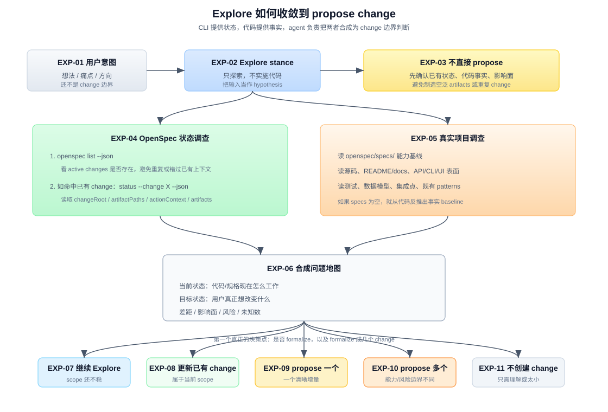
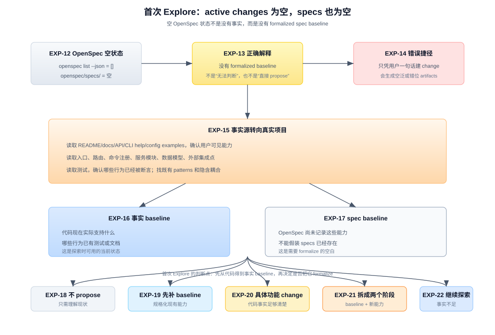

# 答案：Explore 如何走到 propose change

## 一句话

`Explore` 不会自动“算出”一个 change。它是一种 agent stance：先基于用户意图探索，再读取 OpenSpec 状态和真实代码，把“想法”收敛成一个或多个可以被 `propose` 承载的增量边界。

OpenSpec CLI 在这里提供的是状态和路径，不提供产品判断：

```text
用户意图
  + openspec 当前状态
  + 既有 specs / changes
  + 真实代码事实
  + agent 工程判断
  = 是否 propose，以及 propose 什么 change
```

所以关键不是“Explore 调了哪个命令就得到 change name”，而是 agent 在 Explore 中完成了一次 scoped discovery。

## 先分清两件事

`explore` 和 `propose` 的边界很重要：

| 项 | Explore | Propose |
|---|---|---|
| 本质 | 思考姿态，不是固定 workflow | 创建 change 并生成 artifacts 的 workflow |
| 是否必须产出 | 不必须 | 必须创建 change 并补齐 schema 要求的 artifacts |
| 是否读代码 | 应该在相关时读真实代码 | 可以读，但主要任务是生成 artifacts |
| 是否实施代码 | 不允许 | 也不实施，实施是 apply |
| 核心判断 | 这是不是一个可 formalize 的 change | 已决定要 formalize，怎么按 DAG 写完整 |

这意味着：**判断“要不要 propose、propose 几个”主要发生在 Explore 阶段，而不是 Propose 阶段。**

`/opsx:propose` 的模板只要求理解用户想 build/fix 什么，然后导出 change name、`openspec new change`、按 `status` 和 `instructions` 创建 artifact。它不是用来做长时间问题发现的。



这张图的重点是：`openspec list/status` 只提供 OpenSpec 状态；真实代码调查提供工程事实；agent 把两者合成问题地图后，才进入分流判断。

图中编号说明：

| 编号 | 名称 | 在流程里做什么 |
|---|---|---|
| EXP-01 | 用户意图 | 用户给出想法、痛点或方向；它只是探索入口，还不是 change 边界。 |
| EXP-02 | Explore stance | agent 进入只读探索姿态，把用户输入当作 hypothesis，不实施代码。 |
| EXP-03 | 不直接 propose | 阻止把一句自然语言直接变成 change，先要求补齐状态、代码事实和影响面。 |
| EXP-04 | OpenSpec 状态调查 | 通过 `openspec list --json` 和必要时的 `status --change X --json` 理解 active changes、artifact 路径和已有上下文。 |
| EXP-05 | 真实项目调查 | 读取 specs、源码、文档、测试、数据模型和既有 patterns，把想法落到工程事实上。 |
| EXP-06 | 合成问题地图 | 汇总当前状态、目标状态、差距、影响面、风险和未知数，形成可判断的 scope。 |
| EXP-07 | 继续 Explore | 目标或事实仍不清楚时，不 formalize，继续调查、提问或比较方案。 |
| EXP-08 | 更新已有 change | 新发现属于已有 active change 的 scope 时，优先延续或更新它，而不是新开 change。 |
| EXP-09 | propose 一个 | 当目标是一个清晰、可命名、可验证的增量时，进入一个新 change。 |
| EXP-10 | propose 多个 | 当能力边界、风险类型、交付节奏或 owning repo 不同，先拆成多个 changes。 |
| EXP-11 | 不创建 change | 如果只是理解现状、一次性调查或变化太小，就不给 OpenSpec 制造新 change。 |

关键节点的细节单独展开在：

- [`answer-exp04.md`](answer-exp04.md) — OpenSpec 状态调查怎么让 agent 知道要读哪些 planning artifacts。
- [`answer-exp05.md`](answer-exp05.md) — 真实项目调查怎么从用户词汇、artifacts、代码入口、测试和 patterns 找到 implementation context。
- [`answer-exp06.md`](answer-exp06.md) — OpenSpec 状态和代码事实怎么合成 pre-proposal 问题地图。
- [`answer-exp07-11.md`](answer-exp07-11.md) — 最终怎么分流到继续 Explore、更新已有 change、propose 一个、propose 多个或不创建 change。

## Step 1：先接住用户意图，但不要立刻命名 change

用户给出的通常是一个入口，不是完整边界：

```text
"auth 系统有点乱"
"想加实时协作"
"这个 schema 机制是不是应该扩一下"
"这里 apply 和 archive 好像不一致"
```

Explore 的第一步是把这句话当成待验证的 hypothesis，而不是直接把它变成：

```text
change name: refactor-auth-system
```

此时 agent 需要先弄清楚：

- 用户在说 bug、能力新增、架构债、体验问题，还是只是想理解现状？
- 这件事影响的是现有能力，还是新能力？
- 它可能落在哪些模块、命令、schema、workflow 或文档中？
- 有没有已有 change 正在处理同一个方向？
- 这是不是值得进入 OpenSpec change，还是一次解释/调查就够？

这一步的输出不是文件，而是探索方向。

## Step 2：读取 OpenSpec active changes

Explore 模板要求启动时快速检查当前 OpenSpec 上下文：

```bash
openspec list --json
```

这个命令告诉 agent 当前有没有 active changes，以及它们的名称、schema、状态等。

它的意义不是“从列表里选一个答案”，而是避免两个错误：

1. 已经有相关 change，却又新开一个重复 change。
2. 当前项目没有 active change，却误以为存在一个可延续的规划上下文。

判断方式大概是：

| `openspec list` 结果 | Explore 中的含义 |
|---|---|
| 没有 active change | 从用户意图和代码事实开始探索；如果后面收敛，再建议新 propose |
| 有多个 active changes | 检查用户话题是否命中其中某个；不要默认全都相关 |
| 有一个明显相关 change | 优先读取它，而不是直接 propose 新 change |
| 有名字相近但 scope 不确定的 change | 继续查 artifact，再判断是复用、扩展还是新开 |

这一步只建立 OpenSpec 上下文，不决定 change 边界。

## Step 3：如果命中已有 change，读取它的 artifacts

如果用户提到某个 change，或者 `openspec list` 中存在明显相关 change，Explore 应该进一步运行：

```bash
openspec status --change "<name>" --json
```

这里重要的不是纯文本状态，而是 JSON 里的几个字段：

| 字段 | Explore 用它做什么 |
|---|---|
| `changeRoot` | 定位这个 change 的根目录 |
| `artifactPaths` | 找到 proposal、design、specs、tasks 等已有输出 |
| `actionContext` | 理解这个 action 面向哪个 planning home、change、artifact 范围 |
| `artifacts` | 了解哪些 artifact 已存在、哪些 blocked/ready/done |

然后 agent 应该读取已有 artifact，例如：

```text
proposal.md        -> 这个 change 原本要解决什么，scope 是什么
design.md          -> 已经做过哪些技术取舍
specs/**/*.md      -> 本次增量打算怎样改变capability 基线
tasks.md           -> 实施已经拆到什么程度
```

此时经常会发现：用户的新问题其实不是新 change，而是已有 change 的 scope 变化、设计补充、任务补充或假设失效。

## Step 4：读取当前capability 基线，而不是只看 change

OpenSpec 的核心事实源之一是：

```text
openspec/specs/
```

它表示当前已经成立的capability 基线。判断一个 change 应不应该存在，必须先知道它相对于当前基线是增量还是误解。

Explore 至少要弄清楚：

- 现有 specs 是否已经覆盖这个能力？
- 用户想要的是 ADDED、MODIFIED、REMOVED，还是 RENAMED？
- 这次变化是否真的改变用户可观察行为？
- 变化属于哪个 capability，还是跨多个 capabilities？

例如“加 SSO 登录”可能是新能力；“OAuth callback 现在错误处理不一致”可能是修改现有 auth capability；“把登录页按钮颜色改一下”可能不值得进入完整 OpenSpec change。

如果不读基线 specs，agent 很容易把“已有能力的小修正”误判成“新增能力”，或者把一个横跨多个能力的变化误压成一个含混 change。

## 空 OpenSpec 首次探索：specs 为空怎么办

有一种极端情况必须单独讲：项目已经存在，但这是第一次引入 OpenSpec。

此时可能同时成立：

```text
openspec list --json  -> []
openspec/specs/       -> 空目录，甚至还没有形成任何capability 基线文档
openspec/changes/     -> 没有 active change
```

这不表示 Explore 无事可做，也不表示 agent 可以跳过调查直接 propose。它只表示：**OpenSpec 里还没有 formalized baseline**。

此时要区分两种 baseline：

| baseline | 来自哪里 | Explore 怎么用 |
|---|---|---|
| 事实 baseline | 真实代码、README/docs、测试、API/CLI/UI 表面、线上行为描述 | 判断系统现在实际做了什么 |
| spec baseline | `openspec/specs/` | 当前为空，表示这些事实还没有被 OpenSpec 规格化 |



所以首次 Explore 的重心会反过来：不是从 `openspec/specs/` 读已有能力，而是先从代码和现有材料反推出“事实上的当前能力”。

空项目图中编号说明：

| 编号 | 名称 | 在流程里做什么 |
|---|---|---|
| EXP-12 | OpenSpec 空状态 | `openspec list --json` 返回空，`openspec/specs/` 也为空；说明没有 active change 和 formalized specs。 |
| EXP-13 | 正确解释 | 把空状态理解为“尚无 formalized baseline”，而不是“没有事实”或“无法探索”。 |
| EXP-14 | 错误捷径 | 只凭用户一句话直接建 change，会产生空泛、错位或重复的 artifacts。 |
| EXP-15 | 事实源转向真实项目 | 读取 README/docs、代码入口、命令/API/UI、数据模型、测试和现有行为描述。 |
| EXP-16 | 事实 baseline | 从真实代码和材料中反推出系统现在实际支持什么，这是首次 Explore 可用的当前状态。 |
| EXP-17 | spec baseline | 承认 `openspec/specs/` 尚未记录这些能力，不能假装已经有 spec 基线。 |
| EXP-18 | 不 propose | 用户只是想理解现状时，输出结构图或现状总结即可。 |
| EXP-19 | 先补 baseline | 用户关心把现有能力规格化时，先 propose 一个记录当前能力的 baseline change。 |
| EXP-20 | 具体功能 change | 代码事实足够清楚且用户目标是明确增量时，直接 propose 具体功能 change。 |
| EXP-21 | 拆成两个阶段 | 旧行为未规格化而新需求又依赖旧行为时，先补 baseline，再做新能力。 |
| EXP-22 | 继续探索 | 代码事实不足、项目结构不清或关键行为无法确认时，继续 Explore，不急着 propose。 |

通常要读：

- README、用户文档、API 文档、CLI help、配置示例。
- 入口文件、路由、命令注册、主要服务模块。
- 数据模型、迁移、持久化层、外部集成点。
- 测试目录，尤其是现有行为被怎样断言。
- issue/roadmap 这类能解释项目意图的材料，如果项目里有。

然后 Explore 要把用户意图放到这个事实 baseline 上判断：

| 判断结果 | 含义 | 更合适的下一步 |
|---|---|---|
| 只是理解现状 | 用户想弄清楚系统怎么工作，还没有明确变化 | 不 propose，给出结构图和现状总结 |
| 需要先建立基线 | 项目缺少 specs，且用户关心的是“把现有能力规格化” | propose 一个 bootstrap-style change，例如 `document-current-auth-baseline` |
| 明确要新增/修改能力 | 虽然 specs 为空，但代码事实足够清楚，用户目标也是具体增量 | propose 一个具体 change，例如 `add-oauth-login` |
| baseline 和新能力纠缠 | 现有行为未规格化，新需求又依赖理解旧行为 | 拆成两个 changes：先补 baseline，再做新能力 |
| 代码事实不足 | 项目结构不清、测试缺失、关键行为无法确认 | 继续 Explore，必要时建议 spike，而不是急着 propose |

例如用户说”我想让这个 CLI 支持跨仓库 store 引用”，而 `openspec/specs/` 为空。Explore 不能直接写一个大而空的 `add-store-support`。它应先查现有 CLI 的命令注册、配置模型、路径解析、测试结构，再判断：

```text
现有 CLI 已经有 repo-local planning home
目标是新增 store/reference/working-set 机制，而不是重写所有命令
影响面集中在 commands/store、core/store/、core/references.ts
```

如果这些边界清楚，就可以 propose 一个具体 change。相反，如果连现有 CLI 的状态模型都没弄清，应该继续 Explore 或先 propose 一个“document current planning model”的 baseline change。

## Step 5：读真实代码，把想法落到工程事实

Explore 模板明确要求：相关时要探索真实代码库，不要只理论化。

这一节点的细节见 [`answer-exp05.md`](answer-exp05.md)：它专门解释 agent 怎么从用户词汇、OpenSpec artifacts、README/docs、入口文件、测试、数据模型和 `rg` 搜索找到真实项目事实。

这一步通常要查：

| 要查的事实 | 为什么影响 change 边界 |
|---|---|
| 现有模块和入口 | 决定变化落在哪里，是否跨边界 |
| 数据模型和持久化 | 决定是否需要 design、迁移、兼容策略 |
| API/CLI/UI 表面 | 决定用户可观察行为和 specs 写法 |
| 测试结构 | 决定验证方式和 tasks 拆法 |
| 既有 patterns | 决定是沿用、扩展，还是引入新模式 |
| 隐含耦合 | 决定一个 change 是否过大、是否要拆 |

这是从“用户想法”到“OpenSpec change”的关键转换。

用户说“auth 系统有点乱”，读代码后可能发现三种完全不同的边界：

```text
A. 登录 session 生命周期不清楚
B. OAuth provider 接入重复
C. permission check 分散在多个 route
```

这三个可以是一个 change，也可以是三个 changes。不能只看用户说了一个“auth”，就机械地 propose 一个 `refactor-auth-system`。

## Step 6：建立问题地图

经过 OpenSpec 状态、specs 和代码调查后，Explore 应该把材料收敛成一个问题地图：

这一节点的细节见 [`answer-exp06.md`](answer-exp06.md)：它把 current state、target state、gap、impact surface、risks、unknowns 和 candidate boundaries 组织成 pre-proposal boundary map。

```text
当前状态：
  代码/规格现在怎么工作

目标状态：
  用户真正想改变什么

差距：
  哪些行为、能力、结构或流程需要变化

影响面：
  涉及哪些 specs、模块、命令、API、数据、测试

风险：
  迁移、安全、兼容、性能、跨模块耦合

未知数：
  哪些事实还没查清，哪些需要用户决策
```

只有这个地图足够清楚时，才有资格判断 propose 什么。

这也是为什么 Explore 不是浪费时间。它把自然语言中的模糊意图，变成可以被 OpenSpec artifact DAG 承载的工程边界。

## Step 7：做分流判断

Explore 结束时不一定进入 propose。更准确的分流如下：

EXP-07 到 EXP-11 的细节见 [`answer-exp07-11.md`](answer-exp07-11.md)：它专门解释继续 Explore、更新已有 change、propose 一个、propose 多个、不创建 change 的判断标准和推荐输出格式。

| 结论 | 什么时候成立 | 下一步 |
|---|---|---|
| 继续 Explore | 用户目标不清、代码事实不足、scope 还在变 | 继续查代码、问问题、比较方案 |
| 更新已有 change | 新发现属于已有 active change 的 scope | 读取并更新相关 artifact，或建议 `/opsx:continue` |
| Propose 一个新 change | 有一个清晰、可命名、可验证的增量目标 | 建议 `/opsx:propose <name>` |
| Propose 多个 changes | 发现多个独立目标，交付/风险/能力边界不同 | 先给拆分方案，再逐个 propose |
| 不创建 change | 用户只是要理解、一次性调查、极小修补，或还没有行为变化 | 给结论或建议普通代码路径 |

这里的重点是：`propose` 是一种 formalization，不是 Explore 的必然终点。

## 怎么判断“一个 change”还是“多个 changes”

不要按“会改几个文件”拆。OpenSpec change 更接近一个能力增量或行为协议，而不是一个 git patch 包。

### 倾向一个 change

满足这些条件时，通常可以是一个 change：

- 目标可以用一个清晰动词短语命名。
- 变化服务同一个用户可观察结果。
- specs 主要落在一个 capability，或多个 capability 只是同一目标的必要支撑。
- design 可以用一个一致方案解释。
- tasks 虽然多，但验证路径是一组连贯场景。
- 这次交付要么整体成立，要么整体不成立。

例子：

```text
add-oauth-login
```

即使它会改 routes、session、UI、tests，只要目标是“支持 OAuth 登录”这一件事，就仍然可能是一个 change。

### 倾向多个 changes

满足这些条件时，应该考虑拆分：

- 用户话题里混着多个独立能力。
- 每个能力可以独立交付、独立验证、独立 archive。
- 不同部分风险类型不同，例如一个是数据迁移，一个是 UI 体验。
- 不同部分属于不同 owning repo 或明显不同模块边界。
- 一个部分是前置基础设施，另一个是面向用户的功能。
- specs 会落到多个互不依赖的 capability，强压在一起会让 proposal/design/tasks 变含混。

例子：

```text
improve-auth-foundation
add-oauth-login
centralize-permission-checks
```

这三个都属于“auth 系统”，但它们的工程边界和验证语义不同。Explore 的价值就在于先看代码和现有规格，再决定是否拆。

## 进入 propose 前应该说清楚什么

Explore 认为可以 propose 时，agent 不应该只说”我来创建 change”。更好的输出是先把候选边界讲清楚：

```text
我建议 propose 一个 change：add-oauth-login

原因：
- 现有 specs 里 auth 只覆盖 email login，没有 OAuth provider 场景。
- 代码里 session 管理已经独立，OAuth 主要新增 provider callback 和 account linking。
- 这件事的用户可观察结果是一个完整能力：用户可以用 GitHub 登录。

不建议同时纳入：
- permission check 重构，因为它不阻塞 OAuth 登录，风险和验证路径不同。
- 登录页视觉调整，因为它不是这个能力的核心行为变化。

可能影响：
- openspec/specs/auth/spec.md
- src/auth/*
- src/routes/oauth/*
- auth integration tests

如果你认可这个边界，我可以进入 /opsx:propose add-oauth-login。
```

这段说明本质上是 proposal 之前的 pre-proposal boundary check。它让用户和 agent 在创建文件前先对齐 scope。

## CLI、agent、用户三方各自负责什么

| 角色 | 负责什么 | 不负责什么 |
|---|---|---|
| OpenSpec CLI | 列 active changes；解释 change 状态；返回 artifact 路径、依赖、instructions | 不判断产品目标，不自动拆 change，不读业务代码做推理 |
| Agent | 读用户意图、OpenSpec 文件、真实代码；建立问题地图；提出 change 边界 | 不在 Explore 中实施代码，不伪造状态，不替用户静默 formalize |
| 用户 | 确认意图、优先级、scope、是否进入 propose | 不需要自己知道所有源码细节 |

OpenSpec 的设计是：CLI 保证状态可解释，agent 负责工程判断，用户保留方向决策。

## 一个更完整的实际流程

可以把 Explore 到 Propose 理解成下面这个循环：

```text
1. 用户提出意图或问题
   ↓
2. agent 进入 Explore：不实施，只探索
   ↓
3. openspec list --json
   ↓
4. 如果有关联 active change：
      openspec status --change "<name>" --json
      读取已有 artifacts
   ↓
5. 读取 openspec/specs/ 当前capability 基线
   ↓
6. 搜索/阅读真实项目代码
   ↓
7. 汇总当前状态、目标状态、差距、影响面、未知数
   ↓
8. 分流：
      a. 继续 Explore
      b. 更新已有 change
      c. propose 一个 change
      d. propose 多个 changes
      e. 不创建 change
   ↓
9. 若选择 propose：
      给出候选 change name + scope + 拆分理由
      用户确认或继续调整
   ↓
10. 进入 /opsx:propose
      openspec new change "<name>"
      status / instructions 循环生成 artifacts
```

注意第 8 步才是判断点。前面的 CLI 调用和代码阅读都是为它提供事实。

## 常见误区

### 误区 1：用户说了一个功能名，就直接 propose

不够。功能名只是入口。OpenSpec change 需要边界：why、what changes、capability delta、impact、tasks。边界没有形成前，直接 propose 只会制造空泛 artifacts。

### 误区 2：Explore 读了代码，就顺手开始改

不行。Explore 可以读文件、搜索代码、调查架构，但不能实施功能。源码里的 Explore 模板把它定义为 thinking partner，而不是 executor。

### 误区 3：按文件数拆 change

一个 change 可以改很多文件；多个 changes 也可能都碰同一个文件。拆分标准不是文件数量，而是能力边界、交付语义、风险类型和验证路径。

### 误区 4：忽略已有 active change

如果已有 change 正在处理同一问题，新开 change 会造成规划分叉。Explore 必须先看 `openspec list --json`，必要时读取已有 artifacts，再决定是继续、扩展还是新开。

### 误区 5：把 Propose 当成 Discovery

Propose 可以补细节，但它的主要工作是 artifact generation。真正的问题发现、scope 识别、拆分判断，应该在 Explore 中完成到足够稳定。

## 结论

Explore 能 figure out 要 propose 什么 change，不是因为 OpenSpec 有一个隐藏算法自动生成 change，而是因为它把 agent 放在一个受约束的探索姿态里：

- 先看当前 OpenSpec 状态，避免脱离已有 planning context。
- 再看 specs 和 change artifacts，避免脱离capability 基线。
- 如果 specs 为空，就承认 OpenSpec 尚无 formalized baseline，并从真实代码反推出事实 baseline。
- 再看真实代码，避免只凭用户意图空转。
- 最后用工程判断把问题收敛成 change 边界。

当这个边界清晰到可以命名、可以写 proposal、可以说明 impact、可以预期 specs/design/tasks 时，才应该进入 propose。

## 参考来源

源码引用基于 commit `970cb44`：

| 来源 | 用到的结论 |
|---|---|
| `src/core/templates/workflows/explore.ts` | Explore 是 stance；可以读代码但不实施；启动时检查 `openspec list --json`；相关 change 用 `status --json` 读取 artifacts |
| `src/core/templates/workflows/propose.ts` | Propose 从 change name/description 开始，创建 change，并按 `status` / `instructions` 循环生成 artifacts |
| `src/commands/workflow/status.ts` | `status --json` 解析 planning home、change、schema 后输出结构化 status JSON |
| `src/commands/workflow/instructions.ts` | `instructions <artifact> --json` 输出依赖文件、输出路径、template、rules、instruction 等 agent 操作包 |
| `src/core/artifact-graph/instruction-loader.ts` | `formatChangeStatus()` 组装 `artifactPaths`、`actionContext`、`nextSteps`；`generateInstructions()` 组装 artifact instructions |
| `src/core/change-status-policy.ts` | `actionContext` 和 `nextSteps` 的语义， |
| [`../../_digested/internal-spec-driven/01-explore-探索模式.md`](../../_digested/internal-spec-driven/01-explore-探索模式.md) | Explore 的 guardrails、OpenSpec awareness、已有 change 场景 |
| [`../../_digested/internal-spec-driven/02-propose-提案生成.md`](../../_digested/internal-spec-driven/02-propose-提案生成.md) | Propose 的 change 创建和 artifact DAG 生成过程 |
| [`../../_digested/system/07-OpenSpec-工程思想.md`](../../_digested/system/07-OpenSpec-工程思想.md) | 文件状态优先、CLI 解释状态、agent 负责推理 |
| [`../../_digested/system/08-对照常见-SDD-与-AI-Coding.md`](../../_digested/system/08-对照常见-SDD-与-AI-Coding.md) | `specs/` 是capability 基线，`changes/` 是增量协议 |
