# 答案：MD/TS 交替协作时序 — Propose 如何走到 Apply-Ready

## 一句话

Propose 不是 agent 自由发挥写 artifacts。它是一个 MD（智力）↔ TS（机械）紧密交替的 artifact 生成循环：

```text
MD 调用 TS 创建 change 容器
  → TS 返回 status DAG（哪些 ready、哪些 blocked）
  → MD 对 ready artifact 调 TS 取操作包
  → TS 返回 instructions（依赖、模板、规则、路径）
  → MD 读依赖、按模板写 artifact
  → MD 再调 TS 刷新状态
  → 循环，直到 apply gate 满足
```

TS 不写一行 artifact 内容，但它通过 schema DAG + 文件系统状态 + instructions JSON 精密控制 MD 每一步该做什么。

## 时序图

```mermaid
sequenceDiagram
    actor User as 用户
    participant MD as MD<br/>智力层<br/>Agent 工程判断
    participant TS as TS<br/>机械层<br/>OpenSpec CLI
    participant FS as 文件系统<br/>changes/ artifacts

    %% ===== Phase 0: 入口 =====
    rect rgb(240, 248, 255)
        Note over User,FS: ══════ Phase 0 · 入口 ══════
        User->>MD: change name/description<br/>（来自 Explore 收敛结果）
        MD->>MD: 读 propose skill template<br/>（MD 内容，由 TS 模板系统生成）
        MD->>MD: 若输入是描述而非 name：<br/>导出 kebab-case name<br/>（如 "add user auth"→add-user-auth）
    end

    %% ===== Phase 1: 创建容器 =====
    rect rgb(255, 250, 240)
        Note over User,FS: ══════ Phase 1 · 创建 change 容器 ══════
        MD->>TS: openspec new change "add-oauth-login"
        TS->>TS: validateChangeName()<br/>（小写字母开头，kebab-case）
        TS->>TS: resolveCurrentPlanningHomeSync()<br/>解析 .openspec.yaml → planning home
        TS->>TS: 选定 schema：<br/>显式 --schema → project config →<br/>planning home default
        TS->>FS: 创建 change 目录<br/>写 .openspec.yaml<br/>（schema, created date）
        FS-->>TS: 创建完成
        TS-->>MD: change 已创建<br/>（仅容器 + metadata，<br/>不含任何 artifact 文件）
    end

    %% ===== Phase 2: 读 DAG =====
    rect rgb(255, 240, 255)
        Note over User,FS: ══════ Phase 2 · 读取 artifact DAG 状态 ══════
        MD->>TS: openspec status --change "X" --json
        TS->>FS: 读 .openspec.yaml → schema<br/>扫描 change 目录 → 已有输出文件
        FS-->>TS: schema 定义 + 文件状态
        TS->>TS: ArtifactGraph.fromSchema(schema)<br/>构建 DAG：proposal → specs/design → tasks<br/>resolveArtifactOutputs() 判定 done<br/>getNextArtifacts() 判定 ready<br/>getBlocked() 判定 blocked
        TS-->>MD: JSON: schemaName, changeRoot,<br/>artifactPaths, actionContext,<br/>artifacts[{id, status, missingDeps}],<br/>applyRequires, nextSteps
        MD->>MD: 解读：当前 ready 的是 proposal<br/>specs/design blocked（缺 proposal）<br/>tasks blocked（缺 specs+design）
    end

    %% ===== Phase 3: Artifact 生成循环 =====
    rect rgb(255, 255, 240)
        Note over User,FS: ══════ Phase 3 · artifact 生成循环 ══════
        loop 每轮：status → instructions → write → status
            MD->>MD: 从 status JSON 找 status:"ready" 的 artifact
            MD->>TS: openspec instructions <artifact> --change "X" --json
            TS->>TS: loadChangeContext()<br/>generateInstructions()<br/>解析 requires → dependencies<br/>加载 schema template/instruction<br/>注入 project context/rules
            TS-->>MD: 操作包：resolvedOutputPath,<br/>dependencies[{id, done, path}],<br/>template, instruction,<br/>context, rules, unlocks
            MD->>FS: 按 dependencies 读已完成 artifact<br/>（如写 specs 前读 proposal.md）
            FS-->>MD: 依赖内容
            MD->>MD: 按 template 组织结构<br/>遵守 instruction 语义规则<br/>受 context/rules 约束<br/>（context/rules 不写入文件！）
            MD->>FS: 写 artifact 到 resolvedOutputPath<br/>（glob artifact 如 specs 需<br/>按 proposal capabilities 选具体路径）
            FS-->>MD: 写入完成
            MD->>TS: openspec status --change "X" --json
            TS->>FS: 重新扫描 change 目录
            FS-->>TS: 更新后的文件状态
            TS->>TS: resolveArtifactOutputs()<br/>重新判定 done/ready/blocked
            TS-->>MD: 更新后的 artifacts 状态
        end
    end

    %% ===== Phase 4: Apply Gate =====
    rect rgb(245, 255, 245)
        Note over User,FS: ══════ Phase 4 · apply gate 检查 ══════
        MD->>MD: 检查 status JSON：<br/>applyRequires 中所有 artifact<br/>是否都是 status:"done"
    end

    alt applyRequires 未满足
        MD->>MD: 回到 Phase 3，继续生成缺失 artifact
    else applyRequires 满足（默认：tasks done）
        rect rgb(240, 255, 240)
            Note over User,FS: ══════ apply-ready · 交棒 ══════
            MD->>MD: tasks artifact done<br/>→ apply.requires 满足<br/>→ /opsx:apply 可以开始
            MD-->>User: propose 完成。<br/>planning artifacts 已足够让<br/>apply skill 读取上下文和任务清单。<br/>可以进入 /opsx:apply。
        end
    end

    opt apply 入口做最终检查
        Note over User,FS: （apply 阶段的第一动作，不属于 propose）
        MD->>TS: openspec instructions apply --change "X" --json
        TS->>TS: 检查 apply.requires<br/>收集 contextFiles<br/>解析 tasks.md checkbox<br/>计算 progress
        TS-->>MD: state: ready | blocked | all_done<br/>contextFiles, progress, tasks
    end
```



## DAG 驱动的 artifact 顺序

spec-driven schema 定义了严格的 DAG：

```text
proposal (requires: [])
  ├→ specs (requires: [proposal])
  │    └→ tasks (requires: [specs, design])
  └→ design (requires: [proposal])
       ┘
```

MD 不能按自己喜好决定顺序。每一轮必须查 status JSON 的 `ready`/`blocked` 状态。这个约束来自 TS 层的 `ArtifactGraph`，不是 MD 的自觉。

## 关键交替模式

### 模式 1：TS 判 done → MD 找 ready → MD 调 TS 取操作包

```text
TS: resolveArtifactOutputs() 判定 proposal.md 不存在 → proposal: ready
TS: resolveArtifactOutputs() 判定 specs/ 无 .md → specs: blocked

MD 看到 proposal: ready → openspec instructions proposal --json
TS 返回：dependencies=[], template="## Why...", instruction="..."
MD 按操作包写 proposal.md
```

TS 不告诉 MD "写什么内容"，只告诉 MD "现在该写 proposal 了，这是模板和规则"。内容仍是 MD 的智力产出。

### 模式 2：TS 管结构 → MD 管内容

```text
TS 提供 template：
  ## Why
  ## What Changes
  ## Capabilities
  ## Impact

MD 填入内容：
  ## Why
  用户只能用 email 登录，需要支持 GitHub OAuth。
  ## What Changes
  - 新增 GitHub OAuth provider callback
  ...
```

结构是 schema 定义的（TS 层），内容是 agent 根据 change 目标生成的（MD 层）。两层各司其职。

### 模式 3：TS 注入约束 → MD 遵守但不复制

```text
TS 返回 context: "This project uses Express + Passport.js"
TS 返回 rules: "All new routes must have rate limiting"

MD 在写 design.md 时：
  - 方案基于 Express + Passport.js（遵守 context）
  - 每个 route 包含 rate limit 配置（遵守 rules）
  - 但不把 <context> 或 <rules> 标签写进文件
```

`context` 和 `rules` 是 TS 给 MD 的约束，不是 artifact 内容。这是 propose 里最容易踩的坑。

### 模式 4：循环终止条件来自 TS

```text
MD 写完 tasks.md → openspec status --json
TS 扫描：tasks.md 是文件（非目录）→ tasks: done
TS 检查 applyRequires: [tasks] → 全部 done
TS 返回 nextSteps: "All apply requirements met."

MD 看到 applyRequires 满足 → propose 完成
```

MD 不能自己宣布 "我觉得可以了"。必须 TS 的 `resolveArtifactOutputs()` 确认文件存在，且 `applyRequires` 全部满足。

## 和 Explore 的对比

| | Explore | Propose |
|---|---|---|
| TS 被调用频率 | 低（主要在开头 `list`、`status`） | 高（每轮 `status` + `instructions`，紧密交替） |
| MD 主要动作 | 读代码、推理、判断 | 按操作包写 artifact 内容 |
| TS 的角色 | 提供 planning context（路径、状态） | 精密控制 artifact 生成顺序和规则 |
| 产物 | 问题地图 + 分流建议 | proposal.md, specs/, design.md, tasks.md |

## 参考来源

源码引用基于 commit `750a03c`：

| 来源 | 用到的结论 |
|---|---|
| `src/core/templates/workflows/propose.ts` | propose skill 的完整步骤和循环 |
| `src/commands/workflow/new-change.ts` | `openspec new change` 的 CLI 行为 |
| `src/utils/change-utils.ts` | change name 校验、schema 解析、目录创建 |
| `src/commands/workflow/status.ts` | `status --json` 如何构建 artifact DAG |
| `src/commands/workflow/instructions.ts` | artifact/apply instructions 的生成 |
| `src/core/artifact-graph/instruction-loader.ts` | `formatChangeStatus()` 和 `generateInstructions()` |
| `src/core/artifact-graph/graph.ts` | ready/blocked/build order 判定 |
| `src/core/artifact-graph/outputs.ts` | 普通路径和 glob 完成判定 |
| `schemas/spec-driven/schema.yaml` | 默认 DAG 和 apply gate |
| [`answer-prp04.md`](answer-prp04.md) | status DAG 细节 |
| [`answer-prp06.md`](answer-prp06.md) | instructions 操作包细节 |
| [`answer-prp10.md`](answer-prp10.md) | apply gate 两层定义 |
