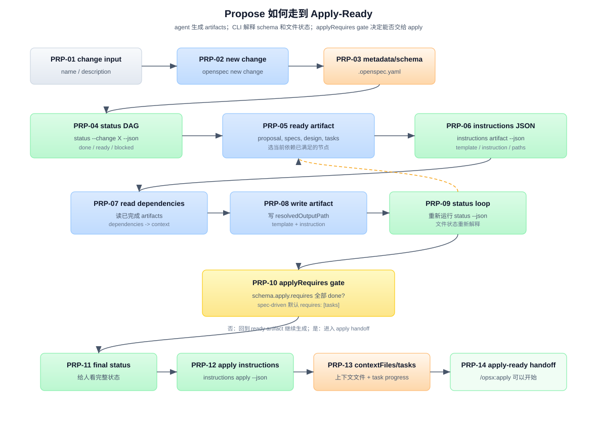

# 答案：Propose 如何走到 Apply-Ready

## 一句话

`propose` 不是“写一份 proposal.md”这么窄。它是一个从 change 输入到 apply-ready 的 artifact 生成循环：

```text
change name / description
  -> openspec new change
  -> .openspec.yaml 选定 schema
  -> status --json 计算 artifact DAG
  -> instructions <artifact> --json 给 agent 操作包
  -> agent 写 artifact 文件
  -> status loop 重新解释文件状态
  -> applyRequires 满足
  -> /opsx:apply 可以开始
```

OpenSpec CLI 不写 proposal/specs/design/tasks 的创造性内容。CLI 负责创建 change 容器、解释 schema 和文件状态、给出路径和 instructions；agent 负责读取上下文、生成 artifact 内容并写文件。

> **v1.7.0 当前边界。** `/opsx:apply` 是 Claude 写法；Codex 使用 `$openspec-apply-change`。同级 ready 的 `specs` 与 `design` 仍可并行，但内置 schema 的推荐显示顺序是 specs 后 design。没有 spec-level 行为变化时，可在 `.openspec.yaml` 声明 `skip_specs: true`；specs 会显式为 `skipped`，但不得同时存在非隐藏 delta spec 文件。



图中编号说明：

| 编号 | 名称 | 在流程里做什么 |
|---|---|---|
| PRP-01 | change input | 用户或 Explore 给出 change name/description，propose 从已收敛的目标开始。 |
| PRP-02 | new change | agent 运行 `openspec new change "<name>"` 创建 change 容器。 |
| PRP-03 | metadata/schema | CLI 写 `.openspec.yaml`，记录 resolved schema、created date 和可选 metadata。 |
| PRP-04 | status DAG | agent 运行 `openspec status --change "<name>" --json`，CLI 构建 artifact DAG 状态。 |
| PRP-05 | ready artifact | agent 从 status JSON 找到当前 `ready` 的 artifact，例如 `proposal`。 |
| PRP-06 | instructions JSON | agent 运行 `openspec instructions <artifact> --change "<name>" --json` 获取操作包。 |
| PRP-07 | read dependencies | agent 按 `dependencies` 读取已完成 artifact 作为上下文。 |
| PRP-08 | write artifact | agent 用 `template`、`instruction`、`context`、`rules` 生成内容并写到 `resolvedOutputPath`。 |
| PRP-09 | status loop | 写完后重新运行 `status --json`，让 CLI 重新解释哪些 artifacts done/ready/blocked。 |
| PRP-10 | applyRequires gate | 检查 schema `apply.requires` 中的 artifacts 是否都已经有输出文件。 |
| PRP-11 | final status | apply gate 满足后显示最终 `openspec status --change "<name>"` 给人看。 |
| PRP-12 | apply instructions | 宿主 apply workflow 会调用 `openspec instructions apply --change "<name>" --json`。 |
| PRP-13 | contextFiles/tasks | apply instructions 返回 artifact context files、project `context`、`operations.apply.guidance`、task progress 和 pending tasks。 |
| PRP-14 | apply-ready handoff | agent 可以开始实施 tasks；propose 阶段到此结束。 |

PRP-04、PRP-06、PRP-10 的细节分别展开在：

- [`answer-prp04.md`](answer-prp04.md)
- [`answer-prp06.md`](answer-prp06.md)
- [`answer-prp10.md`](answer-prp10.md)

如果关心 `apply` 能否低改造用于 agent、Markdown、skill、command 等非代码产物，见三种借用路径总览：[`answer-agent-md-apply.md`](answer-agent-md-apply.md)。

另外，从 MD/TS 交替协作的视角重新组织了整个流程，含完整 Mermaid 时序图：[`answer-sequence.md`](answer-sequence.md)。

## Step 1：从已收敛目标得到 change name

`propose` 的输入必须是：

```text
change name（kebab-case）
或
用户想 build/fix 什么的描述
```

如果输入不清楚，`propose` skill 要求 agent 追问：

```text
What change do you want to work on? Describe what you want to build or fix.
```

如果输入是描述，agent 从描述导出 kebab-case name：

```text
"add user authentication" -> add-user-auth
```

change name 需要通过 `validateChangeName()`：

```text
^[a-z][a-z0-9]*(-[a-z0-9]+)*$
```

也就是：小写字母开头，只含小写字母、数字和连字符；不能有空格、下划线、大写、首尾连字符、连续连字符或数字开头。

## Step 2：创建 change 容器，而不是直接创建 artifacts

agent 运行：

```bash
openspec new change "<name>"
```

CLI 的实际行为是：

```text
resolveCurrentPlanningHomeSync()
validateChangeName()
validateSchemaExists()     # 如果显式传了 --schema
createChange()
```

`createChange()` 会：

1. 解析 schema：显式 `--schema` -> project config -> planning home default schema。
2. 创建 change 目录。
3. 写 `.openspec.yaml`。

`.openspec.yaml` 类似：

```yaml
schema: spec-driven
created: "2026-06-14"
```

重要边界：`openspec new change` **不创建** `proposal.md`、`design.md`、`specs/**/*.md` 或 `tasks.md`。它只创建容器和 metadata。artifact 文件由 agent 后续按 instructions 写入。

## Step 3：用 status 读取 schema DAG 和当前文件状态

刚创建 change 后，agent 运行：

```bash
openspec status --change "<name>" --json
```

status JSON 会告诉 agent：

```text
schemaName
planningHome
changeRoot
artifactPaths
actionContext
artifacts
applyRequires
nextSteps
```

对默认 `spec-driven` schema，DAG 是：

```text
proposal
  -> specs
  -> tasks

proposal
  -> design
  -> tasks
```

刚创建目录时通常是：

```json
{
  "applyRequires": ["tasks"],
  "artifacts": [
    { "id": "proposal", "status": "ready" },
    { "id": "specs", "status": "blocked", "missingDeps": ["proposal"] },
    { "id": "design", "status": "blocked", "missingDeps": ["proposal"] },
    { "id": "tasks", "status": "blocked", "missingDeps": ["design", "specs"] }
  ]
}
```

这一步让 agent 知道：当前先写 `proposal`。

## Step 4：对 ready artifact 调 instructions

对每个 ready artifact，agent 运行：

```bash
openspec instructions <artifact-id> --change "<name>" --json
```

返回的是一个 artifact 操作包，核心字段包括：

| 字段 | agent 怎么用 |
|---|---|
| `resolvedOutputPath` | 写入 artifact 的目标路径。 |
| `existingOutputPaths` | 该 artifact 当前已经存在的具体输出文件。 |
| `dependencies` | 写当前 artifact 前应该读取的依赖 artifacts。 |
| `template` | 输出文件的结构骨架。 |
| `instruction` | schema 对该 artifact 的语义指导。 |
| `context` | project config 注入的背景，约束 agent，不写入文件。 |
| `rules` | artifact-specific 规则，约束 agent，不写入文件。 |
| `unlocks` | 完成当前 artifact 后会解锁哪些 artifact。 |

agent 要做的是：

```text
读 dependencies
按 template 组织输出
遵守 instruction/context/rules
写到 resolvedOutputPath
```

agent 不应该把 `context`、`rules` 或 `<project_context>` 标签复制进 artifact 文件里。

## Step 5：按 spec-driven 顺序创建 artifacts

默认 `spec-driven` 通常生成四类 artifacts。

### proposal

`proposal` 是 DAG 根节点，`requires: []`，一开始就是 ready。

它回答：

```text
为什么做？
做什么变化？
涉及哪些 capabilities？
影响哪些代码/API/依赖/系统？
```

`Capabilities` 是关键契约：它告诉后续 `specs` 要创建或修改哪些 capability spec 文件。

### specs

`specs` 依赖 `proposal`。

它回答：

```text
系统行为应该怎样变化？
新增、修改、删除、重命名哪些 requirements？
每个 requirement 有哪些 scenario？
```

`specs` 的输出路径是 glob：

```text
specs/**/*.md
```

因此一个 change 可以创建多个 capability delta specs。v1.7.0 的 capability 是 `specs/` 下的相对 path，允许 `identity/session/spec.md` 这样的嵌套路径；delta 必须使用同一相对 path，根级 `changes/<change>/specs/spec.md` 无效。

### design

`design` 也依赖 `proposal`，和 `specs` 并行。

它回答：

```text
怎么实现？
有哪些技术决策？
有哪些目标/非目标、风险、迁移和 open questions？
```

schema instruction 说 design 不是流水账；它应该用于跨模块、新依赖、数据模型、安全/性能/迁移复杂度，或需要提前消除技术歧义的情况。

### tasks

`tasks` 依赖 `specs` 和 `design`。

它回答：

```text
实施时按什么顺序做？
每一步怎么确认完成？
```

默认 apply 阶段会解析 checkbox：

```markdown
- [ ] 1.1 Implement session storage
- [ ] 1.2 Add integration tests
```

`tasks.md` 完成后，默认 `apply.requires: [tasks]` 被满足。

如果 change 只是重构、工具或文档等不改变 spec-level 行为的工作，则在 metadata 写 `skip_specs: true`，status 会将 specs 标为 `skipped` 而不是要求写一份虚假的零 delta spec；真实行为变化不能用它绕过 specs。

## Step 6：每写完一个 artifact，都重新解释状态

agent 写完 artifact 后，不应该靠记忆判断下一步。它应该重新运行：

```bash
openspec status --change "<name>" --json
```

CLI 会重新扫描 change 目录：

```text
artifactOutputExists(changeDir, artifact.generates)
```

完成判定不是“agent 说写完了”，而是文件系统中有符合 `generates` 的输出文件：

- 普通路径：必须是 `statSync(...).isFile()`。
- glob：用 `fast-glob` 在 changeDir 下匹配 `onlyFiles: true`，至少一个文件匹配才算 done。

所以 propose 的循环是：

```text
status -> 找 ready artifact
instructions -> 读依赖和模板
write -> 写 artifact
status -> 重新判断 done/ready/blocked
```

直到 `applyRequires` 满足。

## Step 7：Apply-Ready 的精确定义

apply-ready 不是所有 artifact 一定都完整，也不是所有任务都完成。它的精确定义来自 schema：

```yaml
apply:
  requires: [tasks]
  tracks: tasks.md
```

对默认 `spec-driven` 来说：

```text
tasks artifact done
  -> apply.requires 满足
  -> 宿主 apply workflow 可以读取 apply instructions
```

`tasks artifact done` 的意思是：

```text
resolveArtifactOutputs(changeDir, "tasks.md").length > 0
```

也就是 `tasks.md` 是一个真实文件。

注意：`tasks.md` 存在但没有 checkbox task 时，`instructions apply` 会返回 `state: "blocked"`，因为 apply 阶段没有可跟踪任务。这是 apply instructions 的检查，不是 propose 的 DAG done 判定。

## Step 8：进入 apply 前会发生什么

当用户运行宿主 apply workflow（Claude 示例为 `/opsx:apply`），它会：

```bash
openspec status --change "<name>" --json
openspec instructions apply --change "<name>" --json
```

`instructions apply` 返回：

```text
contextFiles   # proposal/specs/design/tasks 等已存在 artifact 文件
context        # project config context
guidance       # operations.apply.guidance（如配置）
progress       # total / complete / remaining
tasks          # checkbox task list
state          # blocked / ready / all_done
instruction    # apply 阶段动态指令
```

如果 state 是 `ready`，agent 才开始实施 tasks。它会先读 `contextFiles`，然后按 pending tasks 修改代码，并把 `tasks.md` 中的 checkbox 从 `- [ ]` 改成 `- [x]`。

所以 propose 的终点不是“代码开始改了”，而是：

```text
planning artifacts 已经足够让 apply skill 读取上下文和任务清单
```

## 三方分工

| 角色 | 在 propose 中负责什么 |
|---|---|
| Agent | 理解 change 目标，调用 CLI，读取 dependencies，生成 proposal/specs/design/tasks 内容，写文件。 |
| OpenSpec CLI | 创建 change 容器，解析 schema，计算 artifact DAG，返回 instructions 和 apply readiness。 |
| Schema | 声明 artifact 列表、输出路径、依赖关系、模板、instructions、apply gate。 |
| 文件系统 | 保存 `.openspec.yaml` 和 artifacts；文件存在性就是状态事实源。 |

## 常见误区

### 误区 1：`openspec new change` 会生成完整 artifacts

不会。它只生成 change 目录和 `.openspec.yaml`。proposal/specs/design/tasks 都由 agent 通过 `instructions` 操作包写入。

### 误区 2：agent 可以按自己喜欢的顺序写 artifacts

不应该。顺序来自 schema DAG。agent 每轮都应该看 `status --json` 的 ready/blocked 状态。

### 误区 3：`instructions` 是普通帮助文本

不是。它是 agent 的操作包：包含路径、依赖、模板、schema instruction、config context/rules。

### 误区 4：apply-ready 等于实现完成

不是。apply-ready 只是“可以开始 implementation”。实现完成发生在 `/opsx:apply` 逐项完成 tasks 后。

### 误区 5：`context` 和 `rules` 应该写进 artifact

不应该。它们是对 agent 的约束，不是 artifact 内容。

## 参考来源

源码引用以 v1.7.0 tag `4e16790` 为当前基线：

| 来源 | 用到的结论 |
|---|---|
| `src/core/templates/workflows/propose.ts` | propose skill 的完整步骤、循环、guardrails 和输出要求 |
| `src/commands/workflow/new-change.ts` | `openspec new change` 的 CLI 行为和 JSON/human 输出 |
| `src/utils/change-utils.ts` | change name 校验、schema 解析优先级、目录创建和 `.openspec.yaml` 写入 |
| `src/commands/workflow/status.ts` | `status --json` 如何加载 change context 并输出 status |
| `src/commands/workflow/instructions.ts` | artifact instructions 和 apply instructions 的生成与输出 |
| `src/core/artifact-graph/instruction-loader.ts` | `formatChangeStatus()` 和 `generateInstructions()` 的核心字段 |
| `src/core/artifact-graph/graph.ts` | artifact DAG 的 build order、ready、blocked 判定 |
| `src/core/artifact-graph/outputs.ts` | artifact 完成判定：普通文件和 glob 输出 |
| `schemas/spec-driven/schema.yaml` | 默认 proposal/specs/design/tasks DAG 和 apply gate |
| `src/core/templates/workflows/apply-change.ts` | apply skill 如何消费 apply instructions、contextFiles 和 tasks |
| [`../../_digested/internal-spec-driven/02-propose-提案生成.md`](../../_digested/internal-spec-driven/02-propose-提案生成.md) | propose 主流程和 artifact 细节 |
