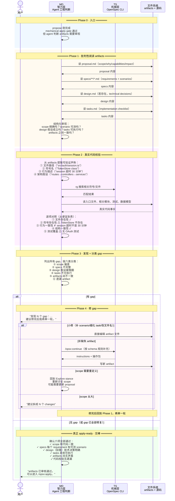

# 答案：MD/TS 交替协作时序 — Iterate 如何打磨 artifacts

## 一句话

Iterate 是四个阶段里 MD 比重最高、TS 参与最少的。和 Propose 的密集 MD↔TS 交替不同，本阶段的大部分工作是 MD 的内循环：读 artifact → 读代码 → 对照 → 发现 gap → 修 artifact → 再审。TS 只在需要确认 artifact 状态或补 artifact 时才被调用。

```text
MD 读 artifacts（FS）→ MD 读代码（FS + TS/rg）→ MD 对照 
  → MD 发现 gap → MD 修文件（FS）→ MD 再审
  → 循环直到真正 apply-ready
```

## 时序图



## 和 Propose/Apply 的 MD/TS 比重对比

| 阶段 | MD 比重 | TS 比重 | TS 被调用时机 |
|---|---|---|---|
| Propose | 中高 | 中高 | 每轮 status + instructions，交替密集 |
| **Iterate** | **极高** | **极低** | 只在补 artifact 或确认状态时按需调用 |
| Apply | 高 | 中 | gate 时一次 + 进度刷新按需 |

Iterate 是唯一一个 TS 几乎不参与核心工作的阶段。TS 的 artifact DAG 和 instructions 机制在 Propose 里已经完成了它们的任务——artifacts 已经存在，剩下的打磨不需要 CLI 每轮重新计算状态。

## 关键交替模式

### 模式 1：MD 内循环（TS 旁观）

```text
MD 读 artifact → MD 读代码 → MD 对照 → MD 发现 gap → MD 修 → MD 再审
```

这是本阶段的核心模式。TS 只有在 MD 需要补 artifact（`/opsx:continue`→`openspec instructions`）或确认状态（`openspec status`）时才被调用。大部分时候 TS 不参与。

### 模式 2：代码事实是最终裁判

```text
artifact 声称：session 逻辑在 src/auth/session.ts
代码事实：session 创建分散在 routes/auth.ts + core/session.ts + middleware/session.ts
MD 判断：proposal impact 不准确 → 更新 proposal.md
```

这和 Explore 的 EXP-05 逻辑一致，但起点不同：EXP-05 从用户意图出发做 discovery，ITR-04 从 artifact 声称出发做 verification。

### 模式 3：TS 按需介入

```text
MD 发现 design.md 需要推翻重来
  → 可能需要 /opsx:continue 重新生成 design artifact
  → MD → TS: openspec instructions design --change "X" --json
  → TS → MD: template + instruction + dependencies
  → MD 写新 design.md
```

这是本阶段少有的 TS 参与点。而且不是因为 TS 要求 MD 这样做，而是 MD 主动决定需要 TS 的 artifact 生成机制。

## 参考来源

| 来源 | 用到的结论 |
|---|---|
| `src/core/templates/workflows/explore.ts` | Explore stance：可读代码、可审视架构、不可实施 |
| `src/core/templates/workflows/continue-change.ts` | `/opsx:continue` 的 artifact 补充机制 |
| `src/commands/workflow/instructions.ts` | artifact instructions 的生成 |
| [`answer.md`](answer.md) | 主流程和 ITR 节点说明 |
| [`answer-itr03.md`](answer-itr03.md) | 批判性阅读 artifacts |
| [`answer-itr04.md`](answer-itr04.md) | 代码校验方法 |
| [`answer-itr05.md`](answer-itr05.md) | gap 分类和修复 |
