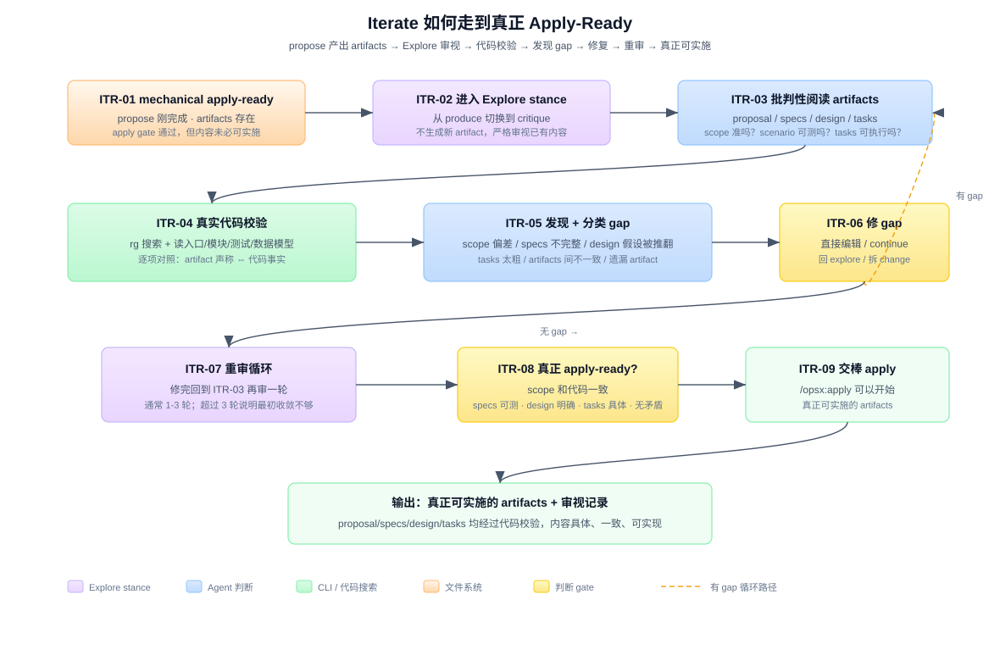

# 答案：Proposed → 通过 Explore 打磨 → 真正 Apply-Ready

## 一句话

Propose 的 mechanical apply gate（tasks.md 存在）只是一个文件系统事实。真正能开始实施的 artifacts 需要经过一轮或多轮 Explore 审视——把 artifacts 当成 Explore 的调查对象，拿真实代码去校验，发现 gap 就修，修完再审，直到 artifacts 足够具体、一致、可实现。

> **v1.8.0 补充。** `skip_specs: true` 是“本 change 没有 spec-level 行为变化”的正式 metadata，不是漏写 specs 的容错；此时 status 的 specs 是 `skipped`，迭代审视应确认这一判断本身成立。下面 `/opsx:*` 仍是 Claude 示例；Codex 以对应 `$openspec-*` skill 运行（v1.8.0 下装在 `.agents/skills/`）。

```text
Propose 产出 artifacts（mechanical apply-ready）
  → 切换 stance：从 produce 到 critique
  → 批判性阅读 artifacts（proposal/specs/design/tasks）
  → 真实代码校验（artifact 声称 ⇔ 代码事实）
  → 发现 + 分类 gap
  → 修 gap → 重审 → 循环
  → 真正 apply-ready
```

这个迭代不是四条核心命令中的任何一条。工具上用的是 Explore 的 stance + Propose/Continue 的更新机制。它是 Explore 和 Propose 之间的迭代组合。



图中编号说明：

| 编号 | 名称 | 在流程里做什么 |
|---|---|---|
| ITR-01 | mechanical apply-ready | propose 刚完成，artifacts 存在，apply gate 通过，但内容未必可实施。 |
| ITR-02 | 进入 Explore stance | 从 produce 切换到 critique——不生成新 artifact，严格审视已有内容。 |
| ITR-03 | 批判性阅读 artifacts | 读 proposal/specs/design/tasks，逐个检查 scope 准吗、scenario 可测吗、tasks 可执行吗。 |
| ITR-04 | 真实代码校验 | rg 搜索 + 读入口/模块/测试/数据模型，逐项对照：artifact 声称 ⇔ 代码事实。 |
| ITR-05 | 发现 + 分类 gap | 识别 scope 偏差、specs 不完整、design 假设被推翻、tasks 太粗、artifacts 不一致、遗漏 artifact。 |
| ITR-06 | 修 gap | 按 gap 类型选策略：直接编辑 / 宿主 update workflow / continue workflow / 回 Explore / 拆 change。 |
| ITR-07 | 重审循环 | 修完回到 ITR-03 再审；有 gap 继续循环，无 gap 进入 ITR-08。通常 1-3 轮。 |
| ITR-08 | 真正 apply-ready gate | scope 和代码一致、specs 可测、design 明确、tasks 具体、无矛盾。 |
| ITR-09 | 交棒 apply | `/opsx:apply` 可以开始，artifacts 已经过代码校验。 |

关键节点的细节单独展开在：

- [`answer-itr03.md`](answer-itr03.md) — 如何批判性阅读每种 artifact（proposal/specs/design/tasks），审视重点和红灯信号。
- [`answer-itr04.md`](answer-itr04.md) — 如何从 artifacts 提取可验证声称，去真实代码里逐项核对（文件→符号→行为→结构→测试）。
- [`answer-itr05.md`](answer-itr05.md) — 六种 gap 类型的分类、严重程度、修复策略和回环机制。

另外，从 MD/TS 交替协作的视角重新组织了整个流程：[`answer-sequence.md`](answer-sequence.md)。

## Step 1：先分清两个 "apply-ready"

在开始迭代之前，必须搞清楚为什么需要这一步：

| | Mechanical apply-ready | 真正的 apply-ready |
|---|---|---|
| 谁说了算 | TS：`resolveArtifactOutputs()` 确认 tasks.md 是文件 | MD：agent 的工程判断 |
| 条件 | `apply.requires` 中的 artifact 都有输出文件 | artifacts 内容具体、一致、经代码验证可实现 |
| 典型 gap | 无（文件存在就过） | proposal scope 和代码事实冲突、specs 漏边界场景、design 假设被代码推翻、tasks 太粗无法执行 |
| 不满足时 | apply instructions 返回 `state: blocked`（仅限缺文件/无 checkbox） | apply instructions 返回 `state: ready`，但实施时会频繁暂停 |

关键的坑：**mechanical apply-ready 通过了，apply instructions 返回 `state: ready`，但一实施就发现 artifacts 对不上真实代码。** 这个 FAQ 要解决的就是这一段路。

## Step 2：切换 stance——从 produce 到 critique

Propose 阶段 agent 的姿态是"产出"——按 schema DAG 和 template 写内容，满足 apply gate。

ITR-02 把姿态切换到"审视"——假设 artifacts 可能有问题，逐项找。关键心态转变：

| 产出姿态（Propose） | 审视姿态（ITR-02） |
|---|---|
| "我需要写一个 proposal" | "这个 proposal 的 scope 说清楚了吗？" |
| "specs 要覆盖 proposal 的 capabilities" | "每个 requirement 的 scenario 真的可测吗？" |
| "tasks 按依赖排序" | "task 3.1 具体到 agent 看到就能执行吗？" |

这一步不碰文件，只是 mindset shift。

## Step 3：批判性阅读 artifacts

逐个 artifact 做结构化审视。不是"看一遍"，而是从"能指导实施吗"的角度逐一检查。

详细方法见 [`answer-itr03.md`](answer-itr03.md)。要点：

- **proposal**：scope 精确吗？Impact 列的文件真实存在吗？有显式 Not included 吗？
- **specs**：每个 requirement 至少一个可测 scenario？有正常 + 边界？MODIFIED 是完整 block 不是 patch？
- **design**（若存在）：技术假设在真实代码里成立吗？提到的 abstraction 存在吗？
- **tasks**：每个 task 具体到 agent 看到就知道改哪个文件？粒度合理吗？
- **一致性**：proposal ↔ specs ↔ tasks scope 一致吗？

输出是一份审视摘要，标注 ✓/⚠/✗，直接喂给 Step 4。

## Step 4：拿真实代码逐项校验

从 artifacts 里提取可验证的声称，去真实代码里核对。详细方法见 [`answer-itr04.md`](answer-itr04.md)。

校验顺序（从便宜到贵）：

```text
1. 文件存在性  → artifact 里列的文件路径真实存在吗？
2. 符号存在性  → artifact 里提到的 class/function/interface 存在吗？
3. 行为一致性  → artifact 里描述的系统行为是否和代码事实匹配？
4. 结构一致性  → artifact 里假设的架构/模块划分是否和代码一致？
5. 测试覆盖    → artifact 里声称的测试是否存在？
```

输出是一份对照表，每行标注 ✓/⚠/✗。

## Step 5：发现 + 分类 gap + 修复

ITR-03 和 ITR-04 的输出汇总后，按六种类型分类。详细方法见 [`answer-itr05.md`](answer-itr05.md)。

六种 gap 类型：

| 类型 | 典型表现 | 高严重度例子 |
|---|---|---|
| scope 偏差 | proposal Impact 和代码不一致 | scope 根本性错误——需回 Explore |
| specs 不完整 | 缺 scenario、缺 requirement | MODIFIED 不完整——archive 时会丢数据 |
| design 假设被推翻 | abstraction 在代码里不存在 | 架构假设根本性错误——需回 Explore |
| tasks 不可执行 | 太粗、太模糊、顺序错 | "Implement OAuth login"（实际是 5-10 步） |
| artifacts 不一致 | proposal 和 specs scope 不同 | proposal 写只做 GitHub OAuth，tasks 出现 Google OAuth |
| 遗漏 artifact | DAG 允许缺失但实际需要 | 复杂 change 缺 design |

修复策略取决于 gap 严重度：小修直接编辑文件或用宿主 update workflow（逐 artifact 确认后写入，并自动检查一致性），中修用 continue workflow 补 artifact，大修回 Explore 重新讨论 scope。Claude 示例是 `/opsx:update` / `/opsx:continue`；Codex 使用相应 `$openspec-*` skills。

## Step 6：重审循环

修完 gap 后回到 Step 3 再审一轮。因为修一个 gap 可能引入新 gap。

```text
ITR-03 审视 → ITR-04 校验 → ITR-05 发现 gap
  → ITR-06 修 gap
  → ITR-07 回到 ITR-03
```

通常 1-3 轮。超过 3 轮还在大改 → 最初的 Explore→Propose 收敛不够，可能需要回到 03 的问题地图重做。

## Step 7：确认真正 apply-ready

真正 apply-ready 的最低条件：

- proposal 的 scope、impact 和真实代码一致
- specs 的每个 requirement 至少有 1 个可测试 scenario（含正常 + 至少 1 个边界）
- 如果 change 涉及跨模块、新依赖、数据迁移或安全——design 存在且技术决策明确
- 每个 task 具体到 agent 看到就能执行（知道改哪个文件、改成什么样）
- artifacts 之间没有矛盾（proposal scope = specs 覆盖 = tasks 范围）
- 用真实代码校验过，没有"artifact 说存在但代码里不存在"的文件或接口

满足所有条件后→ ITR-09：交棒宿主 apply workflow（Claude：`/opsx:apply`；Codex：`$openspec-apply-change`）。

## 和四个阶段的衔接

```text
03_explore-to-propose-change    Explore 判断是否 propose
        ↓
04_propose-to-apply-ready       Propose 生成 artifacts（mechanical apply-ready）
        ↓
05_iterate-to-apply-ready    ← 本 FAQ：Explore 审视 artifacts → 迭代打磨
        ↓
06_apply-ready-to-archive-ready Apply 实施代码
        ↓
07_archive-ready-to-archived    Archive 收束
```

它处于 propose 和 apply 之间。不是一条新命令——工具上用的是 Explore 的 stance + Propose/Continue 的更新机制。

## 三方分工

| 角色 | 在 iterate 中负责什么 |
|---|---|
| Agent（MD 智力层） | 切换 stance、批判性阅读、代码校验、发现 gap、决定修复策略、写文件。 |
| OpenSpec CLI（TS 机械层） | 只在需要确认 artifact 状态或补 artifact 时被调用（`openspec status`、`openspec instructions`）。本阶段 TS 参与度低。 |
| 文件系统 | 保存 artifacts 和真实代码；文件存在性和内容就是校验的事实源。 |
| 用户 | 确认 gap 修复方向（尤其是 scope 级 gap），确认最终 apply-ready。 |

## 常见误区

### 误区 1：mechanical apply-ready 过了就直接 apply

最常见的问题。tasks.md 存在不代表 tasks 可执行。Propose 阶段 agent 可能写出 "Implement OAuth login" 这种一行 task——文件存在、gate 通过、apply instructions 返回 `ready`，但一实施就卡住。

### 误区 2：在 Apply 阶段边实施边修 artifacts

可以，但效率低。Apply 每次暂停都会丢上下文。不如在 Apply 之前花 10-20 分钟把 artifacts 审一遍。

### 误区 3：审 artifacts 就是再跑一遍 Propose

不是。Propose 是生成 artifacts，它的 stance 是"产出"不是"审视"。用 Explore 的 stance 去读 artifacts 才能发现 gap。

### 误区 4：所有 change 都需要这个迭代

不需要。简单 change（改文案、加一个配置项、修一个明显 bug）通常 propose 产出就够用了。需要迭代的主要是中等以上复杂度的 change。

### 误区 5：审视 = 重新读一遍

不是。审视需要有方法——从 artifacts 提取可验证声称，拿代码逐项核对。只"读一遍"会漏掉同样的 gap。

## 参考来源

源码引用以 v1.9.0（`2826b88`；release tag `v1.9.0` = `2826b88`）为当前基线：

| 来源 | 用到的结论 |
|---|---|
| `src/core/templates/workflows/explore.ts` | Explore stance：可读代码、可审视架构、不可实施 |
| `src/core/templates/workflows/propose.ts` | Propose 的 artifact 生成和 mechanical gate |
| `src/core/templates/workflows/continue-change.ts` | `/opsx:continue` 的 artifact 补充机制 |
| `src/core/templates/workflows/update-change.ts` | `/opsx:update` — v1.6.0 新增的 planning artifact 修订 workflow，不改代码 |
| `src/core/artifact-graph/outputs.ts` | mechanical apply-ready 的判定（文件存在性） |
| `src/commands/workflow/instructions.ts` | apply instructions 的 state 判定和 contextFiles |
| `schemas/spec-driven/schema.yaml` | proposal/specs/design/tasks 的 template 和 instruction 定义 |
| [`../03_explore-to-propose-change/answer.md`](../03_explore-to-propose-change/answer.md) | Explore 的 stance 和分流判断 |
| [`../03_explore-to-propose-change/answer-exp05.md`](../03_explore-to-propose-change/answer-exp05.md) | EXP-05 真实项目调查方法 |
| [`../04_propose-to-apply-ready/answer.md`](../04_propose-to-apply-ready/answer.md) | Propose 的 artifact DAG 和 apply gate |
| [`../04_propose-to-apply-ready/answer-prp10.md`](../04_propose-to-apply-ready/answer-prp10.md) | apply-ready 的两层定义 |
| [`answer-itr03.md`](answer-itr03.md) | 批判性阅读每种 artifact 的方法 |
| [`answer-itr04.md`](answer-itr04.md) | 代码校验的五个层次 |
| [`answer-itr05.md`](answer-itr05.md) | 六种 gap 类型和修复策略 |
| [`answer-sequence.md`](answer-sequence.md) | MD/TS 交替协作时序 |
