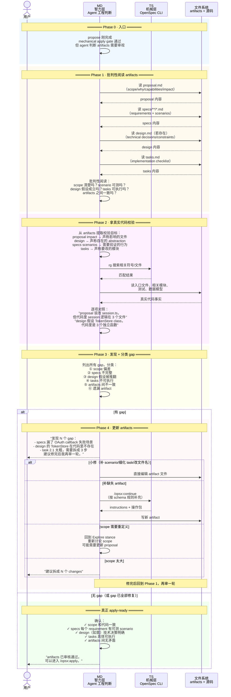

# 答案：Proposed → 通过 Explore 打磨 → 真正 Apply-Ready

## 一句话

Propose 的 mechanical apply gate（tasks.md 存在）只是一个文件系统事实。真正能开始实施的 artifacts 需要经过一轮或多轮 Explore 审视——把 artifacts 当成 Explore 的调查对象，拿真实代码去校验，发现 gap 就修，修完再审，直到 artifacts 足够具体、一致、可实现。

```text
Propose 产出 artifacts（mechanical apply-ready）
  → Explore stance 审视 artifacts + 真实代码
  → 发现 gap（scope 不准 / specs 漏 scenario / design 被代码推翻 / tasks 太粗）
  → 更新 artifacts（/opsx:continue 或直接编辑）
  → 再审
  → 真正 apply-ready
```

## 先分清两个 "apply-ready"

| | Mechanical apply-ready | 真正的 apply-ready |
|---|---|---|
| 谁说了算 | TS：`resolveArtifactOutputs()` 确认 tasks.md 是文件 | MD：agent 的工程判断 |
| 条件 | `apply.requires` 中的 artifact 都有输出文件 | artifacts 内容具体、一致、经代码验证可实现 |
| 典型 gap | 无（文件存在就过） | proposal scope 和代码事实冲突、specs 漏边界场景、design 假设被代码推翻、tasks 太粗无法执行 |
| 不满足时 | apply instructions 返回 `state: blocked`（仅限缺文件/无 checkbox） | apply instructions 返回 `state: ready`，但实施时会频繁暂停 |

关键的坑在这里：**mechanical apply-ready 通过了，apply instructions 返回 `state: ready`，但一实施就发现 artifacts 对不上真实代码。** 这个 FAQ 要解决的就是 mechanical ready 到真正 ready 之间的这段路。

## 为什么这段路不是 Propose 也不是 Apply

Propose 的目标是生成 artifacts、满足 DAG。它的 stance 是"按 schema 产出"，不是"严格审视产出的质量"。Propose skill 本身也会读代码、也会检查一致性，但它没有把"审出 gap 然后迭代"作为显式步骤。

Apply 的目标是按 tasks 改代码。它遇到 gap 会暂停，但暂停后建议的操作通常是"回 Explore 或更新 artifacts"——也就是说，Apply 阶段发现的 gap，实际修复发生在 Apply 之外。

所以这段迭代路本质上是一个 **Explore 动作**，只是 Explore 的对象不是"用户的一个模糊意图"，而是"已存在的 proposed artifacts"。

## 迭代循环

```text
┌─────────────────────────────────────────┐
│                                         │
│  1. 读 artifacts（proposal/specs/design/tasks）
│     ↓                                   │
│  2. 拿真实代码校验                       │
│     ↓                                   │
│  3. 发现 gap？                          │
│     ├─ 没有 → 真正 apply-ready，退出     │
│     └─ 有  → 4. 更新 artifacts           │
│                  ↓                      │
│               5. 回到 1                 │
└─────────────────────────────────────────┘
```

### Step 1：把 artifacts 当成 Explore 的调查对象

和初始 Explore 不同，这次不是从用户一句话开始。已经有完整的 proposal/specs/design/tasks。Explore 的姿态是**批判性阅读**：

- proposal：scope 描述是否和 specs 一致？有没有写了但 specs 没覆盖的能力？
- specs：每个 requirement 是否至少有一个可测试 scenario？ADDED/MODIFIED/REMOVED 的 delta 操作是否语义清楚？有没有漏边界情况（error、empty、concurrent、permission）？
- design：技术决策的假设在真实代码里是否成立？有没有提到具体模块/文件/接口？migration 策略是否写了？
- tasks：每个 task 是否具体到"知道该改哪个文件"的程度？checkbox 顺序是否反映真实依赖？

### Step 2：拿真实代码校验

这是 Explore 的老本行（EXP-05）。但这次有明确的校验目标：

| artifact 里的声称 | 真实代码里查什么 |
|---|---|
| proposal Impact: "src/auth/session.ts" | 这个文件真的存在吗？里面真的有 session 逻辑吗？ |
| design: "使用现有 token store" | token store 的接口是什么？和 design 里假设的一致吗？ |
| specs: "用户可以用 GitHub 登录" | 现有 auth route 是否已经预留了 provider 扩展点？ |
| tasks: "2.1 Add OAuth callback route" | 现有 route 注册方式是什么？需要改哪些文件？ |

这一步经常发现：proposal 里写的文件名是猜的、design 假设的 abstraction 在代码里不存在、specs 的 scenario 在现有测试框架下没法写。

### Step 3：发现 gap

常见 gap 类型：

| gap 类型 | 表现 | 例子 |
|---|---|---|
| scope 偏差 | proposal 说影响 A，代码事实显示影响 B+C | proposal 写 "改 session.ts"，实际 session 逻辑分散在 3 个文件 |
| specs 不完整 | requirement 没有 scenario 或漏边界情况 | "用户可以用 GitHub 登录"但没有写 "GitHub API 返回错误时怎么办" |
| design 假设被推翻 | design 提到的 abstraction 在代码里不存在或形态不同 | design 假设有 `TokenStore` class，代码里是三个独立函数 |
| tasks 不可执行 | task 太粗，不知道从哪下手 | "Implement OAuth login" — 是一个 task 还是十个？ |
| artifacts 之间不一致 | proposal 的 scope 和 tasks 的范围对不上 | proposal 说只做 GitHub OAuth，tasks 里出现了 Google OAuth |
| 遗漏 artifact | DAG 允许某 artifact 缺失，但实际需要 | spec-driven 的 design 不是 required，但这个 change 确实需要 design |

### Step 4：更新 artifacts

修 gap 的方式取决于 gap 的性质：

| 修法 | 适用场景 |
|---|---|
| 直接编辑 artifact 文件 | 小修：补一个 scenario、修正文件名、细化一个 task |
| `/opsx:continue` | 需要按 schema 规则补充缺失 artifact |
| 回到 Explore 重新讨论 | scope 需要重新定义、design 需要推翻重来 |
| 拆 change | 发现 scope 太大，一个 change 装不下 |

修完后，回到 Step 1 再审一轮。通常 1-3 轮就够了。如果超过 3 轮还在大改，说明最初的 Explore→Propose 收敛不够，可能需要回到 03 的流程重新做问题地图。

### Step 5：确认真正 apply-ready

真正 apply-ready 的最低条件：

- proposal 的 scope、impact 和真实代码一致
- specs 的每个 requirement 至少有 1 个可测试 scenario（含正常 + 至少 1 个边界）
- 如果 change 涉及跨模块、新依赖、数据迁移或安全——design 存在且技术决策明确
- 每个 task 具体到 agent 看到就能执行
- artifacts 之间没有矛盾（proposal scope = specs 覆盖 = tasks 范围）
- 用真实代码校验过，没有"artifact 说存在但代码里不存在"的文件或接口

## 时序图



## 关键交替模式

### 模式 1：MD 内循环（TS 几乎不参与）

和 Propose 的密集 MD↔TS 交替不同，本阶段的大部分工作是 MD 的内循环：

```text
MD 读 artifact → MD 读代码 → MD 对照 → MD 发现 gap → MD 修 artifact → MD 再审
```

TS 只在需要确认 artifact 状态（`openspec status`）或补充 artifact（`openspec instructions`）时才被调用。因为 artifacts 已经存在，不需要 TS 每轮重新计算 DAG。

### 模式 2：代码事实是最终裁判

```text
artifact 声称：session 逻辑在 src/auth/session.ts
代码事实：session 创建分散在 routes/auth.ts + core/session.ts + middleware/session.ts
结论：proposal impact 不准确，需要更新
```

这和初始 Explore 的 EXP-05 逻辑完全一致，只是这次的起点不是用户意图，而是 artifact 里的具体声称。

### 模式 3：迭代深度取决于 change 复杂度

```text
简单 change（加一个按钮、改一个配置）：
  1 轮审视就够了

中等 change（新增 OAuth login）：
  1-2 轮：第一轮通常发现 specs 漏 scenario、tasks 不够细

复杂 change（跨模块重构、数据迁移）：
  2-3 轮：第一轮看 scope 和 design，第二轮看 specs 和 tasks，
  第三轮确认修复
```

超过 3 轮还在大改 → 说明最初的 Explore→Propose 收敛不够。

## 和四个阶段的衔接

```text
03_explore-to-propose-change    Explore 判断是否 propose
        ↓
04_propose-to-apply-ready       Propose 生成 artifacts（mechanical apply-ready）
        ↓
05_iterate-to-apply-ready    ← 本 FAQ：Explore 审视 artifacts → 迭代打磨
        ↓
06_apply-ready-to-archive-ready Apply 实施代码
        ↓
07_archive-ready-to-archived    Archive 收束
```

它处于 propose 和 apply 之间，但工具上用的是 Explore 的 stance + Propose/Continue 的更新机制。它不是一条新命令，而是对现有命令的组合使用。

## 常见误区

### 误区 1：mechanical apply-ready 过了就直接 apply

最常见的问题。tasks.md 存在不代表 tasks 可执行。Propose 阶段 agent 可能写出 "Implement OAuth login" 这种一行 task——文件存在、gate 通过、apply instructions 返回 `ready`，但一实施就卡住。

### 误区 2：在 Apply 阶段边实施边修 artifacts

可以，但效率低。Apply 每次暂停都会丢上下文（"当前做到哪了"）。不如在 Apply 之前花 10-20 分钟把 artifacts 审一遍。

### 误区 3：审 artifacts 就是再跑一遍 Propose

不是。Propose 是生成 artifacts，它的 stance 是"产出"不是"审视"。用 Explore 的 stance 去读 artifacts 才能发现 gap。

### 误区 4：所有 change 都需要这个迭代

不需要。简单 change（改文案、加一个配置项、修一个明显 bug）通常 propose 产出就够用了。需要迭代的主要是中等以上复杂度的 change。

## 参考来源

源码引用基于 commit `970cb44`（Explore）、`750a03c`（Propose）、`ff4576f`（Apply）：

| 来源 | 用到的结论 |
|---|---|
| `src/core/templates/workflows/explore.ts` | Explore stance：可读代码、可审视架构、不可实施 |
| `src/core/templates/workflows/propose.ts` | Propose 的 artifact 生成和 mechanical gate |
| `src/core/templates/workflows/continue-change.ts` | `/opsx:continue` 的 artifact 补充机制 |
| `src/core/artifact-graph/outputs.ts` | mechanical apply-ready 的判定（文件存在性） |
| `src/commands/workflow/instructions.ts` | apply instructions 的 state 判定和 contextFiles |
| [`../03_explore-to-propose-change/answer.md`](../03_explore-to-propose-change/answer.md) | Explore 的 EXP-05（真实代码调查）和分流判断 |
| [`../04_propose-to-apply-ready/answer.md`](../04_propose-to-apply-ready/answer.md) | Propose 的 artifact DAG 和 apply gate |
| [`../04_propose-to-apply-ready/answer-prp10.md`](../04_propose-to-apply-ready/answer-prp10.md) | apply-ready 的两层定义 |
