# 答案：MD/TS 交替协作时序 — Apply 如何走到 Archive-Ready

## 一句话

Apply 是四条核心命令里唯一真正修改业务代码的阶段。TS 的角色从前两个阶段的"密集交替"退到"gate + 追踪"：TS 判断能不能开始、提供上下文文件列表、解析 checkbox 进度，但读代码、写代码、跑验证、更新 checkbox 全部是 MD 的事。

```text
MD 调 TS 拿 apply gate（state + contextFiles + tasks）
  → TS 返回 ready/blocked/all_done
  → MD 读所有 contextFiles（proposal/specs/design/tasks）
  → MD 逐个执行 pending task：读源码 → 写代码 → 验证 → 勾 checkbox
  → MD 必要时重调 TS 刷新进度
  → 遇到 guard 暂停，直到全部 done
```

## 时序图

```mermaid
sequenceDiagram
    actor User as 用户
    participant MD as MD<br/>智力层<br/>Agent 工程判断
    participant TS as TS<br/>机械层<br/>OpenSpec CLI
    participant FS as 文件系统<br/>源码 + artifacts

    %% ===== Phase 0: 入口 =====
    rect rgb(240, 248, 255)
        Note over User,FS: ══════ Phase 0 · 入口 · 选择 change ══════
        User->>MD: /opsx:apply [change-name]
        MD->>MD: 读 apply skill template
        MD->>MD: 确定 change：<br/>① 用户显式传入 name<br/>② 从对话上下文推断<br/>③ 唯一 active change → 自动选中<br/>④ 多个 → openspec list → 让用户选
        MD-->>User: "Using change: add-oauth-login"
    end

    %% ===== Phase 1: Status + Scope =====
    rect rgb(255, 250, 240)
        Note over User,FS: ══════ Phase 1 · status 确认 scope ══════
        MD->>TS: openspec status --change "X" --json
        TS->>FS: 读 change/.openspec.yaml<br/>扫描 artifacts
        FS-->>TS: schema + 文件状态
        TS-->>MD: schemaName, planningHome,<br/>changeRoot, actionContext,<br/>artifactPaths
        MD->>MD: 确认：schema、scope、<br/>allowedEditRoots<br/>（repo-local 约束）
    end

    %% ===== Phase 2: Apply Gate =====
    rect rgb(255, 240, 255)
        Note over User,FS: ══════ Phase 2 · apply instructions gate ══════
        MD->>TS: openspec instructions apply --change "X" --json
        TS->>TS: 检查 apply.requires 是否满足<br/>收集所有 artifact → contextFiles<br/>读 tasks.md → 解析 checkbox<br/>（正则：^\s*[-*]\s*\[([\sxX])\]\s*(.*)，允许缩进子任务）<br/>计算 progress
        TS-->>MD: state, contextFiles,<br/>progress{total, complete, remaining},<br/>tasks[{description, done}],<br/>instruction, [missingArtifacts]
    end

    %% ===== Branch: state =====
    alt state = "blocked"
        rect rgb(255, 240, 240)
            Note over User,FS: ══════ blocked · 不能实施 ══════
            MD->>MD: 原因：缺 required artifact /<br/>缺 tasks.md / tasks.md 无 checkbox
            MD-->>User: "Apply blocked。<br/>建议 /opsx:continue 补 artifact。"
        end
    else state = "all_done"
        rect rgb(240, 255, 240)
            Note over User,FS: ══════ all_done · 无需实施 ══════
            MD-->>User: "所有 tasks 已完成。<br/>建议 review + test 后<br/>/opsx:archive。"
        end
    else state = "ready"
        rect rgb(245, 255, 245)
            Note over User,FS: ══════ ready · 开始实施 ══════

            %% ===== Phase 3: 读上下文 =====
            rect rgb(250, 250, 250)
                Note over User,FS: Phase 3 · 读取 context files
                MD->>FS: 按 contextFiles 逐项读取：<br/>proposal.md（why / scope）<br/>specs/*.md（behavior / scenarios）<br/>design.md（technical decisions）<br/>tasks.md（implementation checklist）
                FS-->>MD: 全部 artifact 内容
                MD->>MD: 不能只靠记忆或 change name 写代码<br/>必须读完所有 contextFiles
            end

            %% ===== Phase 4: 展示进度 =====
            MD-->>User: "Change: add-oauth-login<br/>Schema: spec-driven<br/>Progress: 2/7 tasks complete<br/>Remaining: …"

            %% ===== Phase 5: Task Loop =====
            rect rgb(255, 255, 240)
                Note over User,FS: Phase 4 · task 实施循环
                loop 每个 done=false 的 task
                    MD->>MD: 选下一个 pending task<br/>（顺序来自 tasks.md）

                    %% 读相关代码
                    MD->>TS: rg 搜索相关符号/文件
                    TS-->>MD: 匹配行
                    MD->>FS: 读入口文件、相关模块、<br/>测试、现有 patterns
                    FS-->>MD: 源码内容

                    %% 实施
                    MD->>MD: 做最小、聚焦的代码修改<br/>沿用既有 patterns<br/>不夹带无关重构<br/>不提前实现后续 task

                    %% 验证
                    opt 有可运行的验证
                        MD->>TS: 运行相关测试 / lint / build
                        TS-->>MD: 结果
                    end

                    %% 更新 checkbox
                    MD->>FS: tasks.md 中对应行：<br/>- [ ] → - [x]
                    FS-->>MD: 写入完成

                    %% 可选：刷新进度
                    opt 需要刷新进度
                        MD->>TS: openspec instructions apply --change "X" --json
                        TS->>FS: 重新解析 tasks.md checkbox
                        FS-->>TS: 更新后的 checkbox 状态
                        TS-->>MD: 更新后的 progress, tasks
                    end
                end
            end

            %% ===== Guard Branches =====
            rect rgb(255, 248, 248)
                Note over User,FS: Phase 5 · guard 分支
                alt task 描述不清楚
                    MD-->>User: "Task 'Improve auth' 不够具体。<br/>暂停，建议更新 tasks.md。"
                else 实施暴露设计问题
                    MD->>MD: design 假设有 session abstraction<br/>代码实际只有 route-local cookie
                    MD-->>User: "代码事实推翻了 design 假设。<br/>建议回到 explore 讨论，<br/>更新 design.md 和 tasks.md。"
                else 测试失败且原因不清
                    MD-->>User: "测试失败，原因超出当前<br/>task scope。暂停待决策。"
                else 用户中断
                    MD-->>User: "已暂停。已完成 N/M tasks。<br/>当前进度：…"
                end
            end

            %% ===== Phase 6: All Done =====
            rect rgb(240, 255, 240)
                Note over User,FS: ══════ Phase 6 · 全部完成 → archive-ready ══════
                MD->>TS: openspec instructions apply --change "X" --json
                TS->>FS: 重新解析 tasks.md
                FS-->>TS: 全部 - [x]
                TS->>TS: complete == total → state: "all_done"
                TS-->>MD: state: "all_done",<br/>progress: {total:N, complete:N, remaining:0}
                MD-->>User: "Implementation Complete<br/>Change: add-oauth-login<br/>N/N tasks complete<br/>建议 review + test 后<br/>/opsx:archive"
            end
        end
    end
```



## 关键交替模式

### 模式 1：TS 判 gate → MD 分流

```text
TS: instructions apply --json
  → 检查 apply.requires
  → 解析 tasks.md checkbox
  → 返回 state: ready | blocked | all_done

MD: 根据 state 走不同分支
  → blocked: 不写代码，建议修 planning
  → all_done: 不写代码，建议 archive
  → ready: 读 contextFiles，进入 task loop
```

这是 apply 阶段 MD 和 TS 最重要的协作点。TS 不替 MD 决定"怎么做"，但 TS 决定"能不能做"。没有这个 gate，MD 可能在 planning 不完整时就动手写代码。

### 模式 2：TS 给 contextFiles → MD 读 → MD 写代码

```text
TS: contextFiles = {
  proposal: ["…/proposal.md"],
  specs: ["…/specs/auth/spec.md"],
  design: ["…/design.md"],
  tasks: ["…/tasks.md"]
}

MD: 逐项读取 → 理解 why/scope/behavior/decisions/checklist
MD: 写业务代码（src/routes/oauth.ts, test/auth/oauth.test.ts, …）
```

TS 不告诉 MD "改哪个源文件"。它只告诉 MD "读这些 planning 文件"。具体改哪些源码，是 MD 从 planning artifacts 和代码调查中自己判断的。这和 Explore 的 EXP-04/EXP-05 分工一致。

### 模式 3：MD 改文件 → MD 勾 checkbox → TS 重新算进度

```text
MD: 完成 task 2.1 → 写代码 → 测试通过
MD: tasks.md 里 - [ ] 2.1 → - [x] 2.1
MD: （可选）openspec instructions apply --json
TS: 重新解析 tasks.md → complete: 3/7 → remaining: 4
```

进度不在 agent 的口头总结里，也不在隐藏数据库里。它在 `tasks.md` checkbox 里，由 TS 的共享 parser `parseTaskLines()`（`src/utils/task-progress.ts`）实时解释——缩进的子任务也计入。MD 勾了才算，TS 扫了才认。

### 模式 4：MD 遇 guard → 暂停，不硬写

```text
MD 发现 design 假设和真实代码冲突
  → 不硬写代码
  → 暂停，输出：当前进度 + 具体阻塞 + 可选下一步
  → 建议回到 explore 或更新 artifacts
```

apply 不是 "phase lock"。发现 planning 问题时回写 artifacts 是允许的。这是 MD 的工程判断，TS 不参与这个决策。

## 和 Propose 的对比

| | Propose | Apply |
|---|---|---|
| TS 调用频率 | 极高（每轮 status + instructions，交替密集） | 中等（gate 时调一次，进度刷新按需） |
| MD 主要动作 | 按操作包写 artifact 内容 | 读源码、写业务代码、跑验证、勾 checkbox |
| TS 的核心输出 | artifact DAG + 操作包（模板、规则、依赖） | state gate + contextFiles + progress |
| 产物 | proposal.md, specs/, design.md, tasks.md | 修改后的业务代码 + 全部勾完的 tasks.md |
| MD 可以改什么 | planning artifacts（change 目录内） | 业务代码（src/, tests/, config）+ tasks.md checkbox |

## 参考来源

源码引用基于 commit `ff4576f`：

| 来源 | 用到的结论 |
|---|---|
| `src/core/templates/workflows/apply-change.ts` | apply skill 的完整步骤、guardrails、checkbox 更新、暂停条件 |
| `src/utils/task-progress.ts` + `src/commands/workflow/instructions.ts` | `parseTaskLines()`（共享 parser）、`generateApplyInstructions()`、state/progress/tasks 输出 |
| `src/core/artifact-graph/outputs.ts` | required artifact 输出文件判定 |
| `src/core/artifact-graph/instruction-loader.ts` | change context 和 contextFiles 收集 |
| `src/core/change-status-policy.ts` | `actionContext`（repo-local）语义 |
| `schemas/spec-driven/schema.yaml` | `apply.requires: [tasks]`、`tracks: tasks.md` |
| [`answer-app03.md`](answer-app03.md) | apply instructions JSON 细节 |
| [`answer-app06.md`](answer-app06.md) | task 循环和 checkbox 更新细节 |
| [`answer-app-guards.md`](answer-app-guards.md) | blocked/all_done/暂停条件细节 |
