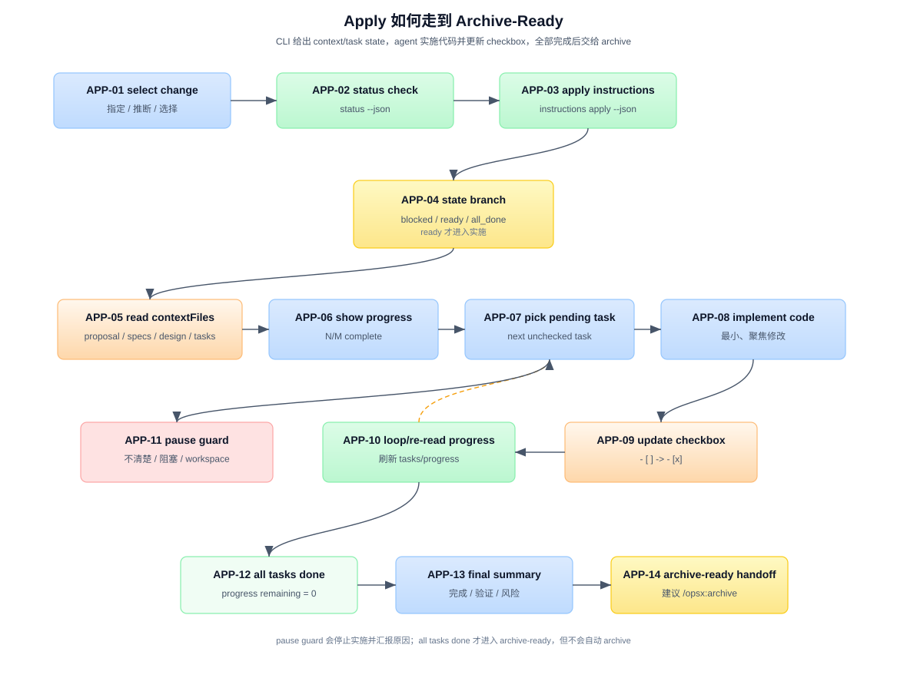

# 答案：Apply 如何从 Apply-Ready 走到 Archive-Ready

## 一句话

宿主的 apply workflow 是从 planning artifacts 进入真实代码修改的阶段。下文 `/opsx:apply` 是 Claude 示例；Codex v1.8.0 使用 `$openspec-apply-change`（装在 `.agents/skills/`）。它的核心循环是：

```text
选择 change
  -> status --json 确认 schema / scope / actionContext
  -> instructions apply --json 获取 contextFiles / operation inputs / tasks / state
  -> 读取所有 contextFiles
  -> 逐个执行 pending task
  -> 改业务代码
  -> 更新 tasks.md checkbox
  -> 直到所有 tasks done 或遇到暂停条件
```

CLI 不直接改业务代码。CLI 提供 apply gate、上下文文件列表、项目 `context`、`operations.apply.guidance`、task progress 和动态指令；agent 读取这些信息后实施代码并更新 checkbox。artifact `rules.*` 只用于生成 planning artifact，不能替代 Apply guidance。



图中编号说明：

| 编号 | 名称 | 在流程里做什么 |
|---|---|---|
| APP-01 | select change | 根据用户输入、对话上下文、唯一 active change 或用户选择确定 change。 |
| APP-02 | status check | 运行 `openspec status --change "<name>" --json`，读取 schema、planningHome、changeRoot、actionContext。 |
| APP-03 | apply instructions | 运行 `openspec instructions apply --change "<name>" --json`，获取 apply runtime 包（含 context 与 operation guidance）。 |
| APP-04 | state branch | 根据 `state` 分支：`blocked` 停止修 planning，`all_done` 建议 archive，`ready` 继续实施。 |
| APP-05 | read contextFiles | 读取 `contextFiles` 中所有 artifact 文件，不能凭记忆写代码。 |
| APP-06 | show progress | 展示 schema、progress、remaining tasks 和 CLI 返回的 instruction。 |
| APP-07 | pick pending task | 从 `tasks` 中选择下一个未完成 task。 |
| APP-08 | implement + verify | 按 task 做最小、聚焦的真实代码修改，并执行该 task 声明的 verification。 |
| APP-09 | update checkbox | verification 通过后才把 tracking file 中对应 checkbox 改成 done。 |
| APP-10 | loop/re-read progress | 继续下一个 pending task；必要时重新获取 apply instructions 刷新进度。 |
| APP-11 | pause guard | 任务不清、设计问题、错误阻塞或用户中断时暂停。 |
| APP-12 | all tasks done | tracking file 中所有 checkbox tasks 都已完成。 |
| APP-13 | final summary | 输出本轮完成任务、总体进度、测试/验证结果和剩余风险。 |
| APP-14 | archive-ready handoff | apply 完成后建议 archive；archive 是下一步，不属于 apply 本身。 |

细节展开：

- [`answer-app03.md`](answer-app03.md) — `instructions apply --json` 返回什么。
- [`answer-app06.md`](answer-app06.md) — task 实施循环和 checkbox 更新。
- [`answer-app-guards.md`](answer-app-guards.md) — blocked/all_done/暂停条件。

另外，从 MD/TS 交替协作的视角重新组织了整个流程，含完整 Mermaid 时序图：[`answer-sequence.md`](answer-sequence.md)。

## Step 1：选择 change

Claude 的 `/opsx:apply` 可带 change name（其他宿主使用自己的 invocation）：

```text
/opsx:apply add-oauth-login
```

如果没有显式 name，apply skill 的优先级是：

1. 从对话上下文推断用户刚才提到的 change。
2. 如果只有一个 active change，自动选中。
3. 如果有多个 active changes，运行 `openspec list --json`，让用户选择。

agent 应该明确宣布：

```text
Using change: <name>
```

这样用户知道现在要实施哪个 change，也知道可以切换到别的 change。

## Step 2：先跑 status，确认 schema 和 scope

agent 运行：

```bash
openspec status --change "<name>" --json
```

这一步不是为了重新做 propose，而是为了拿到 apply 前的 scope：

```text
schemaName
planningHome
changeRoot
actionContext
artifactPaths
artifacts
```

## Step 3：获取 apply runtime 包

agent 运行：

```bash
openspec instructions apply --change "<name>" --json
```

这个命令的输出是 apply 阶段的运行时输入，核心字段：

| 字段 | agent 怎么用 |
|---|---|
| `state` | 决定能不能实施，或是否已经完成。 |
| `contextFiles` | 必须先读取的 planning artifact 文件列表。 |
| `progress` | 当前 total/complete/remaining。 |
| `tasks` | 从 tracking file 解析出的 task 列表和 done 状态。 |
| `missingArtifacts` | 缺 required artifact 时才出现。 |
| `instruction` | schema apply 阶段的动态指导。 |
| operation inputs | 项目 `context` 与 `operations.apply.guidance`（如配置）；这是 Apply 专属项目指引，不是 `rules.apply`。 |

默认 `spec-driven` 的 context files 通常包括：

```text
proposal.md
specs/**/*.md
design.md
tasks.md
```

不同 schema 可以返回完全不同的 `contextFiles`，所以 agent 不能硬编码文件名。

## Step 4：按 state 分支

`instructions apply` 可能返回三种主要状态：

| state | 含义 | agent 行为 |
|---|---|---|
| `blocked` | 缺 required artifact、缺 tracking file，或 tracking file 没有 checkbox tasks。 | 停止实施，建议 `/opsx:continue` 或修复 planning artifact。 |
| `ready` | required artifacts 存在，并且有 pending tasks。 | 读取 context files，开始实施。 |
| `all_done` | tracking file 中所有 checkbox tasks 都完成。 | 不再实施，建议 review/test 后 archive。 |

注意：`tasks.md` 文件存在不等于 apply 一定 ready。如果文件里没有任何 checkbox task，apply instructions 会返回 `blocked`。

## Step 5：读取 context files

在写任何业务代码前，agent 必须读取 `contextFiles` 里的每个文件。

这一步的意义是：

```text
proposal -> why / scope
specs    -> expected behavior / scenarios
design   -> technical decisions / constraints
tasks    -> implementation checklist
```

agent 不应该只靠聊天记忆或 change name 实施。除逐一读取 `contextFiles` 外，还应遵循 operation input 中的 project context/guidance。OpenSpec 的工程取舍就是让真实上下文落在文件里，再由 CLI 明确告诉 agent 读哪些文件。

## Step 6：展示进度，然后开始 task loop

agent 应该展示：

```text
Change: <name>
Schema: <schemaName>
Progress: N/M tasks complete
Remaining tasks:
- ...
```

然后进入 pending task 循环：

```text
for each task where done = false:
  announce task
  implement minimal code change
  run the verification declared by that task
  update checkbox in tasks.md
  continue
```

apply 的 task 顺序来自 `tasks.md`，不是 CLI 再算一次 DAG。CLI 只解析 checkbox 和进度。

v1.9.0 起 apply 模板要求：若任务需要的工作**超出 spec/tasks 描述**，或你想靠缩小、推迟、接受例外来塞进范围，必须把新增范围摊开并暂停，不要默默吸收；只有指定行为全部落地才能勾 `- [x]`。这是 skill/command 文本，不是 CLI 硬门。

## Step 7：实施代码并更新 checkbox

apply 是唯一真正修改业务代码的阶段。agent 可以改：

```text
src/
tests/
package/config files
docs if task requires
```

但每个 task 应该保持最小、聚焦：

```text
Working on task 3/7: Add OAuth callback route
```

完成并通过该 task 自带的 verification 后，立即更新 tracking file：

```markdown
- [ ] 2.1 Add OAuth callback route — verify: run the focused callback tests
```

变成：

```markdown
- [x] 2.1 Add OAuth callback route — verify: run the focused callback tests
```

这一步很重要：OpenSpec 的 apply progress 来自 `tasks.md` checkbox，不来自 agent 的口头总结。

若 verification 无法执行或失败，保持 `- [ ]` 并暂停说明原因；不能先勾选再把验证留给“最后统一跑”。这项约束来自 v1.10.0 的 tasks 生成契约与 apply 工作方式，不改变既有 pause-on-scope 结论。

## Step 8：暂停条件

apply 不是盲目执行到底。遇到这些情况应该暂停：

- task 描述不清楚。
- 实施时发现 proposal/spec/design/tasks 不一致。
- 真实代码事实推翻了设计假设。
- 测试失败且原因不清。
- 用户中断或改变方向。

暂停时 agent 应该输出：

```text
当前 change
当前进度
已经完成的 tasks
遇到的问题
可选下一步
```

如果是 planning artifact 问题，建议回到宿主 continue workflow 或 explore 更新 artifacts，而不是硬写代码。

## Step 9：所有 tasks 完成后进入 archive-ready

当所有 checkbox 都是 done：

```text
progress.complete == progress.total
progress.remaining == 0
state 下一次会变成 all_done
```

agent 输出完成总结：

```text
Implementation Complete
Change: <name>
Progress: M/M tasks complete
Completed this session:
- ...
```

这时状态是 archive-ready：可以 review、跑测试、然后运行宿主 archive workflow。archive 会把 delta specs 合并回主 `openspec/specs/` 并移动 change 目录；它不是 apply 的一部分。

## 三方分工

| 角色 | 在 apply 中负责什么 |
|---|---|
| OpenSpec CLI | 判断 apply state，解析 checkbox，返回 contextFiles、progress、tasks、instruction。 |
| Agent | 读取 context files，实施代码，运行验证，更新 tasks checkbox，遇到问题暂停。 |
| 文件系统 | 保存 artifacts、业务代码改动和 `tasks.md` 进度状态。 |

## 常见误区

### 误区 1：apply 可以不读 artifacts，直接照 task 写代码

不行。task 只是执行清单，proposal/specs/design 才能告诉 agent 为什么做、行为应该是什么、技术约束是什么。

### 误区 2：CLI 会替 agent 修改代码

不会。CLI 只返回 apply instructions。代码修改由宿主 coding agent 完成。

### 误区 3：checkbox 是装饰

不是。checkbox 是 apply progress 的事实源。没有 checkbox，`tasks.md` 就无法被 apply 正确追踪。

### 误区 4：进入 apply 后 planning 不能再改

不是 phase lock。实施中发现设计问题时，应该暂停并建议更新 artifacts，然后再继续 apply。

### 误区 5：所有 tasks 完成就自动 archive

不会。apply 完成后只是 archive-ready。archive 需要显式运行，因为它会合并 specs 并移动 change。

## 参考来源

源码引用以 v1.10.0（release tag `v1.10.0` = `1ebddd1`）为当前基线：

| 来源 | 用到的结论 |
|---|---|
| `src/core/templates/workflows/apply-change.ts` | apply skill 的完整步骤、guardrails、输出格式和 fluid workflow 说明 |
| `src/commands/workflow/instructions.ts` | `generateApplyInstructions()`、task checkbox 解析、state/progress/contextFiles 输出 |
| `src/core/artifact-graph/outputs.ts` | required artifact 输出文件判定 |
| `src/core/artifact-graph/instruction-loader.ts` | change context 和 artifact 文件收集 |
| `src/core/change-status-policy.ts` | `actionContext`（repo-local）的语义 |
| `schemas/spec-driven/schema.yaml` | 默认 `apply.requires: [tasks]`、`tracks: tasks.md` 和 apply instruction |
| [`../../_digested/internal-spec-driven/03-apply-实施执行.md`](../../_digested/internal-spec-driven/03-apply-实施执行.md) | apply gate、checkbox、实施循环、暂停条件 |
| [`../04_propose-to-apply-ready/answer.md`](../04_propose-to-apply-ready/answer.md) | apply-ready 的前置状态 |


## v1.13.0 补充：apply 遇到无 delta spec 的 change 会警告

`openspec instructions apply` 之前只要 tasks 存在就报 ready，哪怕完全没有 spec delta——而这正是 `openspec validate` 拒绝的状态（`8ba4ac1b`）。v1.13.0 起 text 与 `--json` 都会警告，并给出两条出路：补写 specs，或在 `.openspec.yaml` 显式声明 `skip_specs: true`。纯重构/文档类 change 如果确实无行为变化，走后者是合法路径。
