# 答案：MD/TS 交替协作时序 — Archive-Ready 如何走到 Archived

## 一句话

Archive 是四个阶段里 TS 比重最高的。前三个阶段（Explore、Propose、Apply）都是 MD 主导、TS 提供状态和指令；archive 反了过来——TS 的 `ArchiveCommand.execute()` 程序化执行验证、合并、移动，MD（agent 或用户）只出现在决策点：选择 change、确认 warning、决定是否跳过 spec updates。

但还有第二条路径：`/opsx:archive` agent 模板会在调 CLI 之前做 MD 主导的 pre-flight checks（status、sync assessment），形成一段短的 MD↔TS 交替前奏。

## 时序图（双路径）

```mermaid
sequenceDiagram
    actor User as 用户
    participant MD as MD<br/>智力层<br/>Agent/用户判断
    participant TS as TS<br/>机械层<br/>OpenSpec CLI
    participant FS as 文件系统<br/>specs/ changes/

    %% ===== Path A: CLI 直调 =====
    rect rgb(255, 255, 250)
        Note over User,FS: ══════ 路径 A · openspec archive（CLI 直调，TS 主导） ══════

        %% Phase 0
        rect rgb(240, 248, 255)
            Note over User,FS: Phase 0 · 选择 change
            alt 用户传了 change name
                User->>TS: openspec archive add-oauth-login
            else 未传 name
                TS->>FS: 扫描 openspec/changes/<br/>排除 archive/
                FS-->>TS: active change 列表
                TS-->>User: 交互选择（inquirer）
                User->>TS: 选择 change
            end
        end

        %% Phase 1
        rect rgb(255, 250, 240)
            Note over User,FS: Phase 1 · 目录验证
            TS->>FS: 检查 openspec/changes/ 存在
            FS-->>TS: ✓
            TS->>FS: 检查 openspec/changes/<change>/ 是目录
            FS-->>TS: ✓
        end

        %% Phase 2
        rect rgb(255, 240, 255)
            Note over User,FS: Phase 2 · validation pass
            opt proposal.md 存在
                TS->>FS: 读 proposal.md
                FS-->>TS: 内容
                TS->>TS: Validator.validateChange()<br/>不通过 → warning（不阻塞）
            end
            opt 存在 delta-formatted specs
                TS->>FS: 读 change/specs/*/spec.md
                FS-->>TS: delta spec 内容
                TS->>TS: Validator.validateChangeDeltaSpecs()<br/>解析 ADDED/MODIFIED/REMOVED/RENAMED<br/>有 ERROR → hard stop
            end
        end

        %% Phase 3
        rect rgb(255, 255, 240)
            Note over User,FS: Phase 3 · task progress check
            TS->>FS: 读 tasks.md（若存在）
            FS-->>TS: checkbox 内容
            TS->>TS: getTaskProgressForChange()<br/>统计 - [ ] / - [x]
            alt 有未完成 tasks
                TS-->>User: "Warning: N incomplete task(s).<br/>Continue?"
                User->>TS: y/N
            else 无 tasks.md
                TS->>TS: total=0, complete=0<br/>"No tasks"（不阻塞）
            end
        end

        %% Phase 4
        rect rgb(245, 255, 245)
            Note over User,FS: Phase 4 · 查找 + 确认 spec updates
            alt 无 --skip-specs
                TS->>FS: findSpecUpdates()<br/>扫描 change/specs/*/spec.md<br/>映射到 openspec/specs/*/spec.md
                FS-->>TS: SpecUpdate[]{source, target, exists}
                alt 有 spec updates
                    TS-->>User: "Specs to update:<br/>  user-auth: update<br/>  billing: create<br/>Proceed?"
                    User->>TS: y/N
                else 无 spec updates
                    TS->>TS: 跳过 spec 更新，仍可 archive
                end
            else --skip-specs
                TS->>TS: 完全跳过 spec update
            end
        end

        %% Phase 5
        rect rgb(248, 248, 255)
            Note over User,FS: Phase 5 · build + merge（纯 TS，无 MD 参与）
            alt 用户确认更新 specs
                TS->>TS: 对所有 updates 预构建：<br/>buildUpdatedSpec(update, changeName)
                TS->>FS: 读 main spec（或创建 skeleton）
                FS-->>TS: main spec 内容
                TS->>TS: findMainSpecStructureIssues()<br/>（拦截 delta header 混入 main spec）
                TS->>TS: 解析 delta plan：<br/>added[], modified[], removed[], renamed[]
                TS->>TS: 预验证：<br/>同 section 不重复、不同 section 不冲突、<br/>RENAMED TO 不和 ADDED 冲突
                TS->>TS: 按顺序应用操作：<br/>RENAMED → REMOVED → MODIFIED → ADDED
                Note right of TS: MODIFIED 是完整替换，<br/>不是智能 patch
                TS->>TS: 重建 spec.md：<br/>已有 requirement 保持原序<br/>新增追加到 ## Requirements 末尾
                TS->>TS: Validator.validateSpecContent()<br/>验证 rebuilt spec
                TS->>FS: writeUpdatedSpec()<br/>写入 openspec/specs/<capability>/spec.md
                FS-->>TS: 写入完成
                TS-->>User: "+ 2 added  ~ 1 modified<br/>  - 0 removed  -> 1 renamed"
            end
        end

        %% Phase 6
        rect rgb(255, 248, 248)
            Note over User,FS: Phase 6 · move change 目录
            TS->>TS: 生成目标名：<br/>YYYY-MM-DD-<changeName>
            TS->>FS: 检查 archive target 是否已存在
            FS-->>TS: 不存在 ✓
            TS->>FS: fs.rename() 移动 change 目录<br/>→ openspec/changes/archive/YYYY-MM-DD-<name>/
            FS-->>TS: 移动完成
            TS-->>User: "Change 'add-oauth-login' archived<br/>Specs updated: 1"
        end
    end

    %% ===== Path B: OPSX 模板 =====
    rect rgb(250, 255, 250)
        Note over User,FS: ══════ 路径 B · /opsx:archive（agent 模板，MD↔TS 交替前奏） ══════

        User->>MD: /opsx:archive [change-name]
        MD->>MD: 读 archive skill template

        rect rgb(245, 245, 255)
            Note over User,FS: MD↔TS 交替 pre-flight
            MD->>TS: openspec status --change "X" --json
            TS-->>MD: artifact 完成状态
            MD->>MD: 确认所有 artifacts done

            MD->>TS: openspec list --json（若无 name）
            TS-->>MD: active changes

            MD->>MD: delta spec sync assessment：<br/>读 change delta specs + main specs<br/>判断是否需要 sync 再 archive<br/>（agent-driven merge，<br/>非 CLI 的 programmatic merge）

            MD-->>User: "archive 前建议确认：<br/>- tasks 全部完成 ✓<br/>- delta specs 与 main 同步 ✓<br/>确认 archive？"
            User->>MD: 确认
        end

        MD->>TS: openspec archive <name> --yes
        Note over TS,FS: 此后进入路径 A 的 Phase 1-6<br/>（TS 主导的程序化 archive）
    end
```



## archive 的 MD/TS 比重反转

前三个阶段的 MD/TS 交替规律在 archive 里被打破：

| 阶段 | MD 比重 | TS 比重 | 特征 |
|---|---|---|---|
| Explore | 极高 | 低 | MD 读代码、推理、合成问题地图；TS 只提供 `list` 和 `status` |
| Propose | 中高 | 中高 | 紧密交替：MD 调 TS 取操作包 → MD 写 artifact → MD 再调 TS 刷新 |
| Apply | 高 | 中 | MD 实施代码；TS 提供 gate 和进度追踪 |
| **Archive** | **低** | **极高** | TS 程序化执行 validate → merge → move；MD 只在决策点出现 |

这不是设计缺陷，而是 archive 的工程本质决定的：merge delta specs 到 main specs 是一个机械操作（RENAMED → REMOVED → MODIFIED → ADDED），不需要智力判断。真正需要智力的是 "merge 之前 delta 和 main 是否已经合理同步"——这个判断在 `/opsx:archive` 路径里由 MD 的 sync assessment 完成，在 CLI 直调路径里由用户承担。

## 关键交替模式

### 模式 1：TS 程序化验证 → MD(User) 确认

```text
TS: validateChangeDeltaSpecs() → ERROR
TS: "Validation failed. Please fix the errors before archiving."

MD(User): 修复 delta spec
MD(User): 重新运行 openspec archive
```

TS 的验证是 hard gate。不通过就不能继续。但修复 delta spec 的内容是 MD 的事。

### 模式 2：TS 统计进度 → MD(User) 决定

```text
TS: getTaskProgressForChange() → 3/7 complete
TS: "Warning: 4 incomplete task(s) found. Continue?"

MD(User): 判断是否接受 incomplete tasks 下 archive
  → y: 继续（warning gate，不是 hard gate）
  → n: 取消，回 apply 补 tasks
```

这和 apply 的 `state: "blocked"` 不同。Apply 阶段 tasks.md 缺失或无 checkbox 是 hard block；archive CLI 里只是 warning + confirmation。

### 模式 3：TS 合并算法（纯机械，零 MD）

```text
TS: buildUpdatedSpec()
  1. 解析 delta plan（ADDED/MODIFIED/REMOVED/RENAMED）
  2. 预验证（去重、冲突检查）
  3. 读 main spec baseline（或创建 skeleton）
  4. 按固定顺序应用操作：RENAMED → REMOVED → MODIFIED → ADDED
  5. 重建 spec.md（保持原序，新增追加末尾）
  6. 验证 rebuilt spec
  7. 写入

全程不需要 MD 参与。
```

操作顺序是语义保证，不是实现细节。RENAMED 先发生，后续 MODIFIED 才能引用新名字；REMOVED 先删掉不再存在的 requirement；MODIFIED 替换完整 block；ADDED 最后加入，避免和 rename target 冲突。

### 模式 4（仅 OPSX 路径）：MD 做 sync assessment → 再交 TS 执行

```text
MD: openspec status --json → artifacts 都 done
MD: 读 change delta specs + main specs
MD: 判断 sync 状态：
  - delta 是否已经合理反映到 main？
  - 是否需要先 openspec-sync-specs？
  - 有没有冲突需要用户决策？
MD→User: sync assessment 结果 + 确认
User→MD: 确认
MD→TS: openspec archive <name> --yes
TS→: 进入程序化 archive（路径 A Phase 1-6）
```

OPSX 路径的价值就是这一段 MD 前奏。CLI 路径假设用户在调命令之前已经自己做完了这些判断。

## guard 强度分层

archive 的 guard 不是二元 "通过/不通过"。它有明确分层：

| 强度 | 触发条件 | 行为 |
|---|---|---|
| **hard stop** | delta spec ERROR、buildUpdatedSpec 失败、rebuilt validation 失败、archive target 已存在 | 不写 specs，不移动 change |
| **warning + confirm** | proposal validation 不通过、tasks 未完成、spec updates 待确认、--no-validate | 用户确认后继续 |
| **skip option** | --skip-specs | 用户显式绕过 spec update |
| **no guard** | 无 tasks.md、无 delta specs | 静默继续 |

## 和 Apply 的对比

| | Apply | Archive |
|---|---|---|
| TS 核心动作 | 解析 checkbox → state + progress | 程序化 merge specs → move directory |
| MD 核心动作 | 读 context、写业务代码、勾 checkbox | 确认 warning、sync assessment（OPSX 路径） |
| 产物 | 修改后的业务代码 | 更新的 main specs + archived change 目录 |
| 可逆性 | 代码可 git revert | 无内置 unarchive |
| task 未完成的含义 | state: "blocked"（hard） | warning（soft，可继续） |

## 参考来源

源码引用基于 commit `487ea92`：

| 来源 | 用到的结论 |
|---|---|
| `src/core/archive.ts` | `ArchiveCommand.execute()` 主流程、validate、task warning、spec update、move |
| `src/core/specs-apply.ts` | `findSpecUpdates()`、`buildUpdatedSpec()`、operation ordering、skeleton、write |
| `src/core/validation/validator.ts` | proposal/delta/main spec validation 语义 |
| `src/core/parsers/requirement-blocks.ts` | delta spec parsing、requirement block 解析 |
| `src/core/parsers/spec-structure.ts` | main spec structure guard（delta header 混入检测） |
| `src/utils/task-progress.ts` | archive 阶段 task checkbox 统计 |
| `src/core/templates/workflows/archive-change.ts` | `/opsx:archive` 模板层行为 |
| `src/core/templates/workflows/sync-specs.ts` | agent-driven sync 模板 |
| [`answer-arc03.md`](answer-arc03.md) | CLI 主流程和 flags |
| [`answer-arc07.md`](answer-arc07.md) | delta merge 算法细节 |
| [`answer-arc-guards.md`](answer-arc-guards.md) | hard stop/warning/skip/risk 分层 |
