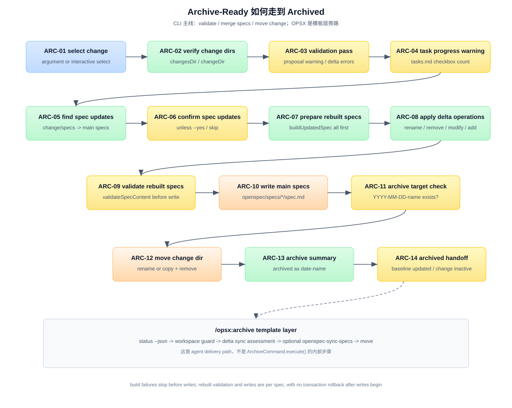

# 答案：Archive-Ready 如何走到 Archived

## 一句话

`openspec archive` 是 change 生命周期的收束动作。它不实施业务代码，而是把已经完成的 change 从“增量工作区”吸收到“正式 capability 基线”：

```text
选择 active change
  -> 验证 change 目录存在
  -> 验证 proposal / delta specs
  -> 检查 tasks 进度并必要时确认
  -> 查找 change/specs 下的 delta specs
  -> 构建 rebuilt main specs
  -> 写回 openspec/specs/
  -> 移动 change 到 openspec/changes/archive/YYYY-MM-DD-<name>/
```

主角是 CLI。`ArchiveCommand.execute()` 负责验证、合并和移动；agent 或用户负责选择 change、确认 warnings，并理解是否跳过了 spec updates。



图中编号说明：

| 编号 | 名称 | 在流程里做什么 |
|---|---|---|
| ARC-01 | select change | 用户传入 change name，或 CLI 交互选择 active change。 |
| ARC-02 | verify change dirs | 检查 `openspec/changes/` 和目标 change 目录存在。 |
| ARC-03 | validation pass | 验证 `proposal.md` 和 delta specs；delta spec ERROR 会阻塞 archive。 |
| ARC-04 | task progress warning | 读取 `tasks.md`，统计 checkbox；未完成 tasks 会 warning 并要求确认。 |
| ARC-05 | find spec updates | 扫描 `change/specs/*/spec.md`，映射到主 `openspec/specs/*/spec.md`。 |
| ARC-06 | confirm spec updates | 如果有 spec updates，除 `--yes` 外会询问是否更新主 specs。 |
| ARC-07 | prepare rebuilt specs | 对所有 delta specs 先调用 `buildUpdatedSpec()`，写入前完成预构建。 |
| ARC-08 | apply delta operations | 按 RENAMED → REMOVED → MODIFIED → ADDED 合并 requirement blocks。 |
| ARC-09 | validate rebuilt specs | 写入前调用 `validateSpecContent()` 验证 rebuilt 主 spec。 |
| ARC-10 | write main specs | 把 rebuilt 内容写回 `openspec/specs/<capability>/spec.md`。 |
| ARC-11 | archive target check | 生成 `YYYY-MM-DD-<change>`，检查目标 archive 目录是否已存在。 |
| ARC-12 | move change dir | 创建 archive 目录并移动 active change；必要时 copy + remove fallback。 |
| ARC-13 | archive summary | 输出 change 已归档和 spec update totals。 |
| ARC-14 | archived handoff | change 不再 active；主 specs 成为新的 formal baseline。 |

细节展开：

- [`answer-arc03.md`](answer-arc03.md) — `ArchiveCommand.execute()` 的主流程和 flags。
- [`answer-arc07.md`](answer-arc07.md) — delta spec merge 算法。
- [`answer-arc-opsx.md`](answer-arc-opsx.md) — `/opsx:archive` 与 CLI 的区别。
- [`answer-arc-guards.md`](answer-arc-guards.md) — 停止、warning、跳过和风险条件。

另外，从 MD/TS 交替协作的视角重新组织了整个流程，含双路径（CLI + OPSX）Mermaid 时序图：[`answer-sequence.md`](answer-sequence.md)。

## Step 1：选择 active change

CLI 可以直接接收 change name：

```bash
openspec archive add-oauth-login
```

如果没有传 name，`ArchiveCommand.execute()` 会进入交互选择：

```text
Select a change to archive
```

选择列表来自 `openspec/changes/` 下的目录，排除 `archive/`。这意味着 archived change 不会再作为 active change 被选中。

## Step 2：确认目录存在

CLI 首先确认：

```text
openspec/changes/             存在
openspec/changes/<change>/    是目录
```

如果没有 OpenSpec changes 目录，会报：

```text
No OpenSpec changes directory found. Run 'openspec init' first.
```

如果指定 change 不存在，会报：

```text
Change '<name>' not found.
```

这一层还没有合并 spec，也没有移动目录，只是确认 active change 容器存在。

## Step 3：验证 proposal 和 delta specs

默认 archive 会验证 change 内容，除非传：

```bash
openspec archive <name> --no-validate
```

验证分两类。

### proposal 验证

如果有 `proposal.md`，CLI 调 `Validator.validateChange()`。

proposal validation 是信息性的：不通过会打印 warning，但不会阻止 archive。

### delta spec 验证

如果 change 下存在 delta-formatted specs：

```text
openspec/changes/<change>/specs/<capability>/spec.md
```

并且内容里有：

```text
## ADDED Requirements
## MODIFIED Requirements
## REMOVED Requirements
## RENAMED Requirements
```

CLI 会调用 `Validator.validateChangeDeltaSpecs()`。这里如果有 ERROR，会停止 archive：

```text
Validation failed. Please fix the errors before archiving.
```

这很重要：archive 是把 delta spec 写进正式 baseline 的入口，所以 delta spec 的结构错误不能被静默吸收。

## Step 4：检查 tasks 完成度

archive 会读取：

```text
openspec/changes/<change>/tasks.md
```

然后用 checkbox 统计进度：

```text
- [ ] 未完成
- [x] 完成
- [X] 完成
```

如果没有 `tasks.md`，进度是 `No tasks`，不会阻止 archive。

如果还有未完成 tasks：

```text
Warning: N incomplete task(s) found. Continue?
```

用户确认后仍可继续。也就是说，task completion 在 CLI archive 中是 warning gate，不是绝对 hard gate。正常 workflow 下 apply 已经把 tasks 全部勾完；archive 这里是最后一道防误操作提示。

## Step 5：查找需要合并的 delta specs

如果没有 `--skip-specs`，CLI 调用：

```text
findSpecUpdates(changeDir, mainSpecsDir)
```

它扫描：

```text
openspec/changes/<change>/specs/<capability>/spec.md
```

并映射到：

```text
openspec/specs/<capability>/spec.md
```

每个 `SpecUpdate` 记录：

```text
source  change delta spec
target  main baseline spec
exists  target 是否已存在
```

如果没有 change specs，archive 仍然可以完成，只是不会更新主 specs。

## Step 6：确认是否更新主 specs

如果找到 spec updates，CLI 会显示：

```text
Specs to update:
  user-auth: update
  billing: create
```

没有 `--yes` 时会询问：

```text
Proceed with spec updates?
```

如果用户拒绝，CLI 会打印：

```text
Skipping spec updates. Proceeding with archive.
```

然后仍然移动 change 到 archive。这个行为要记清楚：**archived 不必然意味着主 specs 被更新**，如果用户拒绝或使用 `--skip-specs`，delta specs 只会保留在 archived change 里。

## Step 7：构建 rebuilt specs，先准备再写入

如果用户选择更新 specs，CLI 不会边读边写。它先对所有 updates 调用：

```text
buildUpdatedSpec(update, changeName)
```

得到：

```text
rebuilt content
operation counts
```

只要其中任何一个 spec 在构建阶段失败，CLI 会输出：

```text
Aborted. No files were changed.
```

并且不会移动 change。

这一步提供了一个重要安全边界：多 spec change 中，如果第二个 spec 合并失败，第一个 spec 不会先被写入。

## Step 8：合并 delta operations

`buildUpdatedSpec()` 的核心语义是：

```text
读取 change delta spec
读取或创建 main spec baseline
解析 ADDED / MODIFIED / REMOVED / RENAMED
在内存里更新 requirement blocks
重建完整 spec.md
```

操作顺序固定：

```text
RENAMED -> REMOVED -> MODIFIED -> ADDED
```

这个顺序不是实现细节，而是语义保证：

- rename 先发生，后续 modify 才能引用新名字。
- remove 先删掉不再存在的 requirement。
- modify 替换保留的完整 requirement block。
- add 最后加入新 requirement，避免和 rename target 冲突。

注意：CLI 的 `MODIFIED` 是完整替换，不是智能 patch。delta spec 里必须放完整 requirement block，包括 scenarios。

## Step 9：验证 rebuilt spec

构建完所有 rebuilt specs 后，CLI 遍历 prepared 列表。对每个 rebuilt spec，在写该 spec 前调用：

```text
Validator.validateSpecContent(specName, rebuilt)
```

如果验证失败，CLI 会提示：

```text
Validation errors in rebuilt spec for <specName> (will not write changes)
Aborted. No files were changed.
```

这条提示在当前失败点之前成立：如果失败发生在第一个待写 spec，确实没有 spec 被写入；如果前面的 spec 已经验证并写入，后续 spec 再失败，CLI 没有事务式回滚，已经写入的主 spec 不会自动恢复。

换句话说，`buildUpdatedSpec()` 阶段是全量预构建，失败会在任何写入前中止；`validateSpecContent()` 和 `writeUpdatedSpec()` 是逐项执行，进入写入循环后没有跨 spec transaction。

## Step 10：写回主 specs

单个 rebuilt spec 验证通过后，CLI 写入：

```text
openspec/specs/<capability>/spec.md
```

并输出每个 capability 的统计：

```text
Applying changes to openspec/specs/user-auth/spec.md:
  + 2 added
  ~ 1 modified
  - 0 removed
  -> 1 renamed
```

多 capability change 会输出 totals。

这一步之后，`openspec/specs/` 代表新的 formal baseline。后续 explore/propose 都应该以这里为当前 capability 基线。

## Step 11：生成 archive 目标并检查冲突

CLI 生成 archive 名：

```text
YYYY-MM-DD-<changeName>
```

例如：

```text
2026-06-14-add-oauth-login
```

目标路径：

```text
openspec/changes/archive/YYYY-MM-DD-<changeName>/
```

如果目标已经存在，archive 会失败：

```text
Archive 'YYYY-MM-DD-<changeName>' already exists.
```

这时不会覆盖已有 archive。

## Step 12：移动 change 目录

最后 CLI 创建 `archive/` 目录，并移动：

```text
openspec/changes/<change>/
  -> openspec/changes/archive/YYYY-MM-DD-<change>/
```

移动优先使用 `fs.rename()`。如果遇到 `EPERM` 或 `EXDEV`，会 fallback 到 copy directory 后删除源目录。

`.openspec.yaml`、`proposal.md`、`specs/`、`design.md`、`tasks.md` 都会随着整个 change 目录一起移动。

## Step 13：archived 的精确定义

archive 完成后，文件系统状态是：

```text
openspec/specs/<capability>/spec.md
  已成为新的正式 baseline

openspec/changes/<change>/
  不再存在

openspec/changes/archive/YYYY-MM-DD-<change>/
  保存原 change artifacts 和 metadata
```

如果用户跳过 spec updates，则第一条不成立：主 specs 没有被更新，但 change artifacts 仍被移到了 archive。

## Step 14：为什么 `/opsx:archive` 看起来不一样

`/opsx:archive` 是 agent 模板，不是 `ArchiveCommand.execute()` 的逐字封装。

模板会先做：

```text
openspec status --change "<name>" --json
artifact completion check

delta spec sync assessment
```

它还可能调用 `openspec-sync-specs` 做 agent-driven sync。这个 sync 路径和 CLI 的 programmatic `buildUpdatedSpec()` 不同：agent 会读 delta spec 和 main spec，然后智能合并。

所以读源码时要分层：

| 路径 | 负责什么 |
|---|---|
| `openspec archive` CLI | 程序化 validate、merge、move。 |
| `/opsx:archive` 模板 | 指导 agent 做 status/sync assessment/user confirmation/move。 |
| `openspec-sync-specs` 模板 | agent-driven spec merge，可独立于 archive 调用。 |

本 FAQ 的主线是 CLI；OPSX 差异见 [`answer-arc-opsx.md`](answer-arc-opsx.md)。

## 三方分工

| 角色 | 在 archive 中负责什么 |
|---|---|
| OpenSpec CLI | 验证 change、统计 tasks、合并 delta specs、移动 change 目录。 |
| 用户 / Agent | 选择 change，确认 warnings，决定是否跳过 spec updates 或 validation。 |
| 文件系统 | 保存正式 `openspec/specs/` baseline 和 archived change 记录。 |

## 常见误区

### 误区 1：archive 会继续改业务代码

不会。业务代码应该在 apply 阶段完成。archive 只处理 OpenSpec 文件状态：主 specs 和 change 目录。

### 误区 2：tasks 没全完成，CLI 一定拒绝 archive

不会。CLI 会 warning 并要求确认。正常流程应先完成 tasks，但 CLI 允许用户显式继续。

### 误区 3：archived 一定代表 specs 已合并

不一定。`--skip-specs` 或用户拒绝 spec updates 时，change 仍会 archive，但主 `openspec/specs/` 不会吸收 delta。

### 误区 4：CLI archive 和 `/opsx:archive` 是同一个东西

不是。CLI 是程序执行路径；OPSX 是 agent 操作模板。它们目标相近，但内部步骤和合并方式不完全相同。

### 误区 5：archive 是可逆操作

没有内置 unarchive。archive 后 active change 消失，恢复需要手工移动目录或重建 change。

## 参考来源

源码引用基于 commit `487ea92`：

| 来源 | 用到的结论 |
|---|---|
| `src/core/archive.ts` | `ArchiveCommand.execute()` 主流程、validation、task warning、spec updates、move directory |
| `src/core/specs-apply.ts` | `findSpecUpdates()`、`buildUpdatedSpec()`、`writeUpdatedSpec()` 和 delta merge 顺序 |
| `src/core/validation/validator.ts` | proposal/delta/main spec validation 语义 |
| `src/core/parsers/requirement-blocks.ts` | delta spec parsing、requirement block parsing、name normalization |
| `src/core/parsers/spec-structure.ts` | main spec 结构错误检查 |
| `src/utils/task-progress.ts` | archive 阶段 task checkbox 统计 |
| `src/cli/index.ts` | `archive [change-name]` command 和 flags |
| `src/core/templates/workflows/archive-change.ts` | `/opsx:archive` 模板层行为 |
| `src/core/templates/workflows/sync-specs.ts` | agent-driven sync 模板 |
| [`../../_digested/internal-spec-driven/04-archive-归档合并.md`](../../_digested/internal-spec-driven/04-archive-归档合并.md) | archive validate/merge/move 机制消化 |
| [`../06_apply-ready-to-archive-ready/answer.md`](../06_apply-ready-to-archive-ready/answer.md) | archive-ready 的前置状态 |
