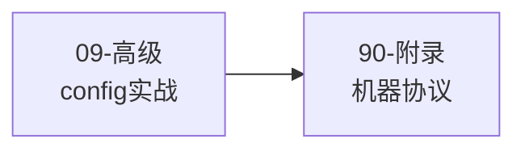

# OpenSpec 手册 · 新版总导读

> 核心原则只有两条：**先会用，再懂概念，最后看机制**；**先讲人用的，再讲机器怎么跑**。

---

## OpenSpec 核心哲学：为什么这样设计

在开始学习前，先理解 OpenSpec 的 5 条设计哲学。这些不是口号，而是每个设计决策背后的真实动机：

| 哲学 | 表面意思 | 背后的真实痛点 | OpenSpec 的解法 |
|------|---------|--------------|--------------|
| **fluid not rigid** | 流动不僵化 | 传统 spec 流程有"阶段锁"，需求变了也不能回头改 | 任何 artifact 随时可改，没有阶段门 |
| **iterative not waterfall** | 迭代不瀑布 | 瀑布式要求"先把所有需求想清楚"，但现实中需求是边做边清晰的 | 每个 change 是一个小迭代，允许不完整 |
| **easy not complex** | 简单不复杂 | 重型 spec 工具（如 Spec Kit）需要大量仪式感，团队不愿用 | 最小化摩擦，3 个命令就能完成一个 change |
| **brownfield not just greenfield** | 棕地优先 | 大多数真实项目都是"接手老代码"，不是从零开始 | `specs/` 是对现有系统的描述，change 是增量修改 |
| **scalable** | 可扩展 | 个人项目和企业项目的需求差异巨大 | profile 机制允许选择工作流复杂度 |

**一句话理解**：OpenSpec 不是为"完美的新项目"设计的，而是为"真实世界里的增量改代码"设计的。

### OpenSpec 不是什么

看源码或讨论时容易产生的误解，这里先澄清：

| 容易误解成 | 实际边界 |
|-----------|---------|
| IDE 插件 | CLI + 文件状态 + agent 指令投递，IDE/agent 是消费方 |
| LLM wrapper | 不做创造性推理，推理在宿主 coding agent |
| 固定流程引擎 | schema 定义 artifact DAG，workflow 是围绕 DAG 的动作入口 |
| 又一个 prompt 模板工具 | 模板只是输出骨架；schema 定义产物依赖图，CLI 解释运行时状态 |
| skill/command 是核心 | skill/command 是投递产物，核心资产是 `openspec/` 目录、schema 和模板

---

## 这套手册怎么读

这套目录分成两大块：

### A. 面向人的主线

按认知层级来排：

1. **初级**：先把 OpenSpec 用起来，知道日常怎么走
2. **中级**：把 `specs`、`changes`、artifact、delta spec 这些概念真正连起来
3. **高级**：再理解 `config.yaml`、`schema`、`.openspec.yaml`、profile、工具集成
4. **专题**：最后看 Claude Code 这种具体宿主里到底发生了什么
5. **生命周期思想**：再把 OpenSpec 对软件开发生命周期的整体理解讲透

### B. 面向机器的附录

这部分讲：

- skill / command / workflow 的关系
- agent 为什么会去调用 `openspec status` / `openspec instructions`
- OpenSpec CLI 如何给宿主 agent 提供结构化上下文

这部分重要，但**不应该先读**。

---

## 推荐阅读顺序

### 路径 1：我只是想先会用

### 路径 2：我已经能用了，想真正理解它

### 路径 3：我要研究它背后的机制

在路径 2 的基础上，最后加：

### 路径 4：我要管理多仓库（v1.4.0 新增）

---

## 核心术语速查

| 术语 | 一句话定义 | 具体例子 |
|------|-----------|---------|
| **change** | 一次完整的增量变更工作包 | `openspec/changes/add-dark-mode/` |
| **artifact** | change 内部的文档产物类型 | proposal.md、specs/*.md、design.md、tasks.md |
| **delta spec** | 描述"这次改了哪里"的增量规格 | `## ADDED Requirements` / `## MODIFIED Requirements` |
| **specs/** | 项目当前正式规格基线 | `openspec/specs/auth/spec.md` |
| **archive** | 把 change 的 delta spec 合并回 specs/，并归档 change | `/opsx:archive add-dark-mode` |
| **schema** | 定义 change 结构骨架的工作流定义 | artifact 种类、依赖关系 |
| **profile** | 选择安装哪些工作流命令 | core（5个命令，v1.4.0 起）vs custom（自选命令） |
| **workspace**（v1.4.0） | 跨仓库规划的本地协调视图 | 管理多个关联 repo 的 change 在 workspace 层协调 |
| **brownfield** | 已有代码库，在上面继续改 | 接手一个跑了 3 年的系统 |
| **greenfield** | 从零开始的新项目 | 白纸一张，全新设计 |

---

## 命令速查

### 日常最常用（core profile，v1.4.0 起默认包含 5 个命令）

| 命令 | 作用 | 典型场景 |
|------|------|---------|
| `/opsx:propose <name>` | 发起一个 change，生成 artifacts | 开始一个新功能或修复 |
| `/opsx:explore` | 探索/调研模式，不生成 artifacts | 了解现有代码、调研技术方案 |
| `/opsx:apply [name]` | 按 tasks 执行实现；也可用于 Markdown/skill/command 等非代码产物 | 开始实施 change |
| `/opsx:sync` | 同步 delta spec 到主 spec（v1.4.0 新增纳入 core） | 多人协作时合并 spec 变更 |
| `/opsx:archive [name]` | 收尾，合并 delta spec 回基线 | 功能完成后归档 |

### 扩展工作流（custom profile）

通过 `openspec config profile` 切换到 custom profile 后，可以启用更多命令：

| 命令 | 作用 |
|------|------|
| `/opsx:new <name>` | 创建新 change（更细粒度） |
| `/opsx:continue` | 继续当前 change |
| `/opsx:ff` | 快进到下一个 artifact |
| `/opsx:verify` | 验证实现与 specs 一致性 |
| `/opsx:sync` | 同步 specs 状态 |
| `/opsx:bulk-archive` | 批量归档多个 changes |
| `/opsx:onboard` | 新成员快速了解项目 |

### CLI 命令（终端直接运行）

| 命令 | 作用 |
|------|------|
| `openspec init` | 初始化项目 |
| `openspec list` | 列出所有 changes |
| `openspec show <name>` | 查看某个 change 详情 |
| `openspec validate` | 验证 artifacts 结构 | **只验证格式和结构**，不验证内容质量 |
| `openspec archive <name>` | 归档 change |
| `openspec config profile` | 切换工作流 profile |
| `openspec update` | 更新 AI 工具的 skills/commands |
| `openspec workspace setup` | 创建跨仓库 workspace（v1.4.0） |
| `openspec workspace open` | 在 agent/editor 中打开 workspace（v1.4.0） |
| `openspec workspace list` | 列出已知 workspace（v1.4.0） |
| `openspec workspace update` | 同步 workspace 级 skills（v1.4.0） |
| `openspec workspace doctor` | 诊断 workspace 配置（v1.4.0） |

---

## 文件地图

| 文件 | 角色 | 适合谁 |
|------|------|--------|
| [01-初级-先把-openspec-用起来.md](01-初级-先把-openspec-用起来.md) | 先会用 | 第一次接触 OpenSpec 的人 |
| [02-中级-把核心概念真正串起来.md](02-中级-把核心概念真正串起来.md) | 建立正确心智模型 | 已经知道命令，但理解还发散的人 |
| [03-高级-config-schema-与项目边界.md](03-高级-config-schema-与项目边界.md) | 看清配置和结构边界 | 想定制或深入理解的人 |
| [04-高级-claude-code-里的-openspec-到底怎么落地.md](04-高级-claude-code-里的-openspec-到底怎么落地.md) | 看 Claude Code 落地 | 想把 OpenSpec 放进 Claude Code 工作流的人 |
| [05-高级-openspec-的软件开发生命周期思想.md](05-高级-openspec-的软件开发生命周期思想.md) | 理解 OpenSpec 怎样看待软件开发生命周期 | 想真正吃透这套方法论的人 |
| [06-案例-从一个真实-change-走完整条主线.md](06-案例-从一个真实-change-走完整条主线.md) | 用一个完整案例把整条主线走通 | 想把抽象概念全部落地的人 |
| [07-案例-从零开始设计一个较复杂系统.md](07-案例-从零开始设计一个较复杂系统.md) | 看 greenfield 复杂系统怎样建立第一版正式基线 | 想理解从零构建时 OpenSpec 怎么切系统的人 |
| [08-高级-项目级全局约束到底放哪.md](08-高级-项目级全局约束到底放哪.md) | 专门判断目录/TDD/style/regression 等全局约束该落在哪层 | 想把项目级原则和能力规格彻底分开的人 |
| [09-高级-config-yaml-怎么写到真正好用.md](09-高级-config-yaml-怎么写到真正好用.md) | 专门讲 `config.yaml` 怎样从空配置写成强配置 | 想把项目级配置写出真实约束力的人 |
| [10-实战-多人协作与Git工作流.md](10-实战-多人协作与Git工作流.md) | 多人团队使用 OpenSpec + Git 的最佳实践 | 团队协作、并行开发、冲突处理 |
| [12-workspace-跨仓库规划-v1.4.0.md](12-workspace-跨仓库规划-v1.4.0.md) | workspace 跨仓库规划（v1.4.0 新增） | 需要管理多个关联仓库的人 |
| [90-附录-给机器看的-agent-协议.md](90-附录-给机器看的-agent-协议.md) | 看机器执行机制 | 想研究底层 protocol 的人 |

---

## 这一版的组织原则

### 1. 先回答"我怎么用"

所以最前面先讲：

- OpenSpec 解决什么问题
- 平时只需要记哪几个命令
- 一个 change 是怎么从开始到结束的

### 2. 再回答"它到底在管理什么"

所以第二层才讲：

- `openspec/specs/` 是什么
- `openspec/changes/` 是什么
- artifact 和 delta spec 在整个系统里扮演什么角色

### 3. 最后才讲"为什么会这样设计"

所以 `schema`、`config.yaml`、Claude Code 集成、生命周期思想、agent protocol，都被压到后面。

这是故意的，不是遗漏。
