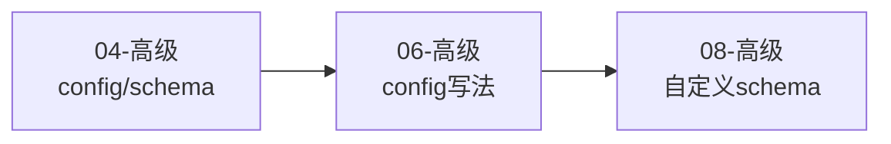

# OpenSpec 手册 · 新版总导读

> 核心原则只有两条：**先会用，再懂概念，最后看机制**；**先讲人用的，再讲机器怎么跑**。
>
> 各篇定位、结构、风格的硬约束见文末 [《内容宪章》](#内容宪章写作规范)——写新篇/改篇前先读。

---

## 版本与维护

| 项 | 值 |
|----|----|
| **手册版本** | **v1.3** |
| **对齐 OpenSpec** | 1.7.0 |
| **本版日期** | 2026-07 |

**两个版本维度（别混）**：

- **手册版本**（v1.3）：本手册自身的版次。理解加深、内容大修时升版。
- **对齐 OpenSpec**（1.7.0）：本手册当前对应的 OpenSpec 上游版本。

**freshness 约定**：

- **版本敏感页**（如 store 篇等与特定版本特性深度绑定的页面）在内容中注明适用版本，不要求在文件名标版本号。
- **概念页**（01-06、08、09 等）通用、不标版本；随对齐 OpenSpec 升级时复审。
- 每次大修 / 对齐新版本，在下面 changelog 记一行。

**变更记录**：

| 手册版本 | 日期 | 对齐 OpenSpec | 主要变更 |
|---------|------|--------------|---------|
| v1.0 | 2026-06 | 1.4.1 | 首版编号化；新增 `09-能力身份与specs漂移维护`（spec-driven 是 driver + capability=相对 path 身份 + 两层 name-as-identity + 漂移维护）；`02`/`04`/`99` 补 capability 身份与 RENAMED 前向指针。 |
| v1.1 | 2026-06 | 1.4.1 | `explore` 地位补全（贯穿 02/03/11/13）：02 状态机补 explore 两处、03 新增 explore 深层机制（反复打磨 proposal / 对抗 LLM 幻觉 / change 作围栏）+ 生命周期补全四动词 `explore→propose→apply→archive`、11/13 实战织入 explore（change 出来后反复打磨保质量）；宪章「三层递进梯度」原则微调（高级可作精炼对照锚点）。 |
| v1.2 | 2026-07 | 1.5.0 | 07 章重写：workspace → store 模型（跨仓库上下文引用）；00-index 版本/术语/命令表/阅读路径更新；workspace/initiative/context-store 概念全部删除。 |
| v1.3 | 2026-07 | 1.7.0 | 对齐 v1.7：nested capability path 完整生命周期、`skip_specs`、Apply/Archive operation guidance、工具投递与 Codex skills-only、store/default 与 archive/sync 可靠性更新。 |

---

## OpenSpec 核心哲学：为什么这样设计

在开始学习前，先理解 OpenSpec 的 5 条设计哲学。这些不是口号，而是每个设计决策背后的真实动机：

| 哲学 | 表面意思 | 背后的真实痛点 | OpenSpec 的解法 |
|------|---------|--------------|--------------|
| **fluid not rigid** | 流动不僵化 | 传统 spec 流程有"阶段锁"，需求变了也不能回头改 | 任何 artifact 随时可改，没有阶段门 |
| **iterative not waterfall** | 迭代不瀑布 | 瀑布式要求"先把所有需求想清楚"，但现实中需求是边做边清晰的 | 每个 change 是一个小迭代，允许不完整 |
| **easy not complex** | 简单不复杂 | 重型 spec 工具（如 Spec Kit）需要大量仪式感，团队不愿用 | 最小化摩擦，3 个命令就能完成一个 change |
| **brownfield not just greenfield** | 棕地优先 | 大多数真实项目都是"接手老代码"，不是从零开始 | `specs/` 是对现有系统的描述，change 是增量修改 |
| **scalable** | 可扩展 | 个人项目和企业项目的需求差异巨大 | profile 机制允许选择工作流复杂度 |

**一句话理解**：OpenSpec 不是为"完美的新项目"设计的，而是为"真实世界里的增量改代码"设计的。

### OpenSpec 不是什么

看源码或讨论时容易产生的误解，这里先澄清：

| 容易误解成 | 实际边界 |
|-----------|---------|
| IDE 插件 | CLI + 文件状态 + agent 指令投递，IDE/agent 是调用方 |
| LLM wrapper | 不做创造性推理——推理由宿主 coding agent 完成 |
| 固定流程引擎 | schema 定义 artifact DAG，workflow 是围绕 DAG 的动作入口 |
| 又一个 prompt 模板工具 | 模板只是输出骨架；schema 定义产物依赖图，CLI 解释运行时状态 |
| skill/command 是核心 | skill/command 是投递产物，核心资产是 `openspec/` 目录、schema 和模板 |

---

## 先把 OpenSpec 和 OPSX 的关系说清楚

手册里会同时出现 `openspec` 和 `/opsx:*`，它们不是两个并列产品。

```text
OpenSpec = 整套机制
  ├── openspec/        项目里的文件事实层
  ├── openspec CLI     终端里的运行时 API
  └── workflow skill / command  投递到 agent 工具里的入口
```

- `openspec` 是终端 CLI，比如 `openspec init`、`openspec status --json`、`openspec archive <name>`。
- `/opsx:*` 是有 command adapter 的宿主（例如 Claude Code）里的入口，比如 `/opsx:propose`、`/opsx:apply`；它不是所有工具的通用语法。
- Codex 在 v1.7.0 使用 skills-only 投递，入口是 `$openspec-*` skill，而不是 `/opsx:*` command。
- `opsx` 这个名字只是部分工具的 command 命名空间或文件前缀，不是另一套独立系统。
- 不要把 `/opsx:propose` 硬翻译成 `openspec propose`。CLI 里没有与之完全对应的单一命令；它背后通常是多步 `openspec ...` 调用，再由 agent 写 artifacts。

所以更准确的说法是：**workflow 的入口语法由宿主决定（`/opsx:*`、`$openspec-*` 或该工具自己的 command 名），`openspec` CLI 才是这些 workflow 读取状态和获取指令的运行时。**

---

## 这套手册怎么读

这套目录分成三块：

### A. 面向人的理解主线

按认知层级来排：

1. **初级**：先把 OpenSpec 用起来，知道日常怎么走
2. **中级**：把 `specs`、`changes`、artifact、delta spec 这些概念真正连起来
3. **高级**：理解生命周期思想、config/schema、全局约束、store 跨仓库协同、自定义 schema、capability 身份与 specs 漂移维护

### B. 面向落地的实战场景

这部分把前面的概念放进真实使用场景：

- Claude Code 里 `openspec/` 和 `.claude/` 怎么分层
- brownfield change 怎么走完整条主线
- artifacts 应该怎么改、怎么验证
- greenfield 复杂系统怎么建立第一版基线
- 部署、验证和回滚怎么纳入 change 闭环
- 多人 Git 协作怎么配合 OpenSpec

### C. 面向机器的附录

这部分讲：

- skill / command / workflow 的关系
- agent 为什么会去调用 `openspec status` / `openspec instructions`
- OpenSpec CLI 如何给宿主 agent 提供结构化上下文

这部分重要，但**不应该先读**。

---

## 推荐阅读顺序

### 路径 1：我只是想先会用


### 路径 2：我已经能用了，想真正理解它


### 路径 3：我要看实战落地


### 路径 4：我要研究它背后的机制

在路径 2 或路径 3 的基础上，最后加：


### 路径 5：我要管理多仓库（store 模型）


### 路径 6：我要自定义工作流（创建自己的 schema）



---

## 核心术语速查

| 术语 | 一句话定义 | 具体例子 |
|------|-----------|---------|
| **change** | 一次完整的增量变更工作包 | `openspec/changes/add-dark-mode/` |
| **artifact** | change 内部的文档产物类型 | proposal.md、specs/*.md、design.md、tasks.md |
| **delta spec** | 描述"这次改了哪里"的增量 spec | `## ADDED Requirements` / `## MODIFIED Requirements` |
| **specs/** | 项目当前正式 spec 基线 | `openspec/specs/auth/spec.md` |
| **capability / 能力** | specs 的组织单位，身份 = `specs/` 下的相对路径 | `auth`、`identity/session`（详见 [09](09-高级-能力身份与specs漂移维护.md)） |
| **archive** | 把 change 的 delta spec 合并回 specs/，并归档 change | `/opsx:archive add-dark-mode` |
| **schema** | 定义 change 结构骨架的工作流定义 | artifact 种类、依赖关系 |
| **profile** | 选择安装哪些工作流命令 | core（5个命令，v1.4.0 起）vs custom（自选命令） |
| **store** | 全局注册的仓库 checkout；通过 `references:` 声明跨仓库依赖 | `openspec store register` → `config.yaml` 加 `references:` → `openspec context` 查看 |
| **brownfield** | 已有代码库，在上面继续改 | 接手一个跑了 3 年的系统 |
| **greenfield** | 从零开始的新项目 | 白纸一张，全新设计 |

---

## 命令速查

这里的 `/opsx:*` 都是 agent 工具里的 slash command 入口。它们属于 OpenSpec 工作流，但不是终端 CLI 命令。需要直接在终端里运行时，看下面的 `openspec ...` CLI 表。

### 日常最常用（core profile，v1.4.0 起默认包含 5 个命令）

| 命令 | 作用 | 典型场景 |
|------|------|---------|
| `/opsx:propose <name>` | 发起一个 change，生成 artifacts | 开始一个新功能或修复 |
| `/opsx:explore` | 探索/调研模式，不生成 artifacts | 了解现有代码、调研技术方案；change 出来后反复打磨 proposal |
| `/opsx:apply [name]` | 按 tasks 执行实现；也可用于 Markdown/skill/command 等非代码产物 | 开始实施 change |
| `/opsx:sync` | 同步 delta spec 到主 spec（v1.4.0 新增纳入 core） | 多人协作时合并 spec 变更 |
| `/opsx:archive [name]` | 收尾，合并 delta spec 回基线 | 功能完成后归档 |

### 扩展工作流（custom profile）

通过 `openspec config profile` 切换到 custom profile 后，可以启用更多命令：

| 命令 | 作用 |
|------|------|
| `/opsx:new <name>` | 创建新 change（更细粒度） |
| `/opsx:continue` | 继续当前 change |
| `/opsx:ff` | 快进到下一个 artifact |
| `/opsx:verify` | 验证实现与 specs 一致性 |
| `/opsx:bulk-archive` | 批量归档多个 changes |
| `/opsx:onboard` | 新成员快速了解项目 |

### CLI 命令（终端直接运行）

| 命令 | 作用 |
|------|------|
| `openspec init` | 初始化项目 |
| `openspec new change <name>` | 新建一个 change 目录（脚手架；`/opsx:new` 的 CLI 形态） |
| `openspec list` | 列出所有 changes |
| `openspec show <name>` | 查看某个 change 详情 |
| `openspec validate` | 验证 artifacts 结构；只验证格式和结构，不验证内容质量 |
| `openspec archive <name>` | 归档 change |
| `openspec config profile` | 切换工作流 profile |
| `openspec update` | 更新 AI 工具的 skills/commands |
| `openspec store register` | 注册一个仓库 checkout 为全局 store |
| `openspec store list` | 列出已注册的 store |
| `openspec context` | 查看 working set（root + referenced stores 的 spec 索引） |
| `openspec workset save/open/list` | 保存/打开/列出个人多仓库工作视图 |
| `openspec doctor` | 检查 store reference 健康状态 |

---

## 文件地图

| 文件 | 角色 | 适合谁 |
|------|------|--------|
| [01-初级-先把-openspec-用起来.md](01-初级-先把-openspec-用起来.md) | 先会用 | 第一次接触 OpenSpec 的人 |
| [02-中级-把核心概念真正串起来.md](02-中级-把核心概念真正串起来.md) | 建立正确心智模型 | 已经知道命令，但理解还发散的人 |
| [03-高级-openspec-的软件开发生命周期思想.md](03-高级-openspec-的软件开发生命周期思想.md) | 理解 OpenSpec 怎样看待软件开发生命周期 | 想真正吃透这套方法论的人 |
| [04-高级-config-schema-与项目边界.md](04-高级-config-schema-与项目边界.md) | 看清配置和结构边界 | 想定制或深入理解的人 |
| [05-高级-项目级全局约束到底放哪.md](05-高级-项目级全局约束到底放哪.md) | 判断目录/TDD/style/regression 等全局约束该落在哪层 | 想把项目级原则和 capability spec 彻底分开的人 |
| [06-高级-config-yaml-怎么写到真正好用.md](06-高级-config-yaml-怎么写到真正好用.md) | 讲 `config.yaml` 怎样从空配置写成强配置 | 想把项目级配置写出真实约束力的人 |
| [07-高级-store-跨仓库协同.md](07-高级-store-跨仓库协同.md) | store 跨仓库上下文引用 | 需要管理多个关联仓库的人 |
| [08-高级-自定义-schema-创建自己的工作流.md](08-高级-自定义-schema-创建自己的工作流.md) | 自定义 schema——从 fork 到完全自定义 DAG | config.yaml 不够用、想创建自己工作流的人 |
| [09-高级-能力身份与specs漂移维护.md](09-高级-能力身份与specs漂移维护.md) | capability 身份模型（capability=specs 相对 path）+ specs 漂移维护 | 想搞懂 specs 怎么组织、为什么会漂、怎么守的人 |
| [10-实战-claude-code-里的-openspec-到底怎么落地.md](10-实战-claude-code-里的-openspec-到底怎么落地.md) | 看 Claude Code 落地 | 想把 OpenSpec 放进 Claude Code 工作流的人 |
| [11-实战-从一个真实-change-走完整条主线.md](11-实战-从一个真实-change-走完整条主线.md) | 用一个完整案例把整条主线走通 | 想把抽象概念全部落地的人 |
| [12-实战-如何正确修改-artifacts.md](12-实战-如何正确修改-artifacts.md) | artifact 修改指南 | 想知道 artifacts 该怎么改、怎么验证的人 |
| [13-实战-从零开始设计一个较复杂系统.md](13-实战-从零开始设计一个较复杂系统.md) | 看 greenfield 复杂系统怎样建立第一版正式基线 | 想理解从零构建时 OpenSpec 怎么切系统的人 |
| [14-实战-用-openspec-管理-devops-部署与验证.md](14-实战-用-openspec-管理-devops-部署与验证.md) | 把部署、验证、回滚纳入 change 闭环 | 想让 OpenSpec 和 CI/CD、监控、发布流程配合的人 |
| [15-实战-多人协作与Git工作流.md](15-实战-多人协作与Git工作流.md) | 多人团队使用 OpenSpec + Git 的最佳实践 | 团队协作、并行开发、冲突处理 |
| [90-附录-给机器看的-agent-协议.md](90-附录-给机器看的-agent-协议.md) | 看机器执行机制 | 想研究底层 protocol 的人 |
| [99-FAQ-常见问题.md](99-FAQ-常见问题.md) | 新手常见问题速查（按主题分类） | 遇到具体疑问时翻一翻 |

---

## 内容宪章（写作规范）

> 本手册是**一篇一篇增量补出来的**。为保证各篇定位与风格统一、不"各写各的"，新写/改写都遵循下面约束。下方「这一版的组织原则」一节规定了**叙事顺序**（先用→再懂→最后机制）；本节是**体裁与风格的硬约束**，二者配合。

### ① 定位：每层只回答一件事

| 层 | 篇 | 只回答 | 海拔上限 |
|---|---|---|---|
| 初级 | 01 | "怎么用"——5 分钟跑通主流程 | 不碰机制 / 字段 / 版本号 |
| 中级 | 02 | "在管什么"——建立心智模型 | 讲机制但停在用户视角 |
| 高级 | 03–09 | "为什么这么设计 + 字段级怎么运作" | 必须观点化、讲设计动机 |
| 实战 | 10–15 | "下一步敲哪条命令、改哪个文件、踩哪个坑" | 必须案例驱动、重可复制样例 |
| 附录 | 90 | "机器怎么消费 OpenSpec"（给集成开发者） | 不该先读；运行时命令 + JSON 字段 |
| FAQ | 99 | "新手速查" | 一问一答，简洁明确 |

### ② 结构（脚手架）

**全篇通用 4 条硬约定：**

1. H1 下第一行必有 `>` 定位句（"这一篇解决的不是 X，而是 Y" / "默认你已理解 X"）。
2. 正文前 1–2 节内，用**加粗主轴句**钉死一句论点。
3. 以 `## 下一步` / `## 继续读` 收尾，且**必须是最后一节**——不得在它之后再追加内容节（版本补丁应并入正文或提前到开篇）。
4. 至少 1 条指向相邻篇的交叉引用（反引号文件名 + 相对链接）。

**各层骨架：**

- **初级**：工作流图 + 3 命令分节 + 一个贯穿全章的最小例子 + 误区表 + "先别纠结什么"。
- **中级**：关系图 + "新手最常问…"节奏锚点 + artifact 四件套 + delta 正反对照 + N 组边界。
- **高级（六件套，缺则补）**：主轴句 → 关系/状态图 → 对比表 → **反例/后果先行** → 字段级方案（yaml/命令/字段表）→ **判断锚点**（问答 H3 / 决策树 / 分级递进 三选一）→ **压缩结论** → 下一步。
- **实战**：开篇点明场景 + 真实问题 → "先把边界/误区说透" → 案例叙事型用编号步骤 + "踩坑表" + "带走 N 句话"。
- **附录 90**：每个结构化示例（JSON）后跟"字段说明"；结尾给一段"给人的三句话翻译"。
- **FAQ 99**：短答；涉及深度话题**必须回链主题篇**。

### ③ 轻量型高级章（特例）

当某主题在 `_digested/` 已有源码级专题时，handbook 对应章可做轻——只守上面 4 条硬约定 + 六件套任选 ≥3 件（**必含「字段级方案」或「判断锚点」之一**）+ 不与专题重复、只给判断锚点与最低守住动作。**09（specs_truth 已深挖）即此类样板**，目标 ~150–180 行。

### ④ 风格（信息基调）

- 第二人称"你"（初/中级最浓，高级/附录渐弱）；**先讲痛点/反例/后果，再讲解法**；**观点化**——每篇明确表态"OpenSpec 怎么看这件事"。
- **代码块语言分工固定**：`text`=目录树/命令示意/ASCII 图、`yaml`=真实配置、`bash`=CLI、`mermaid`=关系/状态/时序图、`markdown`=artifact 样例。
- **图种**：主力 `graph`/`sequenceDiagram`，按场景灵活选择 `gantt`（时间线/阶段对比）、`mindmap`（概念全景/脑图）、`gitGraph`（Git 分支流程）；同篇同种 ≤3 张、勿与文字流程列表重复；**选图种的第一原则是"这个场景用它最直观"，不是"别的篇没用过所以不能用"**。
- **emoji 克制**：**禁用风险灯**（🟢🟡🔴 这类孤例符号）；`✅`/`❌` 仅用于判断表/对错示例，**同篇 ≤10 处、不得与风险灯同框**。
- **版本耦合写进标题或开篇定位句**（`(v1.4.0)` / `适用 openspec ≥ 1.4`），不散落正文。
- **收尾速查统一命名**："压缩结论"或"最该带走的 N 句话"，**不另造**"黄金法则 / 速查卡"等同义词。
- **术语铁律：OpenSpec 核心概念在中文行文中必须保持英文原词**——`spec`/`specs`（非"规格"）、`change`（非"变更"，当指 OpenSpec 的 change 对象时）、`artifact`（非"工件"）、`capability`（非"能力"，当指 `specs/<capability>/` 组织单位时）、`requirement`（非"要求"，当指 `### Requirement:` 标题时）、`scenario`（非"场景"，当指 `#### Scenario:` 时）、`delta spec`（非"增量规格"）。**判断标准**：问自己"这个中文词在这里是不是某个 OpenSpec 术语的替身"——是，则用英文；只是中文叙述中的一般描述，可保留中文。**架构概念标签**（如"项目事实层""入口层"）和**方法论概念**（如"弱约束""行为合同"）在首次定义时标注英文对应，形成 `中文（English）` 双语模式，确保读者跨语言查阅时能准确对应。
- **三层递进梯度**：装修这类生活比喻是帮没概念的读者建立直觉的"拐杖"，随读者爬升平滑淡出，不一直赖着——**初级浓**（生活类比建立直觉、概念最少、图多）、**中级淡**（仅在核心概念处短锚点呼应、不大段铺陈；概念精选讲透、不面面俱到吓走读者；图多）、**高级不铺垫装修**（读者已建立软件开发心智模型，用纯概念/设计动机论述；但允许装修作**精炼对照锚点**，如 03 用"勘测/方案/施工/验收"对照串四动词 `explore→propose→apply→archive`），按需用 graph/gantt/架构图。各篇装修浓度据此定位，不各写各的。
- **例子空间统一**：全手册的例子统一在"建筑/装修/工程项目管理"这一物理世界空间里——用同一个领域的故事贯穿各篇，读者从头到尾跟一个线索理解 OpenSpec，不东一个电商、西一个支付。01 用装修比喻建立直觉，02/03 用建筑工程管理系统（BuildFlow）做例子；写新篇或改旧篇时，例子优先从这一空间找，不另起领域。例子统一用 `>` blockquote 包裹，**开头句式统一为"以 BuildFlow 为例——"或"以建筑工程管理系统为例——"**（轻量举例可简化为一句），与观点引用的 blockquote 通过开头句式区分。推荐渲染时给例子 blockquote 加浅蓝（`#e3f2fd`）左边框作为视觉锚点。

### ⑤ 元信息卫生

- **单一事实源 = `00-index.md`**：版本、目录、术语、命令、阅读路径、文件地图以它为准；`README.md` 是镜像，链回 00-index，不另立口径。
- **不硬编码会过时的数字**（如"36 问"）。
- **freshness 二分必须可判定**：版本敏感页在文件名标 `-vX.Y.Z`，概念页不标；概念页 = 所有不标版本的页（含 01–06、08、09）。
- **新增篇章落入既有编号区间**（01–02 / 03–09 / 10–15 / 90 / 99），不新增混合层级；文件名含难度层级词。

---

## 这一版的组织原则

### 1. 先回答"我怎么用"

所以最前面先讲：

- OpenSpec 解决什么问题
- 平时只需要记哪几个命令
- 一个 change 是怎么从开始到结束的

### 2. 再回答"它到底在管理什么"

所以第二层才讲：

- `openspec/specs/` 是什么
- `openspec/changes/` 是什么
- artifact 和 delta spec 在整个系统里扮演什么角色

### 3. 最后才讲"为什么会这样设计"

所以生命周期思想、`schema`、`config.yaml`、store 跨仓库协同、Claude Code 集成、agent protocol，都被压到后面。

这是故意的，不是遗漏。
