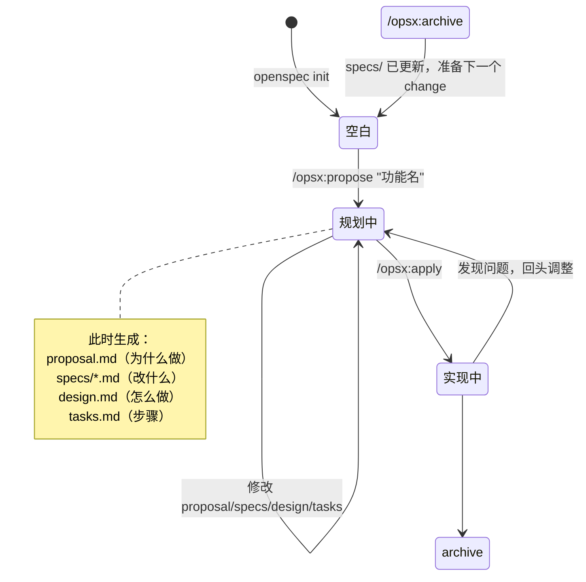

# 01 · 初级：先把 OpenSpec 用起来

> 目标不是研究源码，而是先把它当工具用顺手。如果第一反应是"改个功能干嘛这么折腾"——很正常，这一篇先帮你把这股别扭解开。

> **v1.7.0 使用提示。** 本章把 `/opsx:*` 保留为 Claude 的示例入口；Codex 使用 `$openspec-*` skills（如 `$openspec-propose-change`）。两者都由宿主 workflow 驱动同一套 `openspec` CLI / 文件状态，不要把 slash 命令当作所有工具的统一语法。

---

## 先别急着写代码——想想装修

你大概头一回听说 OpenSpec。第一反应很可能是："我就改个功能，让 AI 直接写代码不就行了？干嘛要搞这么多文件、这么多步骤？"

这个别扭很正常。先放下命令，看一个生活里的类比。

想想装修。你不会让装修队一进门就抡起锤子砸墙——

- 先得有**方案**：哪堵墙拆、隔成几间、水电走哪儿
- 再排**施工单**：先水电、后泥瓦、最后刷漆，一步步来
- 干完**验收结案**，把新房的样子记进档案

少了任何一环都会出乱子：没方案就砸墙，砸完才发现承重墙动不得；没施工单，泥瓦工和水电工撞到一起；验收没记录，过两年漏水都说不清当初怎么做的。

**改代码是一模一样的事。** 直接让 AI 动手，你迟早会撞上这几种疼：

| 直接让 AI 写 | 会怎样 |
|---|---|
| 你说"加个按钮" | 越做越多，AI 顺手重构了半个系统，刹不住车 |
| 做完之后 | 说不清这次到底改了什么、系统现在该是什么样 |
| 过几个月回头看 | 忘了当初为什么这么改，对着代码发呆 |
| 多人一起改 | 各改各的，一合并就打架 |

OpenSpec 做的事，就是给"改代码"也加上装修那套**"先想清楚，再动手"**的节奏：花两三分钟把"这次到底改什么"说清楚，省掉后面反复返工和扯皮。它不让你写更多代码，只是让每次改动都带一份简短的"施工说明"。

带着这个感觉往下看，那些命令和文件就不是"麻烦"，而是装修该有的那几步。

---

## 一张图看整体

在记任何命令之前，先用一张图把"直接让 AI 写"和"用 OpenSpec"的差别看个大概：

```text
  直接让 AI 写                        用 OpenSpec
  ──────────                          ─────────
  一句话需求                          发起一个 change
    → AI 直接开写                       → 先写清楚：改什么/怎么做
    → 越写越多，刹不住车                 → 照着干，逐项推进
    → 做完说不清改了什么                 → 验收归档，更新系统底账
```

右边这条路多出来的，不是"工作量"，而是"让 AI 别跑偏、让改动留得下痕迹"的几道关卡。下面讲的三个命令，就是右边这条路上的三个关键动作。

---

## 先记一句话

**OpenSpec 是一个"先把 change 讲清楚，再去写代码"的协作层。**

它不是模型，不替你思考；它做的事是把一次改动拆成几份能讨论、能验证、能 archive 的文件。

如果你是第一次接触它，先不用记 `schema`、skill、adapter。
先记这三步就够了：

```text
/opsx:propose  →  /opsx:apply  →  /opsx:archive
```

这里的 `/opsx:*` 不是另一套叫 OPSX 的工具，而是 Claude 等宿主的 command 入口。你在终端里直接运行的是 `openspec ...` CLI；在 agent 对话里触发工作流要使用宿主安装的入口（Codex 为 `$openspec-*` skills）。

---

## 你日常最常用的 3 个动作

用一张图理解整个工作流：



### 1. `/opsx:propose`

用来**发起一个 change**，并把规划类文件先搭起来。

你可以把它理解成：

- 给这次改动起名字
- 让 AI 帮你先把"为什么改、改什么、怎么做、做哪些任务"写出来

典型例子：

```text
/opsx:propose add-dark-mode
```

通常会得到这样一组文件：

```text
openspec/changes/add-dark-mode/
├── proposal.md
├── design.md
├── tasks.md
└── specs/
    └── ui/
        └── spec.md
```

### 2. `/opsx:apply`

用来**按 `tasks.md` 真正实现代码**。

它会围绕任务清单逐项推进，做完的任务会被打勾。

你可以把它理解成：

- 现在不是"讨论要做什么"
- 而是"拿着已经形成的 change 文件，开始干活"

### 3. `/opsx:archive`

用来**收尾**。

它做两件很关键的事：

1. 把这次 change 里的 delta spec 合并回主 `specs/`
2. 把这次 change 挪到 `changes/archive/`，保留历史

所以 archive 不是"删掉"，而是"结案归档"。

---

## 先看目录，别先看机制

一个最典型的项目，大概长这样：

```text
my-project/
├── src/
├── tests/
└── openspec/
    ├── specs/
    ├── changes/
    └── config.yaml
```

这一层先只要这样理解：

- `openspec/specs/`：记录项目当前已经成立的 spec（行为基线）
- `openspec/changes/`：记录你现在正在做的变更
- `openspec/config.yaml`：补一些项目级背景和默认设置

到这里就够了。

### 新手最常问：openspec init 之后会发生什么？

运行 `openspec init` 后，你会得到：

```text
my-project/
└── openspec/
    ├── specs/          ← 空的，等第一个 change archive 后才有内容
    ├── changes/        ← 空的，等你 propose 第一个 change
    └── config.yaml     ← 有一个最基础的配置
```

**重点**：
- `specs/` 一开始是空的，这是正常的！
- 第一个 change archive 后，specs/ 才会有内容
- 不需要手动写 specs/，它是 archive 自动生成的

### 新手最常问：为什么要有这么多文件？

很多人第一次看到 proposal/specs/design/tasks 会觉得"太复杂了"。

还记得前面装修的比方吗？这四份文件，就是装修里的那几样东西——方案、验收标准、施工方案、施工单，各管一摊，少一样都会乱。对应一下：

| 文件 | 装修里的对应物 | 解决什么问题 | 如果没有它会怎样 |
|------|---------------|-------------|----------------|
| **proposal.md** | 装修方案（改成什么样） | 防止 scope 失控 | AI 会不断加功能，永远做不完 |
| **specs/*.md** | 验收标准（怎样算合格） | 防止行为不清晰 | 做完了也不知道系统承诺了什么 |
| **design.md** | 施工方案（水电墙怎么走） | 防止技术选型随意 | 后人不知道为什么这样做 |
| **tasks.md** | 施工单（先干哪步） | 防止实现无序 | AI 不知道从哪开始，容易乱改。有了 tasks.md，可以逐项推进，还能追踪进度 |

**一句话**：这些文件不是为了"仪式感"，而是为了"让 AI 和人都能对齐"。

---

## 一次最小工作流

假设你要给系统加深色模式。

### 第一步：发起 change

```text
/opsx:propose add-dark-mode
```

这时 AI 会围绕这次 change 生成几类文件：

- `proposal.md`：为什么做
- `specs/.../spec.md`：行为上要改什么
- `design.md`：技术上怎么做
- `tasks.md`：具体任务拆解

**生成的 proposal.md 大概长这样：**

```markdown
# Proposal: Add Dark Mode

## Why
用户反馈在夜间使用时界面太亮，影响体验。

## What Changes
- 新增主题切换按钮（右上角）
- 支持 light / dark 两种主题
- 用户偏好持久化到 localStorage

## Out of Scope
- 系统级主题跟随（留给下一个 change）
- 自定义颜色（不在本次范围内）
```

### 第二步：实现

```text
/opsx:apply add-dark-mode
```

这一步才开始真正改代码。

### 第三步：archive

```text
/opsx:archive add-dark-mode
```

这一步结束后，这次 change 的结果会变成项目正式 spec 的一部分。

---

## 第一次用 OpenSpec 的 5 个常见误区

| 误区 | 实际情况 |
|------|---------|
| "要先把整个系统的 spec 都写完才能开始" | 不需要。第一个 change 只需要描述"这次要改的那一块" |
| "proposal 写完了就不能改了" | 随时可以改。Actions, not phases |
| "archive 是删除 change" | 不是。是把 delta spec 合并回 specs/，并把 change 移到 archive/ 保留历史 |
| "specs/ 是我手动维护的文档" | 不是。它是 archive 后自动更新的正式基线 |
| "不用 archive 也没关系" | 不 archive 的话，specs/ 基线不会更新，下一个 change 就没有正确的基线可以参考。**后果**：你会不知道系统现在到底是什么样的，多人协作时会乱套 |

---

## 初级阶段最重要的 5 个认知

### 1. OpenSpec 管的是 change，不是纯聊天

它不是让 AI 随便聊聊需求，而是把一次改动沉淀成文件。

### 2. 你不用一开始就理解全部内部结构

先会用 `propose / apply / archive`，已经能完成大部分日常场景。

### 3. `changes/` 是工作区，不是垃圾堆

每个 change 都是一个完整工作单元，有自己的规划、spec、任务和历史。

### 4. `specs/` 很重要，但初学时不用一次想透

你只要先知道：archive 以后，change 会沉淀回正式 spec。

### 5. 不要一开始就被 Claude Code、skills 吓住

那些是"宿主工具怎么接 OpenSpec"的问题，不是"你怎么用 OpenSpec"的第一步问题。

---

## 初级阶段先别纠结什么

先别急着纠结这些词：

- `schema`
- `.openspec.yaml`
- `workflow profile`
- `skill`
- `command adapter`
- `instructions JSON`

它们都是真的，也都重要。

但如果你在还没把主流程走通前就钻进去，很容易越看越乱。

---

## 下一步

如果你现在已经知道：

- OpenSpec 大概解决什么问题
- 默认工作流怎么走
- 一个 change 从哪里开始、在哪里结束

那接着读 [`02` 中级篇](02-中级-把核心概念真正串起来.md)就够了。

下一篇会把真正容易混的几件事讲透：

- `specs` 和 `changes` 的关系
- artifact 到底是什么
- delta spec 为什么是 OpenSpec 的关键
