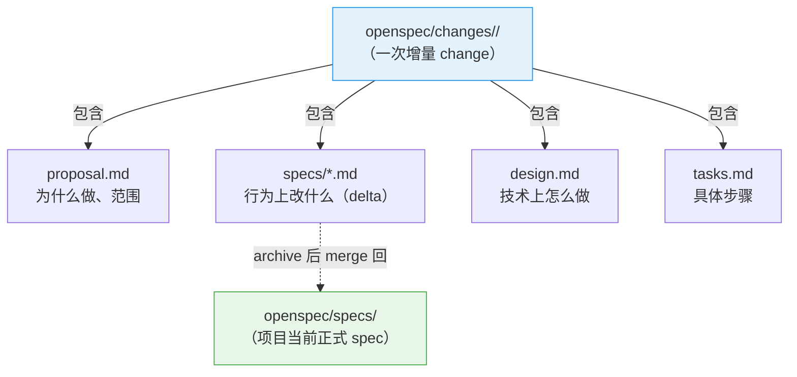
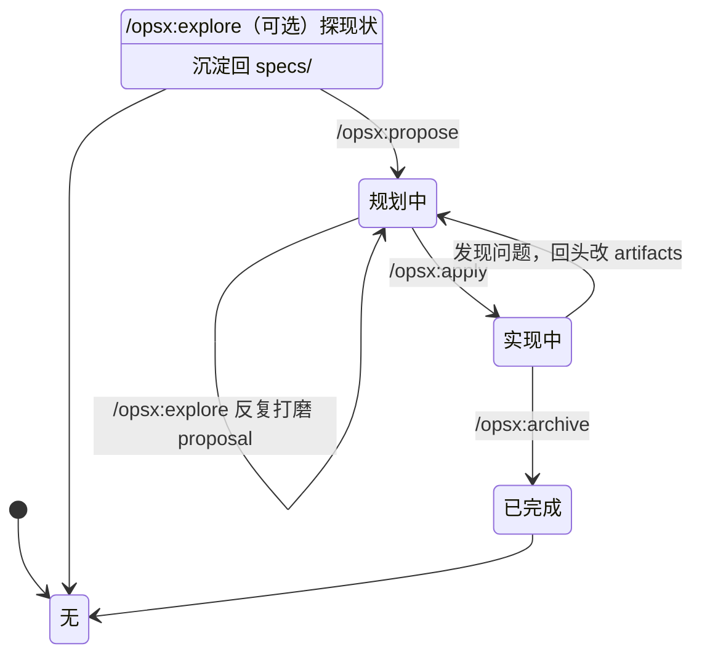

# 02 · 中级：把核心概念真正串起来

> 这一篇解决的不是"怎么按命令用"，而是"OpenSpec 到底在管理什么"。

> **v1.13.1 当前模型。** capability ID 仍是 `openspec/specs/` 下的相对 path。Codex、Zed Agent 与 vendor-neutral `agents` 目标共享 `.agents/skills/`；Zed 是 skills-only，不使用 `/opsx:*` command。

---

## 先抓住主轴

很多人读 OpenSpec 会乱，不是因为文档不够多，而是因为主轴抓晚了。

最该先抓住的不是 `schema`，也不是 skill，而是这条线：



换句话说：

> **OpenSpec 的核心不是"生成几份文档"，而是"围绕项目当前 spec，管理一次次增量 change"。**

---

## `specs/` 和 `changes/` 到底是什么关系

### `openspec/specs/`

这是**当前正式 spec（正式基线）**。

它表达的是：

- 这个项目现在承诺了什么行为
- 当前系统的能力边界是什么
- 后续所有 change 该以什么为基线继续修改

所以它更像：

- 当前 capability 合同
- 项目行为基线
- source of truth

### capability 不是代码目录，也不是“装文档的桶”

把 main specs 切好，决定了以后每一次 change 要读多少、改哪里、能否安全并行。一个 capability 应是**可独立解释用途、独立承受变化、独立用 scenarios 验证**的行为合同切片；不要按 UI 页面、数据库表、源码文件夹或团队组织图机械切分。

```text
openspec/specs/
├── identity/
│   ├── login/spec.md             ← identity/login
│   └── session/spec.md           ← identity/session
├── billing/invoices/spec.md      ← billing/invoices
└── data-export/spec.md           ← data-export
```

`identity` 是帮助人和 agent 缩小查找范围的 **domain**，不是父 capability：它不继承 requirement、不聚合子 spec，也不会让 OpenSpec 自动读取 `identity/` 下所有文件。只有当第三层也长期稳定且确有导航价值时才继续加深；别照搬代码路径、URL 或临时项目名。

选择时问三件事即可：

| 信号 | 应该怎样决定 |
|---|---|
| 新行为能被现有 requirement 自然表达 | 修改已有 capability，别建近义 path |
| 有独立用户/调用方合同、场景和演进节奏 | 新建 capability，并写清 `## Purpose` |
| 两组 requirement 总是同改、同测、读者也无法分开理解 | 不要为了树好看而拆分 |

这不是排版问题。完整 path 就是 v1.8.0（v1.7.0 起）的 capability ID；proposal、delta、`show`、`validate`、sync 与 archive 都靠它定位。更系统的切分和维护规则见 [09](09-高级-能力身份与specs漂移维护.md)。

### 新手最常问：specs/ 一开始是空的吗？要手动写吗？

**答案：一开始是空的，不需要手动写。**

很多人误以为要先手动写一份完整的系统 spec，其实不是：

1. `openspec init` 后，specs/ 是空的
2. 你做第一个 change（比如 `/opsx:propose add-site-inspection`）
3. change 里会生成 delta spec（描述这次加了什么）
4. `/opsx:archive` 后，delta spec 自动 merge 到 specs/
5. 这时 specs/ 才有了第一份内容

**关键**：specs/ 是"长出来的"，不是"一开始写完的"。

### 新手最常问：`.openspec.yaml` 是什么？

你可能在"先别纠结"列表里看到过这个文件名。简单说：

**`.openspec.yaml` 是 change 目录里的配置文件**，记录这次 change 用哪套 schema。

大多数情况下：
- 它会自动生成
- 你不需要手动改它
- 它的内容通常就是 `schema: spec-driven`

**什么时候需要关心它**：
- 当你想让某个 change 用不同的 schema 时
- 当你在研究高级定制时
- 当你确认这次没有任何 spec-level 行为变化，需要显式写 `skip_specs: true` 时

若这次只是内部重构、换实现、工具或文档工作，且没有改变用户或调用方可观察的合同，可以这样声明：

```yaml
schema: spec-driven
skip_specs: true
```

这会让 status 中的 specs 显示为 `skipped`，而不是“漏了一份 spec”。但它不能与任何非隐藏 delta spec 文件共存；有可观察行为变化时仍必须写 delta。**现在不用纠结其他 metadata**——只要先知道：`spec-driven` 是 OpenSpec 默认的 schema，也是**背后的 driver**（每个 change 的 artifact 骨架、delta 操作、capability 契约都由它定义）。想真正吃透它，看 [`09-高级-能力身份与specs漂移维护`](09-高级-能力身份与specs漂移维护.md) 的开头，以及项目根 `_digested/schema/02-内置-spec-driven-详解.md`。

### `openspec/changes/`

这是**change 工作区**。

每一个 change 文件夹，都是"针对当前正式 spec 的一次增量改动"。

所以它更像：

- 一次完整改动的工作包
- 一次迭代的文档容器
- 正式 spec 的 patch 工作区

### 它们的关系

```text
specs/    = 现在系统是什么
changes/  = 这次准备把它改成什么样
```

archive 之后：

```text
                          ┌── archive 合并 ──>  openspec/specs/（正式基线更新）
changes/add-progress-dashboard/    │
       specs/（delta）    └── 挪入 ──>  changes/archive/（历史留档）
```

archive 把 delta 合并进正式 specs，change 自身挪进 `changes/archive/` 留档。

合并是**按 relative path 寻址**的：delta 在 `changes/<name>/specs/<capability-path>/spec.md`，合并到主 spec 中同一路径的 `openspec/specs/<capability-path>/spec.md`。所以 capability 的“地址”是完整相对 path（可嵌套）——它仍是稳定契约，不能随意搬改（详见 [`09`](09-高级-能力身份与specs漂移维护.md)）。

### 新手最常问：archive 的 merge 是自动的还是手动的？

**答案：自动的。**

当你运行宿主 archive workflow（Claude 示例 `/opsx:archive add-progress-dashboard`）时：

1. OpenSpec CLI 自动读取 `changes/add-progress-dashboard/specs/` 里的 delta spec
2. 自动解析 ADDED/MODIFIED/REMOVED 标记
3. 自动更新 `openspec/specs/` 里对应的文件
4. 自动把 change 移到 `changes/archive/`

**你不需要**：
- 手动复制粘贴
- 手动更新 specs/

**你只需要**：
- 确保 delta spec 写对了（ADDED/MODIFIED/REMOVED 标记正确）
- 运行 archive 命令

### 新手最常问：如果 archive 时同一个 capability 已经被别人改过，怎么办？

两个 change 都基于旧 main spec 修改同一个 requirement 时，后 archive 的 delta 可能找不到原标题，或其 `MODIFIED` block 不再能精确应用。OpenSpec 会停止 archive，避免把半套结果写进基线；它不会替你写 Git 风格的冲突标记、也不会猜两个行为版本如何合并。

正确处理是：

1. 先保留已经 archive 的 main spec，重新读取它的完整 requirement 与 scenarios。
2. 判断后一个 change 仍应修改什么，重写它的 delta，使其以最新 main spec 为基线。
3. 如果两个 change 本来是一个不可分割的行为决定，合并或重新规划它们，而不是硬凑两份 delta。
4. 再执行 `openspec validate <change> --type change --strict`，通过后 archive。

最省成本的预防是：同一 capability path 上的行为 change 串行化；前一个 archive 后，马上让后一个 change rebaseline。不同文件不必然独立，真正的隔离单位是完整 capability path 和其中被改的 requirement。

---

## artifact 到底是什么

artifact 不是"附件"，而是一次 change 内部的几类产物。

默认最常见的 4 个是：

| artifact | 作用 | 你可以把它理解成 |
|----------|------|------------------|
| `proposal` | 为什么做、范围是什么 | change 立项说明 |
| `specs` | 行为上改什么 | 需求/行为变更合同 |
| `design` | 技术上怎么做 | 技术方案 |
| `tasks` | 具体怎么一步步落地 | 施工清单 |

它们的顺序，不是僵硬流程，而是一种自然的信息展开：

```text
proposal（为什么改）
   → specs（行为改什么）
      → design（技术上怎么做）
         → tasks（先干哪步）
            → implement（照着干）
```

简单说：

- `proposal` 回答"为什么改"
- `specs` 回答"行为上改什么"
- `design` 回答"技术上怎么实现"
- `tasks` 回答"具体先做哪几步"

再往深看一步：为什么拆成四份独立文件、而不是揉成一份？因为它们关注的事不一样——`proposal` 管"该不该做、做到哪算完"，`specs` 管"系统该变成什么样"，`design` 管"怎么实现"，`tasks` 管"先干哪步"。揉成一份，改一处就得重读整份；拆开，你能在 specs 和 design 之间反复对照、各改各的。这也是为什么 OpenSpec 让它们各自成文件：分开，才能分开 review、分开改。

---

## delta spec 为什么是 OpenSpec 的关键

如果没有 delta spec，OpenSpec 只是一套"AI 帮你写 planning 文档"的工具。

真正让它变得有意思的，是它不是每次重写整份 spec，而是写"增量修改"。

还是装修的比方——但这次往深一层。装修到一半，你想把厨房的墙往里挪 30cm。你不会把整套房子图纸重新测绘一遍，只会出一份"本次施工变更单"：就改这一处。

delta spec 就是这份"变更单"。它不重写整个系统的 spec，只精确描述"这次改了哪里"。

```text
  整份重写                         delta 增量
  ─────────                        ─────────
  重画整套图纸                     只写本次变更单
    → 审查者要逐行找你改了什么       → 一眼看出改了哪几处
    → 多人同时改，必然打架           → 各改各的文件，互不冲突
```

这张图就是 delta 和"整份重写"的本质区别。下面看它在文件里到底长什么样。

### delta spec 的意思

change 里的 `specs/**/*.md`，不是一份全新的正式 spec。

它表达的是：

- 新增什么要求
- 修改什么要求
- 删除什么要求
- 必要时重命名什么要求

通常你会看到这样的分段：

```markdown
## ADDED Requirements
## MODIFIED Requirements
## REMOVED Requirements
## RENAMED Requirements   ← 改名用 FROM/TO；注意：只有 requirement 有 rename 操作，capability 没有
```

这背后的思想非常重要：

> **OpenSpec 不是让你每次重新描述整个系统，而是让你精确描述"这次改了哪里"。**

这就特别适合老项目、增量迭代、多人并行修改。

### 反面例子：不用 delta spec 会怎样

假设你要给一个已有的工程项目管理系统新增"导出施工日志（CSV）"功能。

**不用 delta spec（传统方式）**：
```markdown
# 系统规格.md（整份重写）

## 功能 1：项目立项
...（200 行）

## 功能 2：材料管理
...（150 行）

...（中间 18 个功能）

## 功能 20：施工日志导出
支持 PDF、CSV 两种格式  ← 这里改了，但审查者要自己找
```

问题：
- 审查者要对比整份文档才知道你改了什么
- 并行开发时容易冲突（两个人都重写了整份文档）
- 历史记录里看不出"这次 change 的边界"

**用 delta spec（OpenSpec 方式）**：
```markdown
# changes/add-diary-export/specs/export.md

## MODIFIED Requirements

### REQ-EXPORT-001: 支持的导出格式
- **原来**：支持 PDF、Excel 两种格式
- **现在**：支持 PDF、Excel、CSV 三种格式
- **原因**：甲方要求施工日志以 CSV 格式提交审阅

## ADDED Requirements

### REQ-EXPORT-004: CSV 导出格式规范
- 第一行为列标题
- 使用 UTF-8 编码
- 日期格式为 YYYY-MM-DD
```

优势：
- 审查者一眼看出改了什么
- 并行开发不冲突（不同 change 改不同文件）
- 历史清晰（archive 后能看到每次 change 的边界）

---

## 为什么说它是 brownfield-first

官方一直强调 `brownfield-first`，这不只是一句口号。

### 什么是 brownfield？什么是 greenfield？

```text
greenfield（绿地）= 从零开始的新项目，白纸一张
brownfield（棕地）= 已有代码库，有历史包袱，需要在上面继续改
```

**现实是：90% 的软件工作都是 brownfield。**

你接手了一个跑了 3 年的工程项目管理系统，要加一个"质量巡检"功能。这就是典型的 brownfield 场景：

- 已有项目管理、材料管理、审批流程
- 已有一堆历史决策和技术债
- 你不能推倒重来，只能在上面加

OpenSpec 的真正对象，不是空白世界，而是：

- 已有代码库
- 已有行为
- 已有能力边界
- 已有一堆历史包袱

delta spec 恰好就是为这种现实工作方式设计的。

换个比方：你面对的是一套住了 3 年的老房子（brownfield），不是毛坯房（greenfield）。毛坯房可以先把整套图纸画完再动手；老房子你不可能把每面墙、每根管子都重新测绘一遍——那正是 greenfield 工具让人劝退的原因。老房子只在"这次要动的那面墙"上动手，这正是 delta spec 的用武之地。

### 反面例子：greenfield 工具用在 brownfield 场景

很多 spec 工具假设你从零开始，让你先写一份完整的系统 spec。

但如果你接手的是一个老项目：

- 你要先把现有系统的所有行为都写成 spec（可能要几周）
- 然后才能开始描述"这次要改什么"
- 这个门槛太高，大多数团队直接放弃

OpenSpec 的做法：

- 先用 `openspec init` 建立一个空的 `specs/` 基线
- 第一个 change 可以只描述"这次要改的那一块"
- 随着时间推移，`specs/` 会逐渐丰富
- 不需要一开始就把整个系统都写完

---

## "Actions, not phases" 到底是什么意思

OpenSpec 还有一句特别重要的话：

> **Actions, not phases**

意思是：

- `propose`、`apply`、`archive` 是动作
- 不是把你永远锁死的阶段

### 用状态机理解 OpenSpec 工作流



图里 `explore` 出现了两次：propose 之前先探现状（无 change 时）、change 出来后反复打磨 proposal（规划中时）。（为什么反复打磨能探得更准，高级篇会讲透。）

状态随时能来回走——这就是"Actions, not phases"和传统"阶段锁"的本质区别（下面以最常见的"回头修正"为例）：

- 你可以先生成 proposal，再回头补 specs
- 你可以在实现过程中发现 design 不对，再回头修改 design
- 你可以边做边修正，而不是一旦进入 implementation 就再也不能改 planning

---

## 中级阶段最该分清的 4 组边界

### 1. `specs` vs change 里的 `specs`

- 前者是正式基线
- 后者是这次 change 的 delta

### 2. artifact vs workflow

- artifact 是文件产物类型
- workflow 是你在工具里触发的动作

### 3. change vs task

- change 是一次完整工作
- task 只是 change 里的实施步骤

### 4. 项目事实 vs 工具入口

- `openspec/` 里大多是项目事实层
- `.claude/`、`.agents/`（Codex、Zed 与 vendor-neutral `agents` 三方共享）、`.cursor/` 这类更多是工具入口层

---

## 两个提效命令，知道就行

上面讲的全是 OpenSpec 的项目模型——spec、change、artifact、delta。下面这两个命令跟项目模型无关，但能大幅减少你日常敲命令的摩擦。

### `openspec completion`：让 shell 帮你补全

```bash
openspec completion install          # 自动检测 shell 并安装补全
openspec completion generate         # 只生成脚本，输出到 stdout
openspec completion uninstall        # 移除补全
```

安装后，在终端里敲 `openspec ` 然后按 Tab，shell 会自动补全：

- **子命令**——`init`、`list`、`show`、`validate`、`archive`……
- **change 名**——所有活跃 change 的 ID
- **spec 名**——所有 capability path
- **schema 名**——所有可用 schema
- **归档名**——已归档 change 的 ID

支持 zsh、bash、fish、powershell。为什么值得装？OpenSpec 的命令行参数经常要填 change 名或 spec 路径，靠记忆或 `ls` 去找远不如敲两三个字母按 Tab 快。

v1.10.0 不再通过 npm `postinstall` 打提示；registry 安装没有 install lifecycle script。首次**可读、且 action 到达 root `postAction`**的交互式 CLI 运行会在 stderr 一次性显示：

```text
Tip: Run 'openspec completion install' for shell completions
```

JSON、非 TTY、`openspec completion ...` 会 defer 而不消费这次提示；CI、已安装 completions、不可支持的 shell 或 `OPENSPEC_NO_COMPLETIONS=1` 会抑制或静默消费 completion 提示。失败 action 若只设置 `process.exitCode` 仍会进入 hook；直接调用 `process.exit(1)` 则跳过 hook且不消费提示。记录 one-shot 状态时只增量写 raw global config，不会顺手把默认 profile/delivery 固化进去。通过 git/directory 安装包时 package manager 仍可能运行 `prepare`，这与已移除的 registry `postinstall` 不是一回事。

首次 telemetry disclosure 同样写 stderr；`--json` 会 defer，因此机器消费 stdout 时不会混入提示文本。两种 notice 都不是 command 的业务输出。

### `openspec feedback`：从终端直接反馈

```bash
openspec feedback "archive 报了一个看不懂的错" --body "在 archive add-dark-mode 时出现的，日志如下：..."
```

这条命令会用 `gh` CLI 把反馈作为 GitHub issue 提交到 `Fission-AI/OpenSpec` 仓库。如果没装 `gh` 或没登录，它会给你一个预填好的 GitHub issue URL，复制到浏览器里就能提交。

长消息会把折叠空白后的摘要截成最多 72 code points 的 issue title，但 `## Summary` 中保留原始完整 message（包括换行和空白）；可选 `--body` 仍完整放入 `## Details`。所以 title 变短不代表反馈正文丢失。

它自动在 issue body 末尾附带元数据：

```text
Submitted via OpenSpec CLI
- Version: 1.7.0
- Platform: darwin
- Timestamp: 2026-07-29T...
```

为什么要用它而不是手动开 issue？**结构化反馈附带版本和环境信息**，维护者不用来回追问"你用的哪个版本"——这对开源工具的迭代速度很重要。而且不用离开终端，不会打断工作流。

---

## 读到这里，先不要急着钻机器层

现在还不急着问：

- skill 怎么发现
- command 怎么生成
- `openspec instructions --json` 怎么喂给 agent

这些属于"机器怎么跑"。

对人来说，中级阶段最重要的是先把下面这句话真正吃透：

> **OpenSpec 用 `changes/` 管增量 change，用 `specs/` 管正式 spec 基线；artifact 是 change 内部的表达层。**

---
