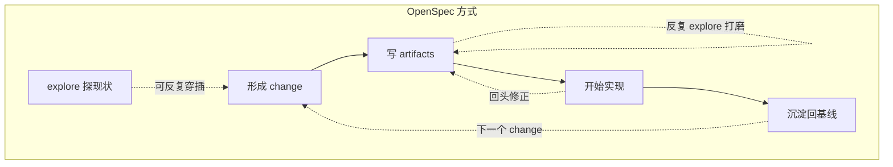

# 03 · 高级：OpenSpec 的软件开发生命周期思想

> 这一篇不再讲"按钮在哪""命令怎么敲"，而是讲 OpenSpec 对软件开发这件事本身的理解。
> 它放在高级区最前面，因为先理解这套生命周期思想，后面的 config、schema、store 才不会变成孤立机制。

> **v1.7.0 现实边界。** 主 specs 可以按嵌套 capability path 切分，却不会自动检索“当前相关”的 specs；agent 仍需按 change scope 选择和阅读上下文。workflow 调用名也随宿主变化：本文 `/opsx:*` 为 Claude 示例，Codex 为 `$openspec-*` skills。

---

## OpenSpec 核心哲学：为什么这样设计

OpenSpec 的 5 条设计哲学（详见 [`00-index`](00-index.md#openspec-核心哲学为什么这样设计)），这里不再逐条复述，只结合本章主题讲最关键的一句：

> **OpenSpec 不是为"完美的新项目"设计的，而是为"真实世界里的增量改代码"设计的。**

这 5 条哲学——fluid not rigid、iterative not waterfall、easy not complex、brownfield not just greenfield、scalable——每条都是下面各节论述的底层前提。如果不熟悉，建议回 00-index 扫一眼表格再继续。

---

## 传统 SDLC vs OpenSpec：核心差异

在理解 OpenSpec 之前，先花一点时间看 SDLC 是怎么一步步走到今天的——知道"为什么会有敏捷"，才真正理解"为什么 OpenSpec 长这样"。

### SDLC 简史：从瀑布到敏捷

```text
1970s 瀑布式          1980s V 模式           2001 敏捷
───────              ────────              ────────
需求→设计→开发→测试    需求拆解→逐层验证       短迭代 sprint
   ↓                     ↓                    ↓
过了就不能回头          每一步有对应测试       持续反馈、拥抱变化
   ↓                     ↓                    ↓
问题：阶段锁            问题：阶段锁没破        突破：不靠一次完美蓝图
                           靠短反馈环反复精炼
```

**瀑布式**（1970s）是最早的正规 SDLC：需求→设计→开发→测试，线性排开，适合需求在项目一开始就完全确定的场景（航天、军用软件）。根本问题在于**阶段锁**——一个阶段结束你就不能再回头。需求写到一半才发现没想清，只能憋着；设计定了又被代码现实打脸，只能凑合。

**V 模式**（1980s）在瀑布上加了左右对称的验证——左侧需求逐层拆解、右侧测试逐层对照，"每一步都有对应的验证"——但它还是线性的，**阶段锁没破**。

**敏捷**（2001 Agile Manifesto）是根本性转折。它不只是在瀑布上打补丁，而是换了套世界观：**不靠一次性完美的蓝图，而靠短反馈环在有限上下文里反复精炼**。这个思想比软件老得多——它从丰田精益（1950s Kanban、小批量、即时反馈）吸过来的，敏捷把它在软件开发语境里表达成了 4 个价值观和 12 条原则。后来敏捷被广泛应用于金融、教育、制造、法律——证明了它是一套**通用方法学**，不只属于代码。

### OpenSpec 就是敏捷在 AI 辅助时代的落地

Agile 的 sprint 循环（plan → build → review → retro），在 AI 辅助的语境下被 OpenSpec 落成了四个动词：

```text
  敏捷 sprint                  OpenSpec
  ───────────                  ────────
  plan（规划）           →     propose（形成 change）
  build（构建）          →     apply（实施）
  review + retro（审视）  →     explore（反复打磨、探现状）
                                 archive（沉淀回基线）
```

把 `explore` 和 `propose` 拆开是 OpenSpec 在 AI 时代做的关键区分——在敏捷里，review 和 retro 主要靠人来做；在 OpenSpec 里，explore 可以把 AI agent 也放进反馈环，让它在 change 的有限上下文里反复核对自洽性、查矛盾、补漏的 scenario。**Agile 说"拥抱变化"；OpenSpec 说"把变化框进一个 change，用 explore 在围栏里反复打磨到自洽"**——同一套思想，只是 OpenSpec 多了 spec 做上下文锚点、多了 AI agent 做信息加工。

区别也在这里：敏捷里"文档"是次要的、可选的（"working software over comprehensive documentation"）；OpenSpec 里 spec 是一等公民——因为 **AI agent 需要它做有限受控上下文**。没有 spec，AI 就是 Vibe Coding（随口说说→自由发挥→不知不觉失控）；有了 spec，AI 在围栏里探、改、验，每一步都在受控范围里。



| 维度 | 传统 SDLC（瀑布 / V 模式） | OpenSpec（敏捷思想的延续） |
|------|--------------------------|--------------------------|
| **阶段切换** | 单向门，过了就不能回头 | 随时可以回头修正 |
| **完成定义** | 代码写完就算完成 | 代码 + spec 沉淀才算完成 |
| **需求变更** | 视为失败或返工 | 视为开发的正常部分 |
| **文档更新** | 要么不改，要么整份重写 | 增量修改（delta spec） |
| **适用场景** | 需求明确的新项目 | 需求模糊的老项目增量开发 |
| **底层哲学** | 一次性完美蓝图 | 短反馈环 × 有限上下文 × 反复精炼 |

---

## 先说结论

OpenSpec 对软件开发生命周期的理解，可以压缩成 5 句话：

1. 软件开发不是"先想完再动手"，而是**边做边学**
2. 真正需要管理的不是抽象项目，而是**一次次可追踪的 change**
3. 系统当前能力必须有一个**正式基线**
4. 新工作应该先表达成**增量变化**，而不是重写整个世界
5. AI 的价值不是替代思考，而是**帮你先把想法探清楚、打磨到自洽（`explore`），再沉淀成可执行 artifact**

如果把这 5 句吃透，OpenSpec 大多数设计都会变得很顺。

---

## 一、它为什么不喜欢传统"阶段锁"

传统的软件流程，常常暗含这样一种想法：

```text
需求阶段  →  设计阶段  →  开发阶段  →  测试阶段  →  结束
```

这种想法的问题不在于它完全错，而在于它太容易假装：

- 需求一旦写完就不会变
- 设计一旦定下就不会被代码现实打脸
- 开发只是机械执行
- 测试只是最后补一道门

OpenSpec 明显不相信这个世界观。

它更接近这样一种现实主义看法：

```text
先形成一个 change
  ↓
写出 proposal / specs / design / tasks
  ↓
开始实现
  ↓
实现过程中继续修正前面的文档
  ↓
完成后再把 change 沉淀回正式 spec
```

这里最关键的不是"可以回头改"，而是：

> **回头改，不是失败；回头改，本来就是开发的一部分。**

---

## 二、为什么它把"change"放在中心

很多工具把"项目"放在中心。

OpenSpec 更像是把"change"放在中心。

这很重要，因为现实里大多数软件工作都不是：

- 从零发明一个新系统

而是：

- 给已有系统增加一个 capability
- 修正一个 capability
- 删除一个过时 capability
- 收缩范围，先交一个 MVP

所以 OpenSpec 不是先问：

- "你的系统全貌是什么？"

它更常先问：

- "这次要改哪一块？"
- "这次 change 的边界是什么？"
- "这次 change 准备怎么落地？"

> 以建筑工程项目管理系统 BuildFlow 为例——当前系统已有项目、任务、材料模块。两种场景都是一个 `change`：
> ① 产品经理想加"施工进度看板"——不是"重新定义项目管理"，而是在已有 UI spec 基础上新增一个 `dashboard` capability，写这次 change 的 proposal、delta spec、design、tasks 就行。
> ② 现场反馈：任务标记"已完成"后没触发验收通知——这也不是"重写任务系统"，当前 tasks spec 已有基线，这次 change 只修一条不符预期的行为，改完把 delta merge 回正式 spec。

这就是"以 change 为中心"的威力：

- change 边界清晰
- 审查对象清晰
- 历史沉淀清晰

---

## 三、为什么它坚持要有正式基线

OpenSpec 里一个常被低估的设计，是 `openspec/specs/`。

很多人第一次看，会把重点放在 `changes/`。

但如果只有 `changes/`，没有稳定的 `specs/` 基线，整个系统会出大问题：

- 你不知道"现在正式认定的行为"是什么
- 你不知道一次 change 究竟是在新增、修改还是删除
- 你没法判断几个 change 的关系
- archive 也就没有真正的"沉淀"对象

所以 `specs/` 的意义，不是"再多一套文档"，而是：

> **给整个开发过程提供一个当前 capability 坐标系。**

> 以 BuildFlow 为例——当前 `specs/materials/spec.md` 规定材料审批 3 个工作日内完成。甲方要求工地进度加快，压缩到 1 个工作日。如果没有正式基线，你只能说"我们现在想要 1 天"。但真正的 change 语义是：当前正式行为是 3 天，这次 change 把它改成 1 天。正因如此，delta spec 里才需要出现：
>
> ```markdown
> ## MODIFIED Requirements
> ```
>
> 它的价值不在于形式，而在于承载了 change 语义。

---

## 四、为什么它推崇 delta spec 而不是重写整份 spec

传统上，很多团队改需求时会做两件事之一：

1. 直接改代码，不改文档
2. 改文档时整份重写

OpenSpec 走第三条路：

3. 先写这次改动的 delta spec

这件事对老项目尤其重要。

### 为什么不建议每次重写整份 spec

因为那会带来几个问题：

- 审查时看不出这次到底改了哪里
- 评审者得自己做脑内 diff
- 并行 change 更容易打架
- 历史理由更容易丢

### delta spec 的优势

- 讨论的是"变化"本身
- 更适合 review
- 更适合多人并行
- archive 后能自然沉淀回基线

> 以 BuildFlow 为例——要给"项目报告"模块新增导出能力。整份重写的话，要交一大篇新 export spec，审查者要逐行找你到底改了什么。用 delta spec 只要三笔：
> - `ADDED`：支持导出施工日志（CSV）
> - `ADDED`：支持导出建材清单（XLSX）
> - `MODIFIED`：导出入口对项目经理和监理同时可见
>
> 这样 reviewer 一眼就知道你改的到底是什么。

---

## 五、为什么它把 planning 文档拆成 proposal / specs / design / tasks

这里其实也体现了它的软件开发观。

它认为"一次变更"内部不是只有一种信息，而至少有 4 层信息：

| 层 | 关注点 | 典型问题 |
|----|--------|----------|
| `proposal` | 业务意图与范围 | 为什么做？做到哪儿为止？ |
| `specs` | 行为合同 | 用户和系统将看到什么变化？ |
| `design` | 技术方案 | 用什么方式实现，为什么这样选？ |
| `tasks` | 落地步骤 | 真正要做哪些工作项？ |

这 4 层如果糊成一团，会有两个后果：

- 讨论时总是跨层跳来跳去
- AI 生成时更容易把"需求、方案、任务"混成一锅

OpenSpec 的做法，本质上是在降低混乱。

> 以 BuildFlow 为例——甲方要求外部监理能登录系统在线审批。如果不拆层，文档里很容易同时混着：为什么甲方要求监理接入、监理登录后应该看到什么、用 SAML 还是 OIDC、哪几个页面和接口要改。拆开以后：
> - `proposal`：为什么现在接——甲方合同要求监理在线审批，第一版只覆盖材料验收环节
> - `specs`：登录行为——新增监理角色、权限范围（只看自己负责的项目）、失败场景
> - `design`：选 OIDC——甲方已有 Identity Provider，比 SAML 轻
> - `tasks`：先接 IdP → 做角色映射 → 补监理界面 → 写验收测试

### explore：change 出来后，反复打磨它的手段

到这里，OpenSpec 生命周期上的四个动词都该登场了：

```text
explore  →  propose  →  apply  →  archive
勘测         出方案      施工       验收归档
```

这是装修那条比方的精确版——四个动作各对应装修的一环，比初级篇的笼统直觉更清楚。但 `explore` 有一个其他三个没有的特性：**它可以反复穿插**。

动手前探一下现状，只是 `explore` 的用法之一；它更大的价值在 `change` 出来**之后**——`change` 一成形（propose 生成了初稿），你就可以**反复 explore 这个 change、打磨它**。原因很实在：

- **初稿几乎一定有内部自洽性问题**。proposal 说"这次只改导出过滤"，可 delta spec 的 scenario 却写成"导出全部订单"——前后对不上。这种裂缝很常见，因为 LLM 生成有概率出幻觉，多个 artifact 一起生成时，接缝处最容易错。
- **change 本身就是 explore 的围栏**。`change` 一旦成形，就约定了上下文（proposal + specs + design + tasks 这一圈）。你在这个有限空间里反复 explore，核对一致性、查矛盾、补漏的 scenario——比漫无边际地探整个 codebase 准得多。
- 所以 `explore` 的真正价值，是在 change 出来**之后**才解锁的：**change 既是产物，也是 explore 的围栏**。

复杂系统尤其吃这一套——多个 capability spec 一起生成，跨 spec 的字段、状态、角色接缝处最易出幻觉，靠的就是反复 explore 把它们对齐。

> 一句话：`propose` 给你初稿，`explore` 让你把它打磨到自洽。两者常常交替——改一轮、探一轮，直到 proposal 经得起推敲，再进 `apply`。

---

## 六、为什么它强调"Actions, not phases"

这句话最好不要只当 slogan 看。

它实际上意味着一种非常具体的生命周期设计：

- 命令是动作，不是阶段门
- 依赖是使能条件，不是组织僵化的流程锁
- 文档不是一口气定死，而是可以持续修订

### 用时间线理解"阶段锁"vs"随时行动"

```mermaid
gantt
    title 传统阶段锁：发现问题只能憋着
    dateFormat  X
    axisFormat %s
    section 传统方式
    需求（锁定）    :done, 0, 2
    设计（锁定）    :done, 2, 4
    开发（发现设计有问题，但不能改）:crit, 4, 7
    测试            :7, 9
```

```mermaid
gantt
    title OpenSpec：随时可以回头修正
    dateFormat  X
    axisFormat %s
    section OpenSpec 方式
    写 proposal/specs/design/tasks :done, 0, 2
    反复 explore 打磨 proposal      :crit, 2, 3
    开始实现                        :active, 3, 6
    发现问题，回头改 design          :crit, 4, 5
    继续实现（基于修正后的 design）  :active, 5, 7
    archive 沉淀                    :7, 8
```





### 一个典型现实场景

你在做"订单导出优化"时，先写了 proposal、specs、design、tasks。

开始实现后发现：

- 数据量比预估大
- 原设计里的同步导出会把接口拖挂

这时传统阶段式心态会说：

- "设计已经过了，现在别动文档，先凑合做"

OpenSpec 的心态则是：

- 回去改 `design.md`
- 必要时改 `tasks.md`
- 如果行为承诺变了，再补 `specs`
- 然后继续 `/opsx:apply`

这正是"action，不是 phase"的现实含义。

---

## 七、它其实在重新定义"完成"这件事

很多团队默认把"代码写完"当完成。

OpenSpec 的隐含标准更高一点：

> **完成，不只是代码存在，而是这次 change 已经被表达清楚、实现清楚、并沉淀回正式 spec。**

所以一个 change 真正闭环，至少要经历：

1. 有明确边界
2. 有可讨论的 artifact
3. 有实际实现
4. 有可回看的历史
5. 有沉淀回基线的结果

> 以 BuildFlow 为例——AI 已经把"施工安全巡检"功能写出来了：现场监理用手机提交巡检记录，系统自动生成整改单。代码能跑，但回头一看：`tasks.md` 没更新（checkbox 还空着），delta spec 没补全（`safety-inspection/spec.md` 没写巡检记录和整改单的关系），archive 更是没做。从 OpenSpec 视角，它不是一个真正"完成"的 change——spec 基线没更新，历史变更没结案，三个月后团队看不清"巡检功能到底承诺了什么"。这就是 OpenSpec 对"完成"更严格的定义：代码存在不算完成，change 被表达清楚、实现清楚、沉淀回基线才算。

---

## 八、它对 AI 的真正期待是什么

OpenSpec 并不是把 AI 当作"自动写代码机器"。

它更像把 AI 放在一个更受约束的位置：

- 帮你起草 proposal
- 帮你整理 delta specs
- 帮你列 design 和 tasks
- 帮你按 tasks 实现
- 帮你用 `explore` 反复验证一致性（见上文 explore 一节）

也就是说，AI 被放进了一个**有 artifact、有边界、有状态**的工作流里。

这和纯聊天式"你帮我做个功能"很不一样。

> **方式 A：纯聊天**——"帮我给 BuildFlow 加个批量导出施工日志的功能。"AI 很快开始写代码，但 scope 模糊（导出哪些字段？什么格式？谁有权限？），做完没人说得清到底承诺了什么。
>
> **方式 B：OpenSpec 式**—— `/opsx:propose add-bulk-diary-export`。先 explore 探现状（现有 diary 模块的 spec、导出权限在哪个 capability），再形成 change：为什么做（甲方要施工日志交审）、改哪些行为（支持按项目/日期范围过滤导出 CSV）、技术方案怎么选（异步导出还是同步）、任务怎么拆。然后 apply → archive。
>
> 方式 B 不是为了官僚化，而是让 AI 在有限受控上下文里干活——不容易跑飞。

---

## 九、这套生命周期最适合什么，不适合什么

### 特别适合

- 既有代码库上的增量开发
- 想让 AI 参与，但又不想完全失控
- 需求、设计、实现需要留清晰痕迹的团队
- 多个 change 并行、需要较好边界管理的项目

### 不那么适合

- 只想临时试一个 5 分钟的一次性脚本
- 完全不想维护任何 spec 痕迹
- 团队根本不打算让 change 留档

OpenSpec 不是万能方案，它偏向的是"让增量开发可解释、可沉淀、可审查"。 

---

## 十、把整套生命周期用一句人话说完

如果要用非常口语的话总结 OpenSpec 的软件开发生命周期思想，可以这么说：

> **先承认系统现在是什么，再明确这次要改什么；先把变化表达清楚，再让 AI 和人一起去实现；实现过程中允许继续修正认知；最后把这次变化沉淀回正式基线。**

这句话里几乎已经包含了 OpenSpec 的所有核心设计选择：

- 为什么有 `specs/`
- 为什么有 `changes/`
- 为什么有 delta spec
- 为什么有 proposal / design / tasks
- 为什么 archive 这么重要
- 为什么它不喜欢 phase-locked 的流程

---

## 常见误区与澄清

| 误区 | 为什么错 | 正确理解 |
|------|---------|---------|
| "OpenSpec 是重型流程工具" | 3 个命令就能完成一个 change，比传统工具轻很多 | 它是轻量级的，但有结构 |
| "必须先写完所有 artifact 才能开始实现" | 可以边实现边补充，Actions, not phases | 可以随时回头修正 |
| "delta spec 只是格式要求" | 它是增量思维的体现，适合老项目和并行开发 | 它是核心设计理念 |
| "archive 只是归档，不重要" | archive 是把变更沉淀回基线，是闭环的关键 | 没有 archive 就没有正式基线更新 |
| "OpenSpec 只适合大项目" | 个人项目也能用，profile 机制支持不同复杂度 | 从个人到企业都适用 |
| "explore 只是动手前探一下" | change 出来后可反复 explore 打磨 proposal；change 本身就是 explore 的围栏 | 它是贯穿始终的打磨手段 |

---

## 压缩结论

```text
┌─────────────────────────────────────────────────────────────┐
│  OpenSpec 软件开发生命周期的 5 个核心信念                    │
├─────────────────────────────────────────────────────────────┤
│  1. 边做边学，不是先想完再动手                               │
│  2. 管理 change，不是管理抽象项目                            │
│  3. 必须有正式基线（specs/），才知道"现在是什么"              │
│  4. 用 delta spec，不是每次重写整个世界            │
│  5. AI 加速沉淀，不是替代思考                                │
├─────────────────────────────────────────────────────────────┤
│  如果只记住一句话：                                          │
│  "先说清楚要改什么，再去改；改的过程中可以回头修正；          │
│   改完后沉淀回基线，为下一次 change 做准备。"                │
└─────────────────────────────────────────────────────────────┘
```

---

## 下一步

如果你已经读到这里，下一步更适合看 OpenSpec 把这些思想落成了哪些项目边界。

继续看 `04`，它会把 config、schema 和项目边界拆开讲。

那里会进一步拆开：

- `openspec/specs/`
- `openspec/config.yaml`
- `openspec/schemas/`
- `openspec/changes/<name>/.openspec.yaml`
- profile 和 schema 的关系
