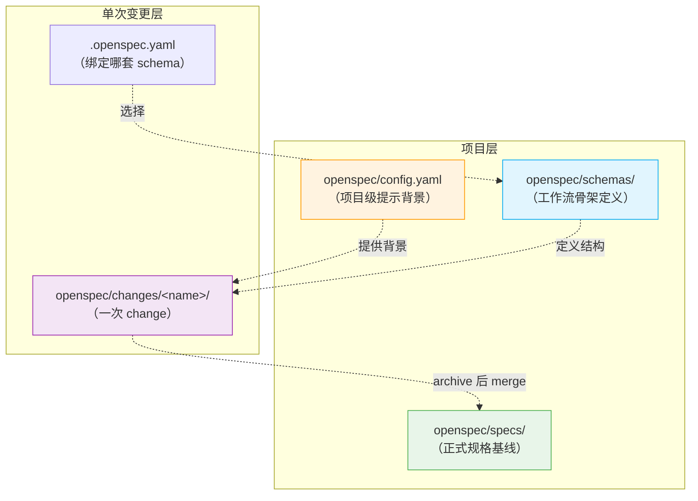
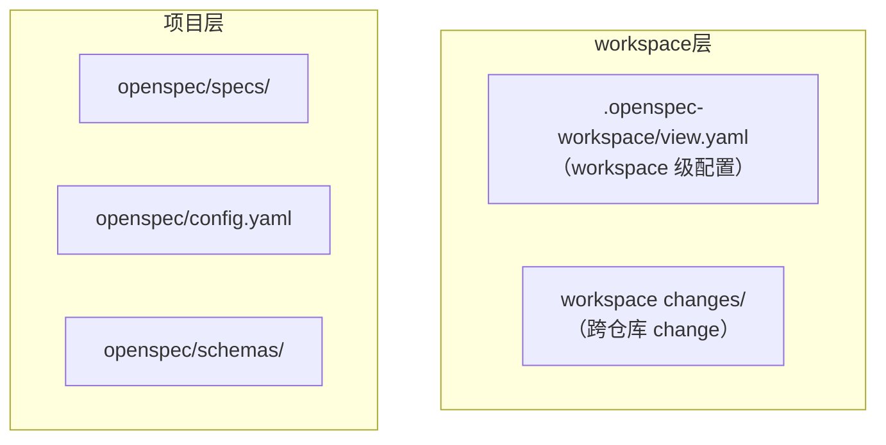

# 04 · 高级：Config、Schema 与项目边界

> 这一篇默认你已经理解了 `specs`、`changes`、artifact 和 delta spec。

---

## 这一层为什么容易乱

因为到了这里，你会同时遇到几类"看起来都像约定"的东西：

- `openspec/specs/`
- `openspec/config.yaml`
- `openspec/schemas/<name>/schema.yaml`
- `openspec/changes/<name>/.openspec.yaml`
- `core` / `custom` profile

如果这些边界没分开，就很容易什么都往一个地方理解。

---

## 先一句话钉死 4 个对象



| 对象 | 它真正管什么 | 类比 |
|------|--------------|------|
| `openspec/specs/` | 项目当前已经成立的行为合同 | 代码库的"当前版本" |
| `openspec/config.yaml` | 项目级提示背景、规则、默认 schema | 项目的"README + 编码规范" |
| `openspec/schemas/<name>/schema.yaml` | change 的结构骨架和 artifact 依赖 | 工作流的"模板定义" |
| `openspec/changes/<name>/.openspec.yaml` | 这次 change 最终绑定哪套 schema | 这次工作的"配置文件" |

最重要的一句可以再说一遍：

> **`config.yaml` 改的是提示层，`schema` 改的是结构层。**

---

## `config.yaml` 到底应该装什么

最适合放进去的，是"稳定、跨 change、高价值"的项目背景。

比如：

- 技术栈
- 测试约定
- 发布或兼容性要求
- 对某类 artifact 的统一补充规则

一个典型例子：

```yaml
schema: spec-driven

context: |
  Tech stack: TypeScript, React, Node.js
  Testing: Vitest + Playwright
  Public APIs should remain backward compatible.

rules:
  proposal:
    - Include rollback plan
  specs:
    - Add unhappy-path scenarios
  design:
    - Explain migration risk
```

**注意**：OpenSpec 的 rules 使用**结构化格式**（按 artifact 分类），不支持纯文本格式。

### config.yaml vs schema：对比表

| 维度 | config.yaml | schema |
|------|-------------|--------|
| **改的是什么层** | 提示层（告诉 AI 项目背景） | 结构层（定义 change 骨架） |
| **典型内容** | 技术栈、测试约定、编码规范 | artifact 种类、依赖关系、模板路径 |
| **影响范围** | 所有 change 的生成质量 | change 的结构和工作流 |
| **修改频率** | 偶尔（项目技术栈变化时） | 很少（工作流模式变化时） |
| **类比** | 项目的 README | 项目的 Makefile 或 package.json scripts |

### 不适合往里塞什么

不要把这些东西硬塞进 `config.yaml`：

- 某一次 change 的临时说明
- 项目当前完整能力清单
- artifact 依赖关系
- 模板正文
- 工具入口配置

这些都不是它的职责。

### 常见配置错误示例

**❌ 太空（没有实质内容）：**
```yaml
schema: spec-driven
context: "This is a web project."
```
问题：AI 无法从中获得有用信息。

**❌ 太少（该写的没写）：**
```yaml
schema: spec-driven
```
问题：AI 不知道技术栈、测试约定、兼容性要求。

**✅ 恰到好处：**
```yaml
schema: spec-driven
context: |
  Tech: TypeScript + React + tRPC
  Testing: Vitest (unit) + Playwright (e2e)
  DB: Prisma + PostgreSQL
  Deployment: Vercel
  Compatibility: Support last 2 major versions
rules:
  specs:
    - Include error scenarios
  design:
    - Explain DB migration strategy if schema changes
```

---

## schema 到底是什么

schema 不是数据库 schema，也不只是 template。

它更准确的角色是：

> **一次 change 应该长成什么样的工作流骨架。**

它定义的通常是：

- 有哪些 artifact
- 各自生成什么文件
- 谁依赖谁
- apply 追踪哪份文件

一个典型 schema 看起来像这样：

```yaml
artifacts:
  - id: proposal
    generates: proposal.md
    requires: []

  - id: specs
    generates: specs/**/*.md
    requires: [proposal]

  - id: design
    generates: design.md
    requires: [proposal]

  - id: tasks
    generates: tasks.md
    requires: [specs, design]
```

所以 schema 说的不是"这个项目用 React 还是 Vue"。
它说的是"这类 change 应该先有哪些产物，它们怎么关联"。

---

## template 和 schema 的关系

这两个词也特别容易混。

### template 是什么

template 是某个 artifact 的文本骨架。

比如 proposal 模板可能只是：

```markdown
## Why
## What Changes
## Impact
```

### schema 是什么

schema 决定：

- 有没有 `proposal` 这个 artifact
- 它依赖谁
- 生成到哪里
- 用哪个 template
- 配什么 instruction

所以：

- template 更像"单个文档的写法骨架"
- schema 更像"整套 change 结构的定义"

---

## `.openspec.yaml` 为什么关键

这个文件在 change 目录里，价值在于：

- 它记录"这次 change 实际绑定哪套 schema"
- 它让单次 change 可以偏离项目默认 schema

也就是说：

- 项目默认可以在 `config.yaml` 里写 `schema: spec-driven`
- 但某个特殊 change 可以用另一套 schema

所以 change 的实际解析顺序，通常会优先看 change 自己，再回退到项目默认。

---

## profile 又是什么

profile 和 schema 不是一回事。

### profile 管什么

profile 管的是：

- 你装哪些 workflow 命令
- 默认是 core 5 个，还是更多扩展动作

### schema 管什么

schema 管的是：

- 一次 change 内部有哪些 artifact
- 它们的结构和依赖是什么

一句话区分：

- **profile 管入口多少**
- **schema 管 change 长相**

### 新手最常问：profile 和 schema 到底什么关系？

用一个具体例子理解：

**场景**：你想用 OpenSpec，但只想要最简单的工作流。

1. **选 profile**：`openspec config profile` 选 `core` 或 `custom`
   - core：你只有 5 个命令（propose/explore/apply/sync/archive）
   - custom：自选命令（可以额外启用 new/continue/ff/verify/bulk-archive/onboard 等）
   - 这是"入口层"的选择

**⚠️ 警告**：
- 切换 profile 可能会删除或添加 workflow 文件
- 从 custom 切换回 core 会删除额外的 workflow 文件
- 切换前确保你理解影响，建议先提交当前更改

2. **选 schema**：在 `config.yaml` 里写 `schema: spec-driven`
   - 结果：每个 change 都有 proposal/specs/design/tasks 四个 artifact
   - 这是"结构层"的选择

**关系**：
- profile 决定"你能用哪些命令"
- schema 决定"每个 change 长什么样"
- 它们是独立的两个维度

**类比**：
- profile 像"你的工具箱有哪些工具"
- schema 像"你用这些工具做出来的东西是什么形状"

---

## 这一层最重要的边界意识

到了高级阶段，你最该有的不是"记住所有字段"，而是以下判断力：

### 什么时候改 `config.yaml`

当你想补的是：

- 项目统一背景
- 项目统一写作约束
- 默认 schema 选择

### 什么时候改 schema

当你想改的是：

- artifact 种类
- artifact 依赖关系
- apply 的前置条件
- 模板和 instruction 的组织方式

### 什么时候看 workspace

当你遇到的是：

- 一个需求跨多个仓库
- 单仓库 `openspec/` 已经不足以表达系统级计划
- 你需要本地 coordination view，而不是把多个 repo 硬塞进一个 spec

这时才需要看 workspace。

---

## 下一步该看什么

如果你关心的是：

- 长期项目规则到底该放在哪
- 哪些信息该进 `config.yaml`
- 哪些信息该进 `specs/` 或 change artifacts
- 什么时候应该改 schema，而不是继续堆 rules

下一篇看 `05`，它专门讲项目级全局约束到底该放在哪。

---

## v1.4.0 补充：第四层 — workspace 层

本文讨论的三层结构（project、user、package）是 repo-local 视角。v1.4.0 引入了第四个作用域：



**Workspace 层改变了边界讨论**：

- Workspace change 使用 `workspace-planning` schema（不是 `spec-driven`）
- Workspace 没有主 `specs/` 基线（spec 在各 linked repo 中）
- Workspace 的配置（profile/delivery/tools）来自 global config，不走 repo-local `config.yaml`
- `PlanningHome` 抽象在运行时判断当前属于 workspace 还是 repo

这意味着「项目级全局约束放哪」这个问题现在有四种可能的答案：**workspace 层、project 层、user 层、package 层**。具体怎么选，取决于你的团队结构和仓库数量；跨仓库场景可以回到 `07` workspace 篇统一看。
