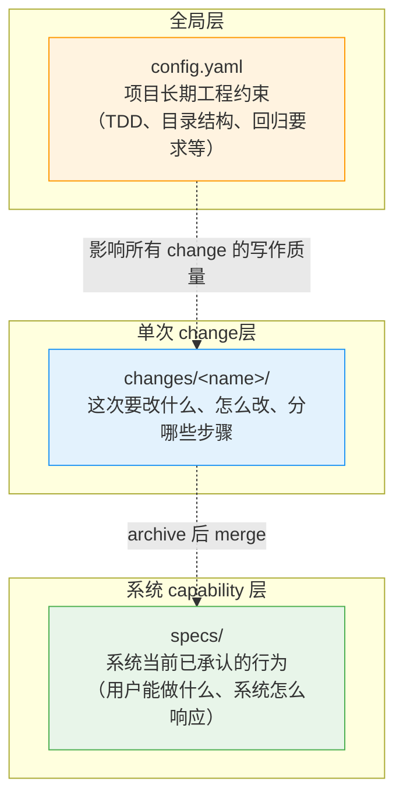
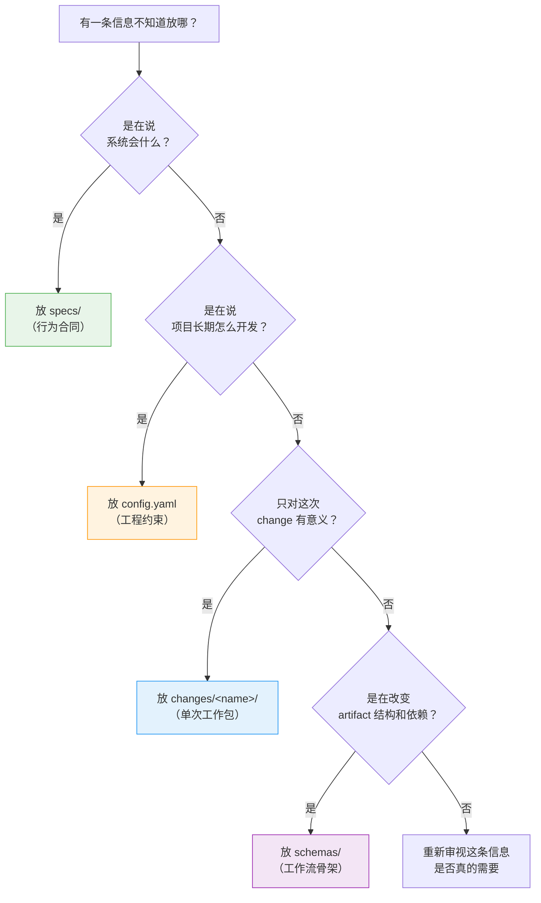

# 05 · 高级：项目级全局约束到底放哪

> 这一篇专门回答一个真正难的问题：
> **那些不是某个 change、却又深刻影响整个项目的长期约束，到底应该放在哪里？**

---

## 为什么这一层最容易写乱

到了真正用 OpenSpec 做项目时，你很快就会遇到这类信息：

- 目录结构约束
- TDD 原则
- coding style
- regression 要求
- 兼容性要求
- 架构边界
- 安全基线
- 发布纪律

这些东西很麻烦，因为它们既不是：

- 某一个 change 的局部说明

也不完全是：

- 系统当前对外能力本身

所以很多人会下意识乱放：

- 有时塞进某个 `proposal.md`
- 有时塞进某个 `tasks.md`
- 有时想写进 `specs/`
- 有时又想靠宿主工具的 rules 顶过去

结果就是整个项目会越来越难读。

OpenSpec 真正需要的，不是"所有信息都进一个地方"，而是：

> **不同类型的信息，各回各层。**

---

## 先一句话钉死三层

如果你只记得一句话，就记这一句：

> **项目怎么开发，看 `config.yaml`；系统现在会什么，看 `specs/`；这次准备改什么，看 `changes/`。**

把它展开，就是三层：

| 层 | 位置 | 回答的问题 | 类比 |
|----|------|------------|------|
| 项目全局层 | `openspec/config.yaml` | 这个项目长期按什么原则开发？ | 宪法 / 编码规范 |
| 系统 capability 层 | `openspec/specs/` | 当前系统正式承认自己会什么？ | 合同 / API 文档 |
| 单次 change层 | `openspec/changes/<change-id>/` | 这次 change 准备改什么、怎么改？ | PR 描述 / 工作包 |

只要这三层不混，OpenSpec 的很多设计都会变得非常清楚。

> **本章讨论的是单仓库场景**——绝大多数项目用这三层就够。如果你管理的是跨多个仓库的大项目，可以通过 store 的 `references:` 声明跨仓库依赖，让 agent 获得更多上下文。详见 [`07`](07-高级-store-跨仓库协同.md)。

### 三层分工可视化



---

## 第一层：`config.yaml` 管的是"项目长期工程约束"

`config.yaml` 最适合装的，不是具体功能内容，而是以下几类项目级信息：

- 稳定的
- 跨 change 的
- 高价值的
- 会持续影响 AI 和人类协作方式的

### 典型适合放进 `config.yaml` 的内容

- 技术栈背景
- 目录组织约束
- 模块边界纪律
- 测试策略
- regression 基线
- 兼容性要求
- 安全或审计底线
- 默认 schema 选择

### 一个最重要的判断法

如果一条规则满足下面两条，它通常更适合进 `config.yaml`：

1. 它会跨越很多个 change 长期存在
2. 它描述的是"怎么开发"而不是"系统具备什么能力"

---

## 第二层：`specs/` 管的是"系统正式 capability合同"

`openspec/specs/` 不是工程守则区。

它的职责只有一个：

> **明确系统当前正式承认的行为能力。**

所以它更适合装：

- 用户能做什么
- 系统会怎么响应
- 某角色在什么条件下可以执行什么动作
- 某事件发生后系统必须有什么行为

### 典型适合放进 `specs/` 的内容

- "系统支持经理审批采购申请"
- "审批通过后系统会通知申请人"
- "用户只能查看自己创建的申请"
- "系统会记录关键审计事件"

### 一个最重要的判断法

如果一条陈述是在回答：

- "系统现在正式承诺会这样工作吗？"

那么它应该优先考虑进 `specs/`，而不是进 `config.yaml`。

---

## 第三层：`changes/` 管的是"单次 change的工作包"

`openspec/changes/<change-id>/` 是临时但正式的工作区。

它不应该承担项目长期规则，也不应该充当系统基线总表。

它更适合装：

- 这次为什么做
- 这次打算新增/修改/删除哪些能力
- 这次采用什么实现思路
- 这次任务如何拆分

### 典型属于 `changes/` 的内容

- 本次 change 的 `proposal.md`
- 本次 delta spec
- 本次 `design.md`
- 本次 `tasks.md`
- 本次 change 特有的风险、权衡和边界

### 一个最重要的判断法

如果一条信息离开这次 change 就失去意义，那它通常属于 `changes/`。

---

## 先看几个最容易放错位置的典型例子

这一节最实用。

我不只说"该放哪"，还说"为什么"。

### 例子 1：目录结构约束

比如：

- 领域代码按能力域组织
- `src/requests/` 放申请域
- `src/approvals/` 放审批域
- `tests/integration/` 放集成测试

#### 最合适的位置

```text
openspec/config.yaml
```

#### 为什么

因为这不是某个功能的行为合同，也不是某个 change 的局部约束。

它是整个项目的长期工程规则。

#### 错放到 `specs/` 会怎样

会把行为 spec 和工程结构混在一起。

#### 错放到某个 `tasks.md` 会怎样

它会看起来像"这次 change 的偶然要求"，而不是项目长期纪律。

---

### 例子 2：TDD 原则

比如：

- 核心域状态转换优先 test-first
- 核心审批逻辑必须先写失败测试再实现

#### 最合适的位置

```text
openspec/config.yaml
```

#### 为什么

这是开发方法约束，不是系统 capability 合同。

#### 什么时候不能只靠 `config.yaml`

如果某次 change 对验证要求特别高，比如：

- 这次必须补一组端到端审批回归

那这类 change-specific 的验证要求可以再补进本次 `tasks.md`。

换句话说：

- **项目级测试哲学** 放 `config.yaml`
- **本次 change 的具体验证动作** 放 `tasks.md`

---

### 例子 3：Coding Style

比如：

- 禁止跨域直接 import 内部实现
- 服务层必须通过明确接口交互
- 不允许隐式共享状态

#### 最合适的位置

```text
openspec/config.yaml
```

#### 为什么

这些属于工程纪律和架构约束。

它们约束的是实现方式，不是系统对用户的行为承诺。

---

### 例子 4：Regression 要求

比如：

- 任何影响审批流程的 change，都必须保住审批授权 regression
- 任何影响通知的 change，都必须验证通知触发链不断

#### 最合适的位置

项目长期版本：

```text
openspec/config.yaml
```

本次 change 的具体执行版本：

```text
openspec/changes/<change-id>/tasks.md
```

#### 为什么

这里其实有两层：

- 长期要求：哪些域改动必须守住哪类 regression
- 本次动作：这次具体跑什么、补什么、验什么

所以 regression 是一个非常典型的"双层信息"。

---

### 例子 5：系统支持多级审批

#### 最合适的位置

```text
openspec/specs/approvals/spec.md
```

#### 为什么

这已经不是工程原则，而是系统能力承诺。

你是在说系统"会什么"，不是在说团队"怎么开发"。

---

### 例子 6：这次 change 打算把通知做成异步队列

#### 最合适的位置

```text
openspec/changes/<change-id>/design.md
```

#### 为什么

这是这次 change 的技术方案决策。

除非这个决策已经成为长期架构总原则，否则它不该直接上升成项目全局规则。

---

## 一个最有用的判断表

下面这个表可以直接拿来用。

| 你手里的信息 | 更适合放哪 | 为什么 |
|--------------|------------|--------|
| 技术栈背景 | `config.yaml` | 项目长期上下文 |
| 目录结构约束 | `config.yaml` | 项目长期工程纪律 |
| TDD 原则 | `config.yaml` | 开发方法约束 |
| 回归测试底线 | `config.yaml` | 跨 change 长期规则 |
| 当前系统正式 capability | `specs/` | 行为合同 |
| 角色权限行为 | `specs/` | 系统承诺 |
| 本次新增的行为变化 | `changes/.../specs/` | 单次 change 的增量合同 |
| 本次技术取舍 | `changes/.../design.md` | 单次方案决策 |
| 本次实施步骤 | `changes/.../tasks.md` | 单次执行清单 |
| 默认 change 结构 | `config.yaml` + `schemas/` | 一个给默认选择，一个给结构定义 |

如果还拿不准，就继续问两句：

1. 这条信息是在说"系统会什么"，还是"团队怎么做"？
2. 它是长期稳定的，还是只对这次 change 有意义？

通常这两问问完，位置就出来了。

---

## `config.yaml` 里到底写什么，才不会写成垃圾桶

很多人一听"项目级全局层"，就会把 `config.yaml` 写成大杂烩。

这是需要避免的。

### 好的 `config.yaml` 有三个特征

1. 它写的是长期稳定原则，不是今天想到的临时抱佛脚
2. 它写的是高杠杆信息，不是低价值细枝末节
3. 它写的是能让 AI 和人都做出更稳定判断的约束

### 不好的 `config.yaml` 常见症状

- 什么都往里塞
- 把完整产品需求也塞进去
- 把某个 change 的临时说明塞进去
- 把本该在 `specs/` 的能力清单塞进去
- 把本该在 schema 的 artifact 结构塞进去

一句话说：

> **`config.yaml` 应该像项目宪法，不应该像项目仓库的垃圾桶。**

---

## 推荐把 `config.yaml` 分成三类内容

这是我更建议的写法。

### 第一类：`context`

这里放稳定背景，比如：

- 项目是什么
- 技术栈是什么
- 兼容性和发布背景是什么
- 哪些质量属性特别重要

### 第二类：`rules`

这里放长期工程纪律，比如：

- 目录约束
- 测试策略
- 安全基线
- regression 要求
- 架构边界

### 第三类：`schema`

这里放默认 change 结构选择，比如：

- `schema: spec-driven`

这三类分开以后，`config.yaml` 会更清楚。

---

## 一个比较强的通用 `config.yaml` 示例

下面给一份偏企业级 Web 项目的通用示例：

```yaml
schema: spec-driven

context: |
  Project: ProcureFlow
  Domain: Internal procurement request and approval platform
  Stack: TypeScript, React, Node.js, PostgreSQL
  Quality priorities:
  - correctness of approval decisions
  - auditability of critical actions
  - maintainable domain boundaries
  Compatibility:
  - avoid breaking existing public APIs once published

rules:
  design:
    - Keep code organized by domain capability first, not by technical layer only
    - Do not bypass published domain interfaces with cross-module internal imports
  specs:
    - Reflect new user-visible behavior in OpenSpec artifacts before or during implementation
  tasks:
    - Core workflow logic should be developed test-first when feasible
    - Preserve authorization checks for all approval-related changes
  risk:
    - Keep audit records append-only
    - Do not merge a change with incomplete authorization checks
    - Prefer additive changes over hidden behavioral rewrites
  structure:
    - Domain modules live under src/<domain>/
    - Shared UI belongs in src/ui/
    - Integration tests live under tests/integration/
    - End-to-end tests live under tests/e2e/
  regression:
    - Approval changes must preserve authorization regression coverage
    - Request workflow changes must preserve submission and status transition coverage
    - Notification changes must verify decision-triggered notification flow
    - Audit changes must verify lifecycle events are still emitted
```

这份示例的重点不在文字优美，而在于：

- 全是项目长期约束
- 没有混入具体功能能力
- 没有混入某次 change 的临时任务

---

## 再给 3 类不同项目的 `config.yaml` 样例

这一节是为了让你更有手感。

---

### 样例 A：前端产品型项目

比如一个 React SaaS 控制台。

```yaml
schema: spec-driven

context: |
  Stack: TypeScript, React, Vite
  UI system: shared design tokens and component library
  Priority: predictable interaction behavior and backward-compatible admin workflows

rules:
  specs:
    - New user-visible flows must include happy-path and unhappy-path scenarios in specs
  design:
    - Shared components belong in src/ui/
    - Feature-specific screens belong in src/features/<feature>/
    - State logic should avoid hidden coupling across features
  tasks:
    - UI behavior changes must preserve regression coverage for primary admin flows
    - Accessibility-impacting changes should verify keyboard and focus behavior
```

### 这份配置在表达什么

- 组件和 feature 的目录边界
- UI 改动也要写到 spec
- regression 不只看接口，还看关键交互

---

### 样例 B：后端 API 平台

比如一个面向外部合作方的 API 服务。

```yaml
schema: spec-driven

context: |
  Stack: TypeScript, Node.js, PostgreSQL
  Service type: external partner API
  Priority: contract stability, observability, safe migrations

rules:
  specs:
    - Public API behavior must remain backward compatible unless explicitly approved
    - API changes must document error-path behavior in specs
  design:
    - Schema migrations must include rollback considerations in design
  tasks:
    - Endpoint logic should preserve authorization and rate-limit behavior
    - Integration tests must cover published API contracts
    - Logging and metrics should remain available for critical endpoints
```

### 这份配置在表达什么

- 契约稳定性优先
- 变更不能只写 happy path
- migration 风险要进入设计层

---

### 样例 C：高审计要求的内部业务系统

比如风控、审批、报销、采购这类系统。

```yaml
schema: spec-driven

context: |
  Domain: internal operations with approval and audit requirements
  Priority: authorization correctness, traceability, operational clarity

rules:
  specs:
    - Role-sensitive behavior must be explicit in specs
    - Administrative override paths must be explicitly documented in specs or design
  tasks:
    - Approval logic should be verified with test-first increments where practical
    - Changes affecting decisions must preserve regression coverage for authorization paths
  risk:
    - Audit records for critical lifecycle events must remain append-only
    - Sensitive actions should avoid silent behavioral changes
```

### 这份配置在表达什么

- 授权正确性是核心
- 审计是硬约束，不是附带品
- "静默改行为"在这类系统里特别危险

---

## 什么不该只靠 `config.yaml`

这一节也非常重要。

因为很多人一旦知道 `config.yaml` 能装项目级规则，就会反过来过度依赖它。

### 不该只靠 `config.yaml` 的第一类：系统正式 capability

比如：

- 用户是否可以撤回申请
- 审批是否支持驳回理由
- 管理员是否可以查看全量审计日志

这些都必须进 `specs/`。

只写在 `config.yaml` 会造成一个严重问题：

- 工程原则有了
- 但系统行为合同没有

---

### 不该只靠 `config.yaml` 的第二类：单次 change的具体动作

比如：

- 这次要补 3 个集成测试
- 这次要加一个异步通知 worker
- 这次要拆掉同步调用链

这些属于本次 change 的具体工作，应进：

- `design.md`
- `tasks.md`
- delta spec

而不是进全局配置。

---

### 不该只靠 `config.yaml` 的第三类：artifact 结构规则

比如：

- proposal 依赖什么
- tasks 依赖什么
- 有哪些 artifact

这些属于 schema 层。

根据源码机制，schema 本身会被校验：

- artifact ID 不能重复
- `requires` 依赖必须引用有效 artifact
- 不能有循环依赖

所以：

- `config.yaml` 更像"默认选择和项目级提示"
- `schemas/<name>/schema.yaml` 才是"change 结构骨架"

---

## 什么时候应该升级为 schema，而不是继续堆 `rules`

这又是一个高级判断题。

### 适合继续写在 `rules` 的

- "proposal 里最好说明回滚风险"
- "涉及审批的改动要守住授权回归"
- "用户可见行为改动要补 unhappy path"

这些仍然属于写作和实施约束。

### 适合升级成 schema 的

- 你的团队决定所有 change 都必须有 `risk.md`
- 某类 change 必须先有 `research.md` 才能进入 design
- `tasks` 必须依赖 `security-review`

因为这已经不只是"建议怎么写"，而是：

- change 结构本身变了
- artifact 依赖图也变了

这时就该去改 schema，而不是继续往 `rules` 里堆描述性文字。

---

## 一个简单但非常硬的决策流程

以后你再遇到某条信息不知道放哪，可以按下面 4 步判断。

### 决策树可视化



### 第 1 问：它是在说"系统会什么"吗

如果是，优先去 `specs/`。

**例子**：
- ✅ "系统支持多级审批" → `specs/approvals/spec.md`
- ✅ "用户只能查看自己创建的申请" → `specs/requests/spec.md`

### 第 2 问：它是在说"这个项目长期怎么开发"吗

如果是，优先去 `config.yaml`。

**例子**：
- ✅ "目录按能力域组织" → `config.yaml`
- ✅ "审批相关改动必须保住授权回归" → `config.yaml`

### 第 3 问：它只对这次 change 有意义吗

如果是，优先去 `changes/<change-id>/`。

**例子**：
- ✅ "这次把通知做成异步队列" → `changes/add-async-notify/design.md`
- ✅ "这次要补 3 个集成测试" → `changes/fix-auth-bug/tasks.md`

### 第 4 问：它是不是在改变 artifact 结构和依赖

如果是，优先去 `schemas/`。

**例子**：
- ✅ "所有 change 都必须有 risk.md" → 修改 schema
- ✅ "tasks 必须依赖 security-review" → 修改 schema

这四问做完，通常就能判断清楚了。

### 如果四问之后还是不确定怎么办？

有时候一条信息可能横跨两层，或者你真的拿不准。这时候：

**兜底原则 1**：优先放更具体的层
- 如果既可以放 config.yaml，也可以放 changes/，优先放 changes/
- 原因：具体的地方更容易改，全局的地方改起来影响大

**兜底原则 2**：问自己"这条信息会影响几个 change"
- 如果只影响 1-2 个 change → 放 changes/
- 如果影响 3+ 个 change → 考虑放 config.yaml

**兜底原则 3**：先放 changes/，等重复 3 次再提升
- 第一次遇到某个约束，先写在 change 里
- 第二次遇到，还是写在 change 里
- 第三次遇到，说明它是项目级的，提升到 config.yaml

**实在不确定**：放 changes/ 是最安全的，因为：
- 放错了容易改（只影响一个 change）
- 以后发现是全局的，再提升也不迟

### 边界模糊案例：如何取舍

有些信息可能横跨两层，这时需要拆分：

**案例：回归测试要求**

- **项目长期要求**（放 `config.yaml`）：
  ```yaml
  rules:
    tasks:
      - Approval-related changes must preserve authorization regression coverage
  ```

- **本次具体动作**（放 `changes/<name>/tasks.md`）：
  ```markdown
  ## Task 3: Verify regression coverage
  - [ ] Run existing auth tests
  - [ ] Add 2 new tests for new approval path
  - [ ] Verify all tests pass
  ```

**原则**：长期原则放全局层，具体执行放 change 层。

---

## 一组"错放反例"

这一节专门防误用。

### 反例 1：把"系统支持审批撤回"写进 `config.yaml`

问题：

- 这会让"行为合同"变成"提示背景"
- AI 可能看到了，但项目正式基线并没有明确这项能力

正确做法：

- 写进 `specs/approvals/spec.md`

---

### 反例 2：把"所有改审批的 change 都必须保住授权回归"写进某个 `tasks.md`

问题：

- 这会把项目长期纪律降级成一次性任务

正确做法：

- 项目长期要求进 `config.yaml`
- 本次具体验证动作再进 `tasks.md`

---

### 反例 3：把"所有 change 必须包含 proposal/specs/design/tasks"写进 `config.yaml` 的 `rules`

问题：

- 这其实不是普通规则，而是 change 结构定义

正确做法：

- 通过 schema 定义 artifact 结构
- 在 `config.yaml` 里只指定默认 schema

---

## 这一层和源码机制怎样对应

如果从实现机制上看，也可以这样理解：

- `config.yaml` 更偏默认上下文与规则注入
- schema 更偏结构验证与依赖定义
- `specs/` 更偏项目当前正式事实
- `changes/` 更偏单次工作区

这也和前面的源码阅读是一致的：

- schema 文件会被解析和校验
- 依赖引用错误会报错
- 循环依赖会报错

这说明 schema 不是"随便写点提示文字"，而是真正的结构层。

反过来说，`config.yaml` 也就更不该承担结构层职责。

---

## 最后的压缩结论

如果把整篇压成 6 句话，大概就是：

1. 目录、TDD、coding style、regression 这类全局工程约束，优先放 `openspec/config.yaml`
2. 系统当前正式能力边界，必须放 `openspec/specs/`
3. 某次 change 的新增/修改/方案/任务，放 `openspec/changes/<change-id>/`
4. 如果你改的是 artifact 结构与依赖，应该去改 schema，不是继续堆 `rules`
5. `config.yaml` 是项目宪法，不是信息垃圾桶
6. 判断不了时，就问自己：这是"系统会什么"、"项目怎么做"、还是"这次怎么改"

---

## 下一步

如果你现在最关心的是：

- 已经知道全局约束该放进 `config.yaml`
- 但还不知道怎样写得具体、有判断力、能真正影响 agent 输出

下一篇看 `06`，它会继续讲 `config.yaml` 怎样写到真正好用。
